<p align="center">
  <a href="https://milinddethe15.github.io">
    
  </a>
</p>

<!-- skyline:start -->
```stl
solid skyline
facet normal 0 0 1
outer loop
vertex -0.5 -0.5 0.6
vertex 0.5 -0.5 0.6
vertex 0.5 70.5 0.6
endloop
endfacet
facet normal 0 0 1
outer loop
vertex -0.5 -0.5 0.6
vertex 0.5 70.5 0.6
vertex -0.5 70.5 0.6
endloop
endfacet
facet normal 0 -1 0
outer loop
vertex -0.5 -0.5 0
vertex 0.5 -0.5 0
vertex 0.5 -0.5 0.6
endloop
endfacet
facet normal 0 -1 0
outer loop
vertex -0.5 -0.5 0
vertex 0.5 -0.5 0.6
vertex -0.5 -0.5 0.6
endloop
endfacet
facet normal 1 0 0
outer loop
vertex 0.5 -0.5 0
vertex 0.5 70.5 0
vertex 0.5 70.5 0.6
endloop
endfacet
facet normal 1 0 0
outer loop
vertex 0.5 -0.5 0
vertex 0.5 70.5 0.6
vertex 0.5 -0.5 0.6
endloop
endfacet
facet normal 0 1 0
outer loop
vertex 0.5 70.5 0
vertex -0.5 70.5 0
vertex -0.5 70.5 0.6
endloop
endfacet
facet normal 0 1 0
outer loop
vertex 0.5 70.5 0
vertex -0.5 70.5 0.6
vertex 0.5 70.5 0.6
endloop
endfacet
facet normal -1 0 0
outer loop
vertex -0.5 70.5 0
vertex -0.5 -0.5 0
vertex -0.5 -0.5 0.6
endloop
endfacet
facet normal -1 0 0
outer loop
vertex -0.5 70.5 0
vertex -0.5 -0.5 0.6
vertex -0.5 70.5 0.6
endloop
endfacet
facet normal 0 0 1
outer loop
vertex 9.5 -0.5 0.6
vertex 10.5 -0.5 0.6
vertex 10.5 70.5 0.6
endloop
endfacet
facet normal 0 0 1
outer loop
vertex 9.5 -0.5 0.6
vertex 10.5 70.5 0.6
vertex 9.5 70.5 0.6
endloop
endfacet
facet normal 0 -1 0
outer loop
vertex 9.5 -0.5 0
vertex 10.5 -0.5 0
vertex 10.5 -0.5 0.6
endloop
endfacet
facet normal 0 -1 0
outer loop
vertex 9.5 -0.5 0
vertex 10.5 -0.5 0.6
vertex 9.5 -0.5 0.6
endloop
endfacet
facet normal 1 0 0
outer loop
vertex 10.5 -0.5 0
vertex 10.5 70.5 0
vertex 10.5 70.5 0.6
endloop
endfacet
facet normal 1 0 0
outer loop
vertex 10.5 -0.5 0
vertex 10.5 70.5 0.6
vertex 10.5 -0.5 0.6
endloop
endfacet
facet normal 0 1 0
outer loop
vertex 10.5 70.5 0
vertex 9.5 70.5 0
vertex 9.5 70.5 0.6
endloop
endfacet
facet normal 0 1 0
outer loop
vertex 10.5 70.5 0
vertex 9.5 70.5 0.6
vertex 10.5 70.5 0.6
endloop
endfacet
facet normal -1 0 0
outer loop
vertex 9.5 70.5 0
vertex 9.5 -0.5 0
vertex 9.5 -0.5 0.6
endloop
endfacet
facet normal -1 0 0
outer loop
vertex 9.5 70.5 0
vertex 9.5 -0.5 0.6
vertex 9.5 70.5 0.6
endloop
endfacet
facet normal 0 0 1
outer loop
vertex 19.5 -0.5 0.6
vertex 20.5 -0.5 0.6
vertex 20.5 70.5 0.6
endloop
endfacet
facet normal 0 0 1
outer loop
vertex 19.5 -0.5 0.6
vertex 20.5 70.5 0.6
vertex 19.5 70.5 0.6
endloop
endfacet
facet normal 0 -1 0
outer loop
vertex 19.5 -0.5 0
vertex 20.5 -0.5 0
vertex 20.5 -0.5 0.6
endloop
endfacet
facet normal 0 -1 0
outer loop
vertex 19.5 -0.5 0
vertex 20.5 -0.5 0.6
vertex 19.5 -0.5 0.6
endloop
endfacet
facet normal 1 0 0
outer loop
vertex 20.5 -0.5 0
vertex 20.5 70.5 0
vertex 20.5 70.5 0.6
endloop
endfacet
facet normal 1 0 0
outer loop
vertex 20.5 -0.5 0
vertex 20.5 70.5 0.6
vertex 20.5 -0.5 0.6
endloop
endfacet
facet normal 0 1 0
outer loop
vertex 20.5 70.5 0
vertex 19.5 70.5 0
vertex 19.5 70.5 0.6
endloop
endfacet
facet normal 0 1 0
outer loop
vertex 20.5 70.5 0
vertex 19.5 70.5 0.6
vertex 20.5 70.5 0.6
endloop
endfacet
facet normal -1 0 0
outer loop
vertex 19.5 70.5 0
vertex 19.5 -0.5 0
vertex 19.5 -0.5 0.6
endloop
endfacet
facet normal -1 0 0
outer loop
vertex 19.5 70.5 0
vertex 19.5 -0.5 0.6
vertex 19.5 70.5 0.6
endloop
endfacet
facet normal 0 0 1
outer loop
vertex 29.5 -0.5 0.6
vertex 30.5 -0.5 0.6
vertex 30.5 70.5 0.6
endloop
endfacet
facet normal 0 0 1
outer loop
vertex 29.5 -0.5 0.6
vertex 30.5 70.5 0.6
vertex 29.5 70.5 0.6
endloop
endfacet
facet normal 0 -1 0
outer loop
vertex 29.5 -0.5 0
vertex 30.5 -0.5 0
vertex 30.5 -0.5 0.6
endloop
endfacet
facet normal 0 -1 0
outer loop
vertex 29.5 -0.5 0
vertex 30.5 -0.5 0.6
vertex 29.5 -0.5 0.6
endloop
endfacet
facet normal 1 0 0
outer loop
vertex 30.5 -0.5 0
vertex 30.5 70.5 0
vertex 30.5 70.5 0.6
endloop
endfacet
facet normal 1 0 0
outer loop
vertex 30.5 -0.5 0
vertex 30.5 70.5 0.6
vertex 30.5 -0.5 0.6
endloop
endfacet
facet normal 0 1 0
outer loop
vertex 30.5 70.5 0
vertex 29.5 70.5 0
vertex 29.5 70.5 0.6
endloop
endfacet
facet normal 0 1 0
outer loop
vertex 30.5 70.5 0
vertex 29.5 70.5 0.6
vertex 30.5 70.5 0.6
endloop
endfacet
facet normal -1 0 0
outer loop
vertex 29.5 70.5 0
vertex 29.5 -0.5 0
vertex 29.5 -0.5 0.6
endloop
endfacet
facet normal -1 0 0
outer loop
vertex 29.5 70.5 0
vertex 29.5 -0.5 0.6
vertex 29.5 70.5 0.6
endloop
endfacet
facet normal 0 0 1
outer loop
vertex 39.5 -0.5 0.6
vertex 40.5 -0.5 0.6
vertex 40.5 70.5 0.6
endloop
endfacet
facet normal 0 0 1
outer loop
vertex 39.5 -0.5 0.6
vertex 40.5 70.5 0.6
vertex 39.5 70.5 0.6
endloop
endfacet
facet normal 0 -1 0
outer loop
vertex 39.5 -0.5 0
vertex 40.5 -0.5 0
vertex 40.5 -0.5 0.6
endloop
endfacet
facet normal 0 -1 0
outer loop
vertex 39.5 -0.5 0
vertex 40.5 -0.5 0.6
vertex 39.5 -0.5 0.6
endloop
endfacet
facet normal 1 0 0
outer loop
vertex 40.5 -0.5 0
vertex 40.5 70.5 0
vertex 40.5 70.5 0.6
endloop
endfacet
facet normal 1 0 0
outer loop
vertex 40.5 -0.5 0
vertex 40.5 70.5 0.6
vertex 40.5 -0.5 0.6
endloop
endfacet
facet normal 0 1 0
outer loop
vertex 40.5 70.5 0
vertex 39.5 70.5 0
vertex 39.5 70.5 0.6
endloop
endfacet
facet normal 0 1 0
outer loop
vertex 40.5 70.5 0
vertex 39.5 70.5 0.6
vertex 40.5 70.5 0.6
endloop
endfacet
facet normal -1 0 0
outer loop
vertex 39.5 70.5 0
vertex 39.5 -0.5 0
vertex 39.5 -0.5 0.6
endloop
endfacet
facet normal -1 0 0
outer loop
vertex 39.5 70.5 0
vertex 39.5 -0.5 0.6
vertex 39.5 70.5 0.6
endloop
endfacet
facet normal 0 0 1
outer loop
vertex 49.5 -0.5 0.6
vertex 50.5 -0.5 0.6
vertex 50.5 70.5 0.6
endloop
endfacet
facet normal 0 0 1
outer loop
vertex 49.5 -0.5 0.6
vertex 50.5 70.5 0.6
vertex 49.5 70.5 0.6
endloop
endfacet
facet normal 0 -1 0
outer loop
vertex 49.5 -0.5 0
vertex 50.5 -0.5 0
vertex 50.5 -0.5 0.6
endloop
endfacet
facet normal 0 -1 0
outer loop
vertex 49.5 -0.5 0
vertex 50.5 -0.5 0.6
vertex 49.5 -0.5 0.6
endloop
endfacet
facet normal 1 0 0
outer loop
vertex 50.5 -0.5 0
vertex 50.5 70.5 0
vertex 50.5 70.5 0.6
endloop
endfacet
facet normal 1 0 0
outer loop
vertex 50.5 -0.5 0
vertex 50.5 70.5 0.6
vertex 50.5 -0.5 0.6
endloop
endfacet
facet normal 0 1 0
outer loop
vertex 50.5 70.5 0
vertex 49.5 70.5 0
vertex 49.5 70.5 0.6
endloop
endfacet
facet normal 0 1 0
outer loop
vertex 50.5 70.5 0
vertex 49.5 70.5 0.6
vertex 50.5 70.5 0.6
endloop
endfacet
facet normal -1 0 0
outer loop
vertex 49.5 70.5 0
vertex 49.5 -0.5 0
vertex 49.5 -0.5 0.6
endloop
endfacet
facet normal -1 0 0
outer loop
vertex 49.5 70.5 0
vertex 49.5 -0.5 0.6
vertex 49.5 70.5 0.6
endloop
endfacet
facet normal 0 0 1
outer loop
vertex 59.5 -0.5 0.6
vertex 60.5 -0.5 0.6
vertex 60.5 70.5 0.6
endloop
endfacet
facet normal 0 0 1
outer loop
vertex 59.5 -0.5 0.6
vertex 60.5 70.5 0.6
vertex 59.5 70.5 0.6
endloop
endfacet
facet normal 0 -1 0
outer loop
vertex 59.5 -0.5 0
vertex 60.5 -0.5 0
vertex 60.5 -0.5 0.6
endloop
endfacet
facet normal 0 -1 0
outer loop
vertex 59.5 -0.5 0
vertex 60.5 -0.5 0.6
vertex 59.5 -0.5 0.6
endloop
endfacet
facet normal 1 0 0
outer loop
vertex 60.5 -0.5 0
vertex 60.5 70.5 0
vertex 60.5 70.5 0.6
endloop
endfacet
facet normal 1 0 0
outer loop
vertex 60.5 -0.5 0
vertex 60.5 70.5 0.6
vertex 60.5 -0.5 0.6
endloop
endfacet
facet normal 0 1 0
outer loop
vertex 60.5 70.5 0
vertex 59.5 70.5 0
vertex 59.5 70.5 0.6
endloop
endfacet
facet normal 0 1 0
outer loop
vertex 60.5 70.5 0
vertex 59.5 70.5 0.6
vertex 60.5 70.5 0.6
endloop
endfacet
facet normal -1 0 0
outer loop
vertex 59.5 70.5 0
vertex 59.5 -0.5 0
vertex 59.5 -0.5 0.6
endloop
endfacet
facet normal -1 0 0
outer loop
vertex 59.5 70.5 0
vertex 59.5 -0.5 0.6
vertex 59.5 70.5 0.6
endloop
endfacet
facet normal 0 0 1
outer loop
vertex 69.5 -0.5 0.6
vertex 70.5 -0.5 0.6
vertex 70.5 70.5 0.6
endloop
endfacet
facet normal 0 0 1
outer loop
vertex 69.5 -0.5 0.6
vertex 70.5 70.5 0.6
vertex 69.5 70.5 0.6
endloop
endfacet
facet normal 0 -1 0
outer loop
vertex 69.5 -0.5 0
vertex 70.5 -0.5 0
vertex 70.5 -0.5 0.6
endloop
endfacet
facet normal 0 -1 0
outer loop
vertex 69.5 -0.5 0
vertex 70.5 -0.5 0.6
vertex 69.5 -0.5 0.6
endloop
endfacet
facet normal 1 0 0
outer loop
vertex 70.5 -0.5 0
vertex 70.5 70.5 0
vertex 70.5 70.5 0.6
endloop
endfacet
facet normal 1 0 0
outer loop
vertex 70.5 -0.5 0
vertex 70.5 70.5 0.6
vertex 70.5 -0.5 0.6
endloop
endfacet
facet normal 0 1 0
outer loop
vertex 70.5 70.5 0
vertex 69.5 70.5 0
vertex 69.5 70.5 0.6
endloop
endfacet
facet normal 0 1 0
outer loop
vertex 70.5 70.5 0
vertex 69.5 70.5 0.6
vertex 70.5 70.5 0.6
endloop
endfacet
facet normal -1 0 0
outer loop
vertex 69.5 70.5 0
vertex 69.5 -0.5 0
vertex 69.5 -0.5 0.6
endloop
endfacet
facet normal -1 0 0
outer loop
vertex 69.5 70.5 0
vertex 69.5 -0.5 0.6
vertex 69.5 70.5 0.6
endloop
endfacet
facet normal 0 0 1
outer loop
vertex 79.5 -0.5 0.6
vertex 80.5 -0.5 0.6
vertex 80.5 70.5 0.6
endloop
endfacet
facet normal 0 0 1
outer loop
vertex 79.5 -0.5 0.6
vertex 80.5 70.5 0.6
vertex 79.5 70.5 0.6
endloop
endfacet
facet normal 0 -1 0
outer loop
vertex 79.5 -0.5 0
vertex 80.5 -0.5 0
vertex 80.5 -0.5 0.6
endloop
endfacet
facet normal 0 -1 0
outer loop
vertex 79.5 -0.5 0
vertex 80.5 -0.5 0.6
vertex 79.5 -0.5 0.6
endloop
endfacet
facet normal 1 0 0
outer loop
vertex 80.5 -0.5 0
vertex 80.5 70.5 0
vertex 80.5 70.5 0.6
endloop
endfacet
facet normal 1 0 0
outer loop
vertex 80.5 -0.5 0
vertex 80.5 70.5 0.6
vertex 80.5 -0.5 0.6
endloop
endfacet
facet normal 0 1 0
outer loop
vertex 80.5 70.5 0
vertex 79.5 70.5 0
vertex 79.5 70.5 0.6
endloop
endfacet
facet normal 0 1 0
outer loop
vertex 80.5 70.5 0
vertex 79.5 70.5 0.6
vertex 80.5 70.5 0.6
endloop
endfacet
facet normal -1 0 0
outer loop
vertex 79.5 70.5 0
vertex 79.5 -0.5 0
vertex 79.5 -0.5 0.6
endloop
endfacet
facet normal -1 0 0
outer loop
vertex 79.5 70.5 0
vertex 79.5 -0.5 0.6
vertex 79.5 70.5 0.6
endloop
endfacet
facet normal 0 0 1
outer loop
vertex 89.5 -0.5 0.6
vertex 90.5 -0.5 0.6
vertex 90.5 70.5 0.6
endloop
endfacet
facet normal 0 0 1
outer loop
vertex 89.5 -0.5 0.6
vertex 90.5 70.5 0.6
vertex 89.5 70.5 0.6
endloop
endfacet
facet normal 0 -1 0
outer loop
vertex 89.5 -0.5 0
vertex 90.5 -0.5 0
vertex 90.5 -0.5 0.6
endloop
endfacet
facet normal 0 -1 0
outer loop
vertex 89.5 -0.5 0
vertex 90.5 -0.5 0.6
vertex 89.5 -0.5 0.6
endloop
endfacet
facet normal 1 0 0
outer loop
vertex 90.5 -0.5 0
vertex 90.5 70.5 0
vertex 90.5 70.5 0.6
endloop
endfacet
facet normal 1 0 0
outer loop
vertex 90.5 -0.5 0
vertex 90.5 70.5 0.6
vertex 90.5 -0.5 0.6
endloop
endfacet
facet normal 0 1 0
outer loop
vertex 90.5 70.5 0
vertex 89.5 70.5 0
vertex 89.5 70.5 0.6
endloop
endfacet
facet normal 0 1 0
outer loop
vertex 90.5 70.5 0
vertex 89.5 70.5 0.6
vertex 90.5 70.5 0.6
endloop
endfacet
facet normal -1 0 0
outer loop
vertex 89.5 70.5 0
vertex 89.5 -0.5 0
vertex 89.5 -0.5 0.6
endloop
endfacet
facet normal -1 0 0
outer loop
vertex 89.5 70.5 0
vertex 89.5 -0.5 0.6
vertex 89.5 70.5 0.6
endloop
endfacet
facet normal 0 0 1
outer loop
vertex 99.5 -0.5 0.6
vertex 100.5 -0.5 0.6
vertex 100.5 70.5 0.6
endloop
endfacet
facet normal 0 0 1
outer loop
vertex 99.5 -0.5 0.6
vertex 100.5 70.5 0.6
vertex 99.5 70.5 0.6
endloop
endfacet
facet normal 0 -1 0
outer loop
vertex 99.5 -0.5 0
vertex 100.5 -0.5 0
vertex 100.5 -0.5 0.6
endloop
endfacet
facet normal 0 -1 0
outer loop
vertex 99.5 -0.5 0
vertex 100.5 -0.5 0.6
vertex 99.5 -0.5 0.6
endloop
endfacet
facet normal 1 0 0
outer loop
vertex 100.5 -0.5 0
vertex 100.5 70.5 0
vertex 100.5 70.5 0.6
endloop
endfacet
facet normal 1 0 0
outer loop
vertex 100.5 -0.5 0
vertex 100.5 70.5 0.6
vertex 100.5 -0.5 0.6
endloop
endfacet
facet normal 0 1 0
outer loop
vertex 100.5 70.5 0
vertex 99.5 70.5 0
vertex 99.5 70.5 0.6
endloop
endfacet
facet normal 0 1 0
outer loop
vertex 100.5 70.5 0
vertex 99.5 70.5 0.6
vertex 100.5 70.5 0.6
endloop
endfacet
facet normal -1 0 0
outer loop
vertex 99.5 70.5 0
vertex 99.5 -0.5 0
vertex 99.5 -0.5 0.6
endloop
endfacet
facet normal -1 0 0
outer loop
vertex 99.5 70.5 0
vertex 99.5 -0.5 0.6
vertex 99.5 70.5 0.6
endloop
endfacet
facet normal 0 0 1
outer loop
vertex 109.5 -0.5 0.6
vertex 110.5 -0.5 0.6
vertex 110.5 70.5 0.6
endloop
endfacet
facet normal 0 0 1
outer loop
vertex 109.5 -0.5 0.6
vertex 110.5 70.5 0.6
vertex 109.5 70.5 0.6
endloop
endfacet
facet normal 0 -1 0
outer loop
vertex 109.5 -0.5 0
vertex 110.5 -0.5 0
vertex 110.5 -0.5 0.6
endloop
endfacet
facet normal 0 -1 0
outer loop
vertex 109.5 -0.5 0
vertex 110.5 -0.5 0.6
vertex 109.5 -0.5 0.6
endloop
endfacet
facet normal 1 0 0
outer loop
vertex 110.5 -0.5 0
vertex 110.5 70.5 0
vertex 110.5 70.5 0.6
endloop
endfacet
facet normal 1 0 0
outer loop
vertex 110.5 -0.5 0
vertex 110.5 70.5 0.6
vertex 110.5 -0.5 0.6
endloop
endfacet
facet normal 0 1 0
outer loop
vertex 110.5 70.5 0
vertex 109.5 70.5 0
vertex 109.5 70.5 0.6
endloop
endfacet
facet normal 0 1 0
outer loop
vertex 110.5 70.5 0
vertex 109.5 70.5 0.6
vertex 110.5 70.5 0.6
endloop
endfacet
facet normal -1 0 0
outer loop
vertex 109.5 70.5 0
vertex 109.5 -0.5 0
vertex 109.5 -0.5 0.6
endloop
endfacet
facet normal -1 0 0
outer loop
vertex 109.5 70.5 0
vertex 109.5 -0.5 0.6
vertex 109.5 70.5 0.6
endloop
endfacet
facet normal 0 0 1
outer loop
vertex 119.5 -0.5 0.6
vertex 120.5 -0.5 0.6
vertex 120.5 70.5 0.6
endloop
endfacet
facet normal 0 0 1
outer loop
vertex 119.5 -0.5 0.6
vertex 120.5 70.5 0.6
vertex 119.5 70.5 0.6
endloop
endfacet
facet normal 0 -1 0
outer loop
vertex 119.5 -0.5 0
vertex 120.5 -0.5 0
vertex 120.5 -0.5 0.6
endloop
endfacet
facet normal 0 -1 0
outer loop
vertex 119.5 -0.5 0
vertex 120.5 -0.5 0.6
vertex 119.5 -0.5 0.6
endloop
endfacet
facet normal 1 0 0
outer loop
vertex 120.5 -0.5 0
vertex 120.5 70.5 0
vertex 120.5 70.5 0.6
endloop
endfacet
facet normal 1 0 0
outer loop
vertex 120.5 -0.5 0
vertex 120.5 70.5 0.6
vertex 120.5 -0.5 0.6
endloop
endfacet
facet normal 0 1 0
outer loop
vertex 120.5 70.5 0
vertex 119.5 70.5 0
vertex 119.5 70.5 0.6
endloop
endfacet
facet normal 0 1 0
outer loop
vertex 120.5 70.5 0
vertex 119.5 70.5 0.6
vertex 120.5 70.5 0.6
endloop
endfacet
facet normal -1 0 0
outer loop
vertex 119.5 70.5 0
vertex 119.5 -0.5 0
vertex 119.5 -0.5 0.6
endloop
endfacet
facet normal -1 0 0
outer loop
vertex 119.5 70.5 0
vertex 119.5 -0.5 0.6
vertex 119.5 70.5 0.6
endloop
endfacet
facet normal 0 0 1
outer loop
vertex 129.5 -0.5 0.6
vertex 130.5 -0.5 0.6
vertex 130.5 70.5 0.6
endloop
endfacet
facet normal 0 0 1
outer loop
vertex 129.5 -0.5 0.6
vertex 130.5 70.5 0.6
vertex 129.5 70.5 0.6
endloop
endfacet
facet normal 0 -1 0
outer loop
vertex 129.5 -0.5 0
vertex 130.5 -0.5 0
vertex 130.5 -0.5 0.6
endloop
endfacet
facet normal 0 -1 0
outer loop
vertex 129.5 -0.5 0
vertex 130.5 -0.5 0.6
vertex 129.5 -0.5 0.6
endloop
endfacet
facet normal 1 0 0
outer loop
vertex 130.5 -0.5 0
vertex 130.5 70.5 0
vertex 130.5 70.5 0.6
endloop
endfacet
facet normal 1 0 0
outer loop
vertex 130.5 -0.5 0
vertex 130.5 70.5 0.6
vertex 130.5 -0.5 0.6
endloop
endfacet
facet normal 0 1 0
outer loop
vertex 130.5 70.5 0
vertex 129.5 70.5 0
vertex 129.5 70.5 0.6
endloop
endfacet
facet normal 0 1 0
outer loop
vertex 130.5 70.5 0
vertex 129.5 70.5 0.6
vertex 130.5 70.5 0.6
endloop
endfacet
facet normal -1 0 0
outer loop
vertex 129.5 70.5 0
vertex 129.5 -0.5 0
vertex 129.5 -0.5 0.6
endloop
endfacet
facet normal -1 0 0
outer loop
vertex 129.5 70.5 0
vertex 129.5 -0.5 0.6
vertex 129.5 70.5 0.6
endloop
endfacet
facet normal 0 0 1
outer loop
vertex 139.5 -0.5 0.6
vertex 140.5 -0.5 0.6
vertex 140.5 70.5 0.6
endloop
endfacet
facet normal 0 0 1
outer loop
vertex 139.5 -0.5 0.6
vertex 140.5 70.5 0.6
vertex 139.5 70.5 0.6
endloop
endfacet
facet normal 0 -1 0
outer loop
vertex 139.5 -0.5 0
vertex 140.5 -0.5 0
vertex 140.5 -0.5 0.6
endloop
endfacet
facet normal 0 -1 0
outer loop
vertex 139.5 -0.5 0
vertex 140.5 -0.5 0.6
vertex 139.5 -0.5 0.6
endloop
endfacet
facet normal 1 0 0
outer loop
vertex 140.5 -0.5 0
vertex 140.5 70.5 0
vertex 140.5 70.5 0.6
endloop
endfacet
facet normal 1 0 0
outer loop
vertex 140.5 -0.5 0
vertex 140.5 70.5 0.6
vertex 140.5 -0.5 0.6
endloop
endfacet
facet normal 0 1 0
outer loop
vertex 140.5 70.5 0
vertex 139.5 70.5 0
vertex 139.5 70.5 0.6
endloop
endfacet
facet normal 0 1 0
outer loop
vertex 140.5 70.5 0
vertex 139.5 70.5 0.6
vertex 140.5 70.5 0.6
endloop
endfacet
facet normal -1 0 0
outer loop
vertex 139.5 70.5 0
vertex 139.5 -0.5 0
vertex 139.5 -0.5 0.6
endloop
endfacet
facet normal -1 0 0
outer loop
vertex 139.5 70.5 0
vertex 139.5 -0.5 0.6
vertex 139.5 70.5 0.6
endloop
endfacet
facet normal 0 0 1
outer loop
vertex 149.5 -0.5 0.6
vertex 150.5 -0.5 0.6
vertex 150.5 70.5 0.6
endloop
endfacet
facet normal 0 0 1
outer loop
vertex 149.5 -0.5 0.6
vertex 150.5 70.5 0.6
vertex 149.5 70.5 0.6
endloop
endfacet
facet normal 0 -1 0
outer loop
vertex 149.5 -0.5 0
vertex 150.5 -0.5 0
vertex 150.5 -0.5 0.6
endloop
endfacet
facet normal 0 -1 0
outer loop
vertex 149.5 -0.5 0
vertex 150.5 -0.5 0.6
vertex 149.5 -0.5 0.6
endloop
endfacet
facet normal 1 0 0
outer loop
vertex 150.5 -0.5 0
vertex 150.5 70.5 0
vertex 150.5 70.5 0.6
endloop
endfacet
facet normal 1 0 0
outer loop
vertex 150.5 -0.5 0
vertex 150.5 70.5 0.6
vertex 150.5 -0.5 0.6
endloop
endfacet
facet normal 0 1 0
outer loop
vertex 150.5 70.5 0
vertex 149.5 70.5 0
vertex 149.5 70.5 0.6
endloop
endfacet
facet normal 0 1 0
outer loop
vertex 150.5 70.5 0
vertex 149.5 70.5 0.6
vertex 150.5 70.5 0.6
endloop
endfacet
facet normal -1 0 0
outer loop
vertex 149.5 70.5 0
vertex 149.5 -0.5 0
vertex 149.5 -0.5 0.6
endloop
endfacet
facet normal -1 0 0
outer loop
vertex 149.5 70.5 0
vertex 149.5 -0.5 0.6
vertex 149.5 70.5 0.6
endloop
endfacet
facet normal 0 0 1
outer loop
vertex 159.5 -0.5 0.6
vertex 160.5 -0.5 0.6
vertex 160.5 70.5 0.6
endloop
endfacet
facet normal 0 0 1
outer loop
vertex 159.5 -0.5 0.6
vertex 160.5 70.5 0.6
vertex 159.5 70.5 0.6
endloop
endfacet
facet normal 0 -1 0
outer loop
vertex 159.5 -0.5 0
vertex 160.5 -0.5 0
vertex 160.5 -0.5 0.6
endloop
endfacet
facet normal 0 -1 0
outer loop
vertex 159.5 -0.5 0
vertex 160.5 -0.5 0.6
vertex 159.5 -0.5 0.6
endloop
endfacet
facet normal 1 0 0
outer loop
vertex 160.5 -0.5 0
vertex 160.5 70.5 0
vertex 160.5 70.5 0.6
endloop
endfacet
facet normal 1 0 0
outer loop
vertex 160.5 -0.5 0
vertex 160.5 70.5 0.6
vertex 160.5 -0.5 0.6
endloop
endfacet
facet normal 0 1 0
outer loop
vertex 160.5 70.5 0
vertex 159.5 70.5 0
vertex 159.5 70.5 0.6
endloop
endfacet
facet normal 0 1 0
outer loop
vertex 160.5 70.5 0
vertex 159.5 70.5 0.6
vertex 160.5 70.5 0.6
endloop
endfacet
facet normal -1 0 0
outer loop
vertex 159.5 70.5 0
vertex 159.5 -0.5 0
vertex 159.5 -0.5 0.6
endloop
endfacet
facet normal -1 0 0
outer loop
vertex 159.5 70.5 0
vertex 159.5 -0.5 0.6
vertex 159.5 70.5 0.6
endloop
endfacet
facet normal 0 0 1
outer loop
vertex 169.5 -0.5 0.6
vertex 170.5 -0.5 0.6
vertex 170.5 70.5 0.6
endloop
endfacet
facet normal 0 0 1
outer loop
vertex 169.5 -0.5 0.6
vertex 170.5 70.5 0.6
vertex 169.5 70.5 0.6
endloop
endfacet
facet normal 0 -1 0
outer loop
vertex 169.5 -0.5 0
vertex 170.5 -0.5 0
vertex 170.5 -0.5 0.6
endloop
endfacet
facet normal 0 -1 0
outer loop
vertex 169.5 -0.5 0
vertex 170.5 -0.5 0.6
vertex 169.5 -0.5 0.6
endloop
endfacet
facet normal 1 0 0
outer loop
vertex 170.5 -0.5 0
vertex 170.5 70.5 0
vertex 170.5 70.5 0.6
endloop
endfacet
facet normal 1 0 0
outer loop
vertex 170.5 -0.5 0
vertex 170.5 70.5 0.6
vertex 170.5 -0.5 0.6
endloop
endfacet
facet normal 0 1 0
outer loop
vertex 170.5 70.5 0
vertex 169.5 70.5 0
vertex 169.5 70.5 0.6
endloop
endfacet
facet normal 0 1 0
outer loop
vertex 170.5 70.5 0
vertex 169.5 70.5 0.6
vertex 170.5 70.5 0.6
endloop
endfacet
facet normal -1 0 0
outer loop
vertex 169.5 70.5 0
vertex 169.5 -0.5 0
vertex 169.5 -0.5 0.6
endloop
endfacet
facet normal -1 0 0
outer loop
vertex 169.5 70.5 0
vertex 169.5 -0.5 0.6
vertex 169.5 70.5 0.6
endloop
endfacet
facet normal 0 0 1
outer loop
vertex 179.5 -0.5 0.6
vertex 180.5 -0.5 0.6
vertex 180.5 70.5 0.6
endloop
endfacet
facet normal 0 0 1
outer loop
vertex 179.5 -0.5 0.6
vertex 180.5 70.5 0.6
vertex 179.5 70.5 0.6
endloop
endfacet
facet normal 0 -1 0
outer loop
vertex 179.5 -0.5 0
vertex 180.5 -0.5 0
vertex 180.5 -0.5 0.6
endloop
endfacet
facet normal 0 -1 0
outer loop
vertex 179.5 -0.5 0
vertex 180.5 -0.5 0.6
vertex 179.5 -0.5 0.6
endloop
endfacet
facet normal 1 0 0
outer loop
vertex 180.5 -0.5 0
vertex 180.5 70.5 0
vertex 180.5 70.5 0.6
endloop
endfacet
facet normal 1 0 0
outer loop
vertex 180.5 -0.5 0
vertex 180.5 70.5 0.6
vertex 180.5 -0.5 0.6
endloop
endfacet
facet normal 0 1 0
outer loop
vertex 180.5 70.5 0
vertex 179.5 70.5 0
vertex 179.5 70.5 0.6
endloop
endfacet
facet normal 0 1 0
outer loop
vertex 180.5 70.5 0
vertex 179.5 70.5 0.6
vertex 180.5 70.5 0.6
endloop
endfacet
facet normal -1 0 0
outer loop
vertex 179.5 70.5 0
vertex 179.5 -0.5 0
vertex 179.5 -0.5 0.6
endloop
endfacet
facet normal -1 0 0
outer loop
vertex 179.5 70.5 0
vertex 179.5 -0.5 0.6
vertex 179.5 70.5 0.6
endloop
endfacet
facet normal 0 0 1
outer loop
vertex -0.5 -0.5 0.6
vertex 180.5 -0.5 0.6
vertex 180.5 0.5 0.6
endloop
endfacet
facet normal 0 0 1
outer loop
vertex -0.5 -0.5 0.6
vertex 180.5 0.5 0.6
vertex -0.5 0.5 0.6
endloop
endfacet
facet normal 0 -1 0
outer loop
vertex -0.5 -0.5 0
vertex 180.5 -0.5 0
vertex 180.5 -0.5 0.6
endloop
endfacet
facet normal 0 -1 0
outer loop
vertex -0.5 -0.5 0
vertex 180.5 -0.5 0.6
vertex -0.5 -0.5 0.6
endloop
endfacet
facet normal 1 0 0
outer loop
vertex 180.5 -0.5 0
vertex 180.5 0.5 0
vertex 180.5 0.5 0.6
endloop
endfacet
facet normal 1 0 0
outer loop
vertex 180.5 -0.5 0
vertex 180.5 0.5 0.6
vertex 180.5 -0.5 0.6
endloop
endfacet
facet normal 0 1 0
outer loop
vertex 180.5 0.5 0
vertex -0.5 0.5 0
vertex -0.5 0.5 0.6
endloop
endfacet
facet normal 0 1 0
outer loop
vertex 180.5 0.5 0
vertex -0.5 0.5 0.6
vertex 180.5 0.5 0.6
endloop
endfacet
facet normal -1 0 0
outer loop
vertex -0.5 0.5 0
vertex -0.5 -0.5 0
vertex -0.5 -0.5 0.6
endloop
endfacet
facet normal -1 0 0
outer loop
vertex -0.5 0.5 0
vertex -0.5 -0.5 0.6
vertex -0.5 0.5 0.6
endloop
endfacet
facet normal 0 0 1
outer loop
vertex -0.5 9.5 0.6
vertex 180.5 9.5 0.6
vertex 180.5 10.5 0.6
endloop
endfacet
facet normal 0 0 1
outer loop
vertex -0.5 9.5 0.6
vertex 180.5 10.5 0.6
vertex -0.5 10.5 0.6
endloop
endfacet
facet normal 0 -1 0
outer loop
vertex -0.5 9.5 0
vertex 180.5 9.5 0
vertex 180.5 9.5 0.6
endloop
endfacet
facet normal 0 -1 0
outer loop
vertex -0.5 9.5 0
vertex 180.5 9.5 0.6
vertex -0.5 9.5 0.6
endloop
endfacet
facet normal 1 0 0
outer loop
vertex 180.5 9.5 0
vertex 180.5 10.5 0
vertex 180.5 10.5 0.6
endloop
endfacet
facet normal 1 0 0
outer loop
vertex 180.5 9.5 0
vertex 180.5 10.5 0.6
vertex 180.5 9.5 0.6
endloop
endfacet
facet normal 0 1 0
outer loop
vertex 180.5 10.5 0
vertex -0.5 10.5 0
vertex -0.5 10.5 0.6
endloop
endfacet
facet normal 0 1 0
outer loop
vertex 180.5 10.5 0
vertex -0.5 10.5 0.6
vertex 180.5 10.5 0.6
endloop
endfacet
facet normal -1 0 0
outer loop
vertex -0.5 10.5 0
vertex -0.5 9.5 0
vertex -0.5 9.5 0.6
endloop
endfacet
facet normal -1 0 0
outer loop
vertex -0.5 10.5 0
vertex -0.5 9.5 0.6
vertex -0.5 10.5 0.6
endloop
endfacet
facet normal 0 0 1
outer loop
vertex -0.5 19.5 0.6
vertex 180.5 19.5 0.6
vertex 180.5 20.5 0.6
endloop
endfacet
facet normal 0 0 1
outer loop
vertex -0.5 19.5 0.6
vertex 180.5 20.5 0.6
vertex -0.5 20.5 0.6
endloop
endfacet
facet normal 0 -1 0
outer loop
vertex -0.5 19.5 0
vertex 180.5 19.5 0
vertex 180.5 19.5 0.6
endloop
endfacet
facet normal 0 -1 0
outer loop
vertex -0.5 19.5 0
vertex 180.5 19.5 0.6
vertex -0.5 19.5 0.6
endloop
endfacet
facet normal 1 0 0
outer loop
vertex 180.5 19.5 0
vertex 180.5 20.5 0
vertex 180.5 20.5 0.6
endloop
endfacet
facet normal 1 0 0
outer loop
vertex 180.5 19.5 0
vertex 180.5 20.5 0.6
vertex 180.5 19.5 0.6
endloop
endfacet
facet normal 0 1 0
outer loop
vertex 180.5 20.5 0
vertex -0.5 20.5 0
vertex -0.5 20.5 0.6
endloop
endfacet
facet normal 0 1 0
outer loop
vertex 180.5 20.5 0
vertex -0.5 20.5 0.6
vertex 180.5 20.5 0.6
endloop
endfacet
facet normal -1 0 0
outer loop
vertex -0.5 20.5 0
vertex -0.5 19.5 0
vertex -0.5 19.5 0.6
endloop
endfacet
facet normal -1 0 0
outer loop
vertex -0.5 20.5 0
vertex -0.5 19.5 0.6
vertex -0.5 20.5 0.6
endloop
endfacet
facet normal 0 0 1
outer loop
vertex -0.5 29.5 0.6
vertex 180.5 29.5 0.6
vertex 180.5 30.5 0.6
endloop
endfacet
facet normal 0 0 1
outer loop
vertex -0.5 29.5 0.6
vertex 180.5 30.5 0.6
vertex -0.5 30.5 0.6
endloop
endfacet
facet normal 0 -1 0
outer loop
vertex -0.5 29.5 0
vertex 180.5 29.5 0
vertex 180.5 29.5 0.6
endloop
endfacet
facet normal 0 -1 0
outer loop
vertex -0.5 29.5 0
vertex 180.5 29.5 0.6
vertex -0.5 29.5 0.6
endloop
endfacet
facet normal 1 0 0
outer loop
vertex 180.5 29.5 0
vertex 180.5 30.5 0
vertex 180.5 30.5 0.6
endloop
endfacet
facet normal 1 0 0
outer loop
vertex 180.5 29.5 0
vertex 180.5 30.5 0.6
vertex 180.5 29.5 0.6
endloop
endfacet
facet normal 0 1 0
outer loop
vertex 180.5 30.5 0
vertex -0.5 30.5 0
vertex -0.5 30.5 0.6
endloop
endfacet
facet normal 0 1 0
outer loop
vertex 180.5 30.5 0
vertex -0.5 30.5 0.6
vertex 180.5 30.5 0.6
endloop
endfacet
facet normal -1 0 0
outer loop
vertex -0.5 30.5 0
vertex -0.5 29.5 0
vertex -0.5 29.5 0.6
endloop
endfacet
facet normal -1 0 0
outer loop
vertex -0.5 30.5 0
vertex -0.5 29.5 0.6
vertex -0.5 30.5 0.6
endloop
endfacet
facet normal 0 0 1
outer loop
vertex -0.5 39.5 0.6
vertex 180.5 39.5 0.6
vertex 180.5 40.5 0.6
endloop
endfacet
facet normal 0 0 1
outer loop
vertex -0.5 39.5 0.6
vertex 180.5 40.5 0.6
vertex -0.5 40.5 0.6
endloop
endfacet
facet normal 0 -1 0
outer loop
vertex -0.5 39.5 0
vertex 180.5 39.5 0
vertex 180.5 39.5 0.6
endloop
endfacet
facet normal 0 -1 0
outer loop
vertex -0.5 39.5 0
vertex 180.5 39.5 0.6
vertex -0.5 39.5 0.6
endloop
endfacet
facet normal 1 0 0
outer loop
vertex 180.5 39.5 0
vertex 180.5 40.5 0
vertex 180.5 40.5 0.6
endloop
endfacet
facet normal 1 0 0
outer loop
vertex 180.5 39.5 0
vertex 180.5 40.5 0.6
vertex 180.5 39.5 0.6
endloop
endfacet
facet normal 0 1 0
outer loop
vertex 180.5 40.5 0
vertex -0.5 40.5 0
vertex -0.5 40.5 0.6
endloop
endfacet
facet normal 0 1 0
outer loop
vertex 180.5 40.5 0
vertex -0.5 40.5 0.6
vertex 180.5 40.5 0.6
endloop
endfacet
facet normal -1 0 0
outer loop
vertex -0.5 40.5 0
vertex -0.5 39.5 0
vertex -0.5 39.5 0.6
endloop
endfacet
facet normal -1 0 0
outer loop
vertex -0.5 40.5 0
vertex -0.5 39.5 0.6
vertex -0.5 40.5 0.6
endloop
endfacet
facet normal 0 0 1
outer loop
vertex -0.5 49.5 0.6
vertex 180.5 49.5 0.6
vertex 180.5 50.5 0.6
endloop
endfacet
facet normal 0 0 1
outer loop
vertex -0.5 49.5 0.6
vertex 180.5 50.5 0.6
vertex -0.5 50.5 0.6
endloop
endfacet
facet normal 0 -1 0
outer loop
vertex -0.5 49.5 0
vertex 180.5 49.5 0
vertex 180.5 49.5 0.6
endloop
endfacet
facet normal 0 -1 0
outer loop
vertex -0.5 49.5 0
vertex 180.5 49.5 0.6
vertex -0.5 49.5 0.6
endloop
endfacet
facet normal 1 0 0
outer loop
vertex 180.5 49.5 0
vertex 180.5 50.5 0
vertex 180.5 50.5 0.6
endloop
endfacet
facet normal 1 0 0
outer loop
vertex 180.5 49.5 0
vertex 180.5 50.5 0.6
vertex 180.5 49.5 0.6
endloop
endfacet
facet normal 0 1 0
outer loop
vertex 180.5 50.5 0
vertex -0.5 50.5 0
vertex -0.5 50.5 0.6
endloop
endfacet
facet normal 0 1 0
outer loop
vertex 180.5 50.5 0
vertex -0.5 50.5 0.6
vertex 180.5 50.5 0.6
endloop
endfacet
facet normal -1 0 0
outer loop
vertex -0.5 50.5 0
vertex -0.5 49.5 0
vertex -0.5 49.5 0.6
endloop
endfacet
facet normal -1 0 0
outer loop
vertex -0.5 50.5 0
vertex -0.5 49.5 0.6
vertex -0.5 50.5 0.6
endloop
endfacet
facet normal 0 0 1
outer loop
vertex -0.5 59.5 0.6
vertex 180.5 59.5 0.6
vertex 180.5 60.5 0.6
endloop
endfacet
facet normal 0 0 1
outer loop
vertex -0.5 59.5 0.6
vertex 180.5 60.5 0.6
vertex -0.5 60.5 0.6
endloop
endfacet
facet normal 0 -1 0
outer loop
vertex -0.5 59.5 0
vertex 180.5 59.5 0
vertex 180.5 59.5 0.6
endloop
endfacet
facet normal 0 -1 0
outer loop
vertex -0.5 59.5 0
vertex 180.5 59.5 0.6
vertex -0.5 59.5 0.6
endloop
endfacet
facet normal 1 0 0
outer loop
vertex 180.5 59.5 0
vertex 180.5 60.5 0
vertex 180.5 60.5 0.6
endloop
endfacet
facet normal 1 0 0
outer loop
vertex 180.5 59.5 0
vertex 180.5 60.5 0.6
vertex 180.5 59.5 0.6
endloop
endfacet
facet normal 0 1 0
outer loop
vertex 180.5 60.5 0
vertex -0.5 60.5 0
vertex -0.5 60.5 0.6
endloop
endfacet
facet normal 0 1 0
outer loop
vertex 180.5 60.5 0
vertex -0.5 60.5 0.6
vertex 180.5 60.5 0.6
endloop
endfacet
facet normal -1 0 0
outer loop
vertex -0.5 60.5 0
vertex -0.5 59.5 0
vertex -0.5 59.5 0.6
endloop
endfacet
facet normal -1 0 0
outer loop
vertex -0.5 60.5 0
vertex -0.5 59.5 0.6
vertex -0.5 60.5 0.6
endloop
endfacet
facet normal 0 0 1
outer loop
vertex -0.5 69.5 0.6
vertex 180.5 69.5 0.6
vertex 180.5 70.5 0.6
endloop
endfacet
facet normal 0 0 1
outer loop
vertex -0.5 69.5 0.6
vertex 180.5 70.5 0.6
vertex -0.5 70.5 0.6
endloop
endfacet
facet normal 0 -1 0
outer loop
vertex -0.5 69.5 0
vertex 180.5 69.5 0
vertex 180.5 69.5 0.6
endloop
endfacet
facet normal 0 -1 0
outer loop
vertex -0.5 69.5 0
vertex 180.5 69.5 0.6
vertex -0.5 69.5 0.6
endloop
endfacet
facet normal 1 0 0
outer loop
vertex 180.5 69.5 0
vertex 180.5 70.5 0
vertex 180.5 70.5 0.6
endloop
endfacet
facet normal 1 0 0
outer loop
vertex 180.5 69.5 0
vertex 180.5 70.5 0.6
vertex 180.5 69.5 0.6
endloop
endfacet
facet normal 0 1 0
outer loop
vertex 180.5 70.5 0
vertex -0.5 70.5 0
vertex -0.5 70.5 0.6
endloop
endfacet
facet normal 0 1 0
outer loop
vertex 180.5 70.5 0
vertex -0.5 70.5 0.6
vertex 180.5 70.5 0.6
endloop
endfacet
facet normal -1 0 0
outer loop
vertex -0.5 70.5 0
vertex -0.5 69.5 0
vertex -0.5 69.5 0.6
endloop
endfacet
facet normal -1 0 0
outer loop
vertex -0.5 70.5 0
vertex -0.5 69.5 0.6
vertex -0.5 70.5 0.6
endloop
endfacet
facet normal 0 0 1
outer loop
vertex -0.5 79.5 0.6
vertex 0.5 79.5 0.6
vertex 0.5 150.5 0.6
endloop
endfacet
facet normal 0 0 1
outer loop
vertex -0.5 79.5 0.6
vertex 0.5 150.5 0.6
vertex -0.5 150.5 0.6
endloop
endfacet
facet normal 0 -1 0
outer loop
vertex -0.5 79.5 0
vertex 0.5 79.5 0
vertex 0.5 79.5 0.6
endloop
endfacet
facet normal 0 -1 0
outer loop
vertex -0.5 79.5 0
vertex 0.5 79.5 0.6
vertex -0.5 79.5 0.6
endloop
endfacet
facet normal 1 0 0
outer loop
vertex 0.5 79.5 0
vertex 0.5 150.5 0
vertex 0.5 150.5 0.6
endloop
endfacet
facet normal 1 0 0
outer loop
vertex 0.5 79.5 0
vertex 0.5 150.5 0.6
vertex 0.5 79.5 0.6
endloop
endfacet
facet normal 0 1 0
outer loop
vertex 0.5 150.5 0
vertex -0.5 150.5 0
vertex -0.5 150.5 0.6
endloop
endfacet
facet normal 0 1 0
outer loop
vertex 0.5 150.5 0
vertex -0.5 150.5 0.6
vertex 0.5 150.5 0.6
endloop
endfacet
facet normal -1 0 0
outer loop
vertex -0.5 150.5 0
vertex -0.5 79.5 0
vertex -0.5 79.5 0.6
endloop
endfacet
facet normal -1 0 0
outer loop
vertex -0.5 150.5 0
vertex -0.5 79.5 0.6
vertex -0.5 150.5 0.6
endloop
endfacet
facet normal 0 0 1
outer loop
vertex 9.5 79.5 0.6
vertex 10.5 79.5 0.6
vertex 10.5 150.5 0.6
endloop
endfacet
facet normal 0 0 1
outer loop
vertex 9.5 79.5 0.6
vertex 10.5 150.5 0.6
vertex 9.5 150.5 0.6
endloop
endfacet
facet normal 0 -1 0
outer loop
vertex 9.5 79.5 0
vertex 10.5 79.5 0
vertex 10.5 79.5 0.6
endloop
endfacet
facet normal 0 -1 0
outer loop
vertex 9.5 79.5 0
vertex 10.5 79.5 0.6
vertex 9.5 79.5 0.6
endloop
endfacet
facet normal 1 0 0
outer loop
vertex 10.5 79.5 0
vertex 10.5 150.5 0
vertex 10.5 150.5 0.6
endloop
endfacet
facet normal 1 0 0
outer loop
vertex 10.5 79.5 0
vertex 10.5 150.5 0.6
vertex 10.5 79.5 0.6
endloop
endfacet
facet normal 0 1 0
outer loop
vertex 10.5 150.5 0
vertex 9.5 150.5 0
vertex 9.5 150.5 0.6
endloop
endfacet
facet normal 0 1 0
outer loop
vertex 10.5 150.5 0
vertex 9.5 150.5 0.6
vertex 10.5 150.5 0.6
endloop
endfacet
facet normal -1 0 0
outer loop
vertex 9.5 150.5 0
vertex 9.5 79.5 0
vertex 9.5 79.5 0.6
endloop
endfacet
facet normal -1 0 0
outer loop
vertex 9.5 150.5 0
vertex 9.5 79.5 0.6
vertex 9.5 150.5 0.6
endloop
endfacet
facet normal 0 0 1
outer loop
vertex 19.5 79.5 0.6
vertex 20.5 79.5 0.6
vertex 20.5 150.5 0.6
endloop
endfacet
facet normal 0 0 1
outer loop
vertex 19.5 79.5 0.6
vertex 20.5 150.5 0.6
vertex 19.5 150.5 0.6
endloop
endfacet
facet normal 0 -1 0
outer loop
vertex 19.5 79.5 0
vertex 20.5 79.5 0
vertex 20.5 79.5 0.6
endloop
endfacet
facet normal 0 -1 0
outer loop
vertex 19.5 79.5 0
vertex 20.5 79.5 0.6
vertex 19.5 79.5 0.6
endloop
endfacet
facet normal 1 0 0
outer loop
vertex 20.5 79.5 0
vertex 20.5 150.5 0
vertex 20.5 150.5 0.6
endloop
endfacet
facet normal 1 0 0
outer loop
vertex 20.5 79.5 0
vertex 20.5 150.5 0.6
vertex 20.5 79.5 0.6
endloop
endfacet
facet normal 0 1 0
outer loop
vertex 20.5 150.5 0
vertex 19.5 150.5 0
vertex 19.5 150.5 0.6
endloop
endfacet
facet normal 0 1 0
outer loop
vertex 20.5 150.5 0
vertex 19.5 150.5 0.6
vertex 20.5 150.5 0.6
endloop
endfacet
facet normal -1 0 0
outer loop
vertex 19.5 150.5 0
vertex 19.5 79.5 0
vertex 19.5 79.5 0.6
endloop
endfacet
facet normal -1 0 0
outer loop
vertex 19.5 150.5 0
vertex 19.5 79.5 0.6
vertex 19.5 150.5 0.6
endloop
endfacet
facet normal 0 0 1
outer loop
vertex 29.5 79.5 0.6
vertex 30.5 79.5 0.6
vertex 30.5 150.5 0.6
endloop
endfacet
facet normal 0 0 1
outer loop
vertex 29.5 79.5 0.6
vertex 30.5 150.5 0.6
vertex 29.5 150.5 0.6
endloop
endfacet
facet normal 0 -1 0
outer loop
vertex 29.5 79.5 0
vertex 30.5 79.5 0
vertex 30.5 79.5 0.6
endloop
endfacet
facet normal 0 -1 0
outer loop
vertex 29.5 79.5 0
vertex 30.5 79.5 0.6
vertex 29.5 79.5 0.6
endloop
endfacet
facet normal 1 0 0
outer loop
vertex 30.5 79.5 0
vertex 30.5 150.5 0
vertex 30.5 150.5 0.6
endloop
endfacet
facet normal 1 0 0
outer loop
vertex 30.5 79.5 0
vertex 30.5 150.5 0.6
vertex 30.5 79.5 0.6
endloop
endfacet
facet normal 0 1 0
outer loop
vertex 30.5 150.5 0
vertex 29.5 150.5 0
vertex 29.5 150.5 0.6
endloop
endfacet
facet normal 0 1 0
outer loop
vertex 30.5 150.5 0
vertex 29.5 150.5 0.6
vertex 30.5 150.5 0.6
endloop
endfacet
facet normal -1 0 0
outer loop
vertex 29.5 150.5 0
vertex 29.5 79.5 0
vertex 29.5 79.5 0.6
endloop
endfacet
facet normal -1 0 0
outer loop
vertex 29.5 150.5 0
vertex 29.5 79.5 0.6
vertex 29.5 150.5 0.6
endloop
endfacet
facet normal 0 0 1
outer loop
vertex 39.5 79.5 0.6
vertex 40.5 79.5 0.6
vertex 40.5 150.5 0.6
endloop
endfacet
facet normal 0 0 1
outer loop
vertex 39.5 79.5 0.6
vertex 40.5 150.5 0.6
vertex 39.5 150.5 0.6
endloop
endfacet
facet normal 0 -1 0
outer loop
vertex 39.5 79.5 0
vertex 40.5 79.5 0
vertex 40.5 79.5 0.6
endloop
endfacet
facet normal 0 -1 0
outer loop
vertex 39.5 79.5 0
vertex 40.5 79.5 0.6
vertex 39.5 79.5 0.6
endloop
endfacet
facet normal 1 0 0
outer loop
vertex 40.5 79.5 0
vertex 40.5 150.5 0
vertex 40.5 150.5 0.6
endloop
endfacet
facet normal 1 0 0
outer loop
vertex 40.5 79.5 0
vertex 40.5 150.5 0.6
vertex 40.5 79.5 0.6
endloop
endfacet
facet normal 0 1 0
outer loop
vertex 40.5 150.5 0
vertex 39.5 150.5 0
vertex 39.5 150.5 0.6
endloop
endfacet
facet normal 0 1 0
outer loop
vertex 40.5 150.5 0
vertex 39.5 150.5 0.6
vertex 40.5 150.5 0.6
endloop
endfacet
facet normal -1 0 0
outer loop
vertex 39.5 150.5 0
vertex 39.5 79.5 0
vertex 39.5 79.5 0.6
endloop
endfacet
facet normal -1 0 0
outer loop
vertex 39.5 150.5 0
vertex 39.5 79.5 0.6
vertex 39.5 150.5 0.6
endloop
endfacet
facet normal 0 0 1
outer loop
vertex 49.5 79.5 0.6
vertex 50.5 79.5 0.6
vertex 50.5 150.5 0.6
endloop
endfacet
facet normal 0 0 1
outer loop
vertex 49.5 79.5 0.6
vertex 50.5 150.5 0.6
vertex 49.5 150.5 0.6
endloop
endfacet
facet normal 0 -1 0
outer loop
vertex 49.5 79.5 0
vertex 50.5 79.5 0
vertex 50.5 79.5 0.6
endloop
endfacet
facet normal 0 -1 0
outer loop
vertex 49.5 79.5 0
vertex 50.5 79.5 0.6
vertex 49.5 79.5 0.6
endloop
endfacet
facet normal 1 0 0
outer loop
vertex 50.5 79.5 0
vertex 50.5 150.5 0
vertex 50.5 150.5 0.6
endloop
endfacet
facet normal 1 0 0
outer loop
vertex 50.5 79.5 0
vertex 50.5 150.5 0.6
vertex 50.5 79.5 0.6
endloop
endfacet
facet normal 0 1 0
outer loop
vertex 50.5 150.5 0
vertex 49.5 150.5 0
vertex 49.5 150.5 0.6
endloop
endfacet
facet normal 0 1 0
outer loop
vertex 50.5 150.5 0
vertex 49.5 150.5 0.6
vertex 50.5 150.5 0.6
endloop
endfacet
facet normal -1 0 0
outer loop
vertex 49.5 150.5 0
vertex 49.5 79.5 0
vertex 49.5 79.5 0.6
endloop
endfacet
facet normal -1 0 0
outer loop
vertex 49.5 150.5 0
vertex 49.5 79.5 0.6
vertex 49.5 150.5 0.6
endloop
endfacet
facet normal 0 0 1
outer loop
vertex 59.5 79.5 0.6
vertex 60.5 79.5 0.6
vertex 60.5 150.5 0.6
endloop
endfacet
facet normal 0 0 1
outer loop
vertex 59.5 79.5 0.6
vertex 60.5 150.5 0.6
vertex 59.5 150.5 0.6
endloop
endfacet
facet normal 0 -1 0
outer loop
vertex 59.5 79.5 0
vertex 60.5 79.5 0
vertex 60.5 79.5 0.6
endloop
endfacet
facet normal 0 -1 0
outer loop
vertex 59.5 79.5 0
vertex 60.5 79.5 0.6
vertex 59.5 79.5 0.6
endloop
endfacet
facet normal 1 0 0
outer loop
vertex 60.5 79.5 0
vertex 60.5 150.5 0
vertex 60.5 150.5 0.6
endloop
endfacet
facet normal 1 0 0
outer loop
vertex 60.5 79.5 0
vertex 60.5 150.5 0.6
vertex 60.5 79.5 0.6
endloop
endfacet
facet normal 0 1 0
outer loop
vertex 60.5 150.5 0
vertex 59.5 150.5 0
vertex 59.5 150.5 0.6
endloop
endfacet
facet normal 0 1 0
outer loop
vertex 60.5 150.5 0
vertex 59.5 150.5 0.6
vertex 60.5 150.5 0.6
endloop
endfacet
facet normal -1 0 0
outer loop
vertex 59.5 150.5 0
vertex 59.5 79.5 0
vertex 59.5 79.5 0.6
endloop
endfacet
facet normal -1 0 0
outer loop
vertex 59.5 150.5 0
vertex 59.5 79.5 0.6
vertex 59.5 150.5 0.6
endloop
endfacet
facet normal 0 0 1
outer loop
vertex 69.5 79.5 0.6
vertex 70.5 79.5 0.6
vertex 70.5 150.5 0.6
endloop
endfacet
facet normal 0 0 1
outer loop
vertex 69.5 79.5 0.6
vertex 70.5 150.5 0.6
vertex 69.5 150.5 0.6
endloop
endfacet
facet normal 0 -1 0
outer loop
vertex 69.5 79.5 0
vertex 70.5 79.5 0
vertex 70.5 79.5 0.6
endloop
endfacet
facet normal 0 -1 0
outer loop
vertex 69.5 79.5 0
vertex 70.5 79.5 0.6
vertex 69.5 79.5 0.6
endloop
endfacet
facet normal 1 0 0
outer loop
vertex 70.5 79.5 0
vertex 70.5 150.5 0
vertex 70.5 150.5 0.6
endloop
endfacet
facet normal 1 0 0
outer loop
vertex 70.5 79.5 0
vertex 70.5 150.5 0.6
vertex 70.5 79.5 0.6
endloop
endfacet
facet normal 0 1 0
outer loop
vertex 70.5 150.5 0
vertex 69.5 150.5 0
vertex 69.5 150.5 0.6
endloop
endfacet
facet normal 0 1 0
outer loop
vertex 70.5 150.5 0
vertex 69.5 150.5 0.6
vertex 70.5 150.5 0.6
endloop
endfacet
facet normal -1 0 0
outer loop
vertex 69.5 150.5 0
vertex 69.5 79.5 0
vertex 69.5 79.5 0.6
endloop
endfacet
facet normal -1 0 0
outer loop
vertex 69.5 150.5 0
vertex 69.5 79.5 0.6
vertex 69.5 150.5 0.6
endloop
endfacet
facet normal 0 0 1
outer loop
vertex 79.5 79.5 0.6
vertex 80.5 79.5 0.6
vertex 80.5 150.5 0.6
endloop
endfacet
facet normal 0 0 1
outer loop
vertex 79.5 79.5 0.6
vertex 80.5 150.5 0.6
vertex 79.5 150.5 0.6
endloop
endfacet
facet normal 0 -1 0
outer loop
vertex 79.5 79.5 0
vertex 80.5 79.5 0
vertex 80.5 79.5 0.6
endloop
endfacet
facet normal 0 -1 0
outer loop
vertex 79.5 79.5 0
vertex 80.5 79.5 0.6
vertex 79.5 79.5 0.6
endloop
endfacet
facet normal 1 0 0
outer loop
vertex 80.5 79.5 0
vertex 80.5 150.5 0
vertex 80.5 150.5 0.6
endloop
endfacet
facet normal 1 0 0
outer loop
vertex 80.5 79.5 0
vertex 80.5 150.5 0.6
vertex 80.5 79.5 0.6
endloop
endfacet
facet normal 0 1 0
outer loop
vertex 80.5 150.5 0
vertex 79.5 150.5 0
vertex 79.5 150.5 0.6
endloop
endfacet
facet normal 0 1 0
outer loop
vertex 80.5 150.5 0
vertex 79.5 150.5 0.6
vertex 80.5 150.5 0.6
endloop
endfacet
facet normal -1 0 0
outer loop
vertex 79.5 150.5 0
vertex 79.5 79.5 0
vertex 79.5 79.5 0.6
endloop
endfacet
facet normal -1 0 0
outer loop
vertex 79.5 150.5 0
vertex 79.5 79.5 0.6
vertex 79.5 150.5 0.6
endloop
endfacet
facet normal 0 0 1
outer loop
vertex 89.5 79.5 0.6
vertex 90.5 79.5 0.6
vertex 90.5 150.5 0.6
endloop
endfacet
facet normal 0 0 1
outer loop
vertex 89.5 79.5 0.6
vertex 90.5 150.5 0.6
vertex 89.5 150.5 0.6
endloop
endfacet
facet normal 0 -1 0
outer loop
vertex 89.5 79.5 0
vertex 90.5 79.5 0
vertex 90.5 79.5 0.6
endloop
endfacet
facet normal 0 -1 0
outer loop
vertex 89.5 79.5 0
vertex 90.5 79.5 0.6
vertex 89.5 79.5 0.6
endloop
endfacet
facet normal 1 0 0
outer loop
vertex 90.5 79.5 0
vertex 90.5 150.5 0
vertex 90.5 150.5 0.6
endloop
endfacet
facet normal 1 0 0
outer loop
vertex 90.5 79.5 0
vertex 90.5 150.5 0.6
vertex 90.5 79.5 0.6
endloop
endfacet
facet normal 0 1 0
outer loop
vertex 90.5 150.5 0
vertex 89.5 150.5 0
vertex 89.5 150.5 0.6
endloop
endfacet
facet normal 0 1 0
outer loop
vertex 90.5 150.5 0
vertex 89.5 150.5 0.6
vertex 90.5 150.5 0.6
endloop
endfacet
facet normal -1 0 0
outer loop
vertex 89.5 150.5 0
vertex 89.5 79.5 0
vertex 89.5 79.5 0.6
endloop
endfacet
facet normal -1 0 0
outer loop
vertex 89.5 150.5 0
vertex 89.5 79.5 0.6
vertex 89.5 150.5 0.6
endloop
endfacet
facet normal 0 0 1
outer loop
vertex 99.5 79.5 0.6
vertex 100.5 79.5 0.6
vertex 100.5 150.5 0.6
endloop
endfacet
facet normal 0 0 1
outer loop
vertex 99.5 79.5 0.6
vertex 100.5 150.5 0.6
vertex 99.5 150.5 0.6
endloop
endfacet
facet normal 0 -1 0
outer loop
vertex 99.5 79.5 0
vertex 100.5 79.5 0
vertex 100.5 79.5 0.6
endloop
endfacet
facet normal 0 -1 0
outer loop
vertex 99.5 79.5 0
vertex 100.5 79.5 0.6
vertex 99.5 79.5 0.6
endloop
endfacet
facet normal 1 0 0
outer loop
vertex 100.5 79.5 0
vertex 100.5 150.5 0
vertex 100.5 150.5 0.6
endloop
endfacet
facet normal 1 0 0
outer loop
vertex 100.5 79.5 0
vertex 100.5 150.5 0.6
vertex 100.5 79.5 0.6
endloop
endfacet
facet normal 0 1 0
outer loop
vertex 100.5 150.5 0
vertex 99.5 150.5 0
vertex 99.5 150.5 0.6
endloop
endfacet
facet normal 0 1 0
outer loop
vertex 100.5 150.5 0
vertex 99.5 150.5 0.6
vertex 100.5 150.5 0.6
endloop
endfacet
facet normal -1 0 0
outer loop
vertex 99.5 150.5 0
vertex 99.5 79.5 0
vertex 99.5 79.5 0.6
endloop
endfacet
facet normal -1 0 0
outer loop
vertex 99.5 150.5 0
vertex 99.5 79.5 0.6
vertex 99.5 150.5 0.6
endloop
endfacet
facet normal 0 0 1
outer loop
vertex 109.5 79.5 0.6
vertex 110.5 79.5 0.6
vertex 110.5 150.5 0.6
endloop
endfacet
facet normal 0 0 1
outer loop
vertex 109.5 79.5 0.6
vertex 110.5 150.5 0.6
vertex 109.5 150.5 0.6
endloop
endfacet
facet normal 0 -1 0
outer loop
vertex 109.5 79.5 0
vertex 110.5 79.5 0
vertex 110.5 79.5 0.6
endloop
endfacet
facet normal 0 -1 0
outer loop
vertex 109.5 79.5 0
vertex 110.5 79.5 0.6
vertex 109.5 79.5 0.6
endloop
endfacet
facet normal 1 0 0
outer loop
vertex 110.5 79.5 0
vertex 110.5 150.5 0
vertex 110.5 150.5 0.6
endloop
endfacet
facet normal 1 0 0
outer loop
vertex 110.5 79.5 0
vertex 110.5 150.5 0.6
vertex 110.5 79.5 0.6
endloop
endfacet
facet normal 0 1 0
outer loop
vertex 110.5 150.5 0
vertex 109.5 150.5 0
vertex 109.5 150.5 0.6
endloop
endfacet
facet normal 0 1 0
outer loop
vertex 110.5 150.5 0
vertex 109.5 150.5 0.6
vertex 110.5 150.5 0.6
endloop
endfacet
facet normal -1 0 0
outer loop
vertex 109.5 150.5 0
vertex 109.5 79.5 0
vertex 109.5 79.5 0.6
endloop
endfacet
facet normal -1 0 0
outer loop
vertex 109.5 150.5 0
vertex 109.5 79.5 0.6
vertex 109.5 150.5 0.6
endloop
endfacet
facet normal 0 0 1
outer loop
vertex 119.5 79.5 0.6
vertex 120.5 79.5 0.6
vertex 120.5 150.5 0.6
endloop
endfacet
facet normal 0 0 1
outer loop
vertex 119.5 79.5 0.6
vertex 120.5 150.5 0.6
vertex 119.5 150.5 0.6
endloop
endfacet
facet normal 0 -1 0
outer loop
vertex 119.5 79.5 0
vertex 120.5 79.5 0
vertex 120.5 79.5 0.6
endloop
endfacet
facet normal 0 -1 0
outer loop
vertex 119.5 79.5 0
vertex 120.5 79.5 0.6
vertex 119.5 79.5 0.6
endloop
endfacet
facet normal 1 0 0
outer loop
vertex 120.5 79.5 0
vertex 120.5 150.5 0
vertex 120.5 150.5 0.6
endloop
endfacet
facet normal 1 0 0
outer loop
vertex 120.5 79.5 0
vertex 120.5 150.5 0.6
vertex 120.5 79.5 0.6
endloop
endfacet
facet normal 0 1 0
outer loop
vertex 120.5 150.5 0
vertex 119.5 150.5 0
vertex 119.5 150.5 0.6
endloop
endfacet
facet normal 0 1 0
outer loop
vertex 120.5 150.5 0
vertex 119.5 150.5 0.6
vertex 120.5 150.5 0.6
endloop
endfacet
facet normal -1 0 0
outer loop
vertex 119.5 150.5 0
vertex 119.5 79.5 0
vertex 119.5 79.5 0.6
endloop
endfacet
facet normal -1 0 0
outer loop
vertex 119.5 150.5 0
vertex 119.5 79.5 0.6
vertex 119.5 150.5 0.6
endloop
endfacet
facet normal 0 0 1
outer loop
vertex 129.5 79.5 0.6
vertex 130.5 79.5 0.6
vertex 130.5 150.5 0.6
endloop
endfacet
facet normal 0 0 1
outer loop
vertex 129.5 79.5 0.6
vertex 130.5 150.5 0.6
vertex 129.5 150.5 0.6
endloop
endfacet
facet normal 0 -1 0
outer loop
vertex 129.5 79.5 0
vertex 130.5 79.5 0
vertex 130.5 79.5 0.6
endloop
endfacet
facet normal 0 -1 0
outer loop
vertex 129.5 79.5 0
vertex 130.5 79.5 0.6
vertex 129.5 79.5 0.6
endloop
endfacet
facet normal 1 0 0
outer loop
vertex 130.5 79.5 0
vertex 130.5 150.5 0
vertex 130.5 150.5 0.6
endloop
endfacet
facet normal 1 0 0
outer loop
vertex 130.5 79.5 0
vertex 130.5 150.5 0.6
vertex 130.5 79.5 0.6
endloop
endfacet
facet normal 0 1 0
outer loop
vertex 130.5 150.5 0
vertex 129.5 150.5 0
vertex 129.5 150.5 0.6
endloop
endfacet
facet normal 0 1 0
outer loop
vertex 130.5 150.5 0
vertex 129.5 150.5 0.6
vertex 130.5 150.5 0.6
endloop
endfacet
facet normal -1 0 0
outer loop
vertex 129.5 150.5 0
vertex 129.5 79.5 0
vertex 129.5 79.5 0.6
endloop
endfacet
facet normal -1 0 0
outer loop
vertex 129.5 150.5 0
vertex 129.5 79.5 0.6
vertex 129.5 150.5 0.6
endloop
endfacet
facet normal 0 0 1
outer loop
vertex 139.5 79.5 0.6
vertex 140.5 79.5 0.6
vertex 140.5 150.5 0.6
endloop
endfacet
facet normal 0 0 1
outer loop
vertex 139.5 79.5 0.6
vertex 140.5 150.5 0.6
vertex 139.5 150.5 0.6
endloop
endfacet
facet normal 0 -1 0
outer loop
vertex 139.5 79.5 0
vertex 140.5 79.5 0
vertex 140.5 79.5 0.6
endloop
endfacet
facet normal 0 -1 0
outer loop
vertex 139.5 79.5 0
vertex 140.5 79.5 0.6
vertex 139.5 79.5 0.6
endloop
endfacet
facet normal 1 0 0
outer loop
vertex 140.5 79.5 0
vertex 140.5 150.5 0
vertex 140.5 150.5 0.6
endloop
endfacet
facet normal 1 0 0
outer loop
vertex 140.5 79.5 0
vertex 140.5 150.5 0.6
vertex 140.5 79.5 0.6
endloop
endfacet
facet normal 0 1 0
outer loop
vertex 140.5 150.5 0
vertex 139.5 150.5 0
vertex 139.5 150.5 0.6
endloop
endfacet
facet normal 0 1 0
outer loop
vertex 140.5 150.5 0
vertex 139.5 150.5 0.6
vertex 140.5 150.5 0.6
endloop
endfacet
facet normal -1 0 0
outer loop
vertex 139.5 150.5 0
vertex 139.5 79.5 0
vertex 139.5 79.5 0.6
endloop
endfacet
facet normal -1 0 0
outer loop
vertex 139.5 150.5 0
vertex 139.5 79.5 0.6
vertex 139.5 150.5 0.6
endloop
endfacet
facet normal 0 0 1
outer loop
vertex 149.5 79.5 0.6
vertex 150.5 79.5 0.6
vertex 150.5 150.5 0.6
endloop
endfacet
facet normal 0 0 1
outer loop
vertex 149.5 79.5 0.6
vertex 150.5 150.5 0.6
vertex 149.5 150.5 0.6
endloop
endfacet
facet normal 0 -1 0
outer loop
vertex 149.5 79.5 0
vertex 150.5 79.5 0
vertex 150.5 79.5 0.6
endloop
endfacet
facet normal 0 -1 0
outer loop
vertex 149.5 79.5 0
vertex 150.5 79.5 0.6
vertex 149.5 79.5 0.6
endloop
endfacet
facet normal 1 0 0
outer loop
vertex 150.5 79.5 0
vertex 150.5 150.5 0
vertex 150.5 150.5 0.6
endloop
endfacet
facet normal 1 0 0
outer loop
vertex 150.5 79.5 0
vertex 150.5 150.5 0.6
vertex 150.5 79.5 0.6
endloop
endfacet
facet normal 0 1 0
outer loop
vertex 150.5 150.5 0
vertex 149.5 150.5 0
vertex 149.5 150.5 0.6
endloop
endfacet
facet normal 0 1 0
outer loop
vertex 150.5 150.5 0
vertex 149.5 150.5 0.6
vertex 150.5 150.5 0.6
endloop
endfacet
facet normal -1 0 0
outer loop
vertex 149.5 150.5 0
vertex 149.5 79.5 0
vertex 149.5 79.5 0.6
endloop
endfacet
facet normal -1 0 0
outer loop
vertex 149.5 150.5 0
vertex 149.5 79.5 0.6
vertex 149.5 150.5 0.6
endloop
endfacet
facet normal 0 0 1
outer loop
vertex 159.5 79.5 0.6
vertex 160.5 79.5 0.6
vertex 160.5 150.5 0.6
endloop
endfacet
facet normal 0 0 1
outer loop
vertex 159.5 79.5 0.6
vertex 160.5 150.5 0.6
vertex 159.5 150.5 0.6
endloop
endfacet
facet normal 0 -1 0
outer loop
vertex 159.5 79.5 0
vertex 160.5 79.5 0
vertex 160.5 79.5 0.6
endloop
endfacet
facet normal 0 -1 0
outer loop
vertex 159.5 79.5 0
vertex 160.5 79.5 0.6
vertex 159.5 79.5 0.6
endloop
endfacet
facet normal 1 0 0
outer loop
vertex 160.5 79.5 0
vertex 160.5 150.5 0
vertex 160.5 150.5 0.6
endloop
endfacet
facet normal 1 0 0
outer loop
vertex 160.5 79.5 0
vertex 160.5 150.5 0.6
vertex 160.5 79.5 0.6
endloop
endfacet
facet normal 0 1 0
outer loop
vertex 160.5 150.5 0
vertex 159.5 150.5 0
vertex 159.5 150.5 0.6
endloop
endfacet
facet normal 0 1 0
outer loop
vertex 160.5 150.5 0
vertex 159.5 150.5 0.6
vertex 160.5 150.5 0.6
endloop
endfacet
facet normal -1 0 0
outer loop
vertex 159.5 150.5 0
vertex 159.5 79.5 0
vertex 159.5 79.5 0.6
endloop
endfacet
facet normal -1 0 0
outer loop
vertex 159.5 150.5 0
vertex 159.5 79.5 0.6
vertex 159.5 150.5 0.6
endloop
endfacet
facet normal 0 0 1
outer loop
vertex 169.5 79.5 0.6
vertex 170.5 79.5 0.6
vertex 170.5 150.5 0.6
endloop
endfacet
facet normal 0 0 1
outer loop
vertex 169.5 79.5 0.6
vertex 170.5 150.5 0.6
vertex 169.5 150.5 0.6
endloop
endfacet
facet normal 0 -1 0
outer loop
vertex 169.5 79.5 0
vertex 170.5 79.5 0
vertex 170.5 79.5 0.6
endloop
endfacet
facet normal 0 -1 0
outer loop
vertex 169.5 79.5 0
vertex 170.5 79.5 0.6
vertex 169.5 79.5 0.6
endloop
endfacet
facet normal 1 0 0
outer loop
vertex 170.5 79.5 0
vertex 170.5 150.5 0
vertex 170.5 150.5 0.6
endloop
endfacet
facet normal 1 0 0
outer loop
vertex 170.5 79.5 0
vertex 170.5 150.5 0.6
vertex 170.5 79.5 0.6
endloop
endfacet
facet normal 0 1 0
outer loop
vertex 170.5 150.5 0
vertex 169.5 150.5 0
vertex 169.5 150.5 0.6
endloop
endfacet
facet normal 0 1 0
outer loop
vertex 170.5 150.5 0
vertex 169.5 150.5 0.6
vertex 170.5 150.5 0.6
endloop
endfacet
facet normal -1 0 0
outer loop
vertex 169.5 150.5 0
vertex 169.5 79.5 0
vertex 169.5 79.5 0.6
endloop
endfacet
facet normal -1 0 0
outer loop
vertex 169.5 150.5 0
vertex 169.5 79.5 0.6
vertex 169.5 150.5 0.6
endloop
endfacet
facet normal 0 0 1
outer loop
vertex 179.5 79.5 0.6
vertex 180.5 79.5 0.6
vertex 180.5 150.5 0.6
endloop
endfacet
facet normal 0 0 1
outer loop
vertex 179.5 79.5 0.6
vertex 180.5 150.5 0.6
vertex 179.5 150.5 0.6
endloop
endfacet
facet normal 0 -1 0
outer loop
vertex 179.5 79.5 0
vertex 180.5 79.5 0
vertex 180.5 79.5 0.6
endloop
endfacet
facet normal 0 -1 0
outer loop
vertex 179.5 79.5 0
vertex 180.5 79.5 0.6
vertex 179.5 79.5 0.6
endloop
endfacet
facet normal 1 0 0
outer loop
vertex 180.5 79.5 0
vertex 180.5 150.5 0
vertex 180.5 150.5 0.6
endloop
endfacet
facet normal 1 0 0
outer loop
vertex 180.5 79.5 0
vertex 180.5 150.5 0.6
vertex 180.5 79.5 0.6
endloop
endfacet
facet normal 0 1 0
outer loop
vertex 180.5 150.5 0
vertex 179.5 150.5 0
vertex 179.5 150.5 0.6
endloop
endfacet
facet normal 0 1 0
outer loop
vertex 180.5 150.5 0
vertex 179.5 150.5 0.6
vertex 180.5 150.5 0.6
endloop
endfacet
facet normal -1 0 0
outer loop
vertex 179.5 150.5 0
vertex 179.5 79.5 0
vertex 179.5 79.5 0.6
endloop
endfacet
facet normal -1 0 0
outer loop
vertex 179.5 150.5 0
vertex 179.5 79.5 0.6
vertex 179.5 150.5 0.6
endloop
endfacet
facet normal 0 0 1
outer loop
vertex -0.5 79.5 0.6
vertex 180.5 79.5 0.6
vertex 180.5 80.5 0.6
endloop
endfacet
facet normal 0 0 1
outer loop
vertex -0.5 79.5 0.6
vertex 180.5 80.5 0.6
vertex -0.5 80.5 0.6
endloop
endfacet
facet normal 0 -1 0
outer loop
vertex -0.5 79.5 0
vertex 180.5 79.5 0
vertex 180.5 79.5 0.6
endloop
endfacet
facet normal 0 -1 0
outer loop
vertex -0.5 79.5 0
vertex 180.5 79.5 0.6
vertex -0.5 79.5 0.6
endloop
endfacet
facet normal 1 0 0
outer loop
vertex 180.5 79.5 0
vertex 180.5 80.5 0
vertex 180.5 80.5 0.6
endloop
endfacet
facet normal 1 0 0
outer loop
vertex 180.5 79.5 0
vertex 180.5 80.5 0.6
vertex 180.5 79.5 0.6
endloop
endfacet
facet normal 0 1 0
outer loop
vertex 180.5 80.5 0
vertex -0.5 80.5 0
vertex -0.5 80.5 0.6
endloop
endfacet
facet normal 0 1 0
outer loop
vertex 180.5 80.5 0
vertex -0.5 80.5 0.6
vertex 180.5 80.5 0.6
endloop
endfacet
facet normal -1 0 0
outer loop
vertex -0.5 80.5 0
vertex -0.5 79.5 0
vertex -0.5 79.5 0.6
endloop
endfacet
facet normal -1 0 0
outer loop
vertex -0.5 80.5 0
vertex -0.5 79.5 0.6
vertex -0.5 80.5 0.6
endloop
endfacet
facet normal 0 0 1
outer loop
vertex -0.5 89.5 0.6
vertex 180.5 89.5 0.6
vertex 180.5 90.5 0.6
endloop
endfacet
facet normal 0 0 1
outer loop
vertex -0.5 89.5 0.6
vertex 180.5 90.5 0.6
vertex -0.5 90.5 0.6
endloop
endfacet
facet normal 0 -1 0
outer loop
vertex -0.5 89.5 0
vertex 180.5 89.5 0
vertex 180.5 89.5 0.6
endloop
endfacet
facet normal 0 -1 0
outer loop
vertex -0.5 89.5 0
vertex 180.5 89.5 0.6
vertex -0.5 89.5 0.6
endloop
endfacet
facet normal 1 0 0
outer loop
vertex 180.5 89.5 0
vertex 180.5 90.5 0
vertex 180.5 90.5 0.6
endloop
endfacet
facet normal 1 0 0
outer loop
vertex 180.5 89.5 0
vertex 180.5 90.5 0.6
vertex 180.5 89.5 0.6
endloop
endfacet
facet normal 0 1 0
outer loop
vertex 180.5 90.5 0
vertex -0.5 90.5 0
vertex -0.5 90.5 0.6
endloop
endfacet
facet normal 0 1 0
outer loop
vertex 180.5 90.5 0
vertex -0.5 90.5 0.6
vertex 180.5 90.5 0.6
endloop
endfacet
facet normal -1 0 0
outer loop
vertex -0.5 90.5 0
vertex -0.5 89.5 0
vertex -0.5 89.5 0.6
endloop
endfacet
facet normal -1 0 0
outer loop
vertex -0.5 90.5 0
vertex -0.5 89.5 0.6
vertex -0.5 90.5 0.6
endloop
endfacet
facet normal 0 0 1
outer loop
vertex -0.5 99.5 0.6
vertex 180.5 99.5 0.6
vertex 180.5 100.5 0.6
endloop
endfacet
facet normal 0 0 1
outer loop
vertex -0.5 99.5 0.6
vertex 180.5 100.5 0.6
vertex -0.5 100.5 0.6
endloop
endfacet
facet normal 0 -1 0
outer loop
vertex -0.5 99.5 0
vertex 180.5 99.5 0
vertex 180.5 99.5 0.6
endloop
endfacet
facet normal 0 -1 0
outer loop
vertex -0.5 99.5 0
vertex 180.5 99.5 0.6
vertex -0.5 99.5 0.6
endloop
endfacet
facet normal 1 0 0
outer loop
vertex 180.5 99.5 0
vertex 180.5 100.5 0
vertex 180.5 100.5 0.6
endloop
endfacet
facet normal 1 0 0
outer loop
vertex 180.5 99.5 0
vertex 180.5 100.5 0.6
vertex 180.5 99.5 0.6
endloop
endfacet
facet normal 0 1 0
outer loop
vertex 180.5 100.5 0
vertex -0.5 100.5 0
vertex -0.5 100.5 0.6
endloop
endfacet
facet normal 0 1 0
outer loop
vertex 180.5 100.5 0
vertex -0.5 100.5 0.6
vertex 180.5 100.5 0.6
endloop
endfacet
facet normal -1 0 0
outer loop
vertex -0.5 100.5 0
vertex -0.5 99.5 0
vertex -0.5 99.5 0.6
endloop
endfacet
facet normal -1 0 0
outer loop
vertex -0.5 100.5 0
vertex -0.5 99.5 0.6
vertex -0.5 100.5 0.6
endloop
endfacet
facet normal 0 0 1
outer loop
vertex -0.5 109.5 0.6
vertex 180.5 109.5 0.6
vertex 180.5 110.5 0.6
endloop
endfacet
facet normal 0 0 1
outer loop
vertex -0.5 109.5 0.6
vertex 180.5 110.5 0.6
vertex -0.5 110.5 0.6
endloop
endfacet
facet normal 0 -1 0
outer loop
vertex -0.5 109.5 0
vertex 180.5 109.5 0
vertex 180.5 109.5 0.6
endloop
endfacet
facet normal 0 -1 0
outer loop
vertex -0.5 109.5 0
vertex 180.5 109.5 0.6
vertex -0.5 109.5 0.6
endloop
endfacet
facet normal 1 0 0
outer loop
vertex 180.5 109.5 0
vertex 180.5 110.5 0
vertex 180.5 110.5 0.6
endloop
endfacet
facet normal 1 0 0
outer loop
vertex 180.5 109.5 0
vertex 180.5 110.5 0.6
vertex 180.5 109.5 0.6
endloop
endfacet
facet normal 0 1 0
outer loop
vertex 180.5 110.5 0
vertex -0.5 110.5 0
vertex -0.5 110.5 0.6
endloop
endfacet
facet normal 0 1 0
outer loop
vertex 180.5 110.5 0
vertex -0.5 110.5 0.6
vertex 180.5 110.5 0.6
endloop
endfacet
facet normal -1 0 0
outer loop
vertex -0.5 110.5 0
vertex -0.5 109.5 0
vertex -0.5 109.5 0.6
endloop
endfacet
facet normal -1 0 0
outer loop
vertex -0.5 110.5 0
vertex -0.5 109.5 0.6
vertex -0.5 110.5 0.6
endloop
endfacet
facet normal 0 0 1
outer loop
vertex -0.5 119.5 0.6
vertex 180.5 119.5 0.6
vertex 180.5 120.5 0.6
endloop
endfacet
facet normal 0 0 1
outer loop
vertex -0.5 119.5 0.6
vertex 180.5 120.5 0.6
vertex -0.5 120.5 0.6
endloop
endfacet
facet normal 0 -1 0
outer loop
vertex -0.5 119.5 0
vertex 180.5 119.5 0
vertex 180.5 119.5 0.6
endloop
endfacet
facet normal 0 -1 0
outer loop
vertex -0.5 119.5 0
vertex 180.5 119.5 0.6
vertex -0.5 119.5 0.6
endloop
endfacet
facet normal 1 0 0
outer loop
vertex 180.5 119.5 0
vertex 180.5 120.5 0
vertex 180.5 120.5 0.6
endloop
endfacet
facet normal 1 0 0
outer loop
vertex 180.5 119.5 0
vertex 180.5 120.5 0.6
vertex 180.5 119.5 0.6
endloop
endfacet
facet normal 0 1 0
outer loop
vertex 180.5 120.5 0
vertex -0.5 120.5 0
vertex -0.5 120.5 0.6
endloop
endfacet
facet normal 0 1 0
outer loop
vertex 180.5 120.5 0
vertex -0.5 120.5 0.6
vertex 180.5 120.5 0.6
endloop
endfacet
facet normal -1 0 0
outer loop
vertex -0.5 120.5 0
vertex -0.5 119.5 0
vertex -0.5 119.5 0.6
endloop
endfacet
facet normal -1 0 0
outer loop
vertex -0.5 120.5 0
vertex -0.5 119.5 0.6
vertex -0.5 120.5 0.6
endloop
endfacet
facet normal 0 0 1
outer loop
vertex -0.5 129.5 0.6
vertex 180.5 129.5 0.6
vertex 180.5 130.5 0.6
endloop
endfacet
facet normal 0 0 1
outer loop
vertex -0.5 129.5 0.6
vertex 180.5 130.5 0.6
vertex -0.5 130.5 0.6
endloop
endfacet
facet normal 0 -1 0
outer loop
vertex -0.5 129.5 0
vertex 180.5 129.5 0
vertex 180.5 129.5 0.6
endloop
endfacet
facet normal 0 -1 0
outer loop
vertex -0.5 129.5 0
vertex 180.5 129.5 0.6
vertex -0.5 129.5 0.6
endloop
endfacet
facet normal 1 0 0
outer loop
vertex 180.5 129.5 0
vertex 180.5 130.5 0
vertex 180.5 130.5 0.6
endloop
endfacet
facet normal 1 0 0
outer loop
vertex 180.5 129.5 0
vertex 180.5 130.5 0.6
vertex 180.5 129.5 0.6
endloop
endfacet
facet normal 0 1 0
outer loop
vertex 180.5 130.5 0
vertex -0.5 130.5 0
vertex -0.5 130.5 0.6
endloop
endfacet
facet normal 0 1 0
outer loop
vertex 180.5 130.5 0
vertex -0.5 130.5 0.6
vertex 180.5 130.5 0.6
endloop
endfacet
facet normal -1 0 0
outer loop
vertex -0.5 130.5 0
vertex -0.5 129.5 0
vertex -0.5 129.5 0.6
endloop
endfacet
facet normal -1 0 0
outer loop
vertex -0.5 130.5 0
vertex -0.5 129.5 0.6
vertex -0.5 130.5 0.6
endloop
endfacet
facet normal 0 0 1
outer loop
vertex -0.5 139.5 0.6
vertex 180.5 139.5 0.6
vertex 180.5 140.5 0.6
endloop
endfacet
facet normal 0 0 1
outer loop
vertex -0.5 139.5 0.6
vertex 180.5 140.5 0.6
vertex -0.5 140.5 0.6
endloop
endfacet
facet normal 0 -1 0
outer loop
vertex -0.5 139.5 0
vertex 180.5 139.5 0
vertex 180.5 139.5 0.6
endloop
endfacet
facet normal 0 -1 0
outer loop
vertex -0.5 139.5 0
vertex 180.5 139.5 0.6
vertex -0.5 139.5 0.6
endloop
endfacet
facet normal 1 0 0
outer loop
vertex 180.5 139.5 0
vertex 180.5 140.5 0
vertex 180.5 140.5 0.6
endloop
endfacet
facet normal 1 0 0
outer loop
vertex 180.5 139.5 0
vertex 180.5 140.5 0.6
vertex 180.5 139.5 0.6
endloop
endfacet
facet normal 0 1 0
outer loop
vertex 180.5 140.5 0
vertex -0.5 140.5 0
vertex -0.5 140.5 0.6
endloop
endfacet
facet normal 0 1 0
outer loop
vertex 180.5 140.5 0
vertex -0.5 140.5 0.6
vertex 180.5 140.5 0.6
endloop
endfacet
facet normal -1 0 0
outer loop
vertex -0.5 140.5 0
vertex -0.5 139.5 0
vertex -0.5 139.5 0.6
endloop
endfacet
facet normal -1 0 0
outer loop
vertex -0.5 140.5 0
vertex -0.5 139.5 0.6
vertex -0.5 140.5 0.6
endloop
endfacet
facet normal 0 0 1
outer loop
vertex -0.5 149.5 0.6
vertex 180.5 149.5 0.6
vertex 180.5 150.5 0.6
endloop
endfacet
facet normal 0 0 1
outer loop
vertex -0.5 149.5 0.6
vertex 180.5 150.5 0.6
vertex -0.5 150.5 0.6
endloop
endfacet
facet normal 0 -1 0
outer loop
vertex -0.5 149.5 0
vertex 180.5 149.5 0
vertex 180.5 149.5 0.6
endloop
endfacet
facet normal 0 -1 0
outer loop
vertex -0.5 149.5 0
vertex 180.5 149.5 0.6
vertex -0.5 149.5 0.6
endloop
endfacet
facet normal 1 0 0
outer loop
vertex 180.5 149.5 0
vertex 180.5 150.5 0
vertex 180.5 150.5 0.6
endloop
endfacet
facet normal 1 0 0
outer loop
vertex 180.5 149.5 0
vertex 180.5 150.5 0.6
vertex 180.5 149.5 0.6
endloop
endfacet
facet normal 0 1 0
outer loop
vertex 180.5 150.5 0
vertex -0.5 150.5 0
vertex -0.5 150.5 0.6
endloop
endfacet
facet normal 0 1 0
outer loop
vertex 180.5 150.5 0
vertex -0.5 150.5 0.6
vertex 180.5 150.5 0.6
endloop
endfacet
facet normal -1 0 0
outer loop
vertex -0.5 150.5 0
vertex -0.5 149.5 0
vertex -0.5 149.5 0.6
endloop
endfacet
facet normal -1 0 0
outer loop
vertex -0.5 150.5 0
vertex -0.5 149.5 0.6
vertex -0.5 150.5 0.6
endloop
endfacet
facet normal 0 0 1
outer loop
vertex -0.5 159.5 0.6
vertex 0.5 159.5 0.6
vertex 0.5 230.5 0.6
endloop
endfacet
facet normal 0 0 1
outer loop
vertex -0.5 159.5 0.6
vertex 0.5 230.5 0.6
vertex -0.5 230.5 0.6
endloop
endfacet
facet normal 0 -1 0
outer loop
vertex -0.5 159.5 0
vertex 0.5 159.5 0
vertex 0.5 159.5 0.6
endloop
endfacet
facet normal 0 -1 0
outer loop
vertex -0.5 159.5 0
vertex 0.5 159.5 0.6
vertex -0.5 159.5 0.6
endloop
endfacet
facet normal 1 0 0
outer loop
vertex 0.5 159.5 0
vertex 0.5 230.5 0
vertex 0.5 230.5 0.6
endloop
endfacet
facet normal 1 0 0
outer loop
vertex 0.5 159.5 0
vertex 0.5 230.5 0.6
vertex 0.5 159.5 0.6
endloop
endfacet
facet normal 0 1 0
outer loop
vertex 0.5 230.5 0
vertex -0.5 230.5 0
vertex -0.5 230.5 0.6
endloop
endfacet
facet normal 0 1 0
outer loop
vertex 0.5 230.5 0
vertex -0.5 230.5 0.6
vertex 0.5 230.5 0.6
endloop
endfacet
facet normal -1 0 0
outer loop
vertex -0.5 230.5 0
vertex -0.5 159.5 0
vertex -0.5 159.5 0.6
endloop
endfacet
facet normal -1 0 0
outer loop
vertex -0.5 230.5 0
vertex -0.5 159.5 0.6
vertex -0.5 230.5 0.6
endloop
endfacet
facet normal 0 0 1
outer loop
vertex 9.5 159.5 0.6
vertex 10.5 159.5 0.6
vertex 10.5 230.5 0.6
endloop
endfacet
facet normal 0 0 1
outer loop
vertex 9.5 159.5 0.6
vertex 10.5 230.5 0.6
vertex 9.5 230.5 0.6
endloop
endfacet
facet normal 0 -1 0
outer loop
vertex 9.5 159.5 0
vertex 10.5 159.5 0
vertex 10.5 159.5 0.6
endloop
endfacet
facet normal 0 -1 0
outer loop
vertex 9.5 159.5 0
vertex 10.5 159.5 0.6
vertex 9.5 159.5 0.6
endloop
endfacet
facet normal 1 0 0
outer loop
vertex 10.5 159.5 0
vertex 10.5 230.5 0
vertex 10.5 230.5 0.6
endloop
endfacet
facet normal 1 0 0
outer loop
vertex 10.5 159.5 0
vertex 10.5 230.5 0.6
vertex 10.5 159.5 0.6
endloop
endfacet
facet normal 0 1 0
outer loop
vertex 10.5 230.5 0
vertex 9.5 230.5 0
vertex 9.5 230.5 0.6
endloop
endfacet
facet normal 0 1 0
outer loop
vertex 10.5 230.5 0
vertex 9.5 230.5 0.6
vertex 10.5 230.5 0.6
endloop
endfacet
facet normal -1 0 0
outer loop
vertex 9.5 230.5 0
vertex 9.5 159.5 0
vertex 9.5 159.5 0.6
endloop
endfacet
facet normal -1 0 0
outer loop
vertex 9.5 230.5 0
vertex 9.5 159.5 0.6
vertex 9.5 230.5 0.6
endloop
endfacet
facet normal 0 0 1
outer loop
vertex 19.5 159.5 0.6
vertex 20.5 159.5 0.6
vertex 20.5 230.5 0.6
endloop
endfacet
facet normal 0 0 1
outer loop
vertex 19.5 159.5 0.6
vertex 20.5 230.5 0.6
vertex 19.5 230.5 0.6
endloop
endfacet
facet normal 0 -1 0
outer loop
vertex 19.5 159.5 0
vertex 20.5 159.5 0
vertex 20.5 159.5 0.6
endloop
endfacet
facet normal 0 -1 0
outer loop
vertex 19.5 159.5 0
vertex 20.5 159.5 0.6
vertex 19.5 159.5 0.6
endloop
endfacet
facet normal 1 0 0
outer loop
vertex 20.5 159.5 0
vertex 20.5 230.5 0
vertex 20.5 230.5 0.6
endloop
endfacet
facet normal 1 0 0
outer loop
vertex 20.5 159.5 0
vertex 20.5 230.5 0.6
vertex 20.5 159.5 0.6
endloop
endfacet
facet normal 0 1 0
outer loop
vertex 20.5 230.5 0
vertex 19.5 230.5 0
vertex 19.5 230.5 0.6
endloop
endfacet
facet normal 0 1 0
outer loop
vertex 20.5 230.5 0
vertex 19.5 230.5 0.6
vertex 20.5 230.5 0.6
endloop
endfacet
facet normal -1 0 0
outer loop
vertex 19.5 230.5 0
vertex 19.5 159.5 0
vertex 19.5 159.5 0.6
endloop
endfacet
facet normal -1 0 0
outer loop
vertex 19.5 230.5 0
vertex 19.5 159.5 0.6
vertex 19.5 230.5 0.6
endloop
endfacet
facet normal 0 0 1
outer loop
vertex 29.5 159.5 0.6
vertex 30.5 159.5 0.6
vertex 30.5 230.5 0.6
endloop
endfacet
facet normal 0 0 1
outer loop
vertex 29.5 159.5 0.6
vertex 30.5 230.5 0.6
vertex 29.5 230.5 0.6
endloop
endfacet
facet normal 0 -1 0
outer loop
vertex 29.5 159.5 0
vertex 30.5 159.5 0
vertex 30.5 159.5 0.6
endloop
endfacet
facet normal 0 -1 0
outer loop
vertex 29.5 159.5 0
vertex 30.5 159.5 0.6
vertex 29.5 159.5 0.6
endloop
endfacet
facet normal 1 0 0
outer loop
vertex 30.5 159.5 0
vertex 30.5 230.5 0
vertex 30.5 230.5 0.6
endloop
endfacet
facet normal 1 0 0
outer loop
vertex 30.5 159.5 0
vertex 30.5 230.5 0.6
vertex 30.5 159.5 0.6
endloop
endfacet
facet normal 0 1 0
outer loop
vertex 30.5 230.5 0
vertex 29.5 230.5 0
vertex 29.5 230.5 0.6
endloop
endfacet
facet normal 0 1 0
outer loop
vertex 30.5 230.5 0
vertex 29.5 230.5 0.6
vertex 30.5 230.5 0.6
endloop
endfacet
facet normal -1 0 0
outer loop
vertex 29.5 230.5 0
vertex 29.5 159.5 0
vertex 29.5 159.5 0.6
endloop
endfacet
facet normal -1 0 0
outer loop
vertex 29.5 230.5 0
vertex 29.5 159.5 0.6
vertex 29.5 230.5 0.6
endloop
endfacet
facet normal 0 0 1
outer loop
vertex 39.5 159.5 0.6
vertex 40.5 159.5 0.6
vertex 40.5 230.5 0.6
endloop
endfacet
facet normal 0 0 1
outer loop
vertex 39.5 159.5 0.6
vertex 40.5 230.5 0.6
vertex 39.5 230.5 0.6
endloop
endfacet
facet normal 0 -1 0
outer loop
vertex 39.5 159.5 0
vertex 40.5 159.5 0
vertex 40.5 159.5 0.6
endloop
endfacet
facet normal 0 -1 0
outer loop
vertex 39.5 159.5 0
vertex 40.5 159.5 0.6
vertex 39.5 159.5 0.6
endloop
endfacet
facet normal 1 0 0
outer loop
vertex 40.5 159.5 0
vertex 40.5 230.5 0
vertex 40.5 230.5 0.6
endloop
endfacet
facet normal 1 0 0
outer loop
vertex 40.5 159.5 0
vertex 40.5 230.5 0.6
vertex 40.5 159.5 0.6
endloop
endfacet
facet normal 0 1 0
outer loop
vertex 40.5 230.5 0
vertex 39.5 230.5 0
vertex 39.5 230.5 0.6
endloop
endfacet
facet normal 0 1 0
outer loop
vertex 40.5 230.5 0
vertex 39.5 230.5 0.6
vertex 40.5 230.5 0.6
endloop
endfacet
facet normal -1 0 0
outer loop
vertex 39.5 230.5 0
vertex 39.5 159.5 0
vertex 39.5 159.5 0.6
endloop
endfacet
facet normal -1 0 0
outer loop
vertex 39.5 230.5 0
vertex 39.5 159.5 0.6
vertex 39.5 230.5 0.6
endloop
endfacet
facet normal 0 0 1
outer loop
vertex 49.5 159.5 0.6
vertex 50.5 159.5 0.6
vertex 50.5 230.5 0.6
endloop
endfacet
facet normal 0 0 1
outer loop
vertex 49.5 159.5 0.6
vertex 50.5 230.5 0.6
vertex 49.5 230.5 0.6
endloop
endfacet
facet normal 0 -1 0
outer loop
vertex 49.5 159.5 0
vertex 50.5 159.5 0
vertex 50.5 159.5 0.6
endloop
endfacet
facet normal 0 -1 0
outer loop
vertex 49.5 159.5 0
vertex 50.5 159.5 0.6
vertex 49.5 159.5 0.6
endloop
endfacet
facet normal 1 0 0
outer loop
vertex 50.5 159.5 0
vertex 50.5 230.5 0
vertex 50.5 230.5 0.6
endloop
endfacet
facet normal 1 0 0
outer loop
vertex 50.5 159.5 0
vertex 50.5 230.5 0.6
vertex 50.5 159.5 0.6
endloop
endfacet
facet normal 0 1 0
outer loop
vertex 50.5 230.5 0
vertex 49.5 230.5 0
vertex 49.5 230.5 0.6
endloop
endfacet
facet normal 0 1 0
outer loop
vertex 50.5 230.5 0
vertex 49.5 230.5 0.6
vertex 50.5 230.5 0.6
endloop
endfacet
facet normal -1 0 0
outer loop
vertex 49.5 230.5 0
vertex 49.5 159.5 0
vertex 49.5 159.5 0.6
endloop
endfacet
facet normal -1 0 0
outer loop
vertex 49.5 230.5 0
vertex 49.5 159.5 0.6
vertex 49.5 230.5 0.6
endloop
endfacet
facet normal 0 0 1
outer loop
vertex 59.5 159.5 0.6
vertex 60.5 159.5 0.6
vertex 60.5 230.5 0.6
endloop
endfacet
facet normal 0 0 1
outer loop
vertex 59.5 159.5 0.6
vertex 60.5 230.5 0.6
vertex 59.5 230.5 0.6
endloop
endfacet
facet normal 0 -1 0
outer loop
vertex 59.5 159.5 0
vertex 60.5 159.5 0
vertex 60.5 159.5 0.6
endloop
endfacet
facet normal 0 -1 0
outer loop
vertex 59.5 159.5 0
vertex 60.5 159.5 0.6
vertex 59.5 159.5 0.6
endloop
endfacet
facet normal 1 0 0
outer loop
vertex 60.5 159.5 0
vertex 60.5 230.5 0
vertex 60.5 230.5 0.6
endloop
endfacet
facet normal 1 0 0
outer loop
vertex 60.5 159.5 0
vertex 60.5 230.5 0.6
vertex 60.5 159.5 0.6
endloop
endfacet
facet normal 0 1 0
outer loop
vertex 60.5 230.5 0
vertex 59.5 230.5 0
vertex 59.5 230.5 0.6
endloop
endfacet
facet normal 0 1 0
outer loop
vertex 60.5 230.5 0
vertex 59.5 230.5 0.6
vertex 60.5 230.5 0.6
endloop
endfacet
facet normal -1 0 0
outer loop
vertex 59.5 230.5 0
vertex 59.5 159.5 0
vertex 59.5 159.5 0.6
endloop
endfacet
facet normal -1 0 0
outer loop
vertex 59.5 230.5 0
vertex 59.5 159.5 0.6
vertex 59.5 230.5 0.6
endloop
endfacet
facet normal 0 0 1
outer loop
vertex 69.5 159.5 0.6
vertex 70.5 159.5 0.6
vertex 70.5 230.5 0.6
endloop
endfacet
facet normal 0 0 1
outer loop
vertex 69.5 159.5 0.6
vertex 70.5 230.5 0.6
vertex 69.5 230.5 0.6
endloop
endfacet
facet normal 0 -1 0
outer loop
vertex 69.5 159.5 0
vertex 70.5 159.5 0
vertex 70.5 159.5 0.6
endloop
endfacet
facet normal 0 -1 0
outer loop
vertex 69.5 159.5 0
vertex 70.5 159.5 0.6
vertex 69.5 159.5 0.6
endloop
endfacet
facet normal 1 0 0
outer loop
vertex 70.5 159.5 0
vertex 70.5 230.5 0
vertex 70.5 230.5 0.6
endloop
endfacet
facet normal 1 0 0
outer loop
vertex 70.5 159.5 0
vertex 70.5 230.5 0.6
vertex 70.5 159.5 0.6
endloop
endfacet
facet normal 0 1 0
outer loop
vertex 70.5 230.5 0
vertex 69.5 230.5 0
vertex 69.5 230.5 0.6
endloop
endfacet
facet normal 0 1 0
outer loop
vertex 70.5 230.5 0
vertex 69.5 230.5 0.6
vertex 70.5 230.5 0.6
endloop
endfacet
facet normal -1 0 0
outer loop
vertex 69.5 230.5 0
vertex 69.5 159.5 0
vertex 69.5 159.5 0.6
endloop
endfacet
facet normal -1 0 0
outer loop
vertex 69.5 230.5 0
vertex 69.5 159.5 0.6
vertex 69.5 230.5 0.6
endloop
endfacet
facet normal 0 0 1
outer loop
vertex 79.5 159.5 0.6
vertex 80.5 159.5 0.6
vertex 80.5 230.5 0.6
endloop
endfacet
facet normal 0 0 1
outer loop
vertex 79.5 159.5 0.6
vertex 80.5 230.5 0.6
vertex 79.5 230.5 0.6
endloop
endfacet
facet normal 0 -1 0
outer loop
vertex 79.5 159.5 0
vertex 80.5 159.5 0
vertex 80.5 159.5 0.6
endloop
endfacet
facet normal 0 -1 0
outer loop
vertex 79.5 159.5 0
vertex 80.5 159.5 0.6
vertex 79.5 159.5 0.6
endloop
endfacet
facet normal 1 0 0
outer loop
vertex 80.5 159.5 0
vertex 80.5 230.5 0
vertex 80.5 230.5 0.6
endloop
endfacet
facet normal 1 0 0
outer loop
vertex 80.5 159.5 0
vertex 80.5 230.5 0.6
vertex 80.5 159.5 0.6
endloop
endfacet
facet normal 0 1 0
outer loop
vertex 80.5 230.5 0
vertex 79.5 230.5 0
vertex 79.5 230.5 0.6
endloop
endfacet
facet normal 0 1 0
outer loop
vertex 80.5 230.5 0
vertex 79.5 230.5 0.6
vertex 80.5 230.5 0.6
endloop
endfacet
facet normal -1 0 0
outer loop
vertex 79.5 230.5 0
vertex 79.5 159.5 0
vertex 79.5 159.5 0.6
endloop
endfacet
facet normal -1 0 0
outer loop
vertex 79.5 230.5 0
vertex 79.5 159.5 0.6
vertex 79.5 230.5 0.6
endloop
endfacet
facet normal 0 0 1
outer loop
vertex 89.5 159.5 0.6
vertex 90.5 159.5 0.6
vertex 90.5 230.5 0.6
endloop
endfacet
facet normal 0 0 1
outer loop
vertex 89.5 159.5 0.6
vertex 90.5 230.5 0.6
vertex 89.5 230.5 0.6
endloop
endfacet
facet normal 0 -1 0
outer loop
vertex 89.5 159.5 0
vertex 90.5 159.5 0
vertex 90.5 159.5 0.6
endloop
endfacet
facet normal 0 -1 0
outer loop
vertex 89.5 159.5 0
vertex 90.5 159.5 0.6
vertex 89.5 159.5 0.6
endloop
endfacet
facet normal 1 0 0
outer loop
vertex 90.5 159.5 0
vertex 90.5 230.5 0
vertex 90.5 230.5 0.6
endloop
endfacet
facet normal 1 0 0
outer loop
vertex 90.5 159.5 0
vertex 90.5 230.5 0.6
vertex 90.5 159.5 0.6
endloop
endfacet
facet normal 0 1 0
outer loop
vertex 90.5 230.5 0
vertex 89.5 230.5 0
vertex 89.5 230.5 0.6
endloop
endfacet
facet normal 0 1 0
outer loop
vertex 90.5 230.5 0
vertex 89.5 230.5 0.6
vertex 90.5 230.5 0.6
endloop
endfacet
facet normal -1 0 0
outer loop
vertex 89.5 230.5 0
vertex 89.5 159.5 0
vertex 89.5 159.5 0.6
endloop
endfacet
facet normal -1 0 0
outer loop
vertex 89.5 230.5 0
vertex 89.5 159.5 0.6
vertex 89.5 230.5 0.6
endloop
endfacet
facet normal 0 0 1
outer loop
vertex 99.5 159.5 0.6
vertex 100.5 159.5 0.6
vertex 100.5 230.5 0.6
endloop
endfacet
facet normal 0 0 1
outer loop
vertex 99.5 159.5 0.6
vertex 100.5 230.5 0.6
vertex 99.5 230.5 0.6
endloop
endfacet
facet normal 0 -1 0
outer loop
vertex 99.5 159.5 0
vertex 100.5 159.5 0
vertex 100.5 159.5 0.6
endloop
endfacet
facet normal 0 -1 0
outer loop
vertex 99.5 159.5 0
vertex 100.5 159.5 0.6
vertex 99.5 159.5 0.6
endloop
endfacet
facet normal 1 0 0
outer loop
vertex 100.5 159.5 0
vertex 100.5 230.5 0
vertex 100.5 230.5 0.6
endloop
endfacet
facet normal 1 0 0
outer loop
vertex 100.5 159.5 0
vertex 100.5 230.5 0.6
vertex 100.5 159.5 0.6
endloop
endfacet
facet normal 0 1 0
outer loop
vertex 100.5 230.5 0
vertex 99.5 230.5 0
vertex 99.5 230.5 0.6
endloop
endfacet
facet normal 0 1 0
outer loop
vertex 100.5 230.5 0
vertex 99.5 230.5 0.6
vertex 100.5 230.5 0.6
endloop
endfacet
facet normal -1 0 0
outer loop
vertex 99.5 230.5 0
vertex 99.5 159.5 0
vertex 99.5 159.5 0.6
endloop
endfacet
facet normal -1 0 0
outer loop
vertex 99.5 230.5 0
vertex 99.5 159.5 0.6
vertex 99.5 230.5 0.6
endloop
endfacet
facet normal 0 0 1
outer loop
vertex 109.5 159.5 0.6
vertex 110.5 159.5 0.6
vertex 110.5 230.5 0.6
endloop
endfacet
facet normal 0 0 1
outer loop
vertex 109.5 159.5 0.6
vertex 110.5 230.5 0.6
vertex 109.5 230.5 0.6
endloop
endfacet
facet normal 0 -1 0
outer loop
vertex 109.5 159.5 0
vertex 110.5 159.5 0
vertex 110.5 159.5 0.6
endloop
endfacet
facet normal 0 -1 0
outer loop
vertex 109.5 159.5 0
vertex 110.5 159.5 0.6
vertex 109.5 159.5 0.6
endloop
endfacet
facet normal 1 0 0
outer loop
vertex 110.5 159.5 0
vertex 110.5 230.5 0
vertex 110.5 230.5 0.6
endloop
endfacet
facet normal 1 0 0
outer loop
vertex 110.5 159.5 0
vertex 110.5 230.5 0.6
vertex 110.5 159.5 0.6
endloop
endfacet
facet normal 0 1 0
outer loop
vertex 110.5 230.5 0
vertex 109.5 230.5 0
vertex 109.5 230.5 0.6
endloop
endfacet
facet normal 0 1 0
outer loop
vertex 110.5 230.5 0
vertex 109.5 230.5 0.6
vertex 110.5 230.5 0.6
endloop
endfacet
facet normal -1 0 0
outer loop
vertex 109.5 230.5 0
vertex 109.5 159.5 0
vertex 109.5 159.5 0.6
endloop
endfacet
facet normal -1 0 0
outer loop
vertex 109.5 230.5 0
vertex 109.5 159.5 0.6
vertex 109.5 230.5 0.6
endloop
endfacet
facet normal 0 0 1
outer loop
vertex 119.5 159.5 0.6
vertex 120.5 159.5 0.6
vertex 120.5 230.5 0.6
endloop
endfacet
facet normal 0 0 1
outer loop
vertex 119.5 159.5 0.6
vertex 120.5 230.5 0.6
vertex 119.5 230.5 0.6
endloop
endfacet
facet normal 0 -1 0
outer loop
vertex 119.5 159.5 0
vertex 120.5 159.5 0
vertex 120.5 159.5 0.6
endloop
endfacet
facet normal 0 -1 0
outer loop
vertex 119.5 159.5 0
vertex 120.5 159.5 0.6
vertex 119.5 159.5 0.6
endloop
endfacet
facet normal 1 0 0
outer loop
vertex 120.5 159.5 0
vertex 120.5 230.5 0
vertex 120.5 230.5 0.6
endloop
endfacet
facet normal 1 0 0
outer loop
vertex 120.5 159.5 0
vertex 120.5 230.5 0.6
vertex 120.5 159.5 0.6
endloop
endfacet
facet normal 0 1 0
outer loop
vertex 120.5 230.5 0
vertex 119.5 230.5 0
vertex 119.5 230.5 0.6
endloop
endfacet
facet normal 0 1 0
outer loop
vertex 120.5 230.5 0
vertex 119.5 230.5 0.6
vertex 120.5 230.5 0.6
endloop
endfacet
facet normal -1 0 0
outer loop
vertex 119.5 230.5 0
vertex 119.5 159.5 0
vertex 119.5 159.5 0.6
endloop
endfacet
facet normal -1 0 0
outer loop
vertex 119.5 230.5 0
vertex 119.5 159.5 0.6
vertex 119.5 230.5 0.6
endloop
endfacet
facet normal 0 0 1
outer loop
vertex 129.5 159.5 0.6
vertex 130.5 159.5 0.6
vertex 130.5 230.5 0.6
endloop
endfacet
facet normal 0 0 1
outer loop
vertex 129.5 159.5 0.6
vertex 130.5 230.5 0.6
vertex 129.5 230.5 0.6
endloop
endfacet
facet normal 0 -1 0
outer loop
vertex 129.5 159.5 0
vertex 130.5 159.5 0
vertex 130.5 159.5 0.6
endloop
endfacet
facet normal 0 -1 0
outer loop
vertex 129.5 159.5 0
vertex 130.5 159.5 0.6
vertex 129.5 159.5 0.6
endloop
endfacet
facet normal 1 0 0
outer loop
vertex 130.5 159.5 0
vertex 130.5 230.5 0
vertex 130.5 230.5 0.6
endloop
endfacet
facet normal 1 0 0
outer loop
vertex 130.5 159.5 0
vertex 130.5 230.5 0.6
vertex 130.5 159.5 0.6
endloop
endfacet
facet normal 0 1 0
outer loop
vertex 130.5 230.5 0
vertex 129.5 230.5 0
vertex 129.5 230.5 0.6
endloop
endfacet
facet normal 0 1 0
outer loop
vertex 130.5 230.5 0
vertex 129.5 230.5 0.6
vertex 130.5 230.5 0.6
endloop
endfacet
facet normal -1 0 0
outer loop
vertex 129.5 230.5 0
vertex 129.5 159.5 0
vertex 129.5 159.5 0.6
endloop
endfacet
facet normal -1 0 0
outer loop
vertex 129.5 230.5 0
vertex 129.5 159.5 0.6
vertex 129.5 230.5 0.6
endloop
endfacet
facet normal 0 0 1
outer loop
vertex 139.5 159.5 0.6
vertex 140.5 159.5 0.6
vertex 140.5 230.5 0.6
endloop
endfacet
facet normal 0 0 1
outer loop
vertex 139.5 159.5 0.6
vertex 140.5 230.5 0.6
vertex 139.5 230.5 0.6
endloop
endfacet
facet normal 0 -1 0
outer loop
vertex 139.5 159.5 0
vertex 140.5 159.5 0
vertex 140.5 159.5 0.6
endloop
endfacet
facet normal 0 -1 0
outer loop
vertex 139.5 159.5 0
vertex 140.5 159.5 0.6
vertex 139.5 159.5 0.6
endloop
endfacet
facet normal 1 0 0
outer loop
vertex 140.5 159.5 0
vertex 140.5 230.5 0
vertex 140.5 230.5 0.6
endloop
endfacet
facet normal 1 0 0
outer loop
vertex 140.5 159.5 0
vertex 140.5 230.5 0.6
vertex 140.5 159.5 0.6
endloop
endfacet
facet normal 0 1 0
outer loop
vertex 140.5 230.5 0
vertex 139.5 230.5 0
vertex 139.5 230.5 0.6
endloop
endfacet
facet normal 0 1 0
outer loop
vertex 140.5 230.5 0
vertex 139.5 230.5 0.6
vertex 140.5 230.5 0.6
endloop
endfacet
facet normal -1 0 0
outer loop
vertex 139.5 230.5 0
vertex 139.5 159.5 0
vertex 139.5 159.5 0.6
endloop
endfacet
facet normal -1 0 0
outer loop
vertex 139.5 230.5 0
vertex 139.5 159.5 0.6
vertex 139.5 230.5 0.6
endloop
endfacet
facet normal 0 0 1
outer loop
vertex 149.5 159.5 0.6
vertex 150.5 159.5 0.6
vertex 150.5 230.5 0.6
endloop
endfacet
facet normal 0 0 1
outer loop
vertex 149.5 159.5 0.6
vertex 150.5 230.5 0.6
vertex 149.5 230.5 0.6
endloop
endfacet
facet normal 0 -1 0
outer loop
vertex 149.5 159.5 0
vertex 150.5 159.5 0
vertex 150.5 159.5 0.6
endloop
endfacet
facet normal 0 -1 0
outer loop
vertex 149.5 159.5 0
vertex 150.5 159.5 0.6
vertex 149.5 159.5 0.6
endloop
endfacet
facet normal 1 0 0
outer loop
vertex 150.5 159.5 0
vertex 150.5 230.5 0
vertex 150.5 230.5 0.6
endloop
endfacet
facet normal 1 0 0
outer loop
vertex 150.5 159.5 0
vertex 150.5 230.5 0.6
vertex 150.5 159.5 0.6
endloop
endfacet
facet normal 0 1 0
outer loop
vertex 150.5 230.5 0
vertex 149.5 230.5 0
vertex 149.5 230.5 0.6
endloop
endfacet
facet normal 0 1 0
outer loop
vertex 150.5 230.5 0
vertex 149.5 230.5 0.6
vertex 150.5 230.5 0.6
endloop
endfacet
facet normal -1 0 0
outer loop
vertex 149.5 230.5 0
vertex 149.5 159.5 0
vertex 149.5 159.5 0.6
endloop
endfacet
facet normal -1 0 0
outer loop
vertex 149.5 230.5 0
vertex 149.5 159.5 0.6
vertex 149.5 230.5 0.6
endloop
endfacet
facet normal 0 0 1
outer loop
vertex 159.5 159.5 0.6
vertex 160.5 159.5 0.6
vertex 160.5 230.5 0.6
endloop
endfacet
facet normal 0 0 1
outer loop
vertex 159.5 159.5 0.6
vertex 160.5 230.5 0.6
vertex 159.5 230.5 0.6
endloop
endfacet
facet normal 0 -1 0
outer loop
vertex 159.5 159.5 0
vertex 160.5 159.5 0
vertex 160.5 159.5 0.6
endloop
endfacet
facet normal 0 -1 0
outer loop
vertex 159.5 159.5 0
vertex 160.5 159.5 0.6
vertex 159.5 159.5 0.6
endloop
endfacet
facet normal 1 0 0
outer loop
vertex 160.5 159.5 0
vertex 160.5 230.5 0
vertex 160.5 230.5 0.6
endloop
endfacet
facet normal 1 0 0
outer loop
vertex 160.5 159.5 0
vertex 160.5 230.5 0.6
vertex 160.5 159.5 0.6
endloop
endfacet
facet normal 0 1 0
outer loop
vertex 160.5 230.5 0
vertex 159.5 230.5 0
vertex 159.5 230.5 0.6
endloop
endfacet
facet normal 0 1 0
outer loop
vertex 160.5 230.5 0
vertex 159.5 230.5 0.6
vertex 160.5 230.5 0.6
endloop
endfacet
facet normal -1 0 0
outer loop
vertex 159.5 230.5 0
vertex 159.5 159.5 0
vertex 159.5 159.5 0.6
endloop
endfacet
facet normal -1 0 0
outer loop
vertex 159.5 230.5 0
vertex 159.5 159.5 0.6
vertex 159.5 230.5 0.6
endloop
endfacet
facet normal 0 0 1
outer loop
vertex 169.5 159.5 0.6
vertex 170.5 159.5 0.6
vertex 170.5 230.5 0.6
endloop
endfacet
facet normal 0 0 1
outer loop
vertex 169.5 159.5 0.6
vertex 170.5 230.5 0.6
vertex 169.5 230.5 0.6
endloop
endfacet
facet normal 0 -1 0
outer loop
vertex 169.5 159.5 0
vertex 170.5 159.5 0
vertex 170.5 159.5 0.6
endloop
endfacet
facet normal 0 -1 0
outer loop
vertex 169.5 159.5 0
vertex 170.5 159.5 0.6
vertex 169.5 159.5 0.6
endloop
endfacet
facet normal 1 0 0
outer loop
vertex 170.5 159.5 0
vertex 170.5 230.5 0
vertex 170.5 230.5 0.6
endloop
endfacet
facet normal 1 0 0
outer loop
vertex 170.5 159.5 0
vertex 170.5 230.5 0.6
vertex 170.5 159.5 0.6
endloop
endfacet
facet normal 0 1 0
outer loop
vertex 170.5 230.5 0
vertex 169.5 230.5 0
vertex 169.5 230.5 0.6
endloop
endfacet
facet normal 0 1 0
outer loop
vertex 170.5 230.5 0
vertex 169.5 230.5 0.6
vertex 170.5 230.5 0.6
endloop
endfacet
facet normal -1 0 0
outer loop
vertex 169.5 230.5 0
vertex 169.5 159.5 0
vertex 169.5 159.5 0.6
endloop
endfacet
facet normal -1 0 0
outer loop
vertex 169.5 230.5 0
vertex 169.5 159.5 0.6
vertex 169.5 230.5 0.6
endloop
endfacet
facet normal 0 0 1
outer loop
vertex 179.5 159.5 0.6
vertex 180.5 159.5 0.6
vertex 180.5 230.5 0.6
endloop
endfacet
facet normal 0 0 1
outer loop
vertex 179.5 159.5 0.6
vertex 180.5 230.5 0.6
vertex 179.5 230.5 0.6
endloop
endfacet
facet normal 0 -1 0
outer loop
vertex 179.5 159.5 0
vertex 180.5 159.5 0
vertex 180.5 159.5 0.6
endloop
endfacet
facet normal 0 -1 0
outer loop
vertex 179.5 159.5 0
vertex 180.5 159.5 0.6
vertex 179.5 159.5 0.6
endloop
endfacet
facet normal 1 0 0
outer loop
vertex 180.5 159.5 0
vertex 180.5 230.5 0
vertex 180.5 230.5 0.6
endloop
endfacet
facet normal 1 0 0
outer loop
vertex 180.5 159.5 0
vertex 180.5 230.5 0.6
vertex 180.5 159.5 0.6
endloop
endfacet
facet normal 0 1 0
outer loop
vertex 180.5 230.5 0
vertex 179.5 230.5 0
vertex 179.5 230.5 0.6
endloop
endfacet
facet normal 0 1 0
outer loop
vertex 180.5 230.5 0
vertex 179.5 230.5 0.6
vertex 180.5 230.5 0.6
endloop
endfacet
facet normal -1 0 0
outer loop
vertex 179.5 230.5 0
vertex 179.5 159.5 0
vertex 179.5 159.5 0.6
endloop
endfacet
facet normal -1 0 0
outer loop
vertex 179.5 230.5 0
vertex 179.5 159.5 0.6
vertex 179.5 230.5 0.6
endloop
endfacet
facet normal 0 0 1
outer loop
vertex -0.5 159.5 0.6
vertex 180.5 159.5 0.6
vertex 180.5 160.5 0.6
endloop
endfacet
facet normal 0 0 1
outer loop
vertex -0.5 159.5 0.6
vertex 180.5 160.5 0.6
vertex -0.5 160.5 0.6
endloop
endfacet
facet normal 0 -1 0
outer loop
vertex -0.5 159.5 0
vertex 180.5 159.5 0
vertex 180.5 159.5 0.6
endloop
endfacet
facet normal 0 -1 0
outer loop
vertex -0.5 159.5 0
vertex 180.5 159.5 0.6
vertex -0.5 159.5 0.6
endloop
endfacet
facet normal 1 0 0
outer loop
vertex 180.5 159.5 0
vertex 180.5 160.5 0
vertex 180.5 160.5 0.6
endloop
endfacet
facet normal 1 0 0
outer loop
vertex 180.5 159.5 0
vertex 180.5 160.5 0.6
vertex 180.5 159.5 0.6
endloop
endfacet
facet normal 0 1 0
outer loop
vertex 180.5 160.5 0
vertex -0.5 160.5 0
vertex -0.5 160.5 0.6
endloop
endfacet
facet normal 0 1 0
outer loop
vertex 180.5 160.5 0
vertex -0.5 160.5 0.6
vertex 180.5 160.5 0.6
endloop
endfacet
facet normal -1 0 0
outer loop
vertex -0.5 160.5 0
vertex -0.5 159.5 0
vertex -0.5 159.5 0.6
endloop
endfacet
facet normal -1 0 0
outer loop
vertex -0.5 160.5 0
vertex -0.5 159.5 0.6
vertex -0.5 160.5 0.6
endloop
endfacet
facet normal 0 0 1
outer loop
vertex -0.5 169.5 0.6
vertex 180.5 169.5 0.6
vertex 180.5 170.5 0.6
endloop
endfacet
facet normal 0 0 1
outer loop
vertex -0.5 169.5 0.6
vertex 180.5 170.5 0.6
vertex -0.5 170.5 0.6
endloop
endfacet
facet normal 0 -1 0
outer loop
vertex -0.5 169.5 0
vertex 180.5 169.5 0
vertex 180.5 169.5 0.6
endloop
endfacet
facet normal 0 -1 0
outer loop
vertex -0.5 169.5 0
vertex 180.5 169.5 0.6
vertex -0.5 169.5 0.6
endloop
endfacet
facet normal 1 0 0
outer loop
vertex 180.5 169.5 0
vertex 180.5 170.5 0
vertex 180.5 170.5 0.6
endloop
endfacet
facet normal 1 0 0
outer loop
vertex 180.5 169.5 0
vertex 180.5 170.5 0.6
vertex 180.5 169.5 0.6
endloop
endfacet
facet normal 0 1 0
outer loop
vertex 180.5 170.5 0
vertex -0.5 170.5 0
vertex -0.5 170.5 0.6
endloop
endfacet
facet normal 0 1 0
outer loop
vertex 180.5 170.5 0
vertex -0.5 170.5 0.6
vertex 180.5 170.5 0.6
endloop
endfacet
facet normal -1 0 0
outer loop
vertex -0.5 170.5 0
vertex -0.5 169.5 0
vertex -0.5 169.5 0.6
endloop
endfacet
facet normal -1 0 0
outer loop
vertex -0.5 170.5 0
vertex -0.5 169.5 0.6
vertex -0.5 170.5 0.6
endloop
endfacet
facet normal 0 0 1
outer loop
vertex -0.5 179.5 0.6
vertex 180.5 179.5 0.6
vertex 180.5 180.5 0.6
endloop
endfacet
facet normal 0 0 1
outer loop
vertex -0.5 179.5 0.6
vertex 180.5 180.5 0.6
vertex -0.5 180.5 0.6
endloop
endfacet
facet normal 0 -1 0
outer loop
vertex -0.5 179.5 0
vertex 180.5 179.5 0
vertex 180.5 179.5 0.6
endloop
endfacet
facet normal 0 -1 0
outer loop
vertex -0.5 179.5 0
vertex 180.5 179.5 0.6
vertex -0.5 179.5 0.6
endloop
endfacet
facet normal 1 0 0
outer loop
vertex 180.5 179.5 0
vertex 180.5 180.5 0
vertex 180.5 180.5 0.6
endloop
endfacet
facet normal 1 0 0
outer loop
vertex 180.5 179.5 0
vertex 180.5 180.5 0.6
vertex 180.5 179.5 0.6
endloop
endfacet
facet normal 0 1 0
outer loop
vertex 180.5 180.5 0
vertex -0.5 180.5 0
vertex -0.5 180.5 0.6
endloop
endfacet
facet normal 0 1 0
outer loop
vertex 180.5 180.5 0
vertex -0.5 180.5 0.6
vertex 180.5 180.5 0.6
endloop
endfacet
facet normal -1 0 0
outer loop
vertex -0.5 180.5 0
vertex -0.5 179.5 0
vertex -0.5 179.5 0.6
endloop
endfacet
facet normal -1 0 0
outer loop
vertex -0.5 180.5 0
vertex -0.5 179.5 0.6
vertex -0.5 180.5 0.6
endloop
endfacet
facet normal 0 0 1
outer loop
vertex -0.5 189.5 0.6
vertex 180.5 189.5 0.6
vertex 180.5 190.5 0.6
endloop
endfacet
facet normal 0 0 1
outer loop
vertex -0.5 189.5 0.6
vertex 180.5 190.5 0.6
vertex -0.5 190.5 0.6
endloop
endfacet
facet normal 0 -1 0
outer loop
vertex -0.5 189.5 0
vertex 180.5 189.5 0
vertex 180.5 189.5 0.6
endloop
endfacet
facet normal 0 -1 0
outer loop
vertex -0.5 189.5 0
vertex 180.5 189.5 0.6
vertex -0.5 189.5 0.6
endloop
endfacet
facet normal 1 0 0
outer loop
vertex 180.5 189.5 0
vertex 180.5 190.5 0
vertex 180.5 190.5 0.6
endloop
endfacet
facet normal 1 0 0
outer loop
vertex 180.5 189.5 0
vertex 180.5 190.5 0.6
vertex 180.5 189.5 0.6
endloop
endfacet
facet normal 0 1 0
outer loop
vertex 180.5 190.5 0
vertex -0.5 190.5 0
vertex -0.5 190.5 0.6
endloop
endfacet
facet normal 0 1 0
outer loop
vertex 180.5 190.5 0
vertex -0.5 190.5 0.6
vertex 180.5 190.5 0.6
endloop
endfacet
facet normal -1 0 0
outer loop
vertex -0.5 190.5 0
vertex -0.5 189.5 0
vertex -0.5 189.5 0.6
endloop
endfacet
facet normal -1 0 0
outer loop
vertex -0.5 190.5 0
vertex -0.5 189.5 0.6
vertex -0.5 190.5 0.6
endloop
endfacet
facet normal 0 0 1
outer loop
vertex -0.5 199.5 0.6
vertex 180.5 199.5 0.6
vertex 180.5 200.5 0.6
endloop
endfacet
facet normal 0 0 1
outer loop
vertex -0.5 199.5 0.6
vertex 180.5 200.5 0.6
vertex -0.5 200.5 0.6
endloop
endfacet
facet normal 0 -1 0
outer loop
vertex -0.5 199.5 0
vertex 180.5 199.5 0
vertex 180.5 199.5 0.6
endloop
endfacet
facet normal 0 -1 0
outer loop
vertex -0.5 199.5 0
vertex 180.5 199.5 0.6
vertex -0.5 199.5 0.6
endloop
endfacet
facet normal 1 0 0
outer loop
vertex 180.5 199.5 0
vertex 180.5 200.5 0
vertex 180.5 200.5 0.6
endloop
endfacet
facet normal 1 0 0
outer loop
vertex 180.5 199.5 0
vertex 180.5 200.5 0.6
vertex 180.5 199.5 0.6
endloop
endfacet
facet normal 0 1 0
outer loop
vertex 180.5 200.5 0
vertex -0.5 200.5 0
vertex -0.5 200.5 0.6
endloop
endfacet
facet normal 0 1 0
outer loop
vertex 180.5 200.5 0
vertex -0.5 200.5 0.6
vertex 180.5 200.5 0.6
endloop
endfacet
facet normal -1 0 0
outer loop
vertex -0.5 200.5 0
vertex -0.5 199.5 0
vertex -0.5 199.5 0.6
endloop
endfacet
facet normal -1 0 0
outer loop
vertex -0.5 200.5 0
vertex -0.5 199.5 0.6
vertex -0.5 200.5 0.6
endloop
endfacet
facet normal 0 0 1
outer loop
vertex -0.5 209.5 0.6
vertex 180.5 209.5 0.6
vertex 180.5 210.5 0.6
endloop
endfacet
facet normal 0 0 1
outer loop
vertex -0.5 209.5 0.6
vertex 180.5 210.5 0.6
vertex -0.5 210.5 0.6
endloop
endfacet
facet normal 0 -1 0
outer loop
vertex -0.5 209.5 0
vertex 180.5 209.5 0
vertex 180.5 209.5 0.6
endloop
endfacet
facet normal 0 -1 0
outer loop
vertex -0.5 209.5 0
vertex 180.5 209.5 0.6
vertex -0.5 209.5 0.6
endloop
endfacet
facet normal 1 0 0
outer loop
vertex 180.5 209.5 0
vertex 180.5 210.5 0
vertex 180.5 210.5 0.6
endloop
endfacet
facet normal 1 0 0
outer loop
vertex 180.5 209.5 0
vertex 180.5 210.5 0.6
vertex 180.5 209.5 0.6
endloop
endfacet
facet normal 0 1 0
outer loop
vertex 180.5 210.5 0
vertex -0.5 210.5 0
vertex -0.5 210.5 0.6
endloop
endfacet
facet normal 0 1 0
outer loop
vertex 180.5 210.5 0
vertex -0.5 210.5 0.6
vertex 180.5 210.5 0.6
endloop
endfacet
facet normal -1 0 0
outer loop
vertex -0.5 210.5 0
vertex -0.5 209.5 0
vertex -0.5 209.5 0.6
endloop
endfacet
facet normal -1 0 0
outer loop
vertex -0.5 210.5 0
vertex -0.5 209.5 0.6
vertex -0.5 210.5 0.6
endloop
endfacet
facet normal 0 0 1
outer loop
vertex -0.5 219.5 0.6
vertex 180.5 219.5 0.6
vertex 180.5 220.5 0.6
endloop
endfacet
facet normal 0 0 1
outer loop
vertex -0.5 219.5 0.6
vertex 180.5 220.5 0.6
vertex -0.5 220.5 0.6
endloop
endfacet
facet normal 0 -1 0
outer loop
vertex -0.5 219.5 0
vertex 180.5 219.5 0
vertex 180.5 219.5 0.6
endloop
endfacet
facet normal 0 -1 0
outer loop
vertex -0.5 219.5 0
vertex 180.5 219.5 0.6
vertex -0.5 219.5 0.6
endloop
endfacet
facet normal 1 0 0
outer loop
vertex 180.5 219.5 0
vertex 180.5 220.5 0
vertex 180.5 220.5 0.6
endloop
endfacet
facet normal 1 0 0
outer loop
vertex 180.5 219.5 0
vertex 180.5 220.5 0.6
vertex 180.5 219.5 0.6
endloop
endfacet
facet normal 0 1 0
outer loop
vertex 180.5 220.5 0
vertex -0.5 220.5 0
vertex -0.5 220.5 0.6
endloop
endfacet
facet normal 0 1 0
outer loop
vertex 180.5 220.5 0
vertex -0.5 220.5 0.6
vertex 180.5 220.5 0.6
endloop
endfacet
facet normal -1 0 0
outer loop
vertex -0.5 220.5 0
vertex -0.5 219.5 0
vertex -0.5 219.5 0.6
endloop
endfacet
facet normal -1 0 0
outer loop
vertex -0.5 220.5 0
vertex -0.5 219.5 0.6
vertex -0.5 220.5 0.6
endloop
endfacet
facet normal 0 0 1
outer loop
vertex -0.5 229.5 0.6
vertex 180.5 229.5 0.6
vertex 180.5 230.5 0.6
endloop
endfacet
facet normal 0 0 1
outer loop
vertex -0.5 229.5 0.6
vertex 180.5 230.5 0.6
vertex -0.5 230.5 0.6
endloop
endfacet
facet normal 0 -1 0
outer loop
vertex -0.5 229.5 0
vertex 180.5 229.5 0
vertex 180.5 229.5 0.6
endloop
endfacet
facet normal 0 -1 0
outer loop
vertex -0.5 229.5 0
vertex 180.5 229.5 0.6
vertex -0.5 229.5 0.6
endloop
endfacet
facet normal 1 0 0
outer loop
vertex 180.5 229.5 0
vertex 180.5 230.5 0
vertex 180.5 230.5 0.6
endloop
endfacet
facet normal 1 0 0
outer loop
vertex 180.5 229.5 0
vertex 180.5 230.5 0.6
vertex 180.5 229.5 0.6
endloop
endfacet
facet normal 0 1 0
outer loop
vertex 180.5 230.5 0
vertex -0.5 230.5 0
vertex -0.5 230.5 0.6
endloop
endfacet
facet normal 0 1 0
outer loop
vertex 180.5 230.5 0
vertex -0.5 230.5 0.6
vertex 180.5 230.5 0.6
endloop
endfacet
facet normal -1 0 0
outer loop
vertex -0.5 230.5 0
vertex -0.5 229.5 0
vertex -0.5 229.5 0.6
endloop
endfacet
facet normal -1 0 0
outer loop
vertex -0.5 230.5 0
vertex -0.5 229.5 0.6
vertex -0.5 230.5 0.6
endloop
endfacet
facet normal 0 0 1
outer loop
vertex 1 201 16
vertex 9 201 16
vertex 9 209 16
endloop
endfacet
facet normal 0 0 1
outer loop
vertex 1 201 16
vertex 9 209 16
vertex 1 209 16
endloop
endfacet
facet normal 0 -1 0
outer loop
vertex 1 201 0
vertex 9 201 0
vertex 9 201 16
endloop
endfacet
facet normal 0 -1 0
outer loop
vertex 1 201 0
vertex 9 201 16
vertex 1 201 16
endloop
endfacet
facet normal 1 0 0
outer loop
vertex 9 201 0
vertex 9 209 0
vertex 9 209 16
endloop
endfacet
facet normal 1 0 0
outer loop
vertex 9 201 0
vertex 9 209 16
vertex 9 201 16
endloop
endfacet
facet normal 0 1 0
outer loop
vertex 9 209 0
vertex 1 209 0
vertex 1 209 16
endloop
endfacet
facet normal 0 1 0
outer loop
vertex 9 209 0
vertex 1 209 16
vertex 9 209 16
endloop
endfacet
facet normal -1 0 0
outer loop
vertex 1 209 0
vertex 1 201 0
vertex 1 201 16
endloop
endfacet
facet normal -1 0 0
outer loop
vertex 1 209 0
vertex 1 201 16
vertex 1 209 16
endloop
endfacet
facet normal 0 0 -1
outer loop
vertex 1 209 0
vertex 9 209 0
vertex 9 201 0
endloop
endfacet
facet normal 0 0 -1
outer loop
vertex 1 209 0
vertex 9 201 0
vertex 1 201 0
endloop
endfacet
facet normal 0 0 1
outer loop
vertex 1 161 19.6
vertex 9 161 19.6
vertex 9 169 19.6
endloop
endfacet
facet normal 0 0 1
outer loop
vertex 1 161 19.6
vertex 9 169 19.6
vertex 1 169 19.6
endloop
endfacet
facet normal 0 -1 0
outer loop
vertex 1 161 0
vertex 9 161 0
vertex 9 161 19.6
endloop
endfacet
facet normal 0 -1 0
outer loop
vertex 1 161 0
vertex 9 161 19.6
vertex 1 161 19.6
endloop
endfacet
facet normal 1 0 0
outer loop
vertex 9 161 0
vertex 9 169 0
vertex 9 169 19.6
endloop
endfacet
facet normal 1 0 0
outer loop
vertex 9 161 0
vertex 9 169 19.6
vertex 9 161 19.6
endloop
endfacet
facet normal 0 1 0
outer loop
vertex 9 169 0
vertex 1 169 0
vertex 1 169 19.6
endloop
endfacet
facet normal 0 1 0
outer loop
vertex 9 169 0
vertex 1 169 19.6
vertex 9 169 19.6
endloop
endfacet
facet normal -1 0 0
outer loop
vertex 1 169 0
vertex 1 161 0
vertex 1 161 19.6
endloop
endfacet
facet normal -1 0 0
outer loop
vertex 1 169 0
vertex 1 161 19.6
vertex 1 169 19.6
endloop
endfacet
facet normal 0 0 -1
outer loop
vertex 1 169 0
vertex 9 169 0
vertex 9 161 0
endloop
endfacet
facet normal 0 0 -1
outer loop
vertex 1 169 0
vertex 9 161 0
vertex 1 161 0
endloop
endfacet
facet normal 0 0 1
outer loop
vertex 2 162 28
vertex 8 162 28
vertex 8 168 28
endloop
endfacet
facet normal 0 0 1
outer loop
vertex 2 162 28
vertex 8 168 28
vertex 2 168 28
endloop
endfacet
facet normal 0 -1 0
outer loop
vertex 2 162 19.6
vertex 8 162 19.6
vertex 8 162 28
endloop
endfacet
facet normal 0 -1 0
outer loop
vertex 2 162 19.6
vertex 8 162 28
vertex 2 162 28
endloop
endfacet
facet normal 1 0 0
outer loop
vertex 8 162 19.6
vertex 8 168 19.6
vertex 8 168 28
endloop
endfacet
facet normal 1 0 0
outer loop
vertex 8 162 19.6
vertex 8 168 28
vertex 8 162 28
endloop
endfacet
facet normal 0 1 0
outer loop
vertex 8 168 19.6
vertex 2 168 19.6
vertex 2 168 28
endloop
endfacet
facet normal 0 1 0
outer loop
vertex 8 168 19.6
vertex 2 168 28
vertex 8 168 28
endloop
endfacet
facet normal -1 0 0
outer loop
vertex 2 168 19.6
vertex 2 162 19.6
vertex 2 162 28
endloop
endfacet
facet normal -1 0 0
outer loop
vertex 2 168 19.6
vertex 2 162 28
vertex 2 168 28
endloop
endfacet
facet normal 0 0 1
outer loop
vertex 11 211 24.8
vertex 19 211 24.8
vertex 19 219 24.8
endloop
endfacet
facet normal 0 0 1
outer loop
vertex 11 211 24.8
vertex 19 219 24.8
vertex 11 219 24.8
endloop
endfacet
facet normal 0 -1 0
outer loop
vertex 11 211 0
vertex 19 211 0
vertex 19 211 24.8
endloop
endfacet
facet normal 0 -1 0
outer loop
vertex 11 211 0
vertex 19 211 24.8
vertex 11 211 24.8
endloop
endfacet
facet normal 1 0 0
outer loop
vertex 19 211 0
vertex 19 219 0
vertex 19 219 24.8
endloop
endfacet
facet normal 1 0 0
outer loop
vertex 19 211 0
vertex 19 219 24.8
vertex 19 211 24.8
endloop
endfacet
facet normal 0 1 0
outer loop
vertex 19 219 0
vertex 11 219 0
vertex 11 219 24.8
endloop
endfacet
facet normal 0 1 0
outer loop
vertex 19 219 0
vertex 11 219 24.8
vertex 19 219 24.8
endloop
endfacet
facet normal -1 0 0
outer loop
vertex 11 219 0
vertex 11 211 0
vertex 11 211 24.8
endloop
endfacet
facet normal -1 0 0
outer loop
vertex 11 219 0
vertex 11 211 24.8
vertex 11 219 24.8
endloop
endfacet
facet normal 0 0 -1
outer loop
vertex 11 219 0
vertex 19 219 0
vertex 19 211 0
endloop
endfacet
facet normal 0 0 -1
outer loop
vertex 11 219 0
vertex 19 211 0
vertex 11 211 0
endloop
endfacet
facet normal 0 0 1
outer loop
vertex 11 171 16
vertex 19 171 16
vertex 19 179 16
endloop
endfacet
facet normal 0 0 1
outer loop
vertex 11 171 16
vertex 19 179 16
vertex 11 179 16
endloop
endfacet
facet normal 0 -1 0
outer loop
vertex 11 171 0
vertex 19 171 0
vertex 19 171 16
endloop
endfacet
facet normal 0 -1 0
outer loop
vertex 11 171 0
vertex 19 171 16
vertex 11 171 16
endloop
endfacet
facet normal 1 0 0
outer loop
vertex 19 171 0
vertex 19 179 0
vertex 19 179 16
endloop
endfacet
facet normal 1 0 0
outer loop
vertex 19 171 0
vertex 19 179 16
vertex 19 171 16
endloop
endfacet
facet normal 0 1 0
outer loop
vertex 19 179 0
vertex 11 179 0
vertex 11 179 16
endloop
endfacet
facet normal 0 1 0
outer loop
vertex 19 179 0
vertex 11 179 16
vertex 19 179 16
endloop
endfacet
facet normal -1 0 0
outer loop
vertex 11 179 0
vertex 11 171 0
vertex 11 171 16
endloop
endfacet
facet normal -1 0 0
outer loop
vertex 11 179 0
vertex 11 171 16
vertex 11 179 16
endloop
endfacet
facet normal 0 0 -1
outer loop
vertex 11 179 0
vertex 19 179 0
vertex 19 171 0
endloop
endfacet
facet normal 0 0 -1
outer loop
vertex 11 179 0
vertex 19 171 0
vertex 11 171 0
endloop
endfacet
facet normal 0 0 1
outer loop
vertex 11 161 16
vertex 19 161 16
vertex 19 169 16
endloop
endfacet
facet normal 0 0 1
outer loop
vertex 11 161 16
vertex 19 169 16
vertex 11 169 16
endloop
endfacet
facet normal 0 -1 0
outer loop
vertex 11 161 0
vertex 19 161 0
vertex 19 161 16
endloop
endfacet
facet normal 0 -1 0
outer loop
vertex 11 161 0
vertex 19 161 16
vertex 11 161 16
endloop
endfacet
facet normal 1 0 0
outer loop
vertex 19 161 0
vertex 19 169 0
vertex 19 169 16
endloop
endfacet
facet normal 1 0 0
outer loop
vertex 19 161 0
vertex 19 169 16
vertex 19 161 16
endloop
endfacet
facet normal 0 1 0
outer loop
vertex 19 169 0
vertex 11 169 0
vertex 11 169 16
endloop
endfacet
facet normal 0 1 0
outer loop
vertex 19 169 0
vertex 11 169 16
vertex 19 169 16
endloop
endfacet
facet normal -1 0 0
outer loop
vertex 11 169 0
vertex 11 161 0
vertex 11 161 16
endloop
endfacet
facet normal -1 0 0
outer loop
vertex 11 169 0
vertex 11 161 16
vertex 11 169 16
endloop
endfacet
facet normal 0 0 -1
outer loop
vertex 11 169 0
vertex 19 169 0
vertex 19 161 0
endloop
endfacet
facet normal 0 0 -1
outer loop
vertex 11 169 0
vertex 19 161 0
vertex 11 161 0
endloop
endfacet
facet normal 0 0 1
outer loop
vertex 21 221 23.6
vertex 29 221 23.6
vertex 29 229 23.6
endloop
endfacet
facet normal 0 0 1
outer loop
vertex 21 221 23.6
vertex 29 229 23.6
vertex 21 229 23.6
endloop
endfacet
facet normal 0 -1 0
outer loop
vertex 21 221 0
vertex 29 221 0
vertex 29 221 23.6
endloop
endfacet
facet normal 0 -1 0
outer loop
vertex 21 221 0
vertex 29 221 23.6
vertex 21 221 23.6
endloop
endfacet
facet normal 1 0 0
outer loop
vertex 29 221 0
vertex 29 229 0
vertex 29 229 23.6
endloop
endfacet
facet normal 1 0 0
outer loop
vertex 29 221 0
vertex 29 229 23.6
vertex 29 221 23.6
endloop
endfacet
facet normal 0 1 0
outer loop
vertex 29 229 0
vertex 21 229 0
vertex 21 229 23.6
endloop
endfacet
facet normal 0 1 0
outer loop
vertex 29 229 0
vertex 21 229 23.6
vertex 29 229 23.6
endloop
endfacet
facet normal -1 0 0
outer loop
vertex 21 229 0
vertex 21 221 0
vertex 21 221 23.6
endloop
endfacet
facet normal -1 0 0
outer loop
vertex 21 229 0
vertex 21 221 23.6
vertex 21 229 23.6
endloop
endfacet
facet normal 0 0 -1
outer loop
vertex 21 229 0
vertex 29 229 0
vertex 29 221 0
endloop
endfacet
facet normal 0 0 -1
outer loop
vertex 21 229 0
vertex 29 221 0
vertex 21 221 0
endloop
endfacet
facet normal 0 0 1
outer loop
vertex 22 222 38.8
vertex 28 222 38.8
vertex 28 228 38.8
endloop
endfacet
facet normal 0 0 1
outer loop
vertex 22 222 38.8
vertex 28 228 38.8
vertex 22 228 38.8
endloop
endfacet
facet normal 0 -1 0
outer loop
vertex 22 222 23.6
vertex 28 222 23.6
vertex 28 222 38.8
endloop
endfacet
facet normal 0 -1 0
outer loop
vertex 22 222 23.6
vertex 28 222 38.8
vertex 22 222 38.8
endloop
endfacet
facet normal 1 0 0
outer loop
vertex 28 222 23.6
vertex 28 228 23.6
vertex 28 228 38.8
endloop
endfacet
facet normal 1 0 0
outer loop
vertex 28 222 23.6
vertex 28 228 38.8
vertex 28 222 38.8
endloop
endfacet
facet normal 0 1 0
outer loop
vertex 28 228 23.6
vertex 22 228 23.6
vertex 22 228 38.8
endloop
endfacet
facet normal 0 1 0
outer loop
vertex 28 228 23.6
vertex 22 228 38.8
vertex 28 228 38.8
endloop
endfacet
facet normal -1 0 0
outer loop
vertex 22 228 23.6
vertex 22 222 23.6
vertex 22 222 38.8
endloop
endfacet
facet normal -1 0 0
outer loop
vertex 22 228 23.6
vertex 22 222 38.8
vertex 22 228 38.8
endloop
endfacet
facet normal 0 0 1
outer loop
vertex 23 223 47.3
vertex 27 223 47.3
vertex 27 227 47.3
endloop
endfacet
facet normal 0 0 1
outer loop
vertex 23 223 47.3
vertex 27 227 47.3
vertex 23 227 47.3
endloop
endfacet
facet normal 0 -1 0
outer loop
vertex 23 223 38.8
vertex 27 223 38.8
vertex 27 223 47.3
endloop
endfacet
facet normal 0 -1 0
outer loop
vertex 23 223 38.8
vertex 27 223 47.3
vertex 23 223 47.3
endloop
endfacet
facet normal 1 0 0
outer loop
vertex 27 223 38.8
vertex 27 227 38.8
vertex 27 227 47.3
endloop
endfacet
facet normal 1 0 0
outer loop
vertex 27 223 38.8
vertex 27 227 47.3
vertex 27 223 47.3
endloop
endfacet
facet normal 0 1 0
outer loop
vertex 27 227 38.8
vertex 23 227 38.8
vertex 23 227 47.3
endloop
endfacet
facet normal 0 1 0
outer loop
vertex 27 227 38.8
vertex 23 227 47.3
vertex 27 227 47.3
endloop
endfacet
facet normal -1 0 0
outer loop
vertex 23 227 38.8
vertex 23 223 38.8
vertex 23 223 47.3
endloop
endfacet
facet normal -1 0 0
outer loop
vertex 23 227 38.8
vertex 23 223 47.3
vertex 23 227 47.3
endloop
endfacet
facet normal 0 0 1
outer loop
vertex 31 171 21
vertex 39 171 21
vertex 39 179 21
endloop
endfacet
facet normal 0 0 1
outer loop
vertex 31 171 21
vertex 39 179 21
vertex 31 179 21
endloop
endfacet
facet normal 0 -1 0
outer loop
vertex 31 171 0
vertex 39 171 0
vertex 39 171 21
endloop
endfacet
facet normal 0 -1 0
outer loop
vertex 31 171 0
vertex 39 171 21
vertex 31 171 21
endloop
endfacet
facet normal 1 0 0
outer loop
vertex 39 171 0
vertex 39 179 0
vertex 39 179 21
endloop
endfacet
facet normal 1 0 0
outer loop
vertex 39 171 0
vertex 39 179 21
vertex 39 171 21
endloop
endfacet
facet normal 0 1 0
outer loop
vertex 39 179 0
vertex 31 179 0
vertex 31 179 21
endloop
endfacet
facet normal 0 1 0
outer loop
vertex 39 179 0
vertex 31 179 21
vertex 39 179 21
endloop
endfacet
facet normal -1 0 0
outer loop
vertex 31 179 0
vertex 31 171 0
vertex 31 171 21
endloop
endfacet
facet normal -1 0 0
outer loop
vertex 31 179 0
vertex 31 171 21
vertex 31 179 21
endloop
endfacet
facet normal 0 0 -1
outer loop
vertex 31 179 0
vertex 39 179 0
vertex 39 171 0
endloop
endfacet
facet normal 0 0 -1
outer loop
vertex 31 179 0
vertex 39 171 0
vertex 31 171 0
endloop
endfacet
facet normal 0 0 1
outer loop
vertex 41 191 21
vertex 49 191 21
vertex 49 199 21
endloop
endfacet
facet normal 0 0 1
outer loop
vertex 41 191 21
vertex 49 199 21
vertex 41 199 21
endloop
endfacet
facet normal 0 -1 0
outer loop
vertex 41 191 0
vertex 49 191 0
vertex 49 191 21
endloop
endfacet
facet normal 0 -1 0
outer loop
vertex 41 191 0
vertex 49 191 21
vertex 41 191 21
endloop
endfacet
facet normal 1 0 0
outer loop
vertex 49 191 0
vertex 49 199 0
vertex 49 199 21
endloop
endfacet
facet normal 1 0 0
outer loop
vertex 49 191 0
vertex 49 199 21
vertex 49 191 21
endloop
endfacet
facet normal 0 1 0
outer loop
vertex 49 199 0
vertex 41 199 0
vertex 41 199 21
endloop
endfacet
facet normal 0 1 0
outer loop
vertex 49 199 0
vertex 41 199 21
vertex 49 199 21
endloop
endfacet
facet normal -1 0 0
outer loop
vertex 41 199 0
vertex 41 191 0
vertex 41 191 21
endloop
endfacet
facet normal -1 0 0
outer loop
vertex 41 199 0
vertex 41 191 21
vertex 41 199 21
endloop
endfacet
facet normal 0 0 -1
outer loop
vertex 41 199 0
vertex 49 199 0
vertex 49 191 0
endloop
endfacet
facet normal 0 0 -1
outer loop
vertex 41 199 0
vertex 49 191 0
vertex 41 191 0
endloop
endfacet
facet normal 0 0 1
outer loop
vertex 51 181 21
vertex 59 181 21
vertex 59 189 21
endloop
endfacet
facet normal 0 0 1
outer loop
vertex 51 181 21
vertex 59 189 21
vertex 51 189 21
endloop
endfacet
facet normal 0 -1 0
outer loop
vertex 51 181 0
vertex 59 181 0
vertex 59 181 21
endloop
endfacet
facet normal 0 -1 0
outer loop
vertex 51 181 0
vertex 59 181 21
vertex 51 181 21
endloop
endfacet
facet normal 1 0 0
outer loop
vertex 59 181 0
vertex 59 189 0
vertex 59 189 21
endloop
endfacet
facet normal 1 0 0
outer loop
vertex 59 181 0
vertex 59 189 21
vertex 59 181 21
endloop
endfacet
facet normal 0 1 0
outer loop
vertex 59 189 0
vertex 51 189 0
vertex 51 189 21
endloop
endfacet
facet normal 0 1 0
outer loop
vertex 59 189 0
vertex 51 189 21
vertex 59 189 21
endloop
endfacet
facet normal -1 0 0
outer loop
vertex 51 189 0
vertex 51 181 0
vertex 51 181 21
endloop
endfacet
facet normal -1 0 0
outer loop
vertex 51 189 0
vertex 51 181 21
vertex 51 189 21
endloop
endfacet
facet normal 0 0 -1
outer loop
vertex 51 189 0
vertex 59 189 0
vertex 59 181 0
endloop
endfacet
facet normal 0 0 -1
outer loop
vertex 51 189 0
vertex 59 181 0
vertex 51 181 0
endloop
endfacet
facet normal 0 0 1
outer loop
vertex 71 171 21
vertex 79 171 21
vertex 79 179 21
endloop
endfacet
facet normal 0 0 1
outer loop
vertex 71 171 21
vertex 79 179 21
vertex 71 179 21
endloop
endfacet
facet normal 0 -1 0
outer loop
vertex 71 171 0
vertex 79 171 0
vertex 79 171 21
endloop
endfacet
facet normal 0 -1 0
outer loop
vertex 71 171 0
vertex 79 171 21
vertex 71 171 21
endloop
endfacet
facet normal 1 0 0
outer loop
vertex 79 171 0
vertex 79 179 0
vertex 79 179 21
endloop
endfacet
facet normal 1 0 0
outer loop
vertex 79 171 0
vertex 79 179 21
vertex 79 171 21
endloop
endfacet
facet normal 0 1 0
outer loop
vertex 79 179 0
vertex 71 179 0
vertex 71 179 21
endloop
endfacet
facet normal 0 1 0
outer loop
vertex 79 179 0
vertex 71 179 21
vertex 79 179 21
endloop
endfacet
facet normal -1 0 0
outer loop
vertex 71 179 0
vertex 71 171 0
vertex 71 171 21
endloop
endfacet
facet normal -1 0 0
outer loop
vertex 71 179 0
vertex 71 171 21
vertex 71 179 21
endloop
endfacet
facet normal 0 0 -1
outer loop
vertex 71 179 0
vertex 79 179 0
vertex 79 171 0
endloop
endfacet
facet normal 0 0 -1
outer loop
vertex 71 179 0
vertex 79 171 0
vertex 71 171 0
endloop
endfacet
facet normal 0 0 1
outer loop
vertex 81 161 28
vertex 89 161 28
vertex 89 169 28
endloop
endfacet
facet normal 0 0 1
outer loop
vertex 81 161 28
vertex 89 169 28
vertex 81 169 28
endloop
endfacet
facet normal 0 -1 0
outer loop
vertex 81 161 0
vertex 89 161 0
vertex 89 161 28
endloop
endfacet
facet normal 0 -1 0
outer loop
vertex 81 161 0
vertex 89 161 28
vertex 81 161 28
endloop
endfacet
facet normal 1 0 0
outer loop
vertex 89 161 0
vertex 89 169 0
vertex 89 169 28
endloop
endfacet
facet normal 1 0 0
outer loop
vertex 89 161 0
vertex 89 169 28
vertex 89 161 28
endloop
endfacet
facet normal 0 1 0
outer loop
vertex 89 169 0
vertex 81 169 0
vertex 81 169 28
endloop
endfacet
facet normal 0 1 0
outer loop
vertex 89 169 0
vertex 81 169 28
vertex 89 169 28
endloop
endfacet
facet normal -1 0 0
outer loop
vertex 81 169 0
vertex 81 161 0
vertex 81 161 28
endloop
endfacet
facet normal -1 0 0
outer loop
vertex 81 169 0
vertex 81 161 28
vertex 81 169 28
endloop
endfacet
facet normal 0 0 -1
outer loop
vertex 81 169 0
vertex 89 169 0
vertex 89 161 0
endloop
endfacet
facet normal 0 0 -1
outer loop
vertex 81 169 0
vertex 89 161 0
vertex 81 161 0
endloop
endfacet
facet normal 0 0 1
outer loop
vertex 82 162 40
vertex 88 162 40
vertex 88 168 40
endloop
endfacet
facet normal 0 0 1
outer loop
vertex 82 162 40
vertex 88 168 40
vertex 82 168 40
endloop
endfacet
facet normal 0 -1 0
outer loop
vertex 82 162 28
vertex 88 162 28
vertex 88 162 40
endloop
endfacet
facet normal 0 -1 0
outer loop
vertex 82 162 28
vertex 88 162 40
vertex 82 162 40
endloop
endfacet
facet normal 1 0 0
outer loop
vertex 88 162 28
vertex 88 168 28
vertex 88 168 40
endloop
endfacet
facet normal 1 0 0
outer loop
vertex 88 162 28
vertex 88 168 40
vertex 88 162 40
endloop
endfacet
facet normal 0 1 0
outer loop
vertex 88 168 28
vertex 82 168 28
vertex 82 168 40
endloop
endfacet
facet normal 0 1 0
outer loop
vertex 88 168 28
vertex 82 168 40
vertex 88 168 40
endloop
endfacet
facet normal -1 0 0
outer loop
vertex 82 168 28
vertex 82 162 28
vertex 82 162 40
endloop
endfacet
facet normal -1 0 0
outer loop
vertex 82 168 28
vertex 82 162 40
vertex 82 168 40
endloop
endfacet
facet normal 0 0 1
outer loop
vertex 91 221 29.5
vertex 99 221 29.5
vertex 99 229 29.5
endloop
endfacet
facet normal 0 0 1
outer loop
vertex 91 221 29.5
vertex 99 229 29.5
vertex 91 229 29.5
endloop
endfacet
facet normal 0 -1 0
outer loop
vertex 91 221 0
vertex 99 221 0
vertex 99 221 29.5
endloop
endfacet
facet normal 0 -1 0
outer loop
vertex 91 221 0
vertex 99 221 29.5
vertex 91 221 29.5
endloop
endfacet
facet normal 1 0 0
outer loop
vertex 99 221 0
vertex 99 229 0
vertex 99 229 29.5
endloop
endfacet
facet normal 1 0 0
outer loop
vertex 99 221 0
vertex 99 229 29.5
vertex 99 221 29.5
endloop
endfacet
facet normal 0 1 0
outer loop
vertex 99 229 0
vertex 91 229 0
vertex 91 229 29.5
endloop
endfacet
facet normal 0 1 0
outer loop
vertex 99 229 0
vertex 91 229 29.5
vertex 99 229 29.5
endloop
endfacet
facet normal -1 0 0
outer loop
vertex 91 229 0
vertex 91 221 0
vertex 91 221 29.5
endloop
endfacet
facet normal -1 0 0
outer loop
vertex 91 229 0
vertex 91 221 29.5
vertex 91 229 29.5
endloop
endfacet
facet normal 0 0 -1
outer loop
vertex 91 229 0
vertex 99 229 0
vertex 99 221 0
endloop
endfacet
facet normal 0 0 -1
outer loop
vertex 91 229 0
vertex 99 221 0
vertex 91 221 0
endloop
endfacet
facet normal 0 0 1
outer loop
vertex 92 222 48.4
vertex 98 222 48.4
vertex 98 228 48.4
endloop
endfacet
facet normal 0 0 1
outer loop
vertex 92 222 48.4
vertex 98 228 48.4
vertex 92 228 48.4
endloop
endfacet
facet normal 0 -1 0
outer loop
vertex 92 222 29.5
vertex 98 222 29.5
vertex 98 222 48.4
endloop
endfacet
facet normal 0 -1 0
outer loop
vertex 92 222 29.5
vertex 98 222 48.4
vertex 92 222 48.4
endloop
endfacet
facet normal 1 0 0
outer loop
vertex 98 222 29.5
vertex 98 228 29.5
vertex 98 228 48.4
endloop
endfacet
facet normal 1 0 0
outer loop
vertex 98 222 29.5
vertex 98 228 48.4
vertex 98 222 48.4
endloop
endfacet
facet normal 0 1 0
outer loop
vertex 98 228 29.5
vertex 92 228 29.5
vertex 92 228 48.4
endloop
endfacet
facet normal 0 1 0
outer loop
vertex 98 228 29.5
vertex 92 228 48.4
vertex 98 228 48.4
endloop
endfacet
facet normal -1 0 0
outer loop
vertex 92 228 29.5
vertex 92 222 29.5
vertex 92 222 48.4
endloop
endfacet
facet normal -1 0 0
outer loop
vertex 92 228 29.5
vertex 92 222 48.4
vertex 92 228 48.4
endloop
endfacet
facet normal 0 0 1
outer loop
vertex 93 223 59
vertex 97 223 59
vertex 97 227 59
endloop
endfacet
facet normal 0 0 1
outer loop
vertex 93 223 59
vertex 97 227 59
vertex 93 227 59
endloop
endfacet
facet normal 0 -1 0
outer loop
vertex 93 223 48.4
vertex 97 223 48.4
vertex 97 223 59
endloop
endfacet
facet normal 0 -1 0
outer loop
vertex 93 223 48.4
vertex 97 223 59
vertex 93 223 59
endloop
endfacet
facet normal 1 0 0
outer loop
vertex 97 223 48.4
vertex 97 227 48.4
vertex 97 227 59
endloop
endfacet
facet normal 1 0 0
outer loop
vertex 97 223 48.4
vertex 97 227 59
vertex 97 223 59
endloop
endfacet
facet normal 0 1 0
outer loop
vertex 97 227 48.4
vertex 93 227 48.4
vertex 93 227 59
endloop
endfacet
facet normal 0 1 0
outer loop
vertex 97 227 48.4
vertex 93 227 59
vertex 97 227 59
endloop
endfacet
facet normal -1 0 0
outer loop
vertex 93 227 48.4
vertex 93 223 48.4
vertex 93 223 59
endloop
endfacet
facet normal -1 0 0
outer loop
vertex 93 227 48.4
vertex 93 223 59
vertex 93 227 59
endloop
endfacet
facet normal 0 0 1
outer loop
vertex 91 191 16
vertex 99 191 16
vertex 99 199 16
endloop
endfacet
facet normal 0 0 1
outer loop
vertex 91 191 16
vertex 99 199 16
vertex 91 199 16
endloop
endfacet
facet normal 0 -1 0
outer loop
vertex 91 191 0
vertex 99 191 0
vertex 99 191 16
endloop
endfacet
facet normal 0 -1 0
outer loop
vertex 91 191 0
vertex 99 191 16
vertex 91 191 16
endloop
endfacet
facet normal 1 0 0
outer loop
vertex 99 191 0
vertex 99 199 0
vertex 99 199 16
endloop
endfacet
facet normal 1 0 0
outer loop
vertex 99 191 0
vertex 99 199 16
vertex 99 191 16
endloop
endfacet
facet normal 0 1 0
outer loop
vertex 99 199 0
vertex 91 199 0
vertex 91 199 16
endloop
endfacet
facet normal 0 1 0
outer loop
vertex 99 199 0
vertex 91 199 16
vertex 99 199 16
endloop
endfacet
facet normal -1 0 0
outer loop
vertex 91 199 0
vertex 91 191 0
vertex 91 191 16
endloop
endfacet
facet normal -1 0 0
outer loop
vertex 91 199 0
vertex 91 191 16
vertex 91 199 16
endloop
endfacet
facet normal 0 0 -1
outer loop
vertex 91 199 0
vertex 99 199 0
vertex 99 191 0
endloop
endfacet
facet normal 0 0 -1
outer loop
vertex 91 199 0
vertex 99 191 0
vertex 91 191 0
endloop
endfacet
facet normal 0 0 1
outer loop
vertex 91 181 24.8
vertex 99 181 24.8
vertex 99 189 24.8
endloop
endfacet
facet normal 0 0 1
outer loop
vertex 91 181 24.8
vertex 99 189 24.8
vertex 91 189 24.8
endloop
endfacet
facet normal 0 -1 0
outer loop
vertex 91 181 0
vertex 99 181 0
vertex 99 181 24.8
endloop
endfacet
facet normal 0 -1 0
outer loop
vertex 91 181 0
vertex 99 181 24.8
vertex 91 181 24.8
endloop
endfacet
facet normal 1 0 0
outer loop
vertex 99 181 0
vertex 99 189 0
vertex 99 189 24.8
endloop
endfacet
facet normal 1 0 0
outer loop
vertex 99 181 0
vertex 99 189 24.8
vertex 99 181 24.8
endloop
endfacet
facet normal 0 1 0
outer loop
vertex 99 189 0
vertex 91 189 0
vertex 91 189 24.8
endloop
endfacet
facet normal 0 1 0
outer loop
vertex 99 189 0
vertex 91 189 24.8
vertex 99 189 24.8
endloop
endfacet
facet normal -1 0 0
outer loop
vertex 91 189 0
vertex 91 181 0
vertex 91 181 24.8
endloop
endfacet
facet normal -1 0 0
outer loop
vertex 91 189 0
vertex 91 181 24.8
vertex 91 189 24.8
endloop
endfacet
facet normal 0 0 -1
outer loop
vertex 91 189 0
vertex 99 189 0
vertex 99 181 0
endloop
endfacet
facet normal 0 0 -1
outer loop
vertex 91 189 0
vertex 99 181 0
vertex 91 181 0
endloop
endfacet
facet normal 0 0 1
outer loop
vertex 101 181 16
vertex 109 181 16
vertex 109 189 16
endloop
endfacet
facet normal 0 0 1
outer loop
vertex 101 181 16
vertex 109 189 16
vertex 101 189 16
endloop
endfacet
facet normal 0 -1 0
outer loop
vertex 101 181 0
vertex 109 181 0
vertex 109 181 16
endloop
endfacet
facet normal 0 -1 0
outer loop
vertex 101 181 0
vertex 109 181 16
vertex 101 181 16
endloop
endfacet
facet normal 1 0 0
outer loop
vertex 109 181 0
vertex 109 189 0
vertex 109 189 16
endloop
endfacet
facet normal 1 0 0
outer loop
vertex 109 181 0
vertex 109 189 16
vertex 109 181 16
endloop
endfacet
facet normal 0 1 0
outer loop
vertex 109 189 0
vertex 101 189 0
vertex 101 189 16
endloop
endfacet
facet normal 0 1 0
outer loop
vertex 109 189 0
vertex 101 189 16
vertex 109 189 16
endloop
endfacet
facet normal -1 0 0
outer loop
vertex 101 189 0
vertex 101 181 0
vertex 101 181 16
endloop
endfacet
facet normal -1 0 0
outer loop
vertex 101 189 0
vertex 101 181 16
vertex 101 189 16
endloop
endfacet
facet normal 0 0 -1
outer loop
vertex 101 189 0
vertex 109 189 0
vertex 109 181 0
endloop
endfacet
facet normal 0 0 -1
outer loop
vertex 101 189 0
vertex 109 181 0
vertex 101 181 0
endloop
endfacet
facet normal 0 0 1
outer loop
vertex 101 171 16
vertex 109 171 16
vertex 109 179 16
endloop
endfacet
facet normal 0 0 1
outer loop
vertex 101 171 16
vertex 109 179 16
vertex 101 179 16
endloop
endfacet
facet normal 0 -1 0
outer loop
vertex 101 171 0
vertex 109 171 0
vertex 109 171 16
endloop
endfacet
facet normal 0 -1 0
outer loop
vertex 101 171 0
vertex 109 171 16
vertex 101 171 16
endloop
endfacet
facet normal 1 0 0
outer loop
vertex 109 171 0
vertex 109 179 0
vertex 109 179 16
endloop
endfacet
facet normal 1 0 0
outer loop
vertex 109 171 0
vertex 109 179 16
vertex 109 171 16
endloop
endfacet
facet normal 0 1 0
outer loop
vertex 109 179 0
vertex 101 179 0
vertex 101 179 16
endloop
endfacet
facet normal 0 1 0
outer loop
vertex 109 179 0
vertex 101 179 16
vertex 109 179 16
endloop
endfacet
facet normal -1 0 0
outer loop
vertex 101 179 0
vertex 101 171 0
vertex 101 171 16
endloop
endfacet
facet normal -1 0 0
outer loop
vertex 101 179 0
vertex 101 171 16
vertex 101 179 16
endloop
endfacet
facet normal 0 0 -1
outer loop
vertex 101 179 0
vertex 109 179 0
vertex 109 171 0
endloop
endfacet
facet normal 0 0 -1
outer loop
vertex 101 179 0
vertex 109 171 0
vertex 101 171 0
endloop
endfacet
facet normal 0 0 1
outer loop
vertex 111 191 26.6
vertex 119 191 26.6
vertex 119 199 26.6
endloop
endfacet
facet normal 0 0 1
outer loop
vertex 111 191 26.6
vertex 119 199 26.6
vertex 111 199 26.6
endloop
endfacet
facet normal 0 -1 0
outer loop
vertex 111 191 0
vertex 119 191 0
vertex 119 191 26.6
endloop
endfacet
facet normal 0 -1 0
outer loop
vertex 111 191 0
vertex 119 191 26.6
vertex 111 191 26.6
endloop
endfacet
facet normal 1 0 0
outer loop
vertex 119 191 0
vertex 119 199 0
vertex 119 199 26.6
endloop
endfacet
facet normal 1 0 0
outer loop
vertex 119 191 0
vertex 119 199 26.6
vertex 119 191 26.6
endloop
endfacet
facet normal 0 1 0
outer loop
vertex 119 199 0
vertex 111 199 0
vertex 111 199 26.6
endloop
endfacet
facet normal 0 1 0
outer loop
vertex 119 199 0
vertex 111 199 26.6
vertex 119 199 26.6
endloop
endfacet
facet normal -1 0 0
outer loop
vertex 111 199 0
vertex 111 191 0
vertex 111 191 26.6
endloop
endfacet
facet normal -1 0 0
outer loop
vertex 111 199 0
vertex 111 191 26.6
vertex 111 199 26.6
endloop
endfacet
facet normal 0 0 -1
outer loop
vertex 111 199 0
vertex 119 199 0
vertex 119 191 0
endloop
endfacet
facet normal 0 0 -1
outer loop
vertex 111 199 0
vertex 119 191 0
vertex 111 191 0
endloop
endfacet
facet normal 0 0 1
outer loop
vertex 112 192 37.9
vertex 118 192 37.9
vertex 118 198 37.9
endloop
endfacet
facet normal 0 0 1
outer loop
vertex 112 192 37.9
vertex 118 198 37.9
vertex 112 198 37.9
endloop
endfacet
facet normal 0 -1 0
outer loop
vertex 112 192 26.6
vertex 118 192 26.6
vertex 118 192 37.9
endloop
endfacet
facet normal 0 -1 0
outer loop
vertex 112 192 26.6
vertex 118 192 37.9
vertex 112 192 37.9
endloop
endfacet
facet normal 1 0 0
outer loop
vertex 118 192 26.6
vertex 118 198 26.6
vertex 118 198 37.9
endloop
endfacet
facet normal 1 0 0
outer loop
vertex 118 192 26.6
vertex 118 198 37.9
vertex 118 192 37.9
endloop
endfacet
facet normal 0 1 0
outer loop
vertex 118 198 26.6
vertex 112 198 26.6
vertex 112 198 37.9
endloop
endfacet
facet normal 0 1 0
outer loop
vertex 118 198 26.6
vertex 112 198 37.9
vertex 118 198 37.9
endloop
endfacet
facet normal -1 0 0
outer loop
vertex 112 198 26.6
vertex 112 192 26.6
vertex 112 192 37.9
endloop
endfacet
facet normal -1 0 0
outer loop
vertex 112 198 26.6
vertex 112 192 37.9
vertex 112 198 37.9
endloop
endfacet
facet normal 0 0 1
outer loop
vertex 121 221 19.6
vertex 129 221 19.6
vertex 129 229 19.6
endloop
endfacet
facet normal 0 0 1
outer loop
vertex 121 221 19.6
vertex 129 229 19.6
vertex 121 229 19.6
endloop
endfacet
facet normal 0 -1 0
outer loop
vertex 121 221 0
vertex 129 221 0
vertex 129 221 19.6
endloop
endfacet
facet normal 0 -1 0
outer loop
vertex 121 221 0
vertex 129 221 19.6
vertex 121 221 19.6
endloop
endfacet
facet normal 1 0 0
outer loop
vertex 129 221 0
vertex 129 229 0
vertex 129 229 19.6
endloop
endfacet
facet normal 1 0 0
outer loop
vertex 129 221 0
vertex 129 229 19.6
vertex 129 221 19.6
endloop
endfacet
facet normal 0 1 0
outer loop
vertex 129 229 0
vertex 121 229 0
vertex 121 229 19.6
endloop
endfacet
facet normal 0 1 0
outer loop
vertex 129 229 0
vertex 121 229 19.6
vertex 129 229 19.6
endloop
endfacet
facet normal -1 0 0
outer loop
vertex 121 229 0
vertex 121 221 0
vertex 121 221 19.6
endloop
endfacet
facet normal -1 0 0
outer loop
vertex 121 229 0
vertex 121 221 19.6
vertex 121 229 19.6
endloop
endfacet
facet normal 0 0 -1
outer loop
vertex 121 229 0
vertex 129 229 0
vertex 129 221 0
endloop
endfacet
facet normal 0 0 -1
outer loop
vertex 121 229 0
vertex 129 221 0
vertex 121 221 0
endloop
endfacet
facet normal 0 0 1
outer loop
vertex 122 222 28
vertex 128 222 28
vertex 128 228 28
endloop
endfacet
facet normal 0 0 1
outer loop
vertex 122 222 28
vertex 128 228 28
vertex 122 228 28
endloop
endfacet
facet normal 0 -1 0
outer loop
vertex 122 222 19.6
vertex 128 222 19.6
vertex 128 222 28
endloop
endfacet
facet normal 0 -1 0
outer loop
vertex 122 222 19.6
vertex 128 222 28
vertex 122 222 28
endloop
endfacet
facet normal 1 0 0
outer loop
vertex 128 222 19.6
vertex 128 228 19.6
vertex 128 228 28
endloop
endfacet
facet normal 1 0 0
outer loop
vertex 128 222 19.6
vertex 128 228 28
vertex 128 222 28
endloop
endfacet
facet normal 0 1 0
outer loop
vertex 128 228 19.6
vertex 122 228 19.6
vertex 122 228 28
endloop
endfacet
facet normal 0 1 0
outer loop
vertex 128 228 19.6
vertex 122 228 28
vertex 128 228 28
endloop
endfacet
facet normal -1 0 0
outer loop
vertex 122 228 19.6
vertex 122 222 19.6
vertex 122 222 28
endloop
endfacet
facet normal -1 0 0
outer loop
vertex 122 228 19.6
vertex 122 222 28
vertex 122 228 28
endloop
endfacet
facet normal 0 0 1
outer loop
vertex 121 161 16
vertex 129 161 16
vertex 129 169 16
endloop
endfacet
facet normal 0 0 1
outer loop
vertex 121 161 16
vertex 129 169 16
vertex 121 169 16
endloop
endfacet
facet normal 0 -1 0
outer loop
vertex 121 161 0
vertex 129 161 0
vertex 129 161 16
endloop
endfacet
facet normal 0 -1 0
outer loop
vertex 121 161 0
vertex 129 161 16
vertex 121 161 16
endloop
endfacet
facet normal 1 0 0
outer loop
vertex 129 161 0
vertex 129 169 0
vertex 129 169 16
endloop
endfacet
facet normal 1 0 0
outer loop
vertex 129 161 0
vertex 129 169 16
vertex 129 161 16
endloop
endfacet
facet normal 0 1 0
outer loop
vertex 129 169 0
vertex 121 169 0
vertex 121 169 16
endloop
endfacet
facet normal 0 1 0
outer loop
vertex 129 169 0
vertex 121 169 16
vertex 129 169 16
endloop
endfacet
facet normal -1 0 0
outer loop
vertex 121 169 0
vertex 121 161 0
vertex 121 161 16
endloop
endfacet
facet normal -1 0 0
outer loop
vertex 121 169 0
vertex 121 161 16
vertex 121 169 16
endloop
endfacet
facet normal 0 0 -1
outer loop
vertex 121 169 0
vertex 129 169 0
vertex 129 161 0
endloop
endfacet
facet normal 0 0 -1
outer loop
vertex 121 169 0
vertex 129 161 0
vertex 121 161 0
endloop
endfacet
facet normal 0 0 1
outer loop
vertex 131 221 16
vertex 139 221 16
vertex 139 229 16
endloop
endfacet
facet normal 0 0 1
outer loop
vertex 131 221 16
vertex 139 229 16
vertex 131 229 16
endloop
endfacet
facet normal 0 -1 0
outer loop
vertex 131 221 0
vertex 139 221 0
vertex 139 221 16
endloop
endfacet
facet normal 0 -1 0
outer loop
vertex 131 221 0
vertex 139 221 16
vertex 131 221 16
endloop
endfacet
facet normal 1 0 0
outer loop
vertex 139 221 0
vertex 139 229 0
vertex 139 229 16
endloop
endfacet
facet normal 1 0 0
outer loop
vertex 139 221 0
vertex 139 229 16
vertex 139 221 16
endloop
endfacet
facet normal 0 1 0
outer loop
vertex 139 229 0
vertex 131 229 0
vertex 131 229 16
endloop
endfacet
facet normal 0 1 0
outer loop
vertex 139 229 0
vertex 131 229 16
vertex 139 229 16
endloop
endfacet
facet normal -1 0 0
outer loop
vertex 131 229 0
vertex 131 221 0
vertex 131 221 16
endloop
endfacet
facet normal -1 0 0
outer loop
vertex 131 229 0
vertex 131 221 16
vertex 131 229 16
endloop
endfacet
facet normal 0 0 -1
outer loop
vertex 131 229 0
vertex 139 229 0
vertex 139 221 0
endloop
endfacet
facet normal 0 0 -1
outer loop
vertex 131 229 0
vertex 139 221 0
vertex 131 221 0
endloop
endfacet
facet normal 0 0 1
outer loop
vertex 131 201 23.4
vertex 139 201 23.4
vertex 139 209 23.4
endloop
endfacet
facet normal 0 0 1
outer loop
vertex 131 201 23.4
vertex 139 209 23.4
vertex 131 209 23.4
endloop
endfacet
facet normal 0 -1 0
outer loop
vertex 131 201 0
vertex 139 201 0
vertex 139 201 23.4
endloop
endfacet
facet normal 0 -1 0
outer loop
vertex 131 201 0
vertex 139 201 23.4
vertex 131 201 23.4
endloop
endfacet
facet normal 1 0 0
outer loop
vertex 139 201 0
vertex 139 209 0
vertex 139 209 23.4
endloop
endfacet
facet normal 1 0 0
outer loop
vertex 139 201 0
vertex 139 209 23.4
vertex 139 201 23.4
endloop
endfacet
facet normal 0 1 0
outer loop
vertex 139 209 0
vertex 131 209 0
vertex 131 209 23.4
endloop
endfacet
facet normal 0 1 0
outer loop
vertex 139 209 0
vertex 131 209 23.4
vertex 139 209 23.4
endloop
endfacet
facet normal -1 0 0
outer loop
vertex 131 209 0
vertex 131 201 0
vertex 131 201 23.4
endloop
endfacet
facet normal -1 0 0
outer loop
vertex 131 209 0
vertex 131 201 23.4
vertex 131 209 23.4
endloop
endfacet
facet normal 0 0 -1
outer loop
vertex 131 209 0
vertex 139 209 0
vertex 139 201 0
endloop
endfacet
facet normal 0 0 -1
outer loop
vertex 131 209 0
vertex 139 201 0
vertex 131 201 0
endloop
endfacet
facet normal 0 0 1
outer loop
vertex 132 202 33.4
vertex 138 202 33.4
vertex 138 208 33.4
endloop
endfacet
facet normal 0 0 1
outer loop
vertex 132 202 33.4
vertex 138 208 33.4
vertex 132 208 33.4
endloop
endfacet
facet normal 0 -1 0
outer loop
vertex 132 202 23.4
vertex 138 202 23.4
vertex 138 202 33.4
endloop
endfacet
facet normal 0 -1 0
outer loop
vertex 132 202 23.4
vertex 138 202 33.4
vertex 132 202 33.4
endloop
endfacet
facet normal 1 0 0
outer loop
vertex 138 202 23.4
vertex 138 208 23.4
vertex 138 208 33.4
endloop
endfacet
facet normal 1 0 0
outer loop
vertex 138 202 23.4
vertex 138 208 33.4
vertex 138 202 33.4
endloop
endfacet
facet normal 0 1 0
outer loop
vertex 138 208 23.4
vertex 132 208 23.4
vertex 132 208 33.4
endloop
endfacet
facet normal 0 1 0
outer loop
vertex 138 208 23.4
vertex 132 208 33.4
vertex 138 208 33.4
endloop
endfacet
facet normal -1 0 0
outer loop
vertex 132 208 23.4
vertex 132 202 23.4
vertex 132 202 33.4
endloop
endfacet
facet normal -1 0 0
outer loop
vertex 132 208 23.4
vertex 132 202 33.4
vertex 132 208 33.4
endloop
endfacet
facet normal 0 0 1
outer loop
vertex 131 191 16
vertex 139 191 16
vertex 139 199 16
endloop
endfacet
facet normal 0 0 1
outer loop
vertex 131 191 16
vertex 139 199 16
vertex 131 199 16
endloop
endfacet
facet normal 0 -1 0
outer loop
vertex 131 191 0
vertex 139 191 0
vertex 139 191 16
endloop
endfacet
facet normal 0 -1 0
outer loop
vertex 131 191 0
vertex 139 191 16
vertex 131 191 16
endloop
endfacet
facet normal 1 0 0
outer loop
vertex 139 191 0
vertex 139 199 0
vertex 139 199 16
endloop
endfacet
facet normal 1 0 0
outer loop
vertex 139 191 0
vertex 139 199 16
vertex 139 191 16
endloop
endfacet
facet normal 0 1 0
outer loop
vertex 139 199 0
vertex 131 199 0
vertex 131 199 16
endloop
endfacet
facet normal 0 1 0
outer loop
vertex 139 199 0
vertex 131 199 16
vertex 139 199 16
endloop
endfacet
facet normal -1 0 0
outer loop
vertex 131 199 0
vertex 131 191 0
vertex 131 191 16
endloop
endfacet
facet normal -1 0 0
outer loop
vertex 131 199 0
vertex 131 191 16
vertex 131 199 16
endloop
endfacet
facet normal 0 0 -1
outer loop
vertex 131 199 0
vertex 139 199 0
vertex 139 191 0
endloop
endfacet
facet normal 0 0 -1
outer loop
vertex 131 199 0
vertex 139 191 0
vertex 131 191 0
endloop
endfacet
facet normal 0 0 1
outer loop
vertex 131 181 21
vertex 139 181 21
vertex 139 189 21
endloop
endfacet
facet normal 0 0 1
outer loop
vertex 131 181 21
vertex 139 189 21
vertex 131 189 21
endloop
endfacet
facet normal 0 -1 0
outer loop
vertex 131 181 0
vertex 139 181 0
vertex 139 181 21
endloop
endfacet
facet normal 0 -1 0
outer loop
vertex 131 181 0
vertex 139 181 21
vertex 131 181 21
endloop
endfacet
facet normal 1 0 0
outer loop
vertex 139 181 0
vertex 139 189 0
vertex 139 189 21
endloop
endfacet
facet normal 1 0 0
outer loop
vertex 139 181 0
vertex 139 189 21
vertex 139 181 21
endloop
endfacet
facet normal 0 1 0
outer loop
vertex 139 189 0
vertex 131 189 0
vertex 131 189 21
endloop
endfacet
facet normal 0 1 0
outer loop
vertex 139 189 0
vertex 131 189 21
vertex 139 189 21
endloop
endfacet
facet normal -1 0 0
outer loop
vertex 131 189 0
vertex 131 181 0
vertex 131 181 21
endloop
endfacet
facet normal -1 0 0
outer loop
vertex 131 189 0
vertex 131 181 21
vertex 131 189 21
endloop
endfacet
facet normal 0 0 -1
outer loop
vertex 131 189 0
vertex 139 189 0
vertex 139 181 0
endloop
endfacet
facet normal 0 0 -1
outer loop
vertex 131 189 0
vertex 139 181 0
vertex 131 181 0
endloop
endfacet
facet normal 0 0 1
outer loop
vertex 131 161 16
vertex 139 161 16
vertex 139 169 16
endloop
endfacet
facet normal 0 0 1
outer loop
vertex 131 161 16
vertex 139 169 16
vertex 131 169 16
endloop
endfacet
facet normal 0 -1 0
outer loop
vertex 131 161 0
vertex 139 161 0
vertex 139 161 16
endloop
endfacet
facet normal 0 -1 0
outer loop
vertex 131 161 0
vertex 139 161 16
vertex 131 161 16
endloop
endfacet
facet normal 1 0 0
outer loop
vertex 139 161 0
vertex 139 169 0
vertex 139 169 16
endloop
endfacet
facet normal 1 0 0
outer loop
vertex 139 161 0
vertex 139 169 16
vertex 139 161 16
endloop
endfacet
facet normal 0 1 0
outer loop
vertex 139 169 0
vertex 131 169 0
vertex 131 169 16
endloop
endfacet
facet normal 0 1 0
outer loop
vertex 139 169 0
vertex 131 169 16
vertex 139 169 16
endloop
endfacet
facet normal -1 0 0
outer loop
vertex 131 169 0
vertex 131 161 0
vertex 131 161 16
endloop
endfacet
facet normal -1 0 0
outer loop
vertex 131 169 0
vertex 131 161 16
vertex 131 169 16
endloop
endfacet
facet normal 0 0 -1
outer loop
vertex 131 169 0
vertex 139 169 0
vertex 139 161 0
endloop
endfacet
facet normal 0 0 -1
outer loop
vertex 131 169 0
vertex 139 161 0
vertex 131 161 0
endloop
endfacet
facet normal 0 0 1
outer loop
vertex 151 221 16
vertex 159 221 16
vertex 159 229 16
endloop
endfacet
facet normal 0 0 1
outer loop
vertex 151 221 16
vertex 159 229 16
vertex 151 229 16
endloop
endfacet
facet normal 0 -1 0
outer loop
vertex 151 221 0
vertex 159 221 0
vertex 159 221 16
endloop
endfacet
facet normal 0 -1 0
outer loop
vertex 151 221 0
vertex 159 221 16
vertex 151 221 16
endloop
endfacet
facet normal 1 0 0
outer loop
vertex 159 221 0
vertex 159 229 0
vertex 159 229 16
endloop
endfacet
facet normal 1 0 0
outer loop
vertex 159 221 0
vertex 159 229 16
vertex 159 221 16
endloop
endfacet
facet normal 0 1 0
outer loop
vertex 159 229 0
vertex 151 229 0
vertex 151 229 16
endloop
endfacet
facet normal 0 1 0
outer loop
vertex 159 229 0
vertex 151 229 16
vertex 159 229 16
endloop
endfacet
facet normal -1 0 0
outer loop
vertex 151 229 0
vertex 151 221 0
vertex 151 221 16
endloop
endfacet
facet normal -1 0 0
outer loop
vertex 151 229 0
vertex 151 221 16
vertex 151 229 16
endloop
endfacet
facet normal 0 0 -1
outer loop
vertex 151 229 0
vertex 159 229 0
vertex 159 221 0
endloop
endfacet
facet normal 0 0 -1
outer loop
vertex 151 229 0
vertex 159 221 0
vertex 151 221 0
endloop
endfacet
facet normal 0 0 1
outer loop
vertex 151 211 21
vertex 159 211 21
vertex 159 219 21
endloop
endfacet
facet normal 0 0 1
outer loop
vertex 151 211 21
vertex 159 219 21
vertex 151 219 21
endloop
endfacet
facet normal 0 -1 0
outer loop
vertex 151 211 0
vertex 159 211 0
vertex 159 211 21
endloop
endfacet
facet normal 0 -1 0
outer loop
vertex 151 211 0
vertex 159 211 21
vertex 151 211 21
endloop
endfacet
facet normal 1 0 0
outer loop
vertex 159 211 0
vertex 159 219 0
vertex 159 219 21
endloop
endfacet
facet normal 1 0 0
outer loop
vertex 159 211 0
vertex 159 219 21
vertex 159 211 21
endloop
endfacet
facet normal 0 1 0
outer loop
vertex 159 219 0
vertex 151 219 0
vertex 151 219 21
endloop
endfacet
facet normal 0 1 0
outer loop
vertex 159 219 0
vertex 151 219 21
vertex 159 219 21
endloop
endfacet
facet normal -1 0 0
outer loop
vertex 151 219 0
vertex 151 211 0
vertex 151 211 21
endloop
endfacet
facet normal -1 0 0
outer loop
vertex 151 219 0
vertex 151 211 21
vertex 151 219 21
endloop
endfacet
facet normal 0 0 -1
outer loop
vertex 151 219 0
vertex 159 219 0
vertex 159 211 0
endloop
endfacet
facet normal 0 0 -1
outer loop
vertex 151 219 0
vertex 159 211 0
vertex 151 211 0
endloop
endfacet
facet normal 0 0 1
outer loop
vertex 161 181 16
vertex 169 181 16
vertex 169 189 16
endloop
endfacet
facet normal 0 0 1
outer loop
vertex 161 181 16
vertex 169 189 16
vertex 161 189 16
endloop
endfacet
facet normal 0 -1 0
outer loop
vertex 161 181 0
vertex 169 181 0
vertex 169 181 16
endloop
endfacet
facet normal 0 -1 0
outer loop
vertex 161 181 0
vertex 169 181 16
vertex 161 181 16
endloop
endfacet
facet normal 1 0 0
outer loop
vertex 169 181 0
vertex 169 189 0
vertex 169 189 16
endloop
endfacet
facet normal 1 0 0
outer loop
vertex 169 181 0
vertex 169 189 16
vertex 169 181 16
endloop
endfacet
facet normal 0 1 0
outer loop
vertex 169 189 0
vertex 161 189 0
vertex 161 189 16
endloop
endfacet
facet normal 0 1 0
outer loop
vertex 169 189 0
vertex 161 189 16
vertex 169 189 16
endloop
endfacet
facet normal -1 0 0
outer loop
vertex 161 189 0
vertex 161 181 0
vertex 161 181 16
endloop
endfacet
facet normal -1 0 0
outer loop
vertex 161 189 0
vertex 161 181 16
vertex 161 189 16
endloop
endfacet
facet normal 0 0 -1
outer loop
vertex 161 189 0
vertex 169 189 0
vertex 169 181 0
endloop
endfacet
facet normal 0 0 -1
outer loop
vertex 161 189 0
vertex 169 181 0
vertex 161 181 0
endloop
endfacet
facet normal 0 0 1
outer loop
vertex 171 211 16
vertex 179 211 16
vertex 179 219 16
endloop
endfacet
facet normal 0 0 1
outer loop
vertex 171 211 16
vertex 179 219 16
vertex 171 219 16
endloop
endfacet
facet normal 0 -1 0
outer loop
vertex 171 211 0
vertex 179 211 0
vertex 179 211 16
endloop
endfacet
facet normal 0 -1 0
outer loop
vertex 171 211 0
vertex 179 211 16
vertex 171 211 16
endloop
endfacet
facet normal 1 0 0
outer loop
vertex 179 211 0
vertex 179 219 0
vertex 179 219 16
endloop
endfacet
facet normal 1 0 0
outer loop
vertex 179 211 0
vertex 179 219 16
vertex 179 211 16
endloop
endfacet
facet normal 0 1 0
outer loop
vertex 179 219 0
vertex 171 219 0
vertex 171 219 16
endloop
endfacet
facet normal 0 1 0
outer loop
vertex 179 219 0
vertex 171 219 16
vertex 179 219 16
endloop
endfacet
facet normal -1 0 0
outer loop
vertex 171 219 0
vertex 171 211 0
vertex 171 211 16
endloop
endfacet
facet normal -1 0 0
outer loop
vertex 171 219 0
vertex 171 211 16
vertex 171 219 16
endloop
endfacet
facet normal 0 0 -1
outer loop
vertex 171 219 0
vertex 179 219 0
vertex 179 211 0
endloop
endfacet
facet normal 0 0 -1
outer loop
vertex 171 219 0
vertex 179 211 0
vertex 171 211 0
endloop
endfacet
facet normal 0 0 1
outer loop
vertex 171 201 19.6
vertex 179 201 19.6
vertex 179 209 19.6
endloop
endfacet
facet normal 0 0 1
outer loop
vertex 171 201 19.6
vertex 179 209 19.6
vertex 171 209 19.6
endloop
endfacet
facet normal 0 -1 0
outer loop
vertex 171 201 0
vertex 179 201 0
vertex 179 201 19.6
endloop
endfacet
facet normal 0 -1 0
outer loop
vertex 171 201 0
vertex 179 201 19.6
vertex 171 201 19.6
endloop
endfacet
facet normal 1 0 0
outer loop
vertex 179 201 0
vertex 179 209 0
vertex 179 209 19.6
endloop
endfacet
facet normal 1 0 0
outer loop
vertex 179 201 0
vertex 179 209 19.6
vertex 179 201 19.6
endloop
endfacet
facet normal 0 1 0
outer loop
vertex 179 209 0
vertex 171 209 0
vertex 171 209 19.6
endloop
endfacet
facet normal 0 1 0
outer loop
vertex 179 209 0
vertex 171 209 19.6
vertex 179 209 19.6
endloop
endfacet
facet normal -1 0 0
outer loop
vertex 171 209 0
vertex 171 201 0
vertex 171 201 19.6
endloop
endfacet
facet normal -1 0 0
outer loop
vertex 171 209 0
vertex 171 201 19.6
vertex 171 209 19.6
endloop
endfacet
facet normal 0 0 -1
outer loop
vertex 171 209 0
vertex 179 209 0
vertex 179 201 0
endloop
endfacet
facet normal 0 0 -1
outer loop
vertex 171 209 0
vertex 179 201 0
vertex 171 201 0
endloop
endfacet
facet normal 0 0 1
outer loop
vertex 172 202 28
vertex 178 202 28
vertex 178 208 28
endloop
endfacet
facet normal 0 0 1
outer loop
vertex 172 202 28
vertex 178 208 28
vertex 172 208 28
endloop
endfacet
facet normal 0 -1 0
outer loop
vertex 172 202 19.6
vertex 178 202 19.6
vertex 178 202 28
endloop
endfacet
facet normal 0 -1 0
outer loop
vertex 172 202 19.6
vertex 178 202 28
vertex 172 202 28
endloop
endfacet
facet normal 1 0 0
outer loop
vertex 178 202 19.6
vertex 178 208 19.6
vertex 178 208 28
endloop
endfacet
facet normal 1 0 0
outer loop
vertex 178 202 19.6
vertex 178 208 28
vertex 178 202 28
endloop
endfacet
facet normal 0 1 0
outer loop
vertex 178 208 19.6
vertex 172 208 19.6
vertex 172 208 28
endloop
endfacet
facet normal 0 1 0
outer loop
vertex 178 208 19.6
vertex 172 208 28
vertex 178 208 28
endloop
endfacet
facet normal -1 0 0
outer loop
vertex 172 208 19.6
vertex 172 202 19.6
vertex 172 202 28
endloop
endfacet
facet normal -1 0 0
outer loop
vertex 172 208 19.6
vertex 172 202 28
vertex 172 208 28
endloop
endfacet
facet normal 0 0 1
outer loop
vertex 171 191 16
vertex 179 191 16
vertex 179 199 16
endloop
endfacet
facet normal 0 0 1
outer loop
vertex 171 191 16
vertex 179 199 16
vertex 171 199 16
endloop
endfacet
facet normal 0 -1 0
outer loop
vertex 171 191 0
vertex 179 191 0
vertex 179 191 16
endloop
endfacet
facet normal 0 -1 0
outer loop
vertex 171 191 0
vertex 179 191 16
vertex 171 191 16
endloop
endfacet
facet normal 1 0 0
outer loop
vertex 179 191 0
vertex 179 199 0
vertex 179 199 16
endloop
endfacet
facet normal 1 0 0
outer loop
vertex 179 191 0
vertex 179 199 16
vertex 179 191 16
endloop
endfacet
facet normal 0 1 0
outer loop
vertex 179 199 0
vertex 171 199 0
vertex 171 199 16
endloop
endfacet
facet normal 0 1 0
outer loop
vertex 179 199 0
vertex 171 199 16
vertex 179 199 16
endloop
endfacet
facet normal -1 0 0
outer loop
vertex 171 199 0
vertex 171 191 0
vertex 171 191 16
endloop
endfacet
facet normal -1 0 0
outer loop
vertex 171 199 0
vertex 171 191 16
vertex 171 199 16
endloop
endfacet
facet normal 0 0 -1
outer loop
vertex 171 199 0
vertex 179 199 0
vertex 179 191 0
endloop
endfacet
facet normal 0 0 -1
outer loop
vertex 171 199 0
vertex 179 191 0
vertex 171 191 0
endloop
endfacet
facet normal 0 0 1
outer loop
vertex 171 181 26.6
vertex 179 181 26.6
vertex 179 189 26.6
endloop
endfacet
facet normal 0 0 1
outer loop
vertex 171 181 26.6
vertex 179 189 26.6
vertex 171 189 26.6
endloop
endfacet
facet normal 0 -1 0
outer loop
vertex 171 181 0
vertex 179 181 0
vertex 179 181 26.6
endloop
endfacet
facet normal 0 -1 0
outer loop
vertex 171 181 0
vertex 179 181 26.6
vertex 171 181 26.6
endloop
endfacet
facet normal 1 0 0
outer loop
vertex 179 181 0
vertex 179 189 0
vertex 179 189 26.6
endloop
endfacet
facet normal 1 0 0
outer loop
vertex 179 181 0
vertex 179 189 26.6
vertex 179 181 26.6
endloop
endfacet
facet normal 0 1 0
outer loop
vertex 179 189 0
vertex 171 189 0
vertex 171 189 26.6
endloop
endfacet
facet normal 0 1 0
outer loop
vertex 179 189 0
vertex 171 189 26.6
vertex 179 189 26.6
endloop
endfacet
facet normal -1 0 0
outer loop
vertex 171 189 0
vertex 171 181 0
vertex 171 181 26.6
endloop
endfacet
facet normal -1 0 0
outer loop
vertex 171 189 0
vertex 171 181 26.6
vertex 171 189 26.6
endloop
endfacet
facet normal 0 0 -1
outer loop
vertex 171 189 0
vertex 179 189 0
vertex 179 181 0
endloop
endfacet
facet normal 0 0 -1
outer loop
vertex 171 189 0
vertex 179 181 0
vertex 171 181 0
endloop
endfacet
facet normal 0 0 1
outer loop
vertex 172 182 37.9
vertex 178 182 37.9
vertex 178 188 37.9
endloop
endfacet
facet normal 0 0 1
outer loop
vertex 172 182 37.9
vertex 178 188 37.9
vertex 172 188 37.9
endloop
endfacet
facet normal 0 -1 0
outer loop
vertex 172 182 26.6
vertex 178 182 26.6
vertex 178 182 37.9
endloop
endfacet
facet normal 0 -1 0
outer loop
vertex 172 182 26.6
vertex 178 182 37.9
vertex 172 182 37.9
endloop
endfacet
facet normal 1 0 0
outer loop
vertex 178 182 26.6
vertex 178 188 26.6
vertex 178 188 37.9
endloop
endfacet
facet normal 1 0 0
outer loop
vertex 178 182 26.6
vertex 178 188 37.9
vertex 178 182 37.9
endloop
endfacet
facet normal 0 1 0
outer loop
vertex 178 188 26.6
vertex 172 188 26.6
vertex 172 188 37.9
endloop
endfacet
facet normal 0 1 0
outer loop
vertex 178 188 26.6
vertex 172 188 37.9
vertex 178 188 37.9
endloop
endfacet
facet normal -1 0 0
outer loop
vertex 172 188 26.6
vertex 172 182 26.6
vertex 172 182 37.9
endloop
endfacet
facet normal -1 0 0
outer loop
vertex 172 188 26.6
vertex 172 182 37.9
vertex 172 188 37.9
endloop
endfacet
facet normal 0 0 1
outer loop
vertex 171 171 21
vertex 179 171 21
vertex 179 179 21
endloop
endfacet
facet normal 0 0 1
outer loop
vertex 171 171 21
vertex 179 179 21
vertex 171 179 21
endloop
endfacet
facet normal 0 -1 0
outer loop
vertex 171 171 0
vertex 179 171 0
vertex 179 171 21
endloop
endfacet
facet normal 0 -1 0
outer loop
vertex 171 171 0
vertex 179 171 21
vertex 171 171 21
endloop
endfacet
facet normal 1 0 0
outer loop
vertex 179 171 0
vertex 179 179 0
vertex 179 179 21
endloop
endfacet
facet normal 1 0 0
outer loop
vertex 179 171 0
vertex 179 179 21
vertex 179 171 21
endloop
endfacet
facet normal 0 1 0
outer loop
vertex 179 179 0
vertex 171 179 0
vertex 171 179 21
endloop
endfacet
facet normal 0 1 0
outer loop
vertex 179 179 0
vertex 171 179 21
vertex 179 179 21
endloop
endfacet
facet normal -1 0 0
outer loop
vertex 171 179 0
vertex 171 171 0
vertex 171 171 21
endloop
endfacet
facet normal -1 0 0
outer loop
vertex 171 179 0
vertex 171 171 21
vertex 171 179 21
endloop
endfacet
facet normal 0 0 -1
outer loop
vertex 171 179 0
vertex 179 179 0
vertex 179 171 0
endloop
endfacet
facet normal 0 0 -1
outer loop
vertex 171 179 0
vertex 179 171 0
vertex 171 171 0
endloop
endfacet
facet normal 0 0 1
outer loop
vertex 1 131 21
vertex 9 131 21
vertex 9 139 21
endloop
endfacet
facet normal 0 0 1
outer loop
vertex 1 131 21
vertex 9 139 21
vertex 1 139 21
endloop
endfacet
facet normal 0 -1 0
outer loop
vertex 1 131 0
vertex 9 131 0
vertex 9 131 21
endloop
endfacet
facet normal 0 -1 0
outer loop
vertex 1 131 0
vertex 9 131 21
vertex 1 131 21
endloop
endfacet
facet normal 1 0 0
outer loop
vertex 9 131 0
vertex 9 139 0
vertex 9 139 21
endloop
endfacet
facet normal 1 0 0
outer loop
vertex 9 131 0
vertex 9 139 21
vertex 9 131 21
endloop
endfacet
facet normal 0 1 0
outer loop
vertex 9 139 0
vertex 1 139 0
vertex 1 139 21
endloop
endfacet
facet normal 0 1 0
outer loop
vertex 9 139 0
vertex 1 139 21
vertex 9 139 21
endloop
endfacet
facet normal -1 0 0
outer loop
vertex 1 139 0
vertex 1 131 0
vertex 1 131 21
endloop
endfacet
facet normal -1 0 0
outer loop
vertex 1 139 0
vertex 1 131 21
vertex 1 139 21
endloop
endfacet
facet normal 0 0 -1
outer loop
vertex 1 139 0
vertex 9 139 0
vertex 9 131 0
endloop
endfacet
facet normal 0 0 -1
outer loop
vertex 1 139 0
vertex 9 131 0
vertex 1 131 0
endloop
endfacet
facet normal 0 0 1
outer loop
vertex 1 91 21
vertex 9 91 21
vertex 9 99 21
endloop
endfacet
facet normal 0 0 1
outer loop
vertex 1 91 21
vertex 9 99 21
vertex 1 99 21
endloop
endfacet
facet normal 0 -1 0
outer loop
vertex 1 91 0
vertex 9 91 0
vertex 9 91 21
endloop
endfacet
facet normal 0 -1 0
outer loop
vertex 1 91 0
vertex 9 91 21
vertex 1 91 21
endloop
endfacet
facet normal 1 0 0
outer loop
vertex 9 91 0
vertex 9 99 0
vertex 9 99 21
endloop
endfacet
facet normal 1 0 0
outer loop
vertex 9 91 0
vertex 9 99 21
vertex 9 91 21
endloop
endfacet
facet normal 0 1 0
outer loop
vertex 9 99 0
vertex 1 99 0
vertex 1 99 21
endloop
endfacet
facet normal 0 1 0
outer loop
vertex 9 99 0
vertex 1 99 21
vertex 9 99 21
endloop
endfacet
facet normal -1 0 0
outer loop
vertex 1 99 0
vertex 1 91 0
vertex 1 91 21
endloop
endfacet
facet normal -1 0 0
outer loop
vertex 1 99 0
vertex 1 91 21
vertex 1 99 21
endloop
endfacet
facet normal 0 0 -1
outer loop
vertex 1 99 0
vertex 9 99 0
vertex 9 91 0
endloop
endfacet
facet normal 0 0 -1
outer loop
vertex 1 99 0
vertex 9 91 0
vertex 1 91 0
endloop
endfacet
facet normal 0 0 1
outer loop
vertex 21 141 26.6
vertex 29 141 26.6
vertex 29 149 26.6
endloop
endfacet
facet normal 0 0 1
outer loop
vertex 21 141 26.6
vertex 29 149 26.6
vertex 21 149 26.6
endloop
endfacet
facet normal 0 -1 0
outer loop
vertex 21 141 0
vertex 29 141 0
vertex 29 141 26.6
endloop
endfacet
facet normal 0 -1 0
outer loop
vertex 21 141 0
vertex 29 141 26.6
vertex 21 141 26.6
endloop
endfacet
facet normal 1 0 0
outer loop
vertex 29 141 0
vertex 29 149 0
vertex 29 149 26.6
endloop
endfacet
facet normal 1 0 0
outer loop
vertex 29 141 0
vertex 29 149 26.6
vertex 29 141 26.6
endloop
endfacet
facet normal 0 1 0
outer loop
vertex 29 149 0
vertex 21 149 0
vertex 21 149 26.6
endloop
endfacet
facet normal 0 1 0
outer loop
vertex 29 149 0
vertex 21 149 26.6
vertex 29 149 26.6
endloop
endfacet
facet normal -1 0 0
outer loop
vertex 21 149 0
vertex 21 141 0
vertex 21 141 26.6
endloop
endfacet
facet normal -1 0 0
outer loop
vertex 21 149 0
vertex 21 141 26.6
vertex 21 149 26.6
endloop
endfacet
facet normal 0 0 -1
outer loop
vertex 21 149 0
vertex 29 149 0
vertex 29 141 0
endloop
endfacet
facet normal 0 0 -1
outer loop
vertex 21 149 0
vertex 29 141 0
vertex 21 141 0
endloop
endfacet
facet normal 0 0 1
outer loop
vertex 22 142 37.9
vertex 28 142 37.9
vertex 28 148 37.9
endloop
endfacet
facet normal 0 0 1
outer loop
vertex 22 142 37.9
vertex 28 148 37.9
vertex 22 148 37.9
endloop
endfacet
facet normal 0 -1 0
outer loop
vertex 22 142 26.6
vertex 28 142 26.6
vertex 28 142 37.9
endloop
endfacet
facet normal 0 -1 0
outer loop
vertex 22 142 26.6
vertex 28 142 37.9
vertex 22 142 37.9
endloop
endfacet
facet normal 1 0 0
outer loop
vertex 28 142 26.6
vertex 28 148 26.6
vertex 28 148 37.9
endloop
endfacet
facet normal 1 0 0
outer loop
vertex 28 142 26.6
vertex 28 148 37.9
vertex 28 142 37.9
endloop
endfacet
facet normal 0 1 0
outer loop
vertex 28 148 26.6
vertex 22 148 26.6
vertex 22 148 37.9
endloop
endfacet
facet normal 0 1 0
outer loop
vertex 28 148 26.6
vertex 22 148 37.9
vertex 28 148 37.9
endloop
endfacet
facet normal -1 0 0
outer loop
vertex 22 148 26.6
vertex 22 142 26.6
vertex 22 142 37.9
endloop
endfacet
facet normal -1 0 0
outer loop
vertex 22 148 26.6
vertex 22 142 37.9
vertex 22 148 37.9
endloop
endfacet
facet normal 0 0 1
outer loop
vertex 21 131 19.6
vertex 29 131 19.6
vertex 29 139 19.6
endloop
endfacet
facet normal 0 0 1
outer loop
vertex 21 131 19.6
vertex 29 139 19.6
vertex 21 139 19.6
endloop
endfacet
facet normal 0 -1 0
outer loop
vertex 21 131 0
vertex 29 131 0
vertex 29 131 19.6
endloop
endfacet
facet normal 0 -1 0
outer loop
vertex 21 131 0
vertex 29 131 19.6
vertex 21 131 19.6
endloop
endfacet
facet normal 1 0 0
outer loop
vertex 29 131 0
vertex 29 139 0
vertex 29 139 19.6
endloop
endfacet
facet normal 1 0 0
outer loop
vertex 29 131 0
vertex 29 139 19.6
vertex 29 131 19.6
endloop
endfacet
facet normal 0 1 0
outer loop
vertex 29 139 0
vertex 21 139 0
vertex 21 139 19.6
endloop
endfacet
facet normal 0 1 0
outer loop
vertex 29 139 0
vertex 21 139 19.6
vertex 29 139 19.6
endloop
endfacet
facet normal -1 0 0
outer loop
vertex 21 139 0
vertex 21 131 0
vertex 21 131 19.6
endloop
endfacet
facet normal -1 0 0
outer loop
vertex 21 139 0
vertex 21 131 19.6
vertex 21 139 19.6
endloop
endfacet
facet normal 0 0 -1
outer loop
vertex 21 139 0
vertex 29 139 0
vertex 29 131 0
endloop
endfacet
facet normal 0 0 -1
outer loop
vertex 21 139 0
vertex 29 131 0
vertex 21 131 0
endloop
endfacet
facet normal 0 0 1
outer loop
vertex 22 132 28
vertex 28 132 28
vertex 28 138 28
endloop
endfacet
facet normal 0 0 1
outer loop
vertex 22 132 28
vertex 28 138 28
vertex 22 138 28
endloop
endfacet
facet normal 0 -1 0
outer loop
vertex 22 132 19.6
vertex 28 132 19.6
vertex 28 132 28
endloop
endfacet
facet normal 0 -1 0
outer loop
vertex 22 132 19.6
vertex 28 132 28
vertex 22 132 28
endloop
endfacet
facet normal 1 0 0
outer loop
vertex 28 132 19.6
vertex 28 138 19.6
vertex 28 138 28
endloop
endfacet
facet normal 1 0 0
outer loop
vertex 28 132 19.6
vertex 28 138 28
vertex 28 132 28
endloop
endfacet
facet normal 0 1 0
outer loop
vertex 28 138 19.6
vertex 22 138 19.6
vertex 22 138 28
endloop
endfacet
facet normal 0 1 0
outer loop
vertex 28 138 19.6
vertex 22 138 28
vertex 28 138 28
endloop
endfacet
facet normal -1 0 0
outer loop
vertex 22 138 19.6
vertex 22 132 19.6
vertex 22 132 28
endloop
endfacet
facet normal -1 0 0
outer loop
vertex 22 138 19.6
vertex 22 132 28
vertex 22 138 28
endloop
endfacet
facet normal 0 0 1
outer loop
vertex 31 121 16
vertex 39 121 16
vertex 39 129 16
endloop
endfacet
facet normal 0 0 1
outer loop
vertex 31 121 16
vertex 39 129 16
vertex 31 129 16
endloop
endfacet
facet normal 0 -1 0
outer loop
vertex 31 121 0
vertex 39 121 0
vertex 39 121 16
endloop
endfacet
facet normal 0 -1 0
outer loop
vertex 31 121 0
vertex 39 121 16
vertex 31 121 16
endloop
endfacet
facet normal 1 0 0
outer loop
vertex 39 121 0
vertex 39 129 0
vertex 39 129 16
endloop
endfacet
facet normal 1 0 0
outer loop
vertex 39 121 0
vertex 39 129 16
vertex 39 121 16
endloop
endfacet
facet normal 0 1 0
outer loop
vertex 39 129 0
vertex 31 129 0
vertex 31 129 16
endloop
endfacet
facet normal 0 1 0
outer loop
vertex 39 129 0
vertex 31 129 16
vertex 39 129 16
endloop
endfacet
facet normal -1 0 0
outer loop
vertex 31 129 0
vertex 31 121 0
vertex 31 121 16
endloop
endfacet
facet normal -1 0 0
outer loop
vertex 31 129 0
vertex 31 121 16
vertex 31 129 16
endloop
endfacet
facet normal 0 0 -1
outer loop
vertex 31 129 0
vertex 39 129 0
vertex 39 121 0
endloop
endfacet
facet normal 0 0 -1
outer loop
vertex 31 129 0
vertex 39 121 0
vertex 31 121 0
endloop
endfacet
facet normal 0 0 1
outer loop
vertex 41 81 16
vertex 49 81 16
vertex 49 89 16
endloop
endfacet
facet normal 0 0 1
outer loop
vertex 41 81 16
vertex 49 89 16
vertex 41 89 16
endloop
endfacet
facet normal 0 -1 0
outer loop
vertex 41 81 0
vertex 49 81 0
vertex 49 81 16
endloop
endfacet
facet normal 0 -1 0
outer loop
vertex 41 81 0
vertex 49 81 16
vertex 41 81 16
endloop
endfacet
facet normal 1 0 0
outer loop
vertex 49 81 0
vertex 49 89 0
vertex 49 89 16
endloop
endfacet
facet normal 1 0 0
outer loop
vertex 49 81 0
vertex 49 89 16
vertex 49 81 16
endloop
endfacet
facet normal 0 1 0
outer loop
vertex 49 89 0
vertex 41 89 0
vertex 41 89 16
endloop
endfacet
facet normal 0 1 0
outer loop
vertex 49 89 0
vertex 41 89 16
vertex 49 89 16
endloop
endfacet
facet normal -1 0 0
outer loop
vertex 41 89 0
vertex 41 81 0
vertex 41 81 16
endloop
endfacet
facet normal -1 0 0
outer loop
vertex 41 89 0
vertex 41 81 16
vertex 41 89 16
endloop
endfacet
facet normal 0 0 -1
outer loop
vertex 41 89 0
vertex 49 89 0
vertex 49 81 0
endloop
endfacet
facet normal 0 0 -1
outer loop
vertex 41 89 0
vertex 49 81 0
vertex 41 81 0
endloop
endfacet
facet normal 0 0 1
outer loop
vertex 101 101 16
vertex 109 101 16
vertex 109 109 16
endloop
endfacet
facet normal 0 0 1
outer loop
vertex 101 101 16
vertex 109 109 16
vertex 101 109 16
endloop
endfacet
facet normal 0 -1 0
outer loop
vertex 101 101 0
vertex 109 101 0
vertex 109 101 16
endloop
endfacet
facet normal 0 -1 0
outer loop
vertex 101 101 0
vertex 109 101 16
vertex 101 101 16
endloop
endfacet
facet normal 1 0 0
outer loop
vertex 109 101 0
vertex 109 109 0
vertex 109 109 16
endloop
endfacet
facet normal 1 0 0
outer loop
vertex 109 101 0
vertex 109 109 16
vertex 109 101 16
endloop
endfacet
facet normal 0 1 0
outer loop
vertex 109 109 0
vertex 101 109 0
vertex 101 109 16
endloop
endfacet
facet normal 0 1 0
outer loop
vertex 109 109 0
vertex 101 109 16
vertex 109 109 16
endloop
endfacet
facet normal -1 0 0
outer loop
vertex 101 109 0
vertex 101 101 0
vertex 101 101 16
endloop
endfacet
facet normal -1 0 0
outer loop
vertex 101 109 0
vertex 101 101 16
vertex 101 109 16
endloop
endfacet
facet normal 0 0 -1
outer loop
vertex 101 109 0
vertex 109 109 0
vertex 109 101 0
endloop
endfacet
facet normal 0 0 -1
outer loop
vertex 101 109 0
vertex 109 101 0
vertex 101 101 0
endloop
endfacet
facet normal 0 0 1
outer loop
vertex 111 131 21
vertex 119 131 21
vertex 119 139 21
endloop
endfacet
facet normal 0 0 1
outer loop
vertex 111 131 21
vertex 119 139 21
vertex 111 139 21
endloop
endfacet
facet normal 0 -1 0
outer loop
vertex 111 131 0
vertex 119 131 0
vertex 119 131 21
endloop
endfacet
facet normal 0 -1 0
outer loop
vertex 111 131 0
vertex 119 131 21
vertex 111 131 21
endloop
endfacet
facet normal 1 0 0
outer loop
vertex 119 131 0
vertex 119 139 0
vertex 119 139 21
endloop
endfacet
facet normal 1 0 0
outer loop
vertex 119 131 0
vertex 119 139 21
vertex 119 131 21
endloop
endfacet
facet normal 0 1 0
outer loop
vertex 119 139 0
vertex 111 139 0
vertex 111 139 21
endloop
endfacet
facet normal 0 1 0
outer loop
vertex 119 139 0
vertex 111 139 21
vertex 119 139 21
endloop
endfacet
facet normal -1 0 0
outer loop
vertex 111 139 0
vertex 111 131 0
vertex 111 131 21
endloop
endfacet
facet normal -1 0 0
outer loop
vertex 111 139 0
vertex 111 131 21
vertex 111 139 21
endloop
endfacet
facet normal 0 0 -1
outer loop
vertex 111 139 0
vertex 119 139 0
vertex 119 131 0
endloop
endfacet
facet normal 0 0 -1
outer loop
vertex 111 139 0
vertex 119 131 0
vertex 111 131 0
endloop
endfacet
facet normal 0 0 1
outer loop
vertex 141 131 21
vertex 149 131 21
vertex 149 139 21
endloop
endfacet
facet normal 0 0 1
outer loop
vertex 141 131 21
vertex 149 139 21
vertex 141 139 21
endloop
endfacet
facet normal 0 -1 0
outer loop
vertex 141 131 0
vertex 149 131 0
vertex 149 131 21
endloop
endfacet
facet normal 0 -1 0
outer loop
vertex 141 131 0
vertex 149 131 21
vertex 141 131 21
endloop
endfacet
facet normal 1 0 0
outer loop
vertex 149 131 0
vertex 149 139 0
vertex 149 139 21
endloop
endfacet
facet normal 1 0 0
outer loop
vertex 149 131 0
vertex 149 139 21
vertex 149 131 21
endloop
endfacet
facet normal 0 1 0
outer loop
vertex 149 139 0
vertex 141 139 0
vertex 141 139 21
endloop
endfacet
facet normal 0 1 0
outer loop
vertex 149 139 0
vertex 141 139 21
vertex 149 139 21
endloop
endfacet
facet normal -1 0 0
outer loop
vertex 141 139 0
vertex 141 131 0
vertex 141 131 21
endloop
endfacet
facet normal -1 0 0
outer loop
vertex 141 139 0
vertex 141 131 21
vertex 141 139 21
endloop
endfacet
facet normal 0 0 -1
outer loop
vertex 141 139 0
vertex 149 139 0
vertex 149 131 0
endloop
endfacet
facet normal 0 0 -1
outer loop
vertex 141 139 0
vertex 149 131 0
vertex 141 131 0
endloop
endfacet
facet normal 0 0 1
outer loop
vertex 141 121 21
vertex 149 121 21
vertex 149 129 21
endloop
endfacet
facet normal 0 0 1
outer loop
vertex 141 121 21
vertex 149 129 21
vertex 141 129 21
endloop
endfacet
facet normal 0 -1 0
outer loop
vertex 141 121 0
vertex 149 121 0
vertex 149 121 21
endloop
endfacet
facet normal 0 -1 0
outer loop
vertex 141 121 0
vertex 149 121 21
vertex 141 121 21
endloop
endfacet
facet normal 1 0 0
outer loop
vertex 149 121 0
vertex 149 129 0
vertex 149 129 21
endloop
endfacet
facet normal 1 0 0
outer loop
vertex 149 121 0
vertex 149 129 21
vertex 149 121 21
endloop
endfacet
facet normal 0 1 0
outer loop
vertex 149 129 0
vertex 141 129 0
vertex 141 129 21
endloop
endfacet
facet normal 0 1 0
outer loop
vertex 149 129 0
vertex 141 129 21
vertex 149 129 21
endloop
endfacet
facet normal -1 0 0
outer loop
vertex 141 129 0
vertex 141 121 0
vertex 141 121 21
endloop
endfacet
facet normal -1 0 0
outer loop
vertex 141 129 0
vertex 141 121 21
vertex 141 129 21
endloop
endfacet
facet normal 0 0 -1
outer loop
vertex 141 129 0
vertex 149 129 0
vertex 149 121 0
endloop
endfacet
facet normal 0 0 -1
outer loop
vertex 141 129 0
vertex 149 121 0
vertex 141 121 0
endloop
endfacet
facet normal 0 0 1
outer loop
vertex 141 91 21
vertex 149 91 21
vertex 149 99 21
endloop
endfacet
facet normal 0 0 1
outer loop
vertex 141 91 21
vertex 149 99 21
vertex 141 99 21
endloop
endfacet
facet normal 0 -1 0
outer loop
vertex 141 91 0
vertex 149 91 0
vertex 149 91 21
endloop
endfacet
facet normal 0 -1 0
outer loop
vertex 141 91 0
vertex 149 91 21
vertex 141 91 21
endloop
endfacet
facet normal 1 0 0
outer loop
vertex 149 91 0
vertex 149 99 0
vertex 149 99 21
endloop
endfacet
facet normal 1 0 0
outer loop
vertex 149 91 0
vertex 149 99 21
vertex 149 91 21
endloop
endfacet
facet normal 0 1 0
outer loop
vertex 149 99 0
vertex 141 99 0
vertex 141 99 21
endloop
endfacet
facet normal 0 1 0
outer loop
vertex 149 99 0
vertex 141 99 21
vertex 149 99 21
endloop
endfacet
facet normal -1 0 0
outer loop
vertex 141 99 0
vertex 141 91 0
vertex 141 91 21
endloop
endfacet
facet normal -1 0 0
outer loop
vertex 141 99 0
vertex 141 91 21
vertex 141 99 21
endloop
endfacet
facet normal 0 0 -1
outer loop
vertex 141 99 0
vertex 149 99 0
vertex 149 91 0
endloop
endfacet
facet normal 0 0 -1
outer loop
vertex 141 99 0
vertex 149 91 0
vertex 141 91 0
endloop
endfacet
facet normal 0 0 1
outer loop
vertex 142 92 34.4
vertex 148 92 34.4
vertex 148 98 34.4
endloop
endfacet
facet normal 0 0 1
outer loop
vertex 142 92 34.4
vertex 148 98 34.4
vertex 142 98 34.4
endloop
endfacet
facet normal 0 -1 0
outer loop
vertex 142 92 21
vertex 148 92 21
vertex 148 92 34.4
endloop
endfacet
facet normal 0 -1 0
outer loop
vertex 142 92 21
vertex 148 92 34.4
vertex 142 92 34.4
endloop
endfacet
facet normal 1 0 0
outer loop
vertex 148 92 21
vertex 148 98 21
vertex 148 98 34.4
endloop
endfacet
facet normal 1 0 0
outer loop
vertex 148 92 21
vertex 148 98 34.4
vertex 148 92 34.4
endloop
endfacet
facet normal 0 1 0
outer loop
vertex 148 98 21
vertex 142 98 21
vertex 142 98 34.4
endloop
endfacet
facet normal 0 1 0
outer loop
vertex 148 98 21
vertex 142 98 34.4
vertex 148 98 34.4
endloop
endfacet
facet normal -1 0 0
outer loop
vertex 142 98 21
vertex 142 92 21
vertex 142 92 34.4
endloop
endfacet
facet normal -1 0 0
outer loop
vertex 142 98 21
vertex 142 92 34.4
vertex 142 98 34.4
endloop
endfacet
facet normal 0 0 1
outer loop
vertex 143 93 41.9
vertex 147 93 41.9
vertex 147 97 41.9
endloop
endfacet
facet normal 0 0 1
outer loop
vertex 143 93 41.9
vertex 147 97 41.9
vertex 143 97 41.9
endloop
endfacet
facet normal 0 -1 0
outer loop
vertex 143 93 34.4
vertex 147 93 34.4
vertex 147 93 41.9
endloop
endfacet
facet normal 0 -1 0
outer loop
vertex 143 93 34.4
vertex 147 93 41.9
vertex 143 93 41.9
endloop
endfacet
facet normal 1 0 0
outer loop
vertex 147 93 34.4
vertex 147 97 34.4
vertex 147 97 41.9
endloop
endfacet
facet normal 1 0 0
outer loop
vertex 147 93 34.4
vertex 147 97 41.9
vertex 147 93 41.9
endloop
endfacet
facet normal 0 1 0
outer loop
vertex 147 97 34.4
vertex 143 97 34.4
vertex 143 97 41.9
endloop
endfacet
facet normal 0 1 0
outer loop
vertex 147 97 34.4
vertex 143 97 41.9
vertex 147 97 41.9
endloop
endfacet
facet normal -1 0 0
outer loop
vertex 143 97 34.4
vertex 143 93 34.4
vertex 143 93 41.9
endloop
endfacet
facet normal -1 0 0
outer loop
vertex 143 97 34.4
vertex 143 93 41.9
vertex 143 97 41.9
endloop
endfacet
facet normal 0 0 1
outer loop
vertex 141 81 33.2
vertex 149 81 33.2
vertex 149 89 33.2
endloop
endfacet
facet normal 0 0 1
outer loop
vertex 141 81 33.2
vertex 149 89 33.2
vertex 141 89 33.2
endloop
endfacet
facet normal 0 -1 0
outer loop
vertex 141 81 0
vertex 149 81 0
vertex 149 81 33.2
endloop
endfacet
facet normal 0 -1 0
outer loop
vertex 141 81 0
vertex 149 81 33.2
vertex 141 81 33.2
endloop
endfacet
facet normal 1 0 0
outer loop
vertex 149 81 0
vertex 149 89 0
vertex 149 89 33.2
endloop
endfacet
facet normal 1 0 0
outer loop
vertex 149 81 0
vertex 149 89 33.2
vertex 149 81 33.2
endloop
endfacet
facet normal 0 1 0
outer loop
vertex 149 89 0
vertex 141 89 0
vertex 141 89 33.2
endloop
endfacet
facet normal 0 1 0
outer loop
vertex 149 89 0
vertex 141 89 33.2
vertex 149 89 33.2
endloop
endfacet
facet normal -1 0 0
outer loop
vertex 141 89 0
vertex 141 81 0
vertex 141 81 33.2
endloop
endfacet
facet normal -1 0 0
outer loop
vertex 141 89 0
vertex 141 81 33.2
vertex 141 89 33.2
endloop
endfacet
facet normal 0 0 -1
outer loop
vertex 141 89 0
vertex 149 89 0
vertex 149 81 0
endloop
endfacet
facet normal 0 0 -1
outer loop
vertex 141 89 0
vertex 149 81 0
vertex 141 81 0
endloop
endfacet
facet normal 0 0 1
outer loop
vertex 142 82 54.4
vertex 148 82 54.4
vertex 148 88 54.4
endloop
endfacet
facet normal 0 0 1
outer loop
vertex 142 82 54.4
vertex 148 88 54.4
vertex 142 88 54.4
endloop
endfacet
facet normal 0 -1 0
outer loop
vertex 142 82 33.2
vertex 148 82 33.2
vertex 148 82 54.4
endloop
endfacet
facet normal 0 -1 0
outer loop
vertex 142 82 33.2
vertex 148 82 54.4
vertex 142 82 54.4
endloop
endfacet
facet normal 1 0 0
outer loop
vertex 148 82 33.2
vertex 148 88 33.2
vertex 148 88 54.4
endloop
endfacet
facet normal 1 0 0
outer loop
vertex 148 82 33.2
vertex 148 88 54.4
vertex 148 82 54.4
endloop
endfacet
facet normal 0 1 0
outer loop
vertex 148 88 33.2
vertex 142 88 33.2
vertex 142 88 54.4
endloop
endfacet
facet normal 0 1 0
outer loop
vertex 148 88 33.2
vertex 142 88 54.4
vertex 148 88 54.4
endloop
endfacet
facet normal -1 0 0
outer loop
vertex 142 88 33.2
vertex 142 82 33.2
vertex 142 82 54.4
endloop
endfacet
facet normal -1 0 0
outer loop
vertex 142 88 33.2
vertex 142 82 54.4
vertex 142 88 54.4
endloop
endfacet
facet normal 0 0 1
outer loop
vertex 143 83 66.4
vertex 147 83 66.4
vertex 147 87 66.4
endloop
endfacet
facet normal 0 0 1
outer loop
vertex 143 83 66.4
vertex 147 87 66.4
vertex 143 87 66.4
endloop
endfacet
facet normal 0 -1 0
outer loop
vertex 143 83 54.4
vertex 147 83 54.4
vertex 147 83 66.4
endloop
endfacet
facet normal 0 -1 0
outer loop
vertex 143 83 54.4
vertex 147 83 66.4
vertex 143 83 66.4
endloop
endfacet
facet normal 1 0 0
outer loop
vertex 147 83 54.4
vertex 147 87 54.4
vertex 147 87 66.4
endloop
endfacet
facet normal 1 0 0
outer loop
vertex 147 83 54.4
vertex 147 87 66.4
vertex 147 83 66.4
endloop
endfacet
facet normal 0 1 0
outer loop
vertex 147 87 54.4
vertex 143 87 54.4
vertex 143 87 66.4
endloop
endfacet
facet normal 0 1 0
outer loop
vertex 147 87 54.4
vertex 143 87 66.4
vertex 147 87 66.4
endloop
endfacet
facet normal -1 0 0
outer loop
vertex 143 87 54.4
vertex 143 83 54.4
vertex 143 83 66.4
endloop
endfacet
facet normal -1 0 0
outer loop
vertex 143 87 54.4
vertex 143 83 66.4
vertex 143 87 66.4
endloop
endfacet
facet normal 0 0 1
outer loop
vertex 144.5 84.5 75.4
vertex 145.5 84.5 75.4
vertex 145.5 85.5 75.4
endloop
endfacet
facet normal 0 0 1
outer loop
vertex 144.5 84.5 75.4
vertex 145.5 85.5 75.4
vertex 144.5 85.5 75.4
endloop
endfacet
facet normal 0 -1 0
outer loop
vertex 144.5 84.5 66.4
vertex 145.5 84.5 66.4
vertex 145.5 84.5 75.4
endloop
endfacet
facet normal 0 -1 0
outer loop
vertex 144.5 84.5 66.4
vertex 145.5 84.5 75.4
vertex 144.5 84.5 75.4
endloop
endfacet
facet normal 1 0 0
outer loop
vertex 145.5 84.5 66.4
vertex 145.5 85.5 66.4
vertex 145.5 85.5 75.4
endloop
endfacet
facet normal 1 0 0
outer loop
vertex 145.5 84.5 66.4
vertex 145.5 85.5 75.4
vertex 145.5 84.5 75.4
endloop
endfacet
facet normal 0 1 0
outer loop
vertex 145.5 85.5 66.4
vertex 144.5 85.5 66.4
vertex 144.5 85.5 75.4
endloop
endfacet
facet normal 0 1 0
outer loop
vertex 145.5 85.5 66.4
vertex 144.5 85.5 75.4
vertex 145.5 85.5 75.4
endloop
endfacet
facet normal -1 0 0
outer loop
vertex 144.5 85.5 66.4
vertex 144.5 84.5 66.4
vertex 144.5 84.5 75.4
endloop
endfacet
facet normal -1 0 0
outer loop
vertex 144.5 85.5 66.4
vertex 144.5 84.5 75.4
vertex 144.5 85.5 75.4
endloop
endfacet
facet normal 0 0 1
outer loop
vertex 161 111 21.6
vertex 169 111 21.6
vertex 169 119 21.6
endloop
endfacet
facet normal 0 0 1
outer loop
vertex 161 111 21.6
vertex 169 119 21.6
vertex 161 119 21.6
endloop
endfacet
facet normal 0 -1 0
outer loop
vertex 161 111 0
vertex 169 111 0
vertex 169 111 21.6
endloop
endfacet
facet normal 0 -1 0
outer loop
vertex 161 111 0
vertex 169 111 21.6
vertex 161 111 21.6
endloop
endfacet
facet normal 1 0 0
outer loop
vertex 169 111 0
vertex 169 119 0
vertex 169 119 21.6
endloop
endfacet
facet normal 1 0 0
outer loop
vertex 169 111 0
vertex 169 119 21.6
vertex 169 111 21.6
endloop
endfacet
facet normal 0 1 0
outer loop
vertex 169 119 0
vertex 161 119 0
vertex 161 119 21.6
endloop
endfacet
facet normal 0 1 0
outer loop
vertex 169 119 0
vertex 161 119 21.6
vertex 169 119 21.6
endloop
endfacet
facet normal -1 0 0
outer loop
vertex 161 119 0
vertex 161 111 0
vertex 161 111 21.6
endloop
endfacet
facet normal -1 0 0
outer loop
vertex 161 119 0
vertex 161 111 21.6
vertex 161 119 21.6
endloop
endfacet
facet normal 0 0 -1
outer loop
vertex 161 119 0
vertex 169 119 0
vertex 169 111 0
endloop
endfacet
facet normal 0 0 -1
outer loop
vertex 161 119 0
vertex 169 111 0
vertex 161 111 0
endloop
endfacet
facet normal 0 0 1
outer loop
vertex 162 112 30.8
vertex 168 112 30.8
vertex 168 118 30.8
endloop
endfacet
facet normal 0 0 1
outer loop
vertex 162 112 30.8
vertex 168 118 30.8
vertex 162 118 30.8
endloop
endfacet
facet normal 0 -1 0
outer loop
vertex 162 112 21.6
vertex 168 112 21.6
vertex 168 112 30.8
endloop
endfacet
facet normal 0 -1 0
outer loop
vertex 162 112 21.6
vertex 168 112 30.8
vertex 162 112 30.8
endloop
endfacet
facet normal 1 0 0
outer loop
vertex 168 112 21.6
vertex 168 118 21.6
vertex 168 118 30.8
endloop
endfacet
facet normal 1 0 0
outer loop
vertex 168 112 21.6
vertex 168 118 30.8
vertex 168 112 30.8
endloop
endfacet
facet normal 0 1 0
outer loop
vertex 168 118 21.6
vertex 162 118 21.6
vertex 162 118 30.8
endloop
endfacet
facet normal 0 1 0
outer loop
vertex 168 118 21.6
vertex 162 118 30.8
vertex 168 118 30.8
endloop
endfacet
facet normal -1 0 0
outer loop
vertex 162 118 21.6
vertex 162 112 21.6
vertex 162 112 30.8
endloop
endfacet
facet normal -1 0 0
outer loop
vertex 162 118 21.6
vertex 162 112 30.8
vertex 162 118 30.8
endloop
endfacet
facet normal 0 0 1
outer loop
vertex 161 91 21
vertex 169 91 21
vertex 169 99 21
endloop
endfacet
facet normal 0 0 1
outer loop
vertex 161 91 21
vertex 169 99 21
vertex 161 99 21
endloop
endfacet
facet normal 0 -1 0
outer loop
vertex 161 91 0
vertex 169 91 0
vertex 169 91 21
endloop
endfacet
facet normal 0 -1 0
outer loop
vertex 161 91 0
vertex 169 91 21
vertex 161 91 21
endloop
endfacet
facet normal 1 0 0
outer loop
vertex 169 91 0
vertex 169 99 0
vertex 169 99 21
endloop
endfacet
facet normal 1 0 0
outer loop
vertex 169 91 0
vertex 169 99 21
vertex 169 91 21
endloop
endfacet
facet normal 0 1 0
outer loop
vertex 169 99 0
vertex 161 99 0
vertex 161 99 21
endloop
endfacet
facet normal 0 1 0
outer loop
vertex 169 99 0
vertex 161 99 21
vertex 169 99 21
endloop
endfacet
facet normal -1 0 0
outer loop
vertex 161 99 0
vertex 161 91 0
vertex 161 91 21
endloop
endfacet
facet normal -1 0 0
outer loop
vertex 161 99 0
vertex 161 91 21
vertex 161 99 21
endloop
endfacet
facet normal 0 0 -1
outer loop
vertex 161 99 0
vertex 169 99 0
vertex 169 91 0
endloop
endfacet
facet normal 0 0 -1
outer loop
vertex 161 99 0
vertex 169 91 0
vertex 161 91 0
endloop
endfacet
facet normal 0 0 1
outer loop
vertex 161 81 24.8
vertex 169 81 24.8
vertex 169 89 24.8
endloop
endfacet
facet normal 0 0 1
outer loop
vertex 161 81 24.8
vertex 169 89 24.8
vertex 161 89 24.8
endloop
endfacet
facet normal 0 -1 0
outer loop
vertex 161 81 0
vertex 169 81 0
vertex 169 81 24.8
endloop
endfacet
facet normal 0 -1 0
outer loop
vertex 161 81 0
vertex 169 81 24.8
vertex 161 81 24.8
endloop
endfacet
facet normal 1 0 0
outer loop
vertex 169 81 0
vertex 169 89 0
vertex 169 89 24.8
endloop
endfacet
facet normal 1 0 0
outer loop
vertex 169 81 0
vertex 169 89 24.8
vertex 169 81 24.8
endloop
endfacet
facet normal 0 1 0
outer loop
vertex 169 89 0
vertex 161 89 0
vertex 161 89 24.8
endloop
endfacet
facet normal 0 1 0
outer loop
vertex 169 89 0
vertex 161 89 24.8
vertex 169 89 24.8
endloop
endfacet
facet normal -1 0 0
outer loop
vertex 161 89 0
vertex 161 81 0
vertex 161 81 24.8
endloop
endfacet
facet normal -1 0 0
outer loop
vertex 161 89 0
vertex 161 81 24.8
vertex 161 89 24.8
endloop
endfacet
facet normal 0 0 -1
outer loop
vertex 161 89 0
vertex 169 89 0
vertex 169 81 0
endloop
endfacet
facet normal 0 0 -1
outer loop
vertex 161 89 0
vertex 169 81 0
vertex 161 81 0
endloop
endfacet
facet normal 0 0 1
outer loop
vertex 171 141 19.6
vertex 179 141 19.6
vertex 179 149 19.6
endloop
endfacet
facet normal 0 0 1
outer loop
vertex 171 141 19.6
vertex 179 149 19.6
vertex 171 149 19.6
endloop
endfacet
facet normal 0 -1 0
outer loop
vertex 171 141 0
vertex 179 141 0
vertex 179 141 19.6
endloop
endfacet
facet normal 0 -1 0
outer loop
vertex 171 141 0
vertex 179 141 19.6
vertex 171 141 19.6
endloop
endfacet
facet normal 1 0 0
outer loop
vertex 179 141 0
vertex 179 149 0
vertex 179 149 19.6
endloop
endfacet
facet normal 1 0 0
outer loop
vertex 179 141 0
vertex 179 149 19.6
vertex 179 141 19.6
endloop
endfacet
facet normal 0 1 0
outer loop
vertex 179 149 0
vertex 171 149 0
vertex 171 149 19.6
endloop
endfacet
facet normal 0 1 0
outer loop
vertex 179 149 0
vertex 171 149 19.6
vertex 179 149 19.6
endloop
endfacet
facet normal -1 0 0
outer loop
vertex 171 149 0
vertex 171 141 0
vertex 171 141 19.6
endloop
endfacet
facet normal -1 0 0
outer loop
vertex 171 149 0
vertex 171 141 19.6
vertex 171 149 19.6
endloop
endfacet
facet normal 0 0 -1
outer loop
vertex 171 149 0
vertex 179 149 0
vertex 179 141 0
endloop
endfacet
facet normal 0 0 -1
outer loop
vertex 171 149 0
vertex 179 141 0
vertex 171 141 0
endloop
endfacet
facet normal 0 0 1
outer loop
vertex 172 142 28
vertex 178 142 28
vertex 178 148 28
endloop
endfacet
facet normal 0 0 1
outer loop
vertex 172 142 28
vertex 178 148 28
vertex 172 148 28
endloop
endfacet
facet normal 0 -1 0
outer loop
vertex 172 142 19.6
vertex 178 142 19.6
vertex 178 142 28
endloop
endfacet
facet normal 0 -1 0
outer loop
vertex 172 142 19.6
vertex 178 142 28
vertex 172 142 28
endloop
endfacet
facet normal 1 0 0
outer loop
vertex 178 142 19.6
vertex 178 148 19.6
vertex 178 148 28
endloop
endfacet
facet normal 1 0 0
outer loop
vertex 178 142 19.6
vertex 178 148 28
vertex 178 142 28
endloop
endfacet
facet normal 0 1 0
outer loop
vertex 178 148 19.6
vertex 172 148 19.6
vertex 172 148 28
endloop
endfacet
facet normal 0 1 0
outer loop
vertex 178 148 19.6
vertex 172 148 28
vertex 178 148 28
endloop
endfacet
facet normal -1 0 0
outer loop
vertex 172 148 19.6
vertex 172 142 19.6
vertex 172 142 28
endloop
endfacet
facet normal -1 0 0
outer loop
vertex 172 148 19.6
vertex 172 142 28
vertex 172 148 28
endloop
endfacet
facet normal 0 0 1
outer loop
vertex 171 131 16
vertex 179 131 16
vertex 179 139 16
endloop
endfacet
facet normal 0 0 1
outer loop
vertex 171 131 16
vertex 179 139 16
vertex 171 139 16
endloop
endfacet
facet normal 0 -1 0
outer loop
vertex 171 131 0
vertex 179 131 0
vertex 179 131 16
endloop
endfacet
facet normal 0 -1 0
outer loop
vertex 171 131 0
vertex 179 131 16
vertex 171 131 16
endloop
endfacet
facet normal 1 0 0
outer loop
vertex 179 131 0
vertex 179 139 0
vertex 179 139 16
endloop
endfacet
facet normal 1 0 0
outer loop
vertex 179 131 0
vertex 179 139 16
vertex 179 131 16
endloop
endfacet
facet normal 0 1 0
outer loop
vertex 179 139 0
vertex 171 139 0
vertex 171 139 16
endloop
endfacet
facet normal 0 1 0
outer loop
vertex 179 139 0
vertex 171 139 16
vertex 179 139 16
endloop
endfacet
facet normal -1 0 0
outer loop
vertex 171 139 0
vertex 171 131 0
vertex 171 131 16
endloop
endfacet
facet normal -1 0 0
outer loop
vertex 171 139 0
vertex 171 131 16
vertex 171 139 16
endloop
endfacet
facet normal 0 0 -1
outer loop
vertex 171 139 0
vertex 179 139 0
vertex 179 131 0
endloop
endfacet
facet normal 0 0 -1
outer loop
vertex 171 139 0
vertex 179 131 0
vertex 171 131 0
endloop
endfacet
facet normal 0 0 1
outer loop
vertex 171 121 16
vertex 179 121 16
vertex 179 129 16
endloop
endfacet
facet normal 0 0 1
outer loop
vertex 171 121 16
vertex 179 129 16
vertex 171 129 16
endloop
endfacet
facet normal 0 -1 0
outer loop
vertex 171 121 0
vertex 179 121 0
vertex 179 121 16
endloop
endfacet
facet normal 0 -1 0
outer loop
vertex 171 121 0
vertex 179 121 16
vertex 171 121 16
endloop
endfacet
facet normal 1 0 0
outer loop
vertex 179 121 0
vertex 179 129 0
vertex 179 129 16
endloop
endfacet
facet normal 1 0 0
outer loop
vertex 179 121 0
vertex 179 129 16
vertex 179 121 16
endloop
endfacet
facet normal 0 1 0
outer loop
vertex 179 129 0
vertex 171 129 0
vertex 171 129 16
endloop
endfacet
facet normal 0 1 0
outer loop
vertex 179 129 0
vertex 171 129 16
vertex 179 129 16
endloop
endfacet
facet normal -1 0 0
outer loop
vertex 171 129 0
vertex 171 121 0
vertex 171 121 16
endloop
endfacet
facet normal -1 0 0
outer loop
vertex 171 129 0
vertex 171 121 16
vertex 171 129 16
endloop
endfacet
facet normal 0 0 -1
outer loop
vertex 171 129 0
vertex 179 129 0
vertex 179 121 0
endloop
endfacet
facet normal 0 0 -1
outer loop
vertex 171 129 0
vertex 179 121 0
vertex 171 121 0
endloop
endfacet
facet normal 0 0 1
outer loop
vertex 171 111 23.4
vertex 179 111 23.4
vertex 179 119 23.4
endloop
endfacet
facet normal 0 0 1
outer loop
vertex 171 111 23.4
vertex 179 119 23.4
vertex 171 119 23.4
endloop
endfacet
facet normal 0 -1 0
outer loop
vertex 171 111 0
vertex 179 111 0
vertex 179 111 23.4
endloop
endfacet
facet normal 0 -1 0
outer loop
vertex 171 111 0
vertex 179 111 23.4
vertex 171 111 23.4
endloop
endfacet
facet normal 1 0 0
outer loop
vertex 179 111 0
vertex 179 119 0
vertex 179 119 23.4
endloop
endfacet
facet normal 1 0 0
outer loop
vertex 179 111 0
vertex 179 119 23.4
vertex 179 111 23.4
endloop
endfacet
facet normal 0 1 0
outer loop
vertex 179 119 0
vertex 171 119 0
vertex 171 119 23.4
endloop
endfacet
facet normal 0 1 0
outer loop
vertex 179 119 0
vertex 171 119 23.4
vertex 179 119 23.4
endloop
endfacet
facet normal -1 0 0
outer loop
vertex 171 119 0
vertex 171 111 0
vertex 171 111 23.4
endloop
endfacet
facet normal -1 0 0
outer loop
vertex 171 119 0
vertex 171 111 23.4
vertex 171 119 23.4
endloop
endfacet
facet normal 0 0 -1
outer loop
vertex 171 119 0
vertex 179 119 0
vertex 179 111 0
endloop
endfacet
facet normal 0 0 -1
outer loop
vertex 171 119 0
vertex 179 111 0
vertex 171 111 0
endloop
endfacet
facet normal 0 0 1
outer loop
vertex 172 112 33.4
vertex 178 112 33.4
vertex 178 118 33.4
endloop
endfacet
facet normal 0 0 1
outer loop
vertex 172 112 33.4
vertex 178 118 33.4
vertex 172 118 33.4
endloop
endfacet
facet normal 0 -1 0
outer loop
vertex 172 112 23.4
vertex 178 112 23.4
vertex 178 112 33.4
endloop
endfacet
facet normal 0 -1 0
outer loop
vertex 172 112 23.4
vertex 178 112 33.4
vertex 172 112 33.4
endloop
endfacet
facet normal 1 0 0
outer loop
vertex 178 112 23.4
vertex 178 118 23.4
vertex 178 118 33.4
endloop
endfacet
facet normal 1 0 0
outer loop
vertex 178 112 23.4
vertex 178 118 33.4
vertex 178 112 33.4
endloop
endfacet
facet normal 0 1 0
outer loop
vertex 178 118 23.4
vertex 172 118 23.4
vertex 172 118 33.4
endloop
endfacet
facet normal 0 1 0
outer loop
vertex 178 118 23.4
vertex 172 118 33.4
vertex 178 118 33.4
endloop
endfacet
facet normal -1 0 0
outer loop
vertex 172 118 23.4
vertex 172 112 23.4
vertex 172 112 33.4
endloop
endfacet
facet normal -1 0 0
outer loop
vertex 172 118 23.4
vertex 172 112 33.4
vertex 172 118 33.4
endloop
endfacet
facet normal 0 0 1
outer loop
vertex 171 101 24.8
vertex 179 101 24.8
vertex 179 109 24.8
endloop
endfacet
facet normal 0 0 1
outer loop
vertex 171 101 24.8
vertex 179 109 24.8
vertex 171 109 24.8
endloop
endfacet
facet normal 0 -1 0
outer loop
vertex 171 101 0
vertex 179 101 0
vertex 179 101 24.8
endloop
endfacet
facet normal 0 -1 0
outer loop
vertex 171 101 0
vertex 179 101 24.8
vertex 171 101 24.8
endloop
endfacet
facet normal 1 0 0
outer loop
vertex 179 101 0
vertex 179 109 0
vertex 179 109 24.8
endloop
endfacet
facet normal 1 0 0
outer loop
vertex 179 101 0
vertex 179 109 24.8
vertex 179 101 24.8
endloop
endfacet
facet normal 0 1 0
outer loop
vertex 179 109 0
vertex 171 109 0
vertex 171 109 24.8
endloop
endfacet
facet normal 0 1 0
outer loop
vertex 179 109 0
vertex 171 109 24.8
vertex 179 109 24.8
endloop
endfacet
facet normal -1 0 0
outer loop
vertex 171 109 0
vertex 171 101 0
vertex 171 101 24.8
endloop
endfacet
facet normal -1 0 0
outer loop
vertex 171 109 0
vertex 171 101 24.8
vertex 171 109 24.8
endloop
endfacet
facet normal 0 0 -1
outer loop
vertex 171 109 0
vertex 179 109 0
vertex 179 101 0
endloop
endfacet
facet normal 0 0 -1
outer loop
vertex 171 109 0
vertex 179 101 0
vertex 171 101 0
endloop
endfacet
facet normal 0 0 1
outer loop
vertex 171 91 23.6
vertex 179 91 23.6
vertex 179 99 23.6
endloop
endfacet
facet normal 0 0 1
outer loop
vertex 171 91 23.6
vertex 179 99 23.6
vertex 171 99 23.6
endloop
endfacet
facet normal 0 -1 0
outer loop
vertex 171 91 0
vertex 179 91 0
vertex 179 91 23.6
endloop
endfacet
facet normal 0 -1 0
outer loop
vertex 171 91 0
vertex 179 91 23.6
vertex 171 91 23.6
endloop
endfacet
facet normal 1 0 0
outer loop
vertex 179 91 0
vertex 179 99 0
vertex 179 99 23.6
endloop
endfacet
facet normal 1 0 0
outer loop
vertex 179 91 0
vertex 179 99 23.6
vertex 179 91 23.6
endloop
endfacet
facet normal 0 1 0
outer loop
vertex 179 99 0
vertex 171 99 0
vertex 171 99 23.6
endloop
endfacet
facet normal 0 1 0
outer loop
vertex 179 99 0
vertex 171 99 23.6
vertex 179 99 23.6
endloop
endfacet
facet normal -1 0 0
outer loop
vertex 171 99 0
vertex 171 91 0
vertex 171 91 23.6
endloop
endfacet
facet normal -1 0 0
outer loop
vertex 171 99 0
vertex 171 91 23.6
vertex 171 99 23.6
endloop
endfacet
facet normal 0 0 -1
outer loop
vertex 171 99 0
vertex 179 99 0
vertex 179 91 0
endloop
endfacet
facet normal 0 0 -1
outer loop
vertex 171 99 0
vertex 179 91 0
vertex 171 91 0
endloop
endfacet
facet normal 0 0 1
outer loop
vertex 172 92 38.8
vertex 178 92 38.8
vertex 178 98 38.8
endloop
endfacet
facet normal 0 0 1
outer loop
vertex 172 92 38.8
vertex 178 98 38.8
vertex 172 98 38.8
endloop
endfacet
facet normal 0 -1 0
outer loop
vertex 172 92 23.6
vertex 178 92 23.6
vertex 178 92 38.8
endloop
endfacet
facet normal 0 -1 0
outer loop
vertex 172 92 23.6
vertex 178 92 38.8
vertex 172 92 38.8
endloop
endfacet
facet normal 1 0 0
outer loop
vertex 178 92 23.6
vertex 178 98 23.6
vertex 178 98 38.8
endloop
endfacet
facet normal 1 0 0
outer loop
vertex 178 92 23.6
vertex 178 98 38.8
vertex 178 92 38.8
endloop
endfacet
facet normal 0 1 0
outer loop
vertex 178 98 23.6
vertex 172 98 23.6
vertex 172 98 38.8
endloop
endfacet
facet normal 0 1 0
outer loop
vertex 178 98 23.6
vertex 172 98 38.8
vertex 178 98 38.8
endloop
endfacet
facet normal -1 0 0
outer loop
vertex 172 98 23.6
vertex 172 92 23.6
vertex 172 92 38.8
endloop
endfacet
facet normal -1 0 0
outer loop
vertex 172 98 23.6
vertex 172 92 38.8
vertex 172 98 38.8
endloop
endfacet
facet normal 0 0 1
outer loop
vertex 173 93 47.3
vertex 177 93 47.3
vertex 177 97 47.3
endloop
endfacet
facet normal 0 0 1
outer loop
vertex 173 93 47.3
vertex 177 97 47.3
vertex 173 97 47.3
endloop
endfacet
facet normal 0 -1 0
outer loop
vertex 173 93 38.8
vertex 177 93 38.8
vertex 177 93 47.3
endloop
endfacet
facet normal 0 -1 0
outer loop
vertex 173 93 38.8
vertex 177 93 47.3
vertex 173 93 47.3
endloop
endfacet
facet normal 1 0 0
outer loop
vertex 177 93 38.8
vertex 177 97 38.8
vertex 177 97 47.3
endloop
endfacet
facet normal 1 0 0
outer loop
vertex 177 93 38.8
vertex 177 97 47.3
vertex 177 93 47.3
endloop
endfacet
facet normal 0 1 0
outer loop
vertex 177 97 38.8
vertex 173 97 38.8
vertex 173 97 47.3
endloop
endfacet
facet normal 0 1 0
outer loop
vertex 177 97 38.8
vertex 173 97 47.3
vertex 177 97 47.3
endloop
endfacet
facet normal -1 0 0
outer loop
vertex 173 97 38.8
vertex 173 93 38.8
vertex 173 93 47.3
endloop
endfacet
facet normal -1 0 0
outer loop
vertex 173 97 38.8
vertex 173 93 47.3
vertex 173 97 47.3
endloop
endfacet
facet normal 0 0 1
outer loop
vertex 171 81 22.8
vertex 179 81 22.8
vertex 179 89 22.8
endloop
endfacet
facet normal 0 0 1
outer loop
vertex 171 81 22.8
vertex 179 89 22.8
vertex 171 89 22.8
endloop
endfacet
facet normal 0 -1 0
outer loop
vertex 171 81 0
vertex 179 81 0
vertex 179 81 22.8
endloop
endfacet
facet normal 0 -1 0
outer loop
vertex 171 81 0
vertex 179 81 22.8
vertex 171 81 22.8
endloop
endfacet
facet normal 1 0 0
outer loop
vertex 179 81 0
vertex 179 89 0
vertex 179 89 22.8
endloop
endfacet
facet normal 1 0 0
outer loop
vertex 179 81 0
vertex 179 89 22.8
vertex 179 81 22.8
endloop
endfacet
facet normal 0 1 0
outer loop
vertex 179 89 0
vertex 171 89 0
vertex 171 89 22.8
endloop
endfacet
facet normal 0 1 0
outer loop
vertex 179 89 0
vertex 171 89 22.8
vertex 179 89 22.8
endloop
endfacet
facet normal -1 0 0
outer loop
vertex 171 89 0
vertex 171 81 0
vertex 171 81 22.8
endloop
endfacet
facet normal -1 0 0
outer loop
vertex 171 89 0
vertex 171 81 22.8
vertex 171 89 22.8
endloop
endfacet
facet normal 0 0 -1
outer loop
vertex 171 89 0
vertex 179 89 0
vertex 179 81 0
endloop
endfacet
facet normal 0 0 -1
outer loop
vertex 171 89 0
vertex 179 81 0
vertex 171 81 0
endloop
endfacet
facet normal 0 0 1
outer loop
vertex 172 82 37.4
vertex 178 82 37.4
vertex 178 88 37.4
endloop
endfacet
facet normal 0 0 1
outer loop
vertex 172 82 37.4
vertex 178 88 37.4
vertex 172 88 37.4
endloop
endfacet
facet normal 0 -1 0
outer loop
vertex 172 82 22.8
vertex 178 82 22.8
vertex 178 82 37.4
endloop
endfacet
facet normal 0 -1 0
outer loop
vertex 172 82 22.8
vertex 178 82 37.4
vertex 172 82 37.4
endloop
endfacet
facet normal 1 0 0
outer loop
vertex 178 82 22.8
vertex 178 88 22.8
vertex 178 88 37.4
endloop
endfacet
facet normal 1 0 0
outer loop
vertex 178 82 22.8
vertex 178 88 37.4
vertex 178 82 37.4
endloop
endfacet
facet normal 0 1 0
outer loop
vertex 178 88 22.8
vertex 172 88 22.8
vertex 172 88 37.4
endloop
endfacet
facet normal 0 1 0
outer loop
vertex 178 88 22.8
vertex 172 88 37.4
vertex 178 88 37.4
endloop
endfacet
facet normal -1 0 0
outer loop
vertex 172 88 22.8
vertex 172 82 22.8
vertex 172 82 37.4
endloop
endfacet
facet normal -1 0 0
outer loop
vertex 172 88 22.8
vertex 172 82 37.4
vertex 172 88 37.4
endloop
endfacet
facet normal 0 0 1
outer loop
vertex 173 83 45.6
vertex 177 83 45.6
vertex 177 87 45.6
endloop
endfacet
facet normal 0 0 1
outer loop
vertex 173 83 45.6
vertex 177 87 45.6
vertex 173 87 45.6
endloop
endfacet
facet normal 0 -1 0
outer loop
vertex 173 83 37.4
vertex 177 83 37.4
vertex 177 83 45.6
endloop
endfacet
facet normal 0 -1 0
outer loop
vertex 173 83 37.4
vertex 177 83 45.6
vertex 173 83 45.6
endloop
endfacet
facet normal 1 0 0
outer loop
vertex 177 83 37.4
vertex 177 87 37.4
vertex 177 87 45.6
endloop
endfacet
facet normal 1 0 0
outer loop
vertex 177 83 37.4
vertex 177 87 45.6
vertex 177 83 45.6
endloop
endfacet
facet normal 0 1 0
outer loop
vertex 177 87 37.4
vertex 173 87 37.4
vertex 173 87 45.6
endloop
endfacet
facet normal 0 1 0
outer loop
vertex 177 87 37.4
vertex 173 87 45.6
vertex 177 87 45.6
endloop
endfacet
facet normal -1 0 0
outer loop
vertex 173 87 37.4
vertex 173 83 37.4
vertex 173 83 45.6
endloop
endfacet
facet normal -1 0 0
outer loop
vertex 173 87 37.4
vertex 173 83 45.6
vertex 173 87 45.6
endloop
endfacet
facet normal 0 0 1
outer loop
vertex 1 61 25
vertex 9 61 25
vertex 9 69 25
endloop
endfacet
facet normal 0 0 1
outer loop
vertex 1 61 25
vertex 9 69 25
vertex 1 69 25
endloop
endfacet
facet normal 0 -1 0
outer loop
vertex 1 61 0
vertex 9 61 0
vertex 9 61 25
endloop
endfacet
facet normal 0 -1 0
outer loop
vertex 1 61 0
vertex 9 61 25
vertex 1 61 25
endloop
endfacet
facet normal 1 0 0
outer loop
vertex 9 61 0
vertex 9 69 0
vertex 9 69 25
endloop
endfacet
facet normal 1 0 0
outer loop
vertex 9 61 0
vertex 9 69 25
vertex 9 61 25
endloop
endfacet
facet normal 0 1 0
outer loop
vertex 9 69 0
vertex 1 69 0
vertex 1 69 25
endloop
endfacet
facet normal 0 1 0
outer loop
vertex 9 69 0
vertex 1 69 25
vertex 9 69 25
endloop
endfacet
facet normal -1 0 0
outer loop
vertex 1 69 0
vertex 1 61 0
vertex 1 61 25
endloop
endfacet
facet normal -1 0 0
outer loop
vertex 1 69 0
vertex 1 61 25
vertex 1 69 25
endloop
endfacet
facet normal 0 0 -1
outer loop
vertex 1 69 0
vertex 9 69 0
vertex 9 61 0
endloop
endfacet
facet normal 0 0 -1
outer loop
vertex 1 69 0
vertex 9 61 0
vertex 1 61 0
endloop
endfacet
facet normal 0 0 1
outer loop
vertex 2 62 35.7
vertex 8 62 35.7
vertex 8 68 35.7
endloop
endfacet
facet normal 0 0 1
outer loop
vertex 2 62 35.7
vertex 8 68 35.7
vertex 2 68 35.7
endloop
endfacet
facet normal 0 -1 0
outer loop
vertex 2 62 25
vertex 8 62 25
vertex 8 62 35.7
endloop
endfacet
facet normal 0 -1 0
outer loop
vertex 2 62 25
vertex 8 62 35.7
vertex 2 62 35.7
endloop
endfacet
facet normal 1 0 0
outer loop
vertex 8 62 25
vertex 8 68 25
vertex 8 68 35.7
endloop
endfacet
facet normal 1 0 0
outer loop
vertex 8 62 25
vertex 8 68 35.7
vertex 8 62 35.7
endloop
endfacet
facet normal 0 1 0
outer loop
vertex 8 68 25
vertex 2 68 25
vertex 2 68 35.7
endloop
endfacet
facet normal 0 1 0
outer loop
vertex 8 68 25
vertex 2 68 35.7
vertex 8 68 35.7
endloop
endfacet
facet normal -1 0 0
outer loop
vertex 2 68 25
vertex 2 62 25
vertex 2 62 35.7
endloop
endfacet
facet normal -1 0 0
outer loop
vertex 2 68 25
vertex 2 62 35.7
vertex 2 68 35.7
endloop
endfacet
facet normal 0 0 1
outer loop
vertex 1 51 23.4
vertex 9 51 23.4
vertex 9 59 23.4
endloop
endfacet
facet normal 0 0 1
outer loop
vertex 1 51 23.4
vertex 9 59 23.4
vertex 1 59 23.4
endloop
endfacet
facet normal 0 -1 0
outer loop
vertex 1 51 0
vertex 9 51 0
vertex 9 51 23.4
endloop
endfacet
facet normal 0 -1 0
outer loop
vertex 1 51 0
vertex 9 51 23.4
vertex 1 51 23.4
endloop
endfacet
facet normal 1 0 0
outer loop
vertex 9 51 0
vertex 9 59 0
vertex 9 59 23.4
endloop
endfacet
facet normal 1 0 0
outer loop
vertex 9 51 0
vertex 9 59 23.4
vertex 9 51 23.4
endloop
endfacet
facet normal 0 1 0
outer loop
vertex 9 59 0
vertex 1 59 0
vertex 1 59 23.4
endloop
endfacet
facet normal 0 1 0
outer loop
vertex 9 59 0
vertex 1 59 23.4
vertex 9 59 23.4
endloop
endfacet
facet normal -1 0 0
outer loop
vertex 1 59 0
vertex 1 51 0
vertex 1 51 23.4
endloop
endfacet
facet normal -1 0 0
outer loop
vertex 1 59 0
vertex 1 51 23.4
vertex 1 59 23.4
endloop
endfacet
facet normal 0 0 -1
outer loop
vertex 1 59 0
vertex 9 59 0
vertex 9 51 0
endloop
endfacet
facet normal 0 0 -1
outer loop
vertex 1 59 0
vertex 9 51 0
vertex 1 51 0
endloop
endfacet
facet normal 0 0 1
outer loop
vertex 2 52 33.4
vertex 8 52 33.4
vertex 8 58 33.4
endloop
endfacet
facet normal 0 0 1
outer loop
vertex 2 52 33.4
vertex 8 58 33.4
vertex 2 58 33.4
endloop
endfacet
facet normal 0 -1 0
outer loop
vertex 2 52 23.4
vertex 8 52 23.4
vertex 8 52 33.4
endloop
endfacet
facet normal 0 -1 0
outer loop
vertex 2 52 23.4
vertex 8 52 33.4
vertex 2 52 33.4
endloop
endfacet
facet normal 1 0 0
outer loop
vertex 8 52 23.4
vertex 8 58 23.4
vertex 8 58 33.4
endloop
endfacet
facet normal 1 0 0
outer loop
vertex 8 52 23.4
vertex 8 58 33.4
vertex 8 52 33.4
endloop
endfacet
facet normal 0 1 0
outer loop
vertex 8 58 23.4
vertex 2 58 23.4
vertex 2 58 33.4
endloop
endfacet
facet normal 0 1 0
outer loop
vertex 8 58 23.4
vertex 2 58 33.4
vertex 8 58 33.4
endloop
endfacet
facet normal -1 0 0
outer loop
vertex 2 58 23.4
vertex 2 52 23.4
vertex 2 52 33.4
endloop
endfacet
facet normal -1 0 0
outer loop
vertex 2 58 23.4
vertex 2 52 33.4
vertex 2 58 33.4
endloop
endfacet
facet normal 0 0 1
outer loop
vertex 1 41 21
vertex 9 41 21
vertex 9 49 21
endloop
endfacet
facet normal 0 0 1
outer loop
vertex 1 41 21
vertex 9 49 21
vertex 1 49 21
endloop
endfacet
facet normal 0 -1 0
outer loop
vertex 1 41 0
vertex 9 41 0
vertex 9 41 21
endloop
endfacet
facet normal 0 -1 0
outer loop
vertex 1 41 0
vertex 9 41 21
vertex 1 41 21
endloop
endfacet
facet normal 1 0 0
outer loop
vertex 9 41 0
vertex 9 49 0
vertex 9 49 21
endloop
endfacet
facet normal 1 0 0
outer loop
vertex 9 41 0
vertex 9 49 21
vertex 9 41 21
endloop
endfacet
facet normal 0 1 0
outer loop
vertex 9 49 0
vertex 1 49 0
vertex 1 49 21
endloop
endfacet
facet normal 0 1 0
outer loop
vertex 9 49 0
vertex 1 49 21
vertex 9 49 21
endloop
endfacet
facet normal -1 0 0
outer loop
vertex 1 49 0
vertex 1 41 0
vertex 1 41 21
endloop
endfacet
facet normal -1 0 0
outer loop
vertex 1 49 0
vertex 1 41 21
vertex 1 49 21
endloop
endfacet
facet normal 0 0 -1
outer loop
vertex 1 49 0
vertex 9 49 0
vertex 9 41 0
endloop
endfacet
facet normal 0 0 -1
outer loop
vertex 1 49 0
vertex 9 41 0
vertex 1 41 0
endloop
endfacet
facet normal 0 0 1
outer loop
vertex 1 31 21
vertex 9 31 21
vertex 9 39 21
endloop
endfacet
facet normal 0 0 1
outer loop
vertex 1 31 21
vertex 9 39 21
vertex 1 39 21
endloop
endfacet
facet normal 0 -1 0
outer loop
vertex 1 31 0
vertex 9 31 0
vertex 9 31 21
endloop
endfacet
facet normal 0 -1 0
outer loop
vertex 1 31 0
vertex 9 31 21
vertex 1 31 21
endloop
endfacet
facet normal 1 0 0
outer loop
vertex 9 31 0
vertex 9 39 0
vertex 9 39 21
endloop
endfacet
facet normal 1 0 0
outer loop
vertex 9 31 0
vertex 9 39 21
vertex 9 31 21
endloop
endfacet
facet normal 0 1 0
outer loop
vertex 9 39 0
vertex 1 39 0
vertex 1 39 21
endloop
endfacet
facet normal 0 1 0
outer loop
vertex 9 39 0
vertex 1 39 21
vertex 9 39 21
endloop
endfacet
facet normal -1 0 0
outer loop
vertex 1 39 0
vertex 1 31 0
vertex 1 31 21
endloop
endfacet
facet normal -1 0 0
outer loop
vertex 1 39 0
vertex 1 31 21
vertex 1 39 21
endloop
endfacet
facet normal 0 0 -1
outer loop
vertex 1 39 0
vertex 9 39 0
vertex 9 31 0
endloop
endfacet
facet normal 0 0 -1
outer loop
vertex 1 39 0
vertex 9 31 0
vertex 1 31 0
endloop
endfacet
facet normal 0 0 1
outer loop
vertex 1 21 21
vertex 9 21 21
vertex 9 29 21
endloop
endfacet
facet normal 0 0 1
outer loop
vertex 1 21 21
vertex 9 29 21
vertex 1 29 21
endloop
endfacet
facet normal 0 -1 0
outer loop
vertex 1 21 0
vertex 9 21 0
vertex 9 21 21
endloop
endfacet
facet normal 0 -1 0
outer loop
vertex 1 21 0
vertex 9 21 21
vertex 1 21 21
endloop
endfacet
facet normal 1 0 0
outer loop
vertex 9 21 0
vertex 9 29 0
vertex 9 29 21
endloop
endfacet
facet normal 1 0 0
outer loop
vertex 9 21 0
vertex 9 29 21
vertex 9 21 21
endloop
endfacet
facet normal 0 1 0
outer loop
vertex 9 29 0
vertex 1 29 0
vertex 1 29 21
endloop
endfacet
facet normal 0 1 0
outer loop
vertex 9 29 0
vertex 1 29 21
vertex 9 29 21
endloop
endfacet
facet normal -1 0 0
outer loop
vertex 1 29 0
vertex 1 21 0
vertex 1 21 21
endloop
endfacet
facet normal -1 0 0
outer loop
vertex 1 29 0
vertex 1 21 21
vertex 1 29 21
endloop
endfacet
facet normal 0 0 -1
outer loop
vertex 1 29 0
vertex 9 29 0
vertex 9 21 0
endloop
endfacet
facet normal 0 0 -1
outer loop
vertex 1 29 0
vertex 9 21 0
vertex 1 21 0
endloop
endfacet
facet normal 0 0 1
outer loop
vertex 1 11 24.8
vertex 9 11 24.8
vertex 9 19 24.8
endloop
endfacet
facet normal 0 0 1
outer loop
vertex 1 11 24.8
vertex 9 19 24.8
vertex 1 19 24.8
endloop
endfacet
facet normal 0 -1 0
outer loop
vertex 1 11 0
vertex 9 11 0
vertex 9 11 24.8
endloop
endfacet
facet normal 0 -1 0
outer loop
vertex 1 11 0
vertex 9 11 24.8
vertex 1 11 24.8
endloop
endfacet
facet normal 1 0 0
outer loop
vertex 9 11 0
vertex 9 19 0
vertex 9 19 24.8
endloop
endfacet
facet normal 1 0 0
outer loop
vertex 9 11 0
vertex 9 19 24.8
vertex 9 11 24.8
endloop
endfacet
facet normal 0 1 0
outer loop
vertex 9 19 0
vertex 1 19 0
vertex 1 19 24.8
endloop
endfacet
facet normal 0 1 0
outer loop
vertex 9 19 0
vertex 1 19 24.8
vertex 9 19 24.8
endloop
endfacet
facet normal -1 0 0
outer loop
vertex 1 19 0
vertex 1 11 0
vertex 1 11 24.8
endloop
endfacet
facet normal -1 0 0
outer loop
vertex 1 19 0
vertex 1 11 24.8
vertex 1 19 24.8
endloop
endfacet
facet normal 0 0 -1
outer loop
vertex 1 19 0
vertex 9 19 0
vertex 9 11 0
endloop
endfacet
facet normal 0 0 -1
outer loop
vertex 1 19 0
vertex 9 11 0
vertex 1 11 0
endloop
endfacet
facet normal 0 0 1
outer loop
vertex 11 21 16
vertex 19 21 16
vertex 19 29 16
endloop
endfacet
facet normal 0 0 1
outer loop
vertex 11 21 16
vertex 19 29 16
vertex 11 29 16
endloop
endfacet
facet normal 0 -1 0
outer loop
vertex 11 21 0
vertex 19 21 0
vertex 19 21 16
endloop
endfacet
facet normal 0 -1 0
outer loop
vertex 11 21 0
vertex 19 21 16
vertex 11 21 16
endloop
endfacet
facet normal 1 0 0
outer loop
vertex 19 21 0
vertex 19 29 0
vertex 19 29 16
endloop
endfacet
facet normal 1 0 0
outer loop
vertex 19 21 0
vertex 19 29 16
vertex 19 21 16
endloop
endfacet
facet normal 0 1 0
outer loop
vertex 19 29 0
vertex 11 29 0
vertex 11 29 16
endloop
endfacet
facet normal 0 1 0
outer loop
vertex 19 29 0
vertex 11 29 16
vertex 19 29 16
endloop
endfacet
facet normal -1 0 0
outer loop
vertex 11 29 0
vertex 11 21 0
vertex 11 21 16
endloop
endfacet
facet normal -1 0 0
outer loop
vertex 11 29 0
vertex 11 21 16
vertex 11 29 16
endloop
endfacet
facet normal 0 0 -1
outer loop
vertex 11 29 0
vertex 19 29 0
vertex 19 21 0
endloop
endfacet
facet normal 0 0 -1
outer loop
vertex 11 29 0
vertex 19 21 0
vertex 11 21 0
endloop
endfacet
facet normal 0 0 1
outer loop
vertex 11 11 16
vertex 19 11 16
vertex 19 19 16
endloop
endfacet
facet normal 0 0 1
outer loop
vertex 11 11 16
vertex 19 19 16
vertex 11 19 16
endloop
endfacet
facet normal 0 -1 0
outer loop
vertex 11 11 0
vertex 19 11 0
vertex 19 11 16
endloop
endfacet
facet normal 0 -1 0
outer loop
vertex 11 11 0
vertex 19 11 16
vertex 11 11 16
endloop
endfacet
facet normal 1 0 0
outer loop
vertex 19 11 0
vertex 19 19 0
vertex 19 19 16
endloop
endfacet
facet normal 1 0 0
outer loop
vertex 19 11 0
vertex 19 19 16
vertex 19 11 16
endloop
endfacet
facet normal 0 1 0
outer loop
vertex 19 19 0
vertex 11 19 0
vertex 11 19 16
endloop
endfacet
facet normal 0 1 0
outer loop
vertex 19 19 0
vertex 11 19 16
vertex 19 19 16
endloop
endfacet
facet normal -1 0 0
outer loop
vertex 11 19 0
vertex 11 11 0
vertex 11 11 16
endloop
endfacet
facet normal -1 0 0
outer loop
vertex 11 19 0
vertex 11 11 16
vertex 11 19 16
endloop
endfacet
facet normal 0 0 -1
outer loop
vertex 11 19 0
vertex 19 19 0
vertex 19 11 0
endloop
endfacet
facet normal 0 0 -1
outer loop
vertex 11 19 0
vertex 19 11 0
vertex 11 11 0
endloop
endfacet
facet normal 0 0 1
outer loop
vertex 31 1 16
vertex 39 1 16
vertex 39 9 16
endloop
endfacet
facet normal 0 0 1
outer loop
vertex 31 1 16
vertex 39 9 16
vertex 31 9 16
endloop
endfacet
facet normal 0 -1 0
outer loop
vertex 31 1 0
vertex 39 1 0
vertex 39 1 16
endloop
endfacet
facet normal 0 -1 0
outer loop
vertex 31 1 0
vertex 39 1 16
vertex 31 1 16
endloop
endfacet
facet normal 1 0 0
outer loop
vertex 39 1 0
vertex 39 9 0
vertex 39 9 16
endloop
endfacet
facet normal 1 0 0
outer loop
vertex 39 1 0
vertex 39 9 16
vertex 39 1 16
endloop
endfacet
facet normal 0 1 0
outer loop
vertex 39 9 0
vertex 31 9 0
vertex 31 9 16
endloop
endfacet
facet normal 0 1 0
outer loop
vertex 39 9 0
vertex 31 9 16
vertex 39 9 16
endloop
endfacet
facet normal -1 0 0
outer loop
vertex 31 9 0
vertex 31 1 0
vertex 31 1 16
endloop
endfacet
facet normal -1 0 0
outer loop
vertex 31 9 0
vertex 31 1 16
vertex 31 9 16
endloop
endfacet
facet normal 0 0 -1
outer loop
vertex 31 9 0
vertex 39 9 0
vertex 39 1 0
endloop
endfacet
facet normal 0 0 -1
outer loop
vertex 31 9 0
vertex 39 1 0
vertex 31 1 0
endloop
endfacet
facet normal 0 0 1
outer loop
vertex 41 61 16
vertex 49 61 16
vertex 49 69 16
endloop
endfacet
facet normal 0 0 1
outer loop
vertex 41 61 16
vertex 49 69 16
vertex 41 69 16
endloop
endfacet
facet normal 0 -1 0
outer loop
vertex 41 61 0
vertex 49 61 0
vertex 49 61 16
endloop
endfacet
facet normal 0 -1 0
outer loop
vertex 41 61 0
vertex 49 61 16
vertex 41 61 16
endloop
endfacet
facet normal 1 0 0
outer loop
vertex 49 61 0
vertex 49 69 0
vertex 49 69 16
endloop
endfacet
facet normal 1 0 0
outer loop
vertex 49 61 0
vertex 49 69 16
vertex 49 61 16
endloop
endfacet
facet normal 0 1 0
outer loop
vertex 49 69 0
vertex 41 69 0
vertex 41 69 16
endloop
endfacet
facet normal 0 1 0
outer loop
vertex 49 69 0
vertex 41 69 16
vertex 49 69 16
endloop
endfacet
facet normal -1 0 0
outer loop
vertex 41 69 0
vertex 41 61 0
vertex 41 61 16
endloop
endfacet
facet normal -1 0 0
outer loop
vertex 41 69 0
vertex 41 61 16
vertex 41 69 16
endloop
endfacet
facet normal 0 0 -1
outer loop
vertex 41 69 0
vertex 49 69 0
vertex 49 61 0
endloop
endfacet
facet normal 0 0 -1
outer loop
vertex 41 69 0
vertex 49 61 0
vertex 41 61 0
endloop
endfacet
facet normal 0 0 1
outer loop
vertex 41 31 21
vertex 49 31 21
vertex 49 39 21
endloop
endfacet
facet normal 0 0 1
outer loop
vertex 41 31 21
vertex 49 39 21
vertex 41 39 21
endloop
endfacet
facet normal 0 -1 0
outer loop
vertex 41 31 0
vertex 49 31 0
vertex 49 31 21
endloop
endfacet
facet normal 0 -1 0
outer loop
vertex 41 31 0
vertex 49 31 21
vertex 41 31 21
endloop
endfacet
facet normal 1 0 0
outer loop
vertex 49 31 0
vertex 49 39 0
vertex 49 39 21
endloop
endfacet
facet normal 1 0 0
outer loop
vertex 49 31 0
vertex 49 39 21
vertex 49 31 21
endloop
endfacet
facet normal 0 1 0
outer loop
vertex 49 39 0
vertex 41 39 0
vertex 41 39 21
endloop
endfacet
facet normal 0 1 0
outer loop
vertex 49 39 0
vertex 41 39 21
vertex 49 39 21
endloop
endfacet
facet normal -1 0 0
outer loop
vertex 41 39 0
vertex 41 31 0
vertex 41 31 21
endloop
endfacet
facet normal -1 0 0
outer loop
vertex 41 39 0
vertex 41 31 21
vertex 41 39 21
endloop
endfacet
facet normal 0 0 -1
outer loop
vertex 41 39 0
vertex 49 39 0
vertex 49 31 0
endloop
endfacet
facet normal 0 0 -1
outer loop
vertex 41 39 0
vertex 49 31 0
vertex 41 31 0
endloop
endfacet
facet normal 0 0 1
outer loop
vertex 41 21 16
vertex 49 21 16
vertex 49 29 16
endloop
endfacet
facet normal 0 0 1
outer loop
vertex 41 21 16
vertex 49 29 16
vertex 41 29 16
endloop
endfacet
facet normal 0 -1 0
outer loop
vertex 41 21 0
vertex 49 21 0
vertex 49 21 16
endloop
endfacet
facet normal 0 -1 0
outer loop
vertex 41 21 0
vertex 49 21 16
vertex 41 21 16
endloop
endfacet
facet normal 1 0 0
outer loop
vertex 49 21 0
vertex 49 29 0
vertex 49 29 16
endloop
endfacet
facet normal 1 0 0
outer loop
vertex 49 21 0
vertex 49 29 16
vertex 49 21 16
endloop
endfacet
facet normal 0 1 0
outer loop
vertex 49 29 0
vertex 41 29 0
vertex 41 29 16
endloop
endfacet
facet normal 0 1 0
outer loop
vertex 49 29 0
vertex 41 29 16
vertex 49 29 16
endloop
endfacet
facet normal -1 0 0
outer loop
vertex 41 29 0
vertex 41 21 0
vertex 41 21 16
endloop
endfacet
facet normal -1 0 0
outer loop
vertex 41 29 0
vertex 41 21 16
vertex 41 29 16
endloop
endfacet
facet normal 0 0 -1
outer loop
vertex 41 29 0
vertex 49 29 0
vertex 49 21 0
endloop
endfacet
facet normal 0 0 -1
outer loop
vertex 41 29 0
vertex 49 21 0
vertex 41 21 0
endloop
endfacet
facet normal 0 0 1
outer loop
vertex 41 11 16
vertex 49 11 16
vertex 49 19 16
endloop
endfacet
facet normal 0 0 1
outer loop
vertex 41 11 16
vertex 49 19 16
vertex 41 19 16
endloop
endfacet
facet normal 0 -1 0
outer loop
vertex 41 11 0
vertex 49 11 0
vertex 49 11 16
endloop
endfacet
facet normal 0 -1 0
outer loop
vertex 41 11 0
vertex 49 11 16
vertex 41 11 16
endloop
endfacet
facet normal 1 0 0
outer loop
vertex 49 11 0
vertex 49 19 0
vertex 49 19 16
endloop
endfacet
facet normal 1 0 0
outer loop
vertex 49 11 0
vertex 49 19 16
vertex 49 11 16
endloop
endfacet
facet normal 0 1 0
outer loop
vertex 49 19 0
vertex 41 19 0
vertex 41 19 16
endloop
endfacet
facet normal 0 1 0
outer loop
vertex 49 19 0
vertex 41 19 16
vertex 49 19 16
endloop
endfacet
facet normal -1 0 0
outer loop
vertex 41 19 0
vertex 41 11 0
vertex 41 11 16
endloop
endfacet
facet normal -1 0 0
outer loop
vertex 41 19 0
vertex 41 11 16
vertex 41 19 16
endloop
endfacet
facet normal 0 0 -1
outer loop
vertex 41 19 0
vertex 49 19 0
vertex 49 11 0
endloop
endfacet
facet normal 0 0 -1
outer loop
vertex 41 19 0
vertex 49 11 0
vertex 41 11 0
endloop
endfacet
facet normal 0 0 1
outer loop
vertex 41 1 21.6
vertex 49 1 21.6
vertex 49 9 21.6
endloop
endfacet
facet normal 0 0 1
outer loop
vertex 41 1 21.6
vertex 49 9 21.6
vertex 41 9 21.6
endloop
endfacet
facet normal 0 -1 0
outer loop
vertex 41 1 0
vertex 49 1 0
vertex 49 1 21.6
endloop
endfacet
facet normal 0 -1 0
outer loop
vertex 41 1 0
vertex 49 1 21.6
vertex 41 1 21.6
endloop
endfacet
facet normal 1 0 0
outer loop
vertex 49 1 0
vertex 49 9 0
vertex 49 9 21.6
endloop
endfacet
facet normal 1 0 0
outer loop
vertex 49 1 0
vertex 49 9 21.6
vertex 49 1 21.6
endloop
endfacet
facet normal 0 1 0
outer loop
vertex 49 9 0
vertex 41 9 0
vertex 41 9 21.6
endloop
endfacet
facet normal 0 1 0
outer loop
vertex 49 9 0
vertex 41 9 21.6
vertex 49 9 21.6
endloop
endfacet
facet normal -1 0 0
outer loop
vertex 41 9 0
vertex 41 1 0
vertex 41 1 21.6
endloop
endfacet
facet normal -1 0 0
outer loop
vertex 41 9 0
vertex 41 1 21.6
vertex 41 9 21.6
endloop
endfacet
facet normal 0 0 -1
outer loop
vertex 41 9 0
vertex 49 9 0
vertex 49 1 0
endloop
endfacet
facet normal 0 0 -1
outer loop
vertex 41 9 0
vertex 49 1 0
vertex 41 1 0
endloop
endfacet
facet normal 0 0 1
outer loop
vertex 42 2 30.8
vertex 48 2 30.8
vertex 48 8 30.8
endloop
endfacet
facet normal 0 0 1
outer loop
vertex 42 2 30.8
vertex 48 8 30.8
vertex 42 8 30.8
endloop
endfacet
facet normal 0 -1 0
outer loop
vertex 42 2 21.6
vertex 48 2 21.6
vertex 48 2 30.8
endloop
endfacet
facet normal 0 -1 0
outer loop
vertex 42 2 21.6
vertex 48 2 30.8
vertex 42 2 30.8
endloop
endfacet
facet normal 1 0 0
outer loop
vertex 48 2 21.6
vertex 48 8 21.6
vertex 48 8 30.8
endloop
endfacet
facet normal 1 0 0
outer loop
vertex 48 2 21.6
vertex 48 8 30.8
vertex 48 2 30.8
endloop
endfacet
facet normal 0 1 0
outer loop
vertex 48 8 21.6
vertex 42 8 21.6
vertex 42 8 30.8
endloop
endfacet
facet normal 0 1 0
outer loop
vertex 48 8 21.6
vertex 42 8 30.8
vertex 48 8 30.8
endloop
endfacet
facet normal -1 0 0
outer loop
vertex 42 8 21.6
vertex 42 2 21.6
vertex 42 2 30.8
endloop
endfacet
facet normal -1 0 0
outer loop
vertex 42 8 21.6
vertex 42 2 30.8
vertex 42 8 30.8
endloop
endfacet
facet normal 0 0 1
outer loop
vertex 51 61 26.6
vertex 59 61 26.6
vertex 59 69 26.6
endloop
endfacet
facet normal 0 0 1
outer loop
vertex 51 61 26.6
vertex 59 69 26.6
vertex 51 69 26.6
endloop
endfacet
facet normal 0 -1 0
outer loop
vertex 51 61 0
vertex 59 61 0
vertex 59 61 26.6
endloop
endfacet
facet normal 0 -1 0
outer loop
vertex 51 61 0
vertex 59 61 26.6
vertex 51 61 26.6
endloop
endfacet
facet normal 1 0 0
outer loop
vertex 59 61 0
vertex 59 69 0
vertex 59 69 26.6
endloop
endfacet
facet normal 1 0 0
outer loop
vertex 59 61 0
vertex 59 69 26.6
vertex 59 61 26.6
endloop
endfacet
facet normal 0 1 0
outer loop
vertex 59 69 0
vertex 51 69 0
vertex 51 69 26.6
endloop
endfacet
facet normal 0 1 0
outer loop
vertex 59 69 0
vertex 51 69 26.6
vertex 59 69 26.6
endloop
endfacet
facet normal -1 0 0
outer loop
vertex 51 69 0
vertex 51 61 0
vertex 51 61 26.6
endloop
endfacet
facet normal -1 0 0
outer loop
vertex 51 69 0
vertex 51 61 26.6
vertex 51 69 26.6
endloop
endfacet
facet normal 0 0 -1
outer loop
vertex 51 69 0
vertex 59 69 0
vertex 59 61 0
endloop
endfacet
facet normal 0 0 -1
outer loop
vertex 51 69 0
vertex 59 61 0
vertex 51 61 0
endloop
endfacet
facet normal 0 0 1
outer loop
vertex 52 62 37.9
vertex 58 62 37.9
vertex 58 68 37.9
endloop
endfacet
facet normal 0 0 1
outer loop
vertex 52 62 37.9
vertex 58 68 37.9
vertex 52 68 37.9
endloop
endfacet
facet normal 0 -1 0
outer loop
vertex 52 62 26.6
vertex 58 62 26.6
vertex 58 62 37.9
endloop
endfacet
facet normal 0 -1 0
outer loop
vertex 52 62 26.6
vertex 58 62 37.9
vertex 52 62 37.9
endloop
endfacet
facet normal 1 0 0
outer loop
vertex 58 62 26.6
vertex 58 68 26.6
vertex 58 68 37.9
endloop
endfacet
facet normal 1 0 0
outer loop
vertex 58 62 26.6
vertex 58 68 37.9
vertex 58 62 37.9
endloop
endfacet
facet normal 0 1 0
outer loop
vertex 58 68 26.6
vertex 52 68 26.6
vertex 52 68 37.9
endloop
endfacet
facet normal 0 1 0
outer loop
vertex 58 68 26.6
vertex 52 68 37.9
vertex 58 68 37.9
endloop
endfacet
facet normal -1 0 0
outer loop
vertex 52 68 26.6
vertex 52 62 26.6
vertex 52 62 37.9
endloop
endfacet
facet normal -1 0 0
outer loop
vertex 52 68 26.6
vertex 52 62 37.9
vertex 52 68 37.9
endloop
endfacet
facet normal 0 0 1
outer loop
vertex 51 51 26.6
vertex 59 51 26.6
vertex 59 59 26.6
endloop
endfacet
facet normal 0 0 1
outer loop
vertex 51 51 26.6
vertex 59 59 26.6
vertex 51 59 26.6
endloop
endfacet
facet normal 0 -1 0
outer loop
vertex 51 51 0
vertex 59 51 0
vertex 59 51 26.6
endloop
endfacet
facet normal 0 -1 0
outer loop
vertex 51 51 0
vertex 59 51 26.6
vertex 51 51 26.6
endloop
endfacet
facet normal 1 0 0
outer loop
vertex 59 51 0
vertex 59 59 0
vertex 59 59 26.6
endloop
endfacet
facet normal 1 0 0
outer loop
vertex 59 51 0
vertex 59 59 26.6
vertex 59 51 26.6
endloop
endfacet
facet normal 0 1 0
outer loop
vertex 59 59 0
vertex 51 59 0
vertex 51 59 26.6
endloop
endfacet
facet normal 0 1 0
outer loop
vertex 59 59 0
vertex 51 59 26.6
vertex 59 59 26.6
endloop
endfacet
facet normal -1 0 0
outer loop
vertex 51 59 0
vertex 51 51 0
vertex 51 51 26.6
endloop
endfacet
facet normal -1 0 0
outer loop
vertex 51 59 0
vertex 51 51 26.6
vertex 51 59 26.6
endloop
endfacet
facet normal 0 0 -1
outer loop
vertex 51 59 0
vertex 59 59 0
vertex 59 51 0
endloop
endfacet
facet normal 0 0 -1
outer loop
vertex 51 59 0
vertex 59 51 0
vertex 51 51 0
endloop
endfacet
facet normal 0 0 1
outer loop
vertex 52 52 37.9
vertex 58 52 37.9
vertex 58 58 37.9
endloop
endfacet
facet normal 0 0 1
outer loop
vertex 52 52 37.9
vertex 58 58 37.9
vertex 52 58 37.9
endloop
endfacet
facet normal 0 -1 0
outer loop
vertex 52 52 26.6
vertex 58 52 26.6
vertex 58 52 37.9
endloop
endfacet
facet normal 0 -1 0
outer loop
vertex 52 52 26.6
vertex 58 52 37.9
vertex 52 52 37.9
endloop
endfacet
facet normal 1 0 0
outer loop
vertex 58 52 26.6
vertex 58 58 26.6
vertex 58 58 37.9
endloop
endfacet
facet normal 1 0 0
outer loop
vertex 58 52 26.6
vertex 58 58 37.9
vertex 58 52 37.9
endloop
endfacet
facet normal 0 1 0
outer loop
vertex 58 58 26.6
vertex 52 58 26.6
vertex 52 58 37.9
endloop
endfacet
facet normal 0 1 0
outer loop
vertex 58 58 26.6
vertex 52 58 37.9
vertex 58 58 37.9
endloop
endfacet
facet normal -1 0 0
outer loop
vertex 52 58 26.6
vertex 52 52 26.6
vertex 52 52 37.9
endloop
endfacet
facet normal -1 0 0
outer loop
vertex 52 58 26.6
vertex 52 52 37.9
vertex 52 58 37.9
endloop
endfacet
facet normal 0 0 1
outer loop
vertex 51 41 24.8
vertex 59 41 24.8
vertex 59 49 24.8
endloop
endfacet
facet normal 0 0 1
outer loop
vertex 51 41 24.8
vertex 59 49 24.8
vertex 51 49 24.8
endloop
endfacet
facet normal 0 -1 0
outer loop
vertex 51 41 0
vertex 59 41 0
vertex 59 41 24.8
endloop
endfacet
facet normal 0 -1 0
outer loop
vertex 51 41 0
vertex 59 41 24.8
vertex 51 41 24.8
endloop
endfacet
facet normal 1 0 0
outer loop
vertex 59 41 0
vertex 59 49 0
vertex 59 49 24.8
endloop
endfacet
facet normal 1 0 0
outer loop
vertex 59 41 0
vertex 59 49 24.8
vertex 59 41 24.8
endloop
endfacet
facet normal 0 1 0
outer loop
vertex 59 49 0
vertex 51 49 0
vertex 51 49 24.8
endloop
endfacet
facet normal 0 1 0
outer loop
vertex 59 49 0
vertex 51 49 24.8
vertex 59 49 24.8
endloop
endfacet
facet normal -1 0 0
outer loop
vertex 51 49 0
vertex 51 41 0
vertex 51 41 24.8
endloop
endfacet
facet normal -1 0 0
outer loop
vertex 51 49 0
vertex 51 41 24.8
vertex 51 49 24.8
endloop
endfacet
facet normal 0 0 -1
outer loop
vertex 51 49 0
vertex 59 49 0
vertex 59 41 0
endloop
endfacet
facet normal 0 0 -1
outer loop
vertex 51 49 0
vertex 59 41 0
vertex 51 41 0
endloop
endfacet
facet normal 0 0 1
outer loop
vertex 51 31 16
vertex 59 31 16
vertex 59 39 16
endloop
endfacet
facet normal 0 0 1
outer loop
vertex 51 31 16
vertex 59 39 16
vertex 51 39 16
endloop
endfacet
facet normal 0 -1 0
outer loop
vertex 51 31 0
vertex 59 31 0
vertex 59 31 16
endloop
endfacet
facet normal 0 -1 0
outer loop
vertex 51 31 0
vertex 59 31 16
vertex 51 31 16
endloop
endfacet
facet normal 1 0 0
outer loop
vertex 59 31 0
vertex 59 39 0
vertex 59 39 16
endloop
endfacet
facet normal 1 0 0
outer loop
vertex 59 31 0
vertex 59 39 16
vertex 59 31 16
endloop
endfacet
facet normal 0 1 0
outer loop
vertex 59 39 0
vertex 51 39 0
vertex 51 39 16
endloop
endfacet
facet normal 0 1 0
outer loop
vertex 59 39 0
vertex 51 39 16
vertex 59 39 16
endloop
endfacet
facet normal -1 0 0
outer loop
vertex 51 39 0
vertex 51 31 0
vertex 51 31 16
endloop
endfacet
facet normal -1 0 0
outer loop
vertex 51 39 0
vertex 51 31 16
vertex 51 39 16
endloop
endfacet
facet normal 0 0 -1
outer loop
vertex 51 39 0
vertex 59 39 0
vertex 59 31 0
endloop
endfacet
facet normal 0 0 -1
outer loop
vertex 51 39 0
vertex 59 31 0
vertex 51 31 0
endloop
endfacet
facet normal 0 0 1
outer loop
vertex 81 61 21
vertex 89 61 21
vertex 89 69 21
endloop
endfacet
facet normal 0 0 1
outer loop
vertex 81 61 21
vertex 89 69 21
vertex 81 69 21
endloop
endfacet
facet normal 0 -1 0
outer loop
vertex 81 61 0
vertex 89 61 0
vertex 89 61 21
endloop
endfacet
facet normal 0 -1 0
outer loop
vertex 81 61 0
vertex 89 61 21
vertex 81 61 21
endloop
endfacet
facet normal 1 0 0
outer loop
vertex 89 61 0
vertex 89 69 0
vertex 89 69 21
endloop
endfacet
facet normal 1 0 0
outer loop
vertex 89 61 0
vertex 89 69 21
vertex 89 61 21
endloop
endfacet
facet normal 0 1 0
outer loop
vertex 89 69 0
vertex 81 69 0
vertex 81 69 21
endloop
endfacet
facet normal 0 1 0
outer loop
vertex 89 69 0
vertex 81 69 21
vertex 89 69 21
endloop
endfacet
facet normal -1 0 0
outer loop
vertex 81 69 0
vertex 81 61 0
vertex 81 61 21
endloop
endfacet
facet normal -1 0 0
outer loop
vertex 81 69 0
vertex 81 61 21
vertex 81 69 21
endloop
endfacet
facet normal 0 0 -1
outer loop
vertex 81 69 0
vertex 89 69 0
vertex 89 61 0
endloop
endfacet
facet normal 0 0 -1
outer loop
vertex 81 69 0
vertex 89 61 0
vertex 81 61 0
endloop
endfacet
facet normal 0 0 1
outer loop
vertex 81 51 21.6
vertex 89 51 21.6
vertex 89 59 21.6
endloop
endfacet
facet normal 0 0 1
outer loop
vertex 81 51 21.6
vertex 89 59 21.6
vertex 81 59 21.6
endloop
endfacet
facet normal 0 -1 0
outer loop
vertex 81 51 0
vertex 89 51 0
vertex 89 51 21.6
endloop
endfacet
facet normal 0 -1 0
outer loop
vertex 81 51 0
vertex 89 51 21.6
vertex 81 51 21.6
endloop
endfacet
facet normal 1 0 0
outer loop
vertex 89 51 0
vertex 89 59 0
vertex 89 59 21.6
endloop
endfacet
facet normal 1 0 0
outer loop
vertex 89 51 0
vertex 89 59 21.6
vertex 89 51 21.6
endloop
endfacet
facet normal 0 1 0
outer loop
vertex 89 59 0
vertex 81 59 0
vertex 81 59 21.6
endloop
endfacet
facet normal 0 1 0
outer loop
vertex 89 59 0
vertex 81 59 21.6
vertex 89 59 21.6
endloop
endfacet
facet normal -1 0 0
outer loop
vertex 81 59 0
vertex 81 51 0
vertex 81 51 21.6
endloop
endfacet
facet normal -1 0 0
outer loop
vertex 81 59 0
vertex 81 51 21.6
vertex 81 59 21.6
endloop
endfacet
facet normal 0 0 -1
outer loop
vertex 81 59 0
vertex 89 59 0
vertex 89 51 0
endloop
endfacet
facet normal 0 0 -1
outer loop
vertex 81 59 0
vertex 89 51 0
vertex 81 51 0
endloop
endfacet
facet normal 0 0 1
outer loop
vertex 82 52 30.8
vertex 88 52 30.8
vertex 88 58 30.8
endloop
endfacet
facet normal 0 0 1
outer loop
vertex 82 52 30.8
vertex 88 58 30.8
vertex 82 58 30.8
endloop
endfacet
facet normal 0 -1 0
outer loop
vertex 82 52 21.6
vertex 88 52 21.6
vertex 88 52 30.8
endloop
endfacet
facet normal 0 -1 0
outer loop
vertex 82 52 21.6
vertex 88 52 30.8
vertex 82 52 30.8
endloop
endfacet
facet normal 1 0 0
outer loop
vertex 88 52 21.6
vertex 88 58 21.6
vertex 88 58 30.8
endloop
endfacet
facet normal 1 0 0
outer loop
vertex 88 52 21.6
vertex 88 58 30.8
vertex 88 52 30.8
endloop
endfacet
facet normal 0 1 0
outer loop
vertex 88 58 21.6
vertex 82 58 21.6
vertex 82 58 30.8
endloop
endfacet
facet normal 0 1 0
outer loop
vertex 88 58 21.6
vertex 82 58 30.8
vertex 88 58 30.8
endloop
endfacet
facet normal -1 0 0
outer loop
vertex 82 58 21.6
vertex 82 52 21.6
vertex 82 52 30.8
endloop
endfacet
facet normal -1 0 0
outer loop
vertex 82 58 21.6
vertex 82 52 30.8
vertex 82 58 30.8
endloop
endfacet
facet normal 0 0 1
outer loop
vertex 81 41 16
vertex 89 41 16
vertex 89 49 16
endloop
endfacet
facet normal 0 0 1
outer loop
vertex 81 41 16
vertex 89 49 16
vertex 81 49 16
endloop
endfacet
facet normal 0 -1 0
outer loop
vertex 81 41 0
vertex 89 41 0
vertex 89 41 16
endloop
endfacet
facet normal 0 -1 0
outer loop
vertex 81 41 0
vertex 89 41 16
vertex 81 41 16
endloop
endfacet
facet normal 1 0 0
outer loop
vertex 89 41 0
vertex 89 49 0
vertex 89 49 16
endloop
endfacet
facet normal 1 0 0
outer loop
vertex 89 41 0
vertex 89 49 16
vertex 89 41 16
endloop
endfacet
facet normal 0 1 0
outer loop
vertex 89 49 0
vertex 81 49 0
vertex 81 49 16
endloop
endfacet
facet normal 0 1 0
outer loop
vertex 89 49 0
vertex 81 49 16
vertex 89 49 16
endloop
endfacet
facet normal -1 0 0
outer loop
vertex 81 49 0
vertex 81 41 0
vertex 81 41 16
endloop
endfacet
facet normal -1 0 0
outer loop
vertex 81 49 0
vertex 81 41 16
vertex 81 49 16
endloop
endfacet
facet normal 0 0 -1
outer loop
vertex 81 49 0
vertex 89 49 0
vertex 89 41 0
endloop
endfacet
facet normal 0 0 -1
outer loop
vertex 81 49 0
vertex 89 41 0
vertex 81 41 0
endloop
endfacet
facet normal 0 0 1
outer loop
vertex 81 31 22.8
vertex 89 31 22.8
vertex 89 39 22.8
endloop
endfacet
facet normal 0 0 1
outer loop
vertex 81 31 22.8
vertex 89 39 22.8
vertex 81 39 22.8
endloop
endfacet
facet normal 0 -1 0
outer loop
vertex 81 31 0
vertex 89 31 0
vertex 89 31 22.8
endloop
endfacet
facet normal 0 -1 0
outer loop
vertex 81 31 0
vertex 89 31 22.8
vertex 81 31 22.8
endloop
endfacet
facet normal 1 0 0
outer loop
vertex 89 31 0
vertex 89 39 0
vertex 89 39 22.8
endloop
endfacet
facet normal 1 0 0
outer loop
vertex 89 31 0
vertex 89 39 22.8
vertex 89 31 22.8
endloop
endfacet
facet normal 0 1 0
outer loop
vertex 89 39 0
vertex 81 39 0
vertex 81 39 22.8
endloop
endfacet
facet normal 0 1 0
outer loop
vertex 89 39 0
vertex 81 39 22.8
vertex 89 39 22.8
endloop
endfacet
facet normal -1 0 0
outer loop
vertex 81 39 0
vertex 81 31 0
vertex 81 31 22.8
endloop
endfacet
facet normal -1 0 0
outer loop
vertex 81 39 0
vertex 81 31 22.8
vertex 81 39 22.8
endloop
endfacet
facet normal 0 0 -1
outer loop
vertex 81 39 0
vertex 89 39 0
vertex 89 31 0
endloop
endfacet
facet normal 0 0 -1
outer loop
vertex 81 39 0
vertex 89 31 0
vertex 81 31 0
endloop
endfacet
facet normal 0 0 1
outer loop
vertex 82 32 37.4
vertex 88 32 37.4
vertex 88 38 37.4
endloop
endfacet
facet normal 0 0 1
outer loop
vertex 82 32 37.4
vertex 88 38 37.4
vertex 82 38 37.4
endloop
endfacet
facet normal 0 -1 0
outer loop
vertex 82 32 22.8
vertex 88 32 22.8
vertex 88 32 37.4
endloop
endfacet
facet normal 0 -1 0
outer loop
vertex 82 32 22.8
vertex 88 32 37.4
vertex 82 32 37.4
endloop
endfacet
facet normal 1 0 0
outer loop
vertex 88 32 22.8
vertex 88 38 22.8
vertex 88 38 37.4
endloop
endfacet
facet normal 1 0 0
outer loop
vertex 88 32 22.8
vertex 88 38 37.4
vertex 88 32 37.4
endloop
endfacet
facet normal 0 1 0
outer loop
vertex 88 38 22.8
vertex 82 38 22.8
vertex 82 38 37.4
endloop
endfacet
facet normal 0 1 0
outer loop
vertex 88 38 22.8
vertex 82 38 37.4
vertex 88 38 37.4
endloop
endfacet
facet normal -1 0 0
outer loop
vertex 82 38 22.8
vertex 82 32 22.8
vertex 82 32 37.4
endloop
endfacet
facet normal -1 0 0
outer loop
vertex 82 38 22.8
vertex 82 32 37.4
vertex 82 38 37.4
endloop
endfacet
facet normal 0 0 1
outer loop
vertex 83 33 45.6
vertex 87 33 45.6
vertex 87 37 45.6
endloop
endfacet
facet normal 0 0 1
outer loop
vertex 83 33 45.6
vertex 87 37 45.6
vertex 83 37 45.6
endloop
endfacet
facet normal 0 -1 0
outer loop
vertex 83 33 37.4
vertex 87 33 37.4
vertex 87 33 45.6
endloop
endfacet
facet normal 0 -1 0
outer loop
vertex 83 33 37.4
vertex 87 33 45.6
vertex 83 33 45.6
endloop
endfacet
facet normal 1 0 0
outer loop
vertex 87 33 37.4
vertex 87 37 37.4
vertex 87 37 45.6
endloop
endfacet
facet normal 1 0 0
outer loop
vertex 87 33 37.4
vertex 87 37 45.6
vertex 87 33 45.6
endloop
endfacet
facet normal 0 1 0
outer loop
vertex 87 37 37.4
vertex 83 37 37.4
vertex 83 37 45.6
endloop
endfacet
facet normal 0 1 0
outer loop
vertex 87 37 37.4
vertex 83 37 45.6
vertex 87 37 45.6
endloop
endfacet
facet normal -1 0 0
outer loop
vertex 83 37 37.4
vertex 83 33 37.4
vertex 83 33 45.6
endloop
endfacet
facet normal -1 0 0
outer loop
vertex 83 37 37.4
vertex 83 33 45.6
vertex 83 37 45.6
endloop
endfacet
facet normal 0 0 1
outer loop
vertex 81 21 16
vertex 89 21 16
vertex 89 29 16
endloop
endfacet
facet normal 0 0 1
outer loop
vertex 81 21 16
vertex 89 29 16
vertex 81 29 16
endloop
endfacet
facet normal 0 -1 0
outer loop
vertex 81 21 0
vertex 89 21 0
vertex 89 21 16
endloop
endfacet
facet normal 0 -1 0
outer loop
vertex 81 21 0
vertex 89 21 16
vertex 81 21 16
endloop
endfacet
facet normal 1 0 0
outer loop
vertex 89 21 0
vertex 89 29 0
vertex 89 29 16
endloop
endfacet
facet normal 1 0 0
outer loop
vertex 89 21 0
vertex 89 29 16
vertex 89 21 16
endloop
endfacet
facet normal 0 1 0
outer loop
vertex 89 29 0
vertex 81 29 0
vertex 81 29 16
endloop
endfacet
facet normal 0 1 0
outer loop
vertex 89 29 0
vertex 81 29 16
vertex 89 29 16
endloop
endfacet
facet normal -1 0 0
outer loop
vertex 81 29 0
vertex 81 21 0
vertex 81 21 16
endloop
endfacet
facet normal -1 0 0
outer loop
vertex 81 29 0
vertex 81 21 16
vertex 81 29 16
endloop
endfacet
facet normal 0 0 -1
outer loop
vertex 81 29 0
vertex 89 29 0
vertex 89 21 0
endloop
endfacet
facet normal 0 0 -1
outer loop
vertex 81 29 0
vertex 89 21 0
vertex 81 21 0
endloop
endfacet
facet normal 0 0 1
outer loop
vertex 81 11 23.4
vertex 89 11 23.4
vertex 89 19 23.4
endloop
endfacet
facet normal 0 0 1
outer loop
vertex 81 11 23.4
vertex 89 19 23.4
vertex 81 19 23.4
endloop
endfacet
facet normal 0 -1 0
outer loop
vertex 81 11 0
vertex 89 11 0
vertex 89 11 23.4
endloop
endfacet
facet normal 0 -1 0
outer loop
vertex 81 11 0
vertex 89 11 23.4
vertex 81 11 23.4
endloop
endfacet
facet normal 1 0 0
outer loop
vertex 89 11 0
vertex 89 19 0
vertex 89 19 23.4
endloop
endfacet
facet normal 1 0 0
outer loop
vertex 89 11 0
vertex 89 19 23.4
vertex 89 11 23.4
endloop
endfacet
facet normal 0 1 0
outer loop
vertex 89 19 0
vertex 81 19 0
vertex 81 19 23.4
endloop
endfacet
facet normal 0 1 0
outer loop
vertex 89 19 0
vertex 81 19 23.4
vertex 89 19 23.4
endloop
endfacet
facet normal -1 0 0
outer loop
vertex 81 19 0
vertex 81 11 0
vertex 81 11 23.4
endloop
endfacet
facet normal -1 0 0
outer loop
vertex 81 19 0
vertex 81 11 23.4
vertex 81 19 23.4
endloop
endfacet
facet normal 0 0 -1
outer loop
vertex 81 19 0
vertex 89 19 0
vertex 89 11 0
endloop
endfacet
facet normal 0 0 -1
outer loop
vertex 81 19 0
vertex 89 11 0
vertex 81 11 0
endloop
endfacet
facet normal 0 0 1
outer loop
vertex 82 12 33.4
vertex 88 12 33.4
vertex 88 18 33.4
endloop
endfacet
facet normal 0 0 1
outer loop
vertex 82 12 33.4
vertex 88 18 33.4
vertex 82 18 33.4
endloop
endfacet
facet normal 0 -1 0
outer loop
vertex 82 12 23.4
vertex 88 12 23.4
vertex 88 12 33.4
endloop
endfacet
facet normal 0 -1 0
outer loop
vertex 82 12 23.4
vertex 88 12 33.4
vertex 82 12 33.4
endloop
endfacet
facet normal 1 0 0
outer loop
vertex 88 12 23.4
vertex 88 18 23.4
vertex 88 18 33.4
endloop
endfacet
facet normal 1 0 0
outer loop
vertex 88 12 23.4
vertex 88 18 33.4
vertex 88 12 33.4
endloop
endfacet
facet normal 0 1 0
outer loop
vertex 88 18 23.4
vertex 82 18 23.4
vertex 82 18 33.4
endloop
endfacet
facet normal 0 1 0
outer loop
vertex 88 18 23.4
vertex 82 18 33.4
vertex 88 18 33.4
endloop
endfacet
facet normal -1 0 0
outer loop
vertex 82 18 23.4
vertex 82 12 23.4
vertex 82 12 33.4
endloop
endfacet
facet normal -1 0 0
outer loop
vertex 82 18 23.4
vertex 82 12 33.4
vertex 82 18 33.4
endloop
endfacet
facet normal 0 0 1
outer loop
vertex 81 1 24.8
vertex 89 1 24.8
vertex 89 9 24.8
endloop
endfacet
facet normal 0 0 1
outer loop
vertex 81 1 24.8
vertex 89 9 24.8
vertex 81 9 24.8
endloop
endfacet
facet normal 0 -1 0
outer loop
vertex 81 1 0
vertex 89 1 0
vertex 89 1 24.8
endloop
endfacet
facet normal 0 -1 0
outer loop
vertex 81 1 0
vertex 89 1 24.8
vertex 81 1 24.8
endloop
endfacet
facet normal 1 0 0
outer loop
vertex 89 1 0
vertex 89 9 0
vertex 89 9 24.8
endloop
endfacet
facet normal 1 0 0
outer loop
vertex 89 1 0
vertex 89 9 24.8
vertex 89 1 24.8
endloop
endfacet
facet normal 0 1 0
outer loop
vertex 89 9 0
vertex 81 9 0
vertex 81 9 24.8
endloop
endfacet
facet normal 0 1 0
outer loop
vertex 89 9 0
vertex 81 9 24.8
vertex 89 9 24.8
endloop
endfacet
facet normal -1 0 0
outer loop
vertex 81 9 0
vertex 81 1 0
vertex 81 1 24.8
endloop
endfacet
facet normal -1 0 0
outer loop
vertex 81 9 0
vertex 81 1 24.8
vertex 81 9 24.8
endloop
endfacet
facet normal 0 0 -1
outer loop
vertex 81 9 0
vertex 89 9 0
vertex 89 1 0
endloop
endfacet
facet normal 0 0 -1
outer loop
vertex 81 9 0
vertex 89 1 0
vertex 81 1 0
endloop
endfacet
facet normal 0 0 1
outer loop
vertex 91 61 21
vertex 99 61 21
vertex 99 69 21
endloop
endfacet
facet normal 0 0 1
outer loop
vertex 91 61 21
vertex 99 69 21
vertex 91 69 21
endloop
endfacet
facet normal 0 -1 0
outer loop
vertex 91 61 0
vertex 99 61 0
vertex 99 61 21
endloop
endfacet
facet normal 0 -1 0
outer loop
vertex 91 61 0
vertex 99 61 21
vertex 91 61 21
endloop
endfacet
facet normal 1 0 0
outer loop
vertex 99 61 0
vertex 99 69 0
vertex 99 69 21
endloop
endfacet
facet normal 1 0 0
outer loop
vertex 99 61 0
vertex 99 69 21
vertex 99 61 21
endloop
endfacet
facet normal 0 1 0
outer loop
vertex 99 69 0
vertex 91 69 0
vertex 91 69 21
endloop
endfacet
facet normal 0 1 0
outer loop
vertex 99 69 0
vertex 91 69 21
vertex 99 69 21
endloop
endfacet
facet normal -1 0 0
outer loop
vertex 91 69 0
vertex 91 61 0
vertex 91 61 21
endloop
endfacet
facet normal -1 0 0
outer loop
vertex 91 69 0
vertex 91 61 21
vertex 91 69 21
endloop
endfacet
facet normal 0 0 -1
outer loop
vertex 91 69 0
vertex 99 69 0
vertex 99 61 0
endloop
endfacet
facet normal 0 0 -1
outer loop
vertex 91 69 0
vertex 99 61 0
vertex 91 61 0
endloop
endfacet
facet normal 0 0 1
outer loop
vertex 92 62 34.4
vertex 98 62 34.4
vertex 98 68 34.4
endloop
endfacet
facet normal 0 0 1
outer loop
vertex 92 62 34.4
vertex 98 68 34.4
vertex 92 68 34.4
endloop
endfacet
facet normal 0 -1 0
outer loop
vertex 92 62 21
vertex 98 62 21
vertex 98 62 34.4
endloop
endfacet
facet normal 0 -1 0
outer loop
vertex 92 62 21
vertex 98 62 34.4
vertex 92 62 34.4
endloop
endfacet
facet normal 1 0 0
outer loop
vertex 98 62 21
vertex 98 68 21
vertex 98 68 34.4
endloop
endfacet
facet normal 1 0 0
outer loop
vertex 98 62 21
vertex 98 68 34.4
vertex 98 62 34.4
endloop
endfacet
facet normal 0 1 0
outer loop
vertex 98 68 21
vertex 92 68 21
vertex 92 68 34.4
endloop
endfacet
facet normal 0 1 0
outer loop
vertex 98 68 21
vertex 92 68 34.4
vertex 98 68 34.4
endloop
endfacet
facet normal -1 0 0
outer loop
vertex 92 68 21
vertex 92 62 21
vertex 92 62 34.4
endloop
endfacet
facet normal -1 0 0
outer loop
vertex 92 68 21
vertex 92 62 34.4
vertex 92 68 34.4
endloop
endfacet
facet normal 0 0 1
outer loop
vertex 93 63 41.9
vertex 97 63 41.9
vertex 97 67 41.9
endloop
endfacet
facet normal 0 0 1
outer loop
vertex 93 63 41.9
vertex 97 67 41.9
vertex 93 67 41.9
endloop
endfacet
facet normal 0 -1 0
outer loop
vertex 93 63 34.4
vertex 97 63 34.4
vertex 97 63 41.9
endloop
endfacet
facet normal 0 -1 0
outer loop
vertex 93 63 34.4
vertex 97 63 41.9
vertex 93 63 41.9
endloop
endfacet
facet normal 1 0 0
outer loop
vertex 97 63 34.4
vertex 97 67 34.4
vertex 97 67 41.9
endloop
endfacet
facet normal 1 0 0
outer loop
vertex 97 63 34.4
vertex 97 67 41.9
vertex 97 63 41.9
endloop
endfacet
facet normal 0 1 0
outer loop
vertex 97 67 34.4
vertex 93 67 34.4
vertex 93 67 41.9
endloop
endfacet
facet normal 0 1 0
outer loop
vertex 97 67 34.4
vertex 93 67 41.9
vertex 97 67 41.9
endloop
endfacet
facet normal -1 0 0
outer loop
vertex 93 67 34.4
vertex 93 63 34.4
vertex 93 63 41.9
endloop
endfacet
facet normal -1 0 0
outer loop
vertex 93 67 34.4
vertex 93 63 41.9
vertex 93 67 41.9
endloop
endfacet
facet normal 0 0 1
outer loop
vertex 111 61 21
vertex 119 61 21
vertex 119 69 21
endloop
endfacet
facet normal 0 0 1
outer loop
vertex 111 61 21
vertex 119 69 21
vertex 111 69 21
endloop
endfacet
facet normal 0 -1 0
outer loop
vertex 111 61 0
vertex 119 61 0
vertex 119 61 21
endloop
endfacet
facet normal 0 -1 0
outer loop
vertex 111 61 0
vertex 119 61 21
vertex 111 61 21
endloop
endfacet
facet normal 1 0 0
outer loop
vertex 119 61 0
vertex 119 69 0
vertex 119 69 21
endloop
endfacet
facet normal 1 0 0
outer loop
vertex 119 61 0
vertex 119 69 21
vertex 119 61 21
endloop
endfacet
facet normal 0 1 0
outer loop
vertex 119 69 0
vertex 111 69 0
vertex 111 69 21
endloop
endfacet
facet normal 0 1 0
outer loop
vertex 119 69 0
vertex 111 69 21
vertex 119 69 21
endloop
endfacet
facet normal -1 0 0
outer loop
vertex 111 69 0
vertex 111 61 0
vertex 111 61 21
endloop
endfacet
facet normal -1 0 0
outer loop
vertex 111 69 0
vertex 111 61 21
vertex 111 69 21
endloop
endfacet
facet normal 0 0 -1
outer loop
vertex 111 69 0
vertex 119 69 0
vertex 119 61 0
endloop
endfacet
facet normal 0 0 -1
outer loop
vertex 111 69 0
vertex 119 61 0
vertex 111 61 0
endloop
endfacet
facet normal 0 0 1
outer loop
vertex 112 62 34.4
vertex 118 62 34.4
vertex 118 68 34.4
endloop
endfacet
facet normal 0 0 1
outer loop
vertex 112 62 34.4
vertex 118 68 34.4
vertex 112 68 34.4
endloop
endfacet
facet normal 0 -1 0
outer loop
vertex 112 62 21
vertex 118 62 21
vertex 118 62 34.4
endloop
endfacet
facet normal 0 -1 0
outer loop
vertex 112 62 21
vertex 118 62 34.4
vertex 112 62 34.4
endloop
endfacet
facet normal 1 0 0
outer loop
vertex 118 62 21
vertex 118 68 21
vertex 118 68 34.4
endloop
endfacet
facet normal 1 0 0
outer loop
vertex 118 62 21
vertex 118 68 34.4
vertex 118 62 34.4
endloop
endfacet
facet normal 0 1 0
outer loop
vertex 118 68 21
vertex 112 68 21
vertex 112 68 34.4
endloop
endfacet
facet normal 0 1 0
outer loop
vertex 118 68 21
vertex 112 68 34.4
vertex 118 68 34.4
endloop
endfacet
facet normal -1 0 0
outer loop
vertex 112 68 21
vertex 112 62 21
vertex 112 62 34.4
endloop
endfacet
facet normal -1 0 0
outer loop
vertex 112 68 21
vertex 112 62 34.4
vertex 112 68 34.4
endloop
endfacet
facet normal 0 0 1
outer loop
vertex 113 63 41.9
vertex 117 63 41.9
vertex 117 67 41.9
endloop
endfacet
facet normal 0 0 1
outer loop
vertex 113 63 41.9
vertex 117 67 41.9
vertex 113 67 41.9
endloop
endfacet
facet normal 0 -1 0
outer loop
vertex 113 63 34.4
vertex 117 63 34.4
vertex 117 63 41.9
endloop
endfacet
facet normal 0 -1 0
outer loop
vertex 113 63 34.4
vertex 117 63 41.9
vertex 113 63 41.9
endloop
endfacet
facet normal 1 0 0
outer loop
vertex 117 63 34.4
vertex 117 67 34.4
vertex 117 67 41.9
endloop
endfacet
facet normal 1 0 0
outer loop
vertex 117 63 34.4
vertex 117 67 41.9
vertex 117 63 41.9
endloop
endfacet
facet normal 0 1 0
outer loop
vertex 117 67 34.4
vertex 113 67 34.4
vertex 113 67 41.9
endloop
endfacet
facet normal 0 1 0
outer loop
vertex 117 67 34.4
vertex 113 67 41.9
vertex 117 67 41.9
endloop
endfacet
facet normal -1 0 0
outer loop
vertex 113 67 34.4
vertex 113 63 34.4
vertex 113 63 41.9
endloop
endfacet
facet normal -1 0 0
outer loop
vertex 113 67 34.4
vertex 113 63 41.9
vertex 113 67 41.9
endloop
endfacet
facet normal 0 0 1
outer loop
vertex 111 51 21
vertex 119 51 21
vertex 119 59 21
endloop
endfacet
facet normal 0 0 1
outer loop
vertex 111 51 21
vertex 119 59 21
vertex 111 59 21
endloop
endfacet
facet normal 0 -1 0
outer loop
vertex 111 51 0
vertex 119 51 0
vertex 119 51 21
endloop
endfacet
facet normal 0 -1 0
outer loop
vertex 111 51 0
vertex 119 51 21
vertex 111 51 21
endloop
endfacet
facet normal 1 0 0
outer loop
vertex 119 51 0
vertex 119 59 0
vertex 119 59 21
endloop
endfacet
facet normal 1 0 0
outer loop
vertex 119 51 0
vertex 119 59 21
vertex 119 51 21
endloop
endfacet
facet normal 0 1 0
outer loop
vertex 119 59 0
vertex 111 59 0
vertex 111 59 21
endloop
endfacet
facet normal 0 1 0
outer loop
vertex 119 59 0
vertex 111 59 21
vertex 119 59 21
endloop
endfacet
facet normal -1 0 0
outer loop
vertex 111 59 0
vertex 111 51 0
vertex 111 51 21
endloop
endfacet
facet normal -1 0 0
outer loop
vertex 111 59 0
vertex 111 51 21
vertex 111 59 21
endloop
endfacet
facet normal 0 0 -1
outer loop
vertex 111 59 0
vertex 119 59 0
vertex 119 51 0
endloop
endfacet
facet normal 0 0 -1
outer loop
vertex 111 59 0
vertex 119 51 0
vertex 111 51 0
endloop
endfacet
facet normal 0 0 1
outer loop
vertex 112 52 34.4
vertex 118 52 34.4
vertex 118 58 34.4
endloop
endfacet
facet normal 0 0 1
outer loop
vertex 112 52 34.4
vertex 118 58 34.4
vertex 112 58 34.4
endloop
endfacet
facet normal 0 -1 0
outer loop
vertex 112 52 21
vertex 118 52 21
vertex 118 52 34.4
endloop
endfacet
facet normal 0 -1 0
outer loop
vertex 112 52 21
vertex 118 52 34.4
vertex 112 52 34.4
endloop
endfacet
facet normal 1 0 0
outer loop
vertex 118 52 21
vertex 118 58 21
vertex 118 58 34.4
endloop
endfacet
facet normal 1 0 0
outer loop
vertex 118 52 21
vertex 118 58 34.4
vertex 118 52 34.4
endloop
endfacet
facet normal 0 1 0
outer loop
vertex 118 58 21
vertex 112 58 21
vertex 112 58 34.4
endloop
endfacet
facet normal 0 1 0
outer loop
vertex 118 58 21
vertex 112 58 34.4
vertex 118 58 34.4
endloop
endfacet
facet normal -1 0 0
outer loop
vertex 112 58 21
vertex 112 52 21
vertex 112 52 34.4
endloop
endfacet
facet normal -1 0 0
outer loop
vertex 112 58 21
vertex 112 52 34.4
vertex 112 58 34.4
endloop
endfacet
facet normal 0 0 1
outer loop
vertex 113 53 41.9
vertex 117 53 41.9
vertex 117 57 41.9
endloop
endfacet
facet normal 0 0 1
outer loop
vertex 113 53 41.9
vertex 117 57 41.9
vertex 113 57 41.9
endloop
endfacet
facet normal 0 -1 0
outer loop
vertex 113 53 34.4
vertex 117 53 34.4
vertex 117 53 41.9
endloop
endfacet
facet normal 0 -1 0
outer loop
vertex 113 53 34.4
vertex 117 53 41.9
vertex 113 53 41.9
endloop
endfacet
facet normal 1 0 0
outer loop
vertex 117 53 34.4
vertex 117 57 34.4
vertex 117 57 41.9
endloop
endfacet
facet normal 1 0 0
outer loop
vertex 117 53 34.4
vertex 117 57 41.9
vertex 117 53 41.9
endloop
endfacet
facet normal 0 1 0
outer loop
vertex 117 57 34.4
vertex 113 57 34.4
vertex 113 57 41.9
endloop
endfacet
facet normal 0 1 0
outer loop
vertex 117 57 34.4
vertex 113 57 41.9
vertex 117 57 41.9
endloop
endfacet
facet normal -1 0 0
outer loop
vertex 113 57 34.4
vertex 113 53 34.4
vertex 113 53 41.9
endloop
endfacet
facet normal -1 0 0
outer loop
vertex 113 57 34.4
vertex 113 53 41.9
vertex 113 57 41.9
endloop
endfacet
facet normal 0 0 1
outer loop
vertex 111 11 19.6
vertex 119 11 19.6
vertex 119 19 19.6
endloop
endfacet
facet normal 0 0 1
outer loop
vertex 111 11 19.6
vertex 119 19 19.6
vertex 111 19 19.6
endloop
endfacet
facet normal 0 -1 0
outer loop
vertex 111 11 0
vertex 119 11 0
vertex 119 11 19.6
endloop
endfacet
facet normal 0 -1 0
outer loop
vertex 111 11 0
vertex 119 11 19.6
vertex 111 11 19.6
endloop
endfacet
facet normal 1 0 0
outer loop
vertex 119 11 0
vertex 119 19 0
vertex 119 19 19.6
endloop
endfacet
facet normal 1 0 0
outer loop
vertex 119 11 0
vertex 119 19 19.6
vertex 119 11 19.6
endloop
endfacet
facet normal 0 1 0
outer loop
vertex 119 19 0
vertex 111 19 0
vertex 111 19 19.6
endloop
endfacet
facet normal 0 1 0
outer loop
vertex 119 19 0
vertex 111 19 19.6
vertex 119 19 19.6
endloop
endfacet
facet normal -1 0 0
outer loop
vertex 111 19 0
vertex 111 11 0
vertex 111 11 19.6
endloop
endfacet
facet normal -1 0 0
outer loop
vertex 111 19 0
vertex 111 11 19.6
vertex 111 19 19.6
endloop
endfacet
facet normal 0 0 -1
outer loop
vertex 111 19 0
vertex 119 19 0
vertex 119 11 0
endloop
endfacet
facet normal 0 0 -1
outer loop
vertex 111 19 0
vertex 119 11 0
vertex 111 11 0
endloop
endfacet
facet normal 0 0 1
outer loop
vertex 112 12 28
vertex 118 12 28
vertex 118 18 28
endloop
endfacet
facet normal 0 0 1
outer loop
vertex 112 12 28
vertex 118 18 28
vertex 112 18 28
endloop
endfacet
facet normal 0 -1 0
outer loop
vertex 112 12 19.6
vertex 118 12 19.6
vertex 118 12 28
endloop
endfacet
facet normal 0 -1 0
outer loop
vertex 112 12 19.6
vertex 118 12 28
vertex 112 12 28
endloop
endfacet
facet normal 1 0 0
outer loop
vertex 118 12 19.6
vertex 118 18 19.6
vertex 118 18 28
endloop
endfacet
facet normal 1 0 0
outer loop
vertex 118 12 19.6
vertex 118 18 28
vertex 118 12 28
endloop
endfacet
facet normal 0 1 0
outer loop
vertex 118 18 19.6
vertex 112 18 19.6
vertex 112 18 28
endloop
endfacet
facet normal 0 1 0
outer loop
vertex 118 18 19.6
vertex 112 18 28
vertex 118 18 28
endloop
endfacet
facet normal -1 0 0
outer loop
vertex 112 18 19.6
vertex 112 12 19.6
vertex 112 12 28
endloop
endfacet
facet normal -1 0 0
outer loop
vertex 112 18 19.6
vertex 112 12 28
vertex 112 18 28
endloop
endfacet
facet normal 0 0 1
outer loop
vertex 111 1 23.6
vertex 119 1 23.6
vertex 119 9 23.6
endloop
endfacet
facet normal 0 0 1
outer loop
vertex 111 1 23.6
vertex 119 9 23.6
vertex 111 9 23.6
endloop
endfacet
facet normal 0 -1 0
outer loop
vertex 111 1 0
vertex 119 1 0
vertex 119 1 23.6
endloop
endfacet
facet normal 0 -1 0
outer loop
vertex 111 1 0
vertex 119 1 23.6
vertex 111 1 23.6
endloop
endfacet
facet normal 1 0 0
outer loop
vertex 119 1 0
vertex 119 9 0
vertex 119 9 23.6
endloop
endfacet
facet normal 1 0 0
outer loop
vertex 119 1 0
vertex 119 9 23.6
vertex 119 1 23.6
endloop
endfacet
facet normal 0 1 0
outer loop
vertex 119 9 0
vertex 111 9 0
vertex 111 9 23.6
endloop
endfacet
facet normal 0 1 0
outer loop
vertex 119 9 0
vertex 111 9 23.6
vertex 119 9 23.6
endloop
endfacet
facet normal -1 0 0
outer loop
vertex 111 9 0
vertex 111 1 0
vertex 111 1 23.6
endloop
endfacet
facet normal -1 0 0
outer loop
vertex 111 9 0
vertex 111 1 23.6
vertex 111 9 23.6
endloop
endfacet
facet normal 0 0 -1
outer loop
vertex 111 9 0
vertex 119 9 0
vertex 119 1 0
endloop
endfacet
facet normal 0 0 -1
outer loop
vertex 111 9 0
vertex 119 1 0
vertex 111 1 0
endloop
endfacet
facet normal 0 0 1
outer loop
vertex 112 2 38.8
vertex 118 2 38.8
vertex 118 8 38.8
endloop
endfacet
facet normal 0 0 1
outer loop
vertex 112 2 38.8
vertex 118 8 38.8
vertex 112 8 38.8
endloop
endfacet
facet normal 0 -1 0
outer loop
vertex 112 2 23.6
vertex 118 2 23.6
vertex 118 2 38.8
endloop
endfacet
facet normal 0 -1 0
outer loop
vertex 112 2 23.6
vertex 118 2 38.8
vertex 112 2 38.8
endloop
endfacet
facet normal 1 0 0
outer loop
vertex 118 2 23.6
vertex 118 8 23.6
vertex 118 8 38.8
endloop
endfacet
facet normal 1 0 0
outer loop
vertex 118 2 23.6
vertex 118 8 38.8
vertex 118 2 38.8
endloop
endfacet
facet normal 0 1 0
outer loop
vertex 118 8 23.6
vertex 112 8 23.6
vertex 112 8 38.8
endloop
endfacet
facet normal 0 1 0
outer loop
vertex 118 8 23.6
vertex 112 8 38.8
vertex 118 8 38.8
endloop
endfacet
facet normal -1 0 0
outer loop
vertex 112 8 23.6
vertex 112 2 23.6
vertex 112 2 38.8
endloop
endfacet
facet normal -1 0 0
outer loop
vertex 112 8 23.6
vertex 112 2 38.8
vertex 112 8 38.8
endloop
endfacet
facet normal 0 0 1
outer loop
vertex 113 3 47.3
vertex 117 3 47.3
vertex 117 7 47.3
endloop
endfacet
facet normal 0 0 1
outer loop
vertex 113 3 47.3
vertex 117 7 47.3
vertex 113 7 47.3
endloop
endfacet
facet normal 0 -1 0
outer loop
vertex 113 3 38.8
vertex 117 3 38.8
vertex 117 3 47.3
endloop
endfacet
facet normal 0 -1 0
outer loop
vertex 113 3 38.8
vertex 117 3 47.3
vertex 113 3 47.3
endloop
endfacet
facet normal 1 0 0
outer loop
vertex 117 3 38.8
vertex 117 7 38.8
vertex 117 7 47.3
endloop
endfacet
facet normal 1 0 0
outer loop
vertex 117 3 38.8
vertex 117 7 47.3
vertex 117 3 47.3
endloop
endfacet
facet normal 0 1 0
outer loop
vertex 117 7 38.8
vertex 113 7 38.8
vertex 113 7 47.3
endloop
endfacet
facet normal 0 1 0
outer loop
vertex 117 7 38.8
vertex 113 7 47.3
vertex 117 7 47.3
endloop
endfacet
facet normal -1 0 0
outer loop
vertex 113 7 38.8
vertex 113 3 38.8
vertex 113 3 47.3
endloop
endfacet
facet normal -1 0 0
outer loop
vertex 113 7 38.8
vertex 113 3 47.3
vertex 113 7 47.3
endloop
endfacet
facet normal 0 0 1
outer loop
vertex 121 41 21
vertex 129 41 21
vertex 129 49 21
endloop
endfacet
facet normal 0 0 1
outer loop
vertex 121 41 21
vertex 129 49 21
vertex 121 49 21
endloop
endfacet
facet normal 0 -1 0
outer loop
vertex 121 41 0
vertex 129 41 0
vertex 129 41 21
endloop
endfacet
facet normal 0 -1 0
outer loop
vertex 121 41 0
vertex 129 41 21
vertex 121 41 21
endloop
endfacet
facet normal 1 0 0
outer loop
vertex 129 41 0
vertex 129 49 0
vertex 129 49 21
endloop
endfacet
facet normal 1 0 0
outer loop
vertex 129 41 0
vertex 129 49 21
vertex 129 41 21
endloop
endfacet
facet normal 0 1 0
outer loop
vertex 129 49 0
vertex 121 49 0
vertex 121 49 21
endloop
endfacet
facet normal 0 1 0
outer loop
vertex 129 49 0
vertex 121 49 21
vertex 129 49 21
endloop
endfacet
facet normal -1 0 0
outer loop
vertex 121 49 0
vertex 121 41 0
vertex 121 41 21
endloop
endfacet
facet normal -1 0 0
outer loop
vertex 121 49 0
vertex 121 41 21
vertex 121 49 21
endloop
endfacet
facet normal 0 0 -1
outer loop
vertex 121 49 0
vertex 129 49 0
vertex 129 41 0
endloop
endfacet
facet normal 0 0 -1
outer loop
vertex 121 49 0
vertex 129 41 0
vertex 121 41 0
endloop
endfacet
facet normal 0 0 1
outer loop
vertex 121 31 16
vertex 129 31 16
vertex 129 39 16
endloop
endfacet
facet normal 0 0 1
outer loop
vertex 121 31 16
vertex 129 39 16
vertex 121 39 16
endloop
endfacet
facet normal 0 -1 0
outer loop
vertex 121 31 0
vertex 129 31 0
vertex 129 31 16
endloop
endfacet
facet normal 0 -1 0
outer loop
vertex 121 31 0
vertex 129 31 16
vertex 121 31 16
endloop
endfacet
facet normal 1 0 0
outer loop
vertex 129 31 0
vertex 129 39 0
vertex 129 39 16
endloop
endfacet
facet normal 1 0 0
outer loop
vertex 129 31 0
vertex 129 39 16
vertex 129 31 16
endloop
endfacet
facet normal 0 1 0
outer loop
vertex 129 39 0
vertex 121 39 0
vertex 121 39 16
endloop
endfacet
facet normal 0 1 0
outer loop
vertex 129 39 0
vertex 121 39 16
vertex 129 39 16
endloop
endfacet
facet normal -1 0 0
outer loop
vertex 121 39 0
vertex 121 31 0
vertex 121 31 16
endloop
endfacet
facet normal -1 0 0
outer loop
vertex 121 39 0
vertex 121 31 16
vertex 121 39 16
endloop
endfacet
facet normal 0 0 -1
outer loop
vertex 121 39 0
vertex 129 39 0
vertex 129 31 0
endloop
endfacet
facet normal 0 0 -1
outer loop
vertex 121 39 0
vertex 129 31 0
vertex 121 31 0
endloop
endfacet
facet normal 0 0 1
outer loop
vertex 121 21 16
vertex 129 21 16
vertex 129 29 16
endloop
endfacet
facet normal 0 0 1
outer loop
vertex 121 21 16
vertex 129 29 16
vertex 121 29 16
endloop
endfacet
facet normal 0 -1 0
outer loop
vertex 121 21 0
vertex 129 21 0
vertex 129 21 16
endloop
endfacet
facet normal 0 -1 0
outer loop
vertex 121 21 0
vertex 129 21 16
vertex 121 21 16
endloop
endfacet
facet normal 1 0 0
outer loop
vertex 129 21 0
vertex 129 29 0
vertex 129 29 16
endloop
endfacet
facet normal 1 0 0
outer loop
vertex 129 21 0
vertex 129 29 16
vertex 129 21 16
endloop
endfacet
facet normal 0 1 0
outer loop
vertex 129 29 0
vertex 121 29 0
vertex 121 29 16
endloop
endfacet
facet normal 0 1 0
outer loop
vertex 129 29 0
vertex 121 29 16
vertex 129 29 16
endloop
endfacet
facet normal -1 0 0
outer loop
vertex 121 29 0
vertex 121 21 0
vertex 121 21 16
endloop
endfacet
facet normal -1 0 0
outer loop
vertex 121 29 0
vertex 121 21 16
vertex 121 29 16
endloop
endfacet
facet normal 0 0 -1
outer loop
vertex 121 29 0
vertex 129 29 0
vertex 129 21 0
endloop
endfacet
facet normal 0 0 -1
outer loop
vertex 121 29 0
vertex 129 21 0
vertex 121 21 0
endloop
endfacet
facet normal 0 0 1
outer loop
vertex 121 11 16
vertex 129 11 16
vertex 129 19 16
endloop
endfacet
facet normal 0 0 1
outer loop
vertex 121 11 16
vertex 129 19 16
vertex 121 19 16
endloop
endfacet
facet normal 0 -1 0
outer loop
vertex 121 11 0
vertex 129 11 0
vertex 129 11 16
endloop
endfacet
facet normal 0 -1 0
outer loop
vertex 121 11 0
vertex 129 11 16
vertex 121 11 16
endloop
endfacet
facet normal 1 0 0
outer loop
vertex 129 11 0
vertex 129 19 0
vertex 129 19 16
endloop
endfacet
facet normal 1 0 0
outer loop
vertex 129 11 0
vertex 129 19 16
vertex 129 11 16
endloop
endfacet
facet normal 0 1 0
outer loop
vertex 129 19 0
vertex 121 19 0
vertex 121 19 16
endloop
endfacet
facet normal 0 1 0
outer loop
vertex 129 19 0
vertex 121 19 16
vertex 129 19 16
endloop
endfacet
facet normal -1 0 0
outer loop
vertex 121 19 0
vertex 121 11 0
vertex 121 11 16
endloop
endfacet
facet normal -1 0 0
outer loop
vertex 121 19 0
vertex 121 11 16
vertex 121 19 16
endloop
endfacet
facet normal 0 0 -1
outer loop
vertex 121 19 0
vertex 129 19 0
vertex 129 11 0
endloop
endfacet
facet normal 0 0 -1
outer loop
vertex 121 19 0
vertex 129 11 0
vertex 121 11 0
endloop
endfacet
facet normal 0 0 1
outer loop
vertex 121 1 16
vertex 129 1 16
vertex 129 9 16
endloop
endfacet
facet normal 0 0 1
outer loop
vertex 121 1 16
vertex 129 9 16
vertex 121 9 16
endloop
endfacet
facet normal 0 -1 0
outer loop
vertex 121 1 0
vertex 129 1 0
vertex 129 1 16
endloop
endfacet
facet normal 0 -1 0
outer loop
vertex 121 1 0
vertex 129 1 16
vertex 121 1 16
endloop
endfacet
facet normal 1 0 0
outer loop
vertex 129 1 0
vertex 129 9 0
vertex 129 9 16
endloop
endfacet
facet normal 1 0 0
outer loop
vertex 129 1 0
vertex 129 9 16
vertex 129 1 16
endloop
endfacet
facet normal 0 1 0
outer loop
vertex 129 9 0
vertex 121 9 0
vertex 121 9 16
endloop
endfacet
facet normal 0 1 0
outer loop
vertex 129 9 0
vertex 121 9 16
vertex 129 9 16
endloop
endfacet
facet normal -1 0 0
outer loop
vertex 121 9 0
vertex 121 1 0
vertex 121 1 16
endloop
endfacet
facet normal -1 0 0
outer loop
vertex 121 9 0
vertex 121 1 16
vertex 121 9 16
endloop
endfacet
facet normal 0 0 -1
outer loop
vertex 121 9 0
vertex 129 9 0
vertex 129 1 0
endloop
endfacet
facet normal 0 0 -1
outer loop
vertex 121 9 0
vertex 129 1 0
vertex 121 1 0
endloop
endfacet
facet normal 0 0 1
outer loop
vertex 131 61 16
vertex 139 61 16
vertex 139 69 16
endloop
endfacet
facet normal 0 0 1
outer loop
vertex 131 61 16
vertex 139 69 16
vertex 131 69 16
endloop
endfacet
facet normal 0 -1 0
outer loop
vertex 131 61 0
vertex 139 61 0
vertex 139 61 16
endloop
endfacet
facet normal 0 -1 0
outer loop
vertex 131 61 0
vertex 139 61 16
vertex 131 61 16
endloop
endfacet
facet normal 1 0 0
outer loop
vertex 139 61 0
vertex 139 69 0
vertex 139 69 16
endloop
endfacet
facet normal 1 0 0
outer loop
vertex 139 61 0
vertex 139 69 16
vertex 139 61 16
endloop
endfacet
facet normal 0 1 0
outer loop
vertex 139 69 0
vertex 131 69 0
vertex 131 69 16
endloop
endfacet
facet normal 0 1 0
outer loop
vertex 139 69 0
vertex 131 69 16
vertex 139 69 16
endloop
endfacet
facet normal -1 0 0
outer loop
vertex 131 69 0
vertex 131 61 0
vertex 131 61 16
endloop
endfacet
facet normal -1 0 0
outer loop
vertex 131 69 0
vertex 131 61 16
vertex 131 69 16
endloop
endfacet
facet normal 0 0 -1
outer loop
vertex 131 69 0
vertex 139 69 0
vertex 139 61 0
endloop
endfacet
facet normal 0 0 -1
outer loop
vertex 131 69 0
vertex 139 61 0
vertex 131 61 0
endloop
endfacet
facet normal 0 0 1
outer loop
vertex 131 51 21
vertex 139 51 21
vertex 139 59 21
endloop
endfacet
facet normal 0 0 1
outer loop
vertex 131 51 21
vertex 139 59 21
vertex 131 59 21
endloop
endfacet
facet normal 0 -1 0
outer loop
vertex 131 51 0
vertex 139 51 0
vertex 139 51 21
endloop
endfacet
facet normal 0 -1 0
outer loop
vertex 131 51 0
vertex 139 51 21
vertex 131 51 21
endloop
endfacet
facet normal 1 0 0
outer loop
vertex 139 51 0
vertex 139 59 0
vertex 139 59 21
endloop
endfacet
facet normal 1 0 0
outer loop
vertex 139 51 0
vertex 139 59 21
vertex 139 51 21
endloop
endfacet
facet normal 0 1 0
outer loop
vertex 139 59 0
vertex 131 59 0
vertex 131 59 21
endloop
endfacet
facet normal 0 1 0
outer loop
vertex 139 59 0
vertex 131 59 21
vertex 139 59 21
endloop
endfacet
facet normal -1 0 0
outer loop
vertex 131 59 0
vertex 131 51 0
vertex 131 51 21
endloop
endfacet
facet normal -1 0 0
outer loop
vertex 131 59 0
vertex 131 51 21
vertex 131 59 21
endloop
endfacet
facet normal 0 0 -1
outer loop
vertex 131 59 0
vertex 139 59 0
vertex 139 51 0
endloop
endfacet
facet normal 0 0 -1
outer loop
vertex 131 59 0
vertex 139 51 0
vertex 131 51 0
endloop
endfacet
facet normal 0 0 1
outer loop
vertex 131 41 21
vertex 139 41 21
vertex 139 49 21
endloop
endfacet
facet normal 0 0 1
outer loop
vertex 131 41 21
vertex 139 49 21
vertex 131 49 21
endloop
endfacet
facet normal 0 -1 0
outer loop
vertex 131 41 0
vertex 139 41 0
vertex 139 41 21
endloop
endfacet
facet normal 0 -1 0
outer loop
vertex 131 41 0
vertex 139 41 21
vertex 131 41 21
endloop
endfacet
facet normal 1 0 0
outer loop
vertex 139 41 0
vertex 139 49 0
vertex 139 49 21
endloop
endfacet
facet normal 1 0 0
outer loop
vertex 139 41 0
vertex 139 49 21
vertex 139 41 21
endloop
endfacet
facet normal 0 1 0
outer loop
vertex 139 49 0
vertex 131 49 0
vertex 131 49 21
endloop
endfacet
facet normal 0 1 0
outer loop
vertex 139 49 0
vertex 131 49 21
vertex 139 49 21
endloop
endfacet
facet normal -1 0 0
outer loop
vertex 131 49 0
vertex 131 41 0
vertex 131 41 21
endloop
endfacet
facet normal -1 0 0
outer loop
vertex 131 49 0
vertex 131 41 21
vertex 131 49 21
endloop
endfacet
facet normal 0 0 -1
outer loop
vertex 131 49 0
vertex 139 49 0
vertex 139 41 0
endloop
endfacet
facet normal 0 0 -1
outer loop
vertex 131 49 0
vertex 139 41 0
vertex 131 41 0
endloop
endfacet
facet normal 0 0 1
outer loop
vertex 131 31 16
vertex 139 31 16
vertex 139 39 16
endloop
endfacet
facet normal 0 0 1
outer loop
vertex 131 31 16
vertex 139 39 16
vertex 131 39 16
endloop
endfacet
facet normal 0 -1 0
outer loop
vertex 131 31 0
vertex 139 31 0
vertex 139 31 16
endloop
endfacet
facet normal 0 -1 0
outer loop
vertex 131 31 0
vertex 139 31 16
vertex 131 31 16
endloop
endfacet
facet normal 1 0 0
outer loop
vertex 139 31 0
vertex 139 39 0
vertex 139 39 16
endloop
endfacet
facet normal 1 0 0
outer loop
vertex 139 31 0
vertex 139 39 16
vertex 139 31 16
endloop
endfacet
facet normal 0 1 0
outer loop
vertex 139 39 0
vertex 131 39 0
vertex 131 39 16
endloop
endfacet
facet normal 0 1 0
outer loop
vertex 139 39 0
vertex 131 39 16
vertex 139 39 16
endloop
endfacet
facet normal -1 0 0
outer loop
vertex 131 39 0
vertex 131 31 0
vertex 131 31 16
endloop
endfacet
facet normal -1 0 0
outer loop
vertex 131 39 0
vertex 131 31 16
vertex 131 39 16
endloop
endfacet
facet normal 0 0 -1
outer loop
vertex 131 39 0
vertex 139 39 0
vertex 139 31 0
endloop
endfacet
facet normal 0 0 -1
outer loop
vertex 131 39 0
vertex 139 31 0
vertex 131 31 0
endloop
endfacet
facet normal 0 0 1
outer loop
vertex 131 21 16
vertex 139 21 16
vertex 139 29 16
endloop
endfacet
facet normal 0 0 1
outer loop
vertex 131 21 16
vertex 139 29 16
vertex 131 29 16
endloop
endfacet
facet normal 0 -1 0
outer loop
vertex 131 21 0
vertex 139 21 0
vertex 139 21 16
endloop
endfacet
facet normal 0 -1 0
outer loop
vertex 131 21 0
vertex 139 21 16
vertex 131 21 16
endloop
endfacet
facet normal 1 0 0
outer loop
vertex 139 21 0
vertex 139 29 0
vertex 139 29 16
endloop
endfacet
facet normal 1 0 0
outer loop
vertex 139 21 0
vertex 139 29 16
vertex 139 21 16
endloop
endfacet
facet normal 0 1 0
outer loop
vertex 139 29 0
vertex 131 29 0
vertex 131 29 16
endloop
endfacet
facet normal 0 1 0
outer loop
vertex 139 29 0
vertex 131 29 16
vertex 139 29 16
endloop
endfacet
facet normal -1 0 0
outer loop
vertex 131 29 0
vertex 131 21 0
vertex 131 21 16
endloop
endfacet
facet normal -1 0 0
outer loop
vertex 131 29 0
vertex 131 21 16
vertex 131 29 16
endloop
endfacet
facet normal 0 0 -1
outer loop
vertex 131 29 0
vertex 139 29 0
vertex 139 21 0
endloop
endfacet
facet normal 0 0 -1
outer loop
vertex 131 29 0
vertex 139 21 0
vertex 131 21 0
endloop
endfacet
facet normal 0 0 1
outer loop
vertex 151 51 21
vertex 159 51 21
vertex 159 59 21
endloop
endfacet
facet normal 0 0 1
outer loop
vertex 151 51 21
vertex 159 59 21
vertex 151 59 21
endloop
endfacet
facet normal 0 -1 0
outer loop
vertex 151 51 0
vertex 159 51 0
vertex 159 51 21
endloop
endfacet
facet normal 0 -1 0
outer loop
vertex 151 51 0
vertex 159 51 21
vertex 151 51 21
endloop
endfacet
facet normal 1 0 0
outer loop
vertex 159 51 0
vertex 159 59 0
vertex 159 59 21
endloop
endfacet
facet normal 1 0 0
outer loop
vertex 159 51 0
vertex 159 59 21
vertex 159 51 21
endloop
endfacet
facet normal 0 1 0
outer loop
vertex 159 59 0
vertex 151 59 0
vertex 151 59 21
endloop
endfacet
facet normal 0 1 0
outer loop
vertex 159 59 0
vertex 151 59 21
vertex 159 59 21
endloop
endfacet
facet normal -1 0 0
outer loop
vertex 151 59 0
vertex 151 51 0
vertex 151 51 21
endloop
endfacet
facet normal -1 0 0
outer loop
vertex 151 59 0
vertex 151 51 21
vertex 151 59 21
endloop
endfacet
facet normal 0 0 -1
outer loop
vertex 151 59 0
vertex 159 59 0
vertex 159 51 0
endloop
endfacet
facet normal 0 0 -1
outer loop
vertex 151 59 0
vertex 159 51 0
vertex 151 51 0
endloop
endfacet
facet normal 0 0 1
outer loop
vertex 151 41 16
vertex 159 41 16
vertex 159 49 16
endloop
endfacet
facet normal 0 0 1
outer loop
vertex 151 41 16
vertex 159 49 16
vertex 151 49 16
endloop
endfacet
facet normal 0 -1 0
outer loop
vertex 151 41 0
vertex 159 41 0
vertex 159 41 16
endloop
endfacet
facet normal 0 -1 0
outer loop
vertex 151 41 0
vertex 159 41 16
vertex 151 41 16
endloop
endfacet
facet normal 1 0 0
outer loop
vertex 159 41 0
vertex 159 49 0
vertex 159 49 16
endloop
endfacet
facet normal 1 0 0
outer loop
vertex 159 41 0
vertex 159 49 16
vertex 159 41 16
endloop
endfacet
facet normal 0 1 0
outer loop
vertex 159 49 0
vertex 151 49 0
vertex 151 49 16
endloop
endfacet
facet normal 0 1 0
outer loop
vertex 159 49 0
vertex 151 49 16
vertex 159 49 16
endloop
endfacet
facet normal -1 0 0
outer loop
vertex 151 49 0
vertex 151 41 0
vertex 151 41 16
endloop
endfacet
facet normal -1 0 0
outer loop
vertex 151 49 0
vertex 151 41 16
vertex 151 49 16
endloop
endfacet
facet normal 0 0 -1
outer loop
vertex 151 49 0
vertex 159 49 0
vertex 159 41 0
endloop
endfacet
facet normal 0 0 -1
outer loop
vertex 151 49 0
vertex 159 41 0
vertex 151 41 0
endloop
endfacet
facet normal 0 0 1
outer loop
vertex 151 1 21
vertex 159 1 21
vertex 159 9 21
endloop
endfacet
facet normal 0 0 1
outer loop
vertex 151 1 21
vertex 159 9 21
vertex 151 9 21
endloop
endfacet
facet normal 0 -1 0
outer loop
vertex 151 1 0
vertex 159 1 0
vertex 159 1 21
endloop
endfacet
facet normal 0 -1 0
outer loop
vertex 151 1 0
vertex 159 1 21
vertex 151 1 21
endloop
endfacet
facet normal 1 0 0
outer loop
vertex 159 1 0
vertex 159 9 0
vertex 159 9 21
endloop
endfacet
facet normal 1 0 0
outer loop
vertex 159 1 0
vertex 159 9 21
vertex 159 1 21
endloop
endfacet
facet normal 0 1 0
outer loop
vertex 159 9 0
vertex 151 9 0
vertex 151 9 21
endloop
endfacet
facet normal 0 1 0
outer loop
vertex 159 9 0
vertex 151 9 21
vertex 159 9 21
endloop
endfacet
facet normal -1 0 0
outer loop
vertex 151 9 0
vertex 151 1 0
vertex 151 1 21
endloop
endfacet
facet normal -1 0 0
outer loop
vertex 151 9 0
vertex 151 1 21
vertex 151 9 21
endloop
endfacet
facet normal 0 0 -1
outer loop
vertex 151 9 0
vertex 159 9 0
vertex 159 1 0
endloop
endfacet
facet normal 0 0 -1
outer loop
vertex 151 9 0
vertex 159 1 0
vertex 151 1 0
endloop
endfacet
facet normal 0 0 1
outer loop
vertex 161 61 19.6
vertex 169 61 19.6
vertex 169 69 19.6
endloop
endfacet
facet normal 0 0 1
outer loop
vertex 161 61 19.6
vertex 169 69 19.6
vertex 161 69 19.6
endloop
endfacet
facet normal 0 -1 0
outer loop
vertex 161 61 0
vertex 169 61 0
vertex 169 61 19.6
endloop
endfacet
facet normal 0 -1 0
outer loop
vertex 161 61 0
vertex 169 61 19.6
vertex 161 61 19.6
endloop
endfacet
facet normal 1 0 0
outer loop
vertex 169 61 0
vertex 169 69 0
vertex 169 69 19.6
endloop
endfacet
facet normal 1 0 0
outer loop
vertex 169 61 0
vertex 169 69 19.6
vertex 169 61 19.6
endloop
endfacet
facet normal 0 1 0
outer loop
vertex 169 69 0
vertex 161 69 0
vertex 161 69 19.6
endloop
endfacet
facet normal 0 1 0
outer loop
vertex 169 69 0
vertex 161 69 19.6
vertex 169 69 19.6
endloop
endfacet
facet normal -1 0 0
outer loop
vertex 161 69 0
vertex 161 61 0
vertex 161 61 19.6
endloop
endfacet
facet normal -1 0 0
outer loop
vertex 161 69 0
vertex 161 61 19.6
vertex 161 69 19.6
endloop
endfacet
facet normal 0 0 -1
outer loop
vertex 161 69 0
vertex 169 69 0
vertex 169 61 0
endloop
endfacet
facet normal 0 0 -1
outer loop
vertex 161 69 0
vertex 169 61 0
vertex 161 61 0
endloop
endfacet
facet normal 0 0 1
outer loop
vertex 162 62 28
vertex 168 62 28
vertex 168 68 28
endloop
endfacet
facet normal 0 0 1
outer loop
vertex 162 62 28
vertex 168 68 28
vertex 162 68 28
endloop
endfacet
facet normal 0 -1 0
outer loop
vertex 162 62 19.6
vertex 168 62 19.6
vertex 168 62 28
endloop
endfacet
facet normal 0 -1 0
outer loop
vertex 162 62 19.6
vertex 168 62 28
vertex 162 62 28
endloop
endfacet
facet normal 1 0 0
outer loop
vertex 168 62 19.6
vertex 168 68 19.6
vertex 168 68 28
endloop
endfacet
facet normal 1 0 0
outer loop
vertex 168 62 19.6
vertex 168 68 28
vertex 168 62 28
endloop
endfacet
facet normal 0 1 0
outer loop
vertex 168 68 19.6
vertex 162 68 19.6
vertex 162 68 28
endloop
endfacet
facet normal 0 1 0
outer loop
vertex 168 68 19.6
vertex 162 68 28
vertex 168 68 28
endloop
endfacet
facet normal -1 0 0
outer loop
vertex 162 68 19.6
vertex 162 62 19.6
vertex 162 62 28
endloop
endfacet
facet normal -1 0 0
outer loop
vertex 162 68 19.6
vertex 162 62 28
vertex 162 68 28
endloop
endfacet
facet normal 0 0 1
outer loop
vertex 161 51 16
vertex 169 51 16
vertex 169 59 16
endloop
endfacet
facet normal 0 0 1
outer loop
vertex 161 51 16
vertex 169 59 16
vertex 161 59 16
endloop
endfacet
facet normal 0 -1 0
outer loop
vertex 161 51 0
vertex 169 51 0
vertex 169 51 16
endloop
endfacet
facet normal 0 -1 0
outer loop
vertex 161 51 0
vertex 169 51 16
vertex 161 51 16
endloop
endfacet
facet normal 1 0 0
outer loop
vertex 169 51 0
vertex 169 59 0
vertex 169 59 16
endloop
endfacet
facet normal 1 0 0
outer loop
vertex 169 51 0
vertex 169 59 16
vertex 169 51 16
endloop
endfacet
facet normal 0 1 0
outer loop
vertex 169 59 0
vertex 161 59 0
vertex 161 59 16
endloop
endfacet
facet normal 0 1 0
outer loop
vertex 169 59 0
vertex 161 59 16
vertex 169 59 16
endloop
endfacet
facet normal -1 0 0
outer loop
vertex 161 59 0
vertex 161 51 0
vertex 161 51 16
endloop
endfacet
facet normal -1 0 0
outer loop
vertex 161 59 0
vertex 161 51 16
vertex 161 59 16
endloop
endfacet
facet normal 0 0 -1
outer loop
vertex 161 59 0
vertex 169 59 0
vertex 169 51 0
endloop
endfacet
facet normal 0 0 -1
outer loop
vertex 161 59 0
vertex 169 51 0
vertex 161 51 0
endloop
endfacet
endsolid skyline
```
<!-- skyline:end -->
