<p align="center">
  <a href="https://milinddethe15.github.io">
    
  </a>
</p>

<p align="center">
  
</p>

<!-- skyline:start -->
```stl
solid contributions
facet normal 0 0 1
outer loop
vertex 1.2 61.2 0.4
vertex 8.8 61.2 0.4
vertex 8.8 68.8 0.4
endloop
endfacet
facet normal 0 0 1
outer loop
vertex 1.2 61.2 0.4
vertex 8.8 68.8 0.4
vertex 1.2 68.8 0.4
endloop
endfacet
facet normal 0 0 1
outer loop
vertex 1.2 51.2 0.4
vertex 8.8 51.2 0.4
vertex 8.8 58.8 0.4
endloop
endfacet
facet normal 0 0 1
outer loop
vertex 1.2 51.2 0.4
vertex 8.8 58.8 0.4
vertex 1.2 58.8 0.4
endloop
endfacet
facet normal 0 0 1
outer loop
vertex 1.2 41.2 13.2
vertex 8.8 41.2 13.2
vertex 8.8 48.8 13.2
endloop
endfacet
facet normal 0 0 1
outer loop
vertex 1.2 41.2 13.2
vertex 8.8 48.8 13.2
vertex 1.2 48.8 13.2
endloop
endfacet
facet normal 0 -1 0
outer loop
vertex 1.2 41.2 0
vertex 8.8 41.2 0
vertex 8.8 41.2 13.2
endloop
endfacet
facet normal 0 -1 0
outer loop
vertex 1.2 41.2 0
vertex 8.8 41.2 13.2
vertex 1.2 41.2 13.2
endloop
endfacet
facet normal 1 0 0
outer loop
vertex 8.8 41.2 0
vertex 8.8 48.8 0
vertex 8.8 48.8 13.2
endloop
endfacet
facet normal 1 0 0
outer loop
vertex 8.8 41.2 0
vertex 8.8 48.8 13.2
vertex 8.8 41.2 13.2
endloop
endfacet
facet normal 0 1 0
outer loop
vertex 8.8 48.8 0
vertex 1.2 48.8 0
vertex 1.2 48.8 13.2
endloop
endfacet
facet normal 0 1 0
outer loop
vertex 8.8 48.8 0
vertex 1.2 48.8 13.2
vertex 8.8 48.8 13.2
endloop
endfacet
facet normal -1 0 0
outer loop
vertex 1.2 48.8 0
vertex 1.2 41.2 0
vertex 1.2 41.2 13.2
endloop
endfacet
facet normal -1 0 0
outer loop
vertex 1.2 48.8 0
vertex 1.2 41.2 13.2
vertex 1.2 48.8 13.2
endloop
endfacet
facet normal 0 0 -1
outer loop
vertex 1.2 48.8 0
vertex 8.8 48.8 0
vertex 8.8 41.2 0
endloop
endfacet
facet normal 0 0 -1
outer loop
vertex 1.2 48.8 0
vertex 8.8 41.2 0
vertex 1.2 41.2 0
endloop
endfacet
facet normal 0 0 1
outer loop
vertex 1.2 31.2 0.4
vertex 8.8 31.2 0.4
vertex 8.8 38.8 0.4
endloop
endfacet
facet normal 0 0 1
outer loop
vertex 1.2 31.2 0.4
vertex 8.8 38.8 0.4
vertex 1.2 38.8 0.4
endloop
endfacet
facet normal 0 0 1
outer loop
vertex 1.2 21.2 0.4
vertex 8.8 21.2 0.4
vertex 8.8 28.8 0.4
endloop
endfacet
facet normal 0 0 1
outer loop
vertex 1.2 21.2 0.4
vertex 8.8 28.8 0.4
vertex 1.2 28.8 0.4
endloop
endfacet
facet normal 0 0 1
outer loop
vertex 1.2 11.2 0.4
vertex 8.8 11.2 0.4
vertex 8.8 18.8 0.4
endloop
endfacet
facet normal 0 0 1
outer loop
vertex 1.2 11.2 0.4
vertex 8.8 18.8 0.4
vertex 1.2 18.8 0.4
endloop
endfacet
facet normal 0 0 1
outer loop
vertex 1.2 1.2 23.4
vertex 8.8 1.2 23.4
vertex 8.8 8.8 23.4
endloop
endfacet
facet normal 0 0 1
outer loop
vertex 1.2 1.2 23.4
vertex 8.8 8.8 23.4
vertex 1.2 8.8 23.4
endloop
endfacet
facet normal 0 -1 0
outer loop
vertex 1.2 1.2 0
vertex 8.8 1.2 0
vertex 8.8 1.2 23.4
endloop
endfacet
facet normal 0 -1 0
outer loop
vertex 1.2 1.2 0
vertex 8.8 1.2 23.4
vertex 1.2 1.2 23.4
endloop
endfacet
facet normal 1 0 0
outer loop
vertex 8.8 1.2 0
vertex 8.8 8.8 0
vertex 8.8 8.8 23.4
endloop
endfacet
facet normal 1 0 0
outer loop
vertex 8.8 1.2 0
vertex 8.8 8.8 23.4
vertex 8.8 1.2 23.4
endloop
endfacet
facet normal 0 1 0
outer loop
vertex 8.8 8.8 0
vertex 1.2 8.8 0
vertex 1.2 8.8 23.4
endloop
endfacet
facet normal 0 1 0
outer loop
vertex 8.8 8.8 0
vertex 1.2 8.8 23.4
vertex 8.8 8.8 23.4
endloop
endfacet
facet normal -1 0 0
outer loop
vertex 1.2 8.8 0
vertex 1.2 1.2 0
vertex 1.2 1.2 23.4
endloop
endfacet
facet normal -1 0 0
outer loop
vertex 1.2 8.8 0
vertex 1.2 1.2 23.4
vertex 1.2 8.8 23.4
endloop
endfacet
facet normal 0 0 -1
outer loop
vertex 1.2 8.8 0
vertex 8.8 8.8 0
vertex 8.8 1.2 0
endloop
endfacet
facet normal 0 0 -1
outer loop
vertex 1.2 8.8 0
vertex 8.8 1.2 0
vertex 1.2 1.2 0
endloop
endfacet
facet normal 0 0 1
outer loop
vertex 11.2 61.2 0.4
vertex 18.8 61.2 0.4
vertex 18.8 68.8 0.4
endloop
endfacet
facet normal 0 0 1
outer loop
vertex 11.2 61.2 0.4
vertex 18.8 68.8 0.4
vertex 11.2 68.8 0.4
endloop
endfacet
facet normal 0 0 1
outer loop
vertex 11.2 51.2 20.67
vertex 18.8 51.2 20.67
vertex 18.8 58.8 20.67
endloop
endfacet
facet normal 0 0 1
outer loop
vertex 11.2 51.2 20.67
vertex 18.8 58.8 20.67
vertex 11.2 58.8 20.67
endloop
endfacet
facet normal 0 -1 0
outer loop
vertex 11.2 51.2 0
vertex 18.8 51.2 0
vertex 18.8 51.2 20.67
endloop
endfacet
facet normal 0 -1 0
outer loop
vertex 11.2 51.2 0
vertex 18.8 51.2 20.67
vertex 11.2 51.2 20.67
endloop
endfacet
facet normal 1 0 0
outer loop
vertex 18.8 51.2 0
vertex 18.8 58.8 0
vertex 18.8 58.8 20.67
endloop
endfacet
facet normal 1 0 0
outer loop
vertex 18.8 51.2 0
vertex 18.8 58.8 20.67
vertex 18.8 51.2 20.67
endloop
endfacet
facet normal 0 1 0
outer loop
vertex 18.8 58.8 0
vertex 11.2 58.8 0
vertex 11.2 58.8 20.67
endloop
endfacet
facet normal 0 1 0
outer loop
vertex 18.8 58.8 0
vertex 11.2 58.8 20.67
vertex 18.8 58.8 20.67
endloop
endfacet
facet normal -1 0 0
outer loop
vertex 11.2 58.8 0
vertex 11.2 51.2 0
vertex 11.2 51.2 20.67
endloop
endfacet
facet normal -1 0 0
outer loop
vertex 11.2 58.8 0
vertex 11.2 51.2 20.67
vertex 11.2 58.8 20.67
endloop
endfacet
facet normal 0 0 -1
outer loop
vertex 11.2 58.8 0
vertex 18.8 58.8 0
vertex 18.8 51.2 0
endloop
endfacet
facet normal 0 0 -1
outer loop
vertex 11.2 58.8 0
vertex 18.8 51.2 0
vertex 11.2 51.2 0
endloop
endfacet
facet normal 0 0 1
outer loop
vertex 11.2 41.2 0.4
vertex 18.8 41.2 0.4
vertex 18.8 48.8 0.4
endloop
endfacet
facet normal 0 0 1
outer loop
vertex 11.2 41.2 0.4
vertex 18.8 48.8 0.4
vertex 11.2 48.8 0.4
endloop
endfacet
facet normal 0 0 1
outer loop
vertex 11.2 31.2 0.4
vertex 18.8 31.2 0.4
vertex 18.8 38.8 0.4
endloop
endfacet
facet normal 0 0 1
outer loop
vertex 11.2 31.2 0.4
vertex 18.8 38.8 0.4
vertex 11.2 38.8 0.4
endloop
endfacet
facet normal 0 0 1
outer loop
vertex 11.2 21.2 0.4
vertex 18.8 21.2 0.4
vertex 18.8 28.8 0.4
endloop
endfacet
facet normal 0 0 1
outer loop
vertex 11.2 21.2 0.4
vertex 18.8 28.8 0.4
vertex 11.2 28.8 0.4
endloop
endfacet
facet normal 0 0 1
outer loop
vertex 11.2 11.2 13.2
vertex 18.8 11.2 13.2
vertex 18.8 18.8 13.2
endloop
endfacet
facet normal 0 0 1
outer loop
vertex 11.2 11.2 13.2
vertex 18.8 18.8 13.2
vertex 11.2 18.8 13.2
endloop
endfacet
facet normal 0 -1 0
outer loop
vertex 11.2 11.2 0
vertex 18.8 11.2 0
vertex 18.8 11.2 13.2
endloop
endfacet
facet normal 0 -1 0
outer loop
vertex 11.2 11.2 0
vertex 18.8 11.2 13.2
vertex 11.2 11.2 13.2
endloop
endfacet
facet normal 1 0 0
outer loop
vertex 18.8 11.2 0
vertex 18.8 18.8 0
vertex 18.8 18.8 13.2
endloop
endfacet
facet normal 1 0 0
outer loop
vertex 18.8 11.2 0
vertex 18.8 18.8 13.2
vertex 18.8 11.2 13.2
endloop
endfacet
facet normal 0 1 0
outer loop
vertex 18.8 18.8 0
vertex 11.2 18.8 0
vertex 11.2 18.8 13.2
endloop
endfacet
facet normal 0 1 0
outer loop
vertex 18.8 18.8 0
vertex 11.2 18.8 13.2
vertex 18.8 18.8 13.2
endloop
endfacet
facet normal -1 0 0
outer loop
vertex 11.2 18.8 0
vertex 11.2 11.2 0
vertex 11.2 11.2 13.2
endloop
endfacet
facet normal -1 0 0
outer loop
vertex 11.2 18.8 0
vertex 11.2 11.2 13.2
vertex 11.2 18.8 13.2
endloop
endfacet
facet normal 0 0 -1
outer loop
vertex 11.2 18.8 0
vertex 18.8 18.8 0
vertex 18.8 11.2 0
endloop
endfacet
facet normal 0 0 -1
outer loop
vertex 11.2 18.8 0
vertex 18.8 11.2 0
vertex 11.2 11.2 0
endloop
endfacet
facet normal 0 0 1
outer loop
vertex 11.2 1.2 13.2
vertex 18.8 1.2 13.2
vertex 18.8 8.8 13.2
endloop
endfacet
facet normal 0 0 1
outer loop
vertex 11.2 1.2 13.2
vertex 18.8 8.8 13.2
vertex 11.2 8.8 13.2
endloop
endfacet
facet normal 0 -1 0
outer loop
vertex 11.2 1.2 0
vertex 18.8 1.2 0
vertex 18.8 1.2 13.2
endloop
endfacet
facet normal 0 -1 0
outer loop
vertex 11.2 1.2 0
vertex 18.8 1.2 13.2
vertex 11.2 1.2 13.2
endloop
endfacet
facet normal 1 0 0
outer loop
vertex 18.8 1.2 0
vertex 18.8 8.8 0
vertex 18.8 8.8 13.2
endloop
endfacet
facet normal 1 0 0
outer loop
vertex 18.8 1.2 0
vertex 18.8 8.8 13.2
vertex 18.8 1.2 13.2
endloop
endfacet
facet normal 0 1 0
outer loop
vertex 18.8 8.8 0
vertex 11.2 8.8 0
vertex 11.2 8.8 13.2
endloop
endfacet
facet normal 0 1 0
outer loop
vertex 18.8 8.8 0
vertex 11.2 8.8 13.2
vertex 18.8 8.8 13.2
endloop
endfacet
facet normal -1 0 0
outer loop
vertex 11.2 8.8 0
vertex 11.2 1.2 0
vertex 11.2 1.2 13.2
endloop
endfacet
facet normal -1 0 0
outer loop
vertex 11.2 8.8 0
vertex 11.2 1.2 13.2
vertex 11.2 8.8 13.2
endloop
endfacet
facet normal 0 0 -1
outer loop
vertex 11.2 8.8 0
vertex 18.8 8.8 0
vertex 18.8 1.2 0
endloop
endfacet
facet normal 0 0 -1
outer loop
vertex 11.2 8.8 0
vertex 18.8 1.2 0
vertex 11.2 1.2 0
endloop
endfacet
facet normal 0 0 1
outer loop
vertex 21.2 61.2 39.78
vertex 28.8 61.2 39.78
vertex 28.8 68.8 39.78
endloop
endfacet
facet normal 0 0 1
outer loop
vertex 21.2 61.2 39.78
vertex 28.8 68.8 39.78
vertex 21.2 68.8 39.78
endloop
endfacet
facet normal 0 -1 0
outer loop
vertex 21.2 61.2 0
vertex 28.8 61.2 0
vertex 28.8 61.2 39.78
endloop
endfacet
facet normal 0 -1 0
outer loop
vertex 21.2 61.2 0
vertex 28.8 61.2 39.78
vertex 21.2 61.2 39.78
endloop
endfacet
facet normal 1 0 0
outer loop
vertex 28.8 61.2 0
vertex 28.8 68.8 0
vertex 28.8 68.8 39.78
endloop
endfacet
facet normal 1 0 0
outer loop
vertex 28.8 61.2 0
vertex 28.8 68.8 39.78
vertex 28.8 61.2 39.78
endloop
endfacet
facet normal 0 1 0
outer loop
vertex 28.8 68.8 0
vertex 21.2 68.8 0
vertex 21.2 68.8 39.78
endloop
endfacet
facet normal 0 1 0
outer loop
vertex 28.8 68.8 0
vertex 21.2 68.8 39.78
vertex 28.8 68.8 39.78
endloop
endfacet
facet normal -1 0 0
outer loop
vertex 21.2 68.8 0
vertex 21.2 61.2 0
vertex 21.2 61.2 39.78
endloop
endfacet
facet normal -1 0 0
outer loop
vertex 21.2 68.8 0
vertex 21.2 61.2 39.78
vertex 21.2 68.8 39.78
endloop
endfacet
facet normal 0 0 -1
outer loop
vertex 21.2 68.8 0
vertex 28.8 68.8 0
vertex 28.8 61.2 0
endloop
endfacet
facet normal 0 0 -1
outer loop
vertex 21.2 68.8 0
vertex 28.8 61.2 0
vertex 21.2 61.2 0
endloop
endfacet
facet normal 0 0 1
outer loop
vertex 21.2 51.2 0.4
vertex 28.8 51.2 0.4
vertex 28.8 58.8 0.4
endloop
endfacet
facet normal 0 0 1
outer loop
vertex 21.2 51.2 0.4
vertex 28.8 58.8 0.4
vertex 21.2 58.8 0.4
endloop
endfacet
facet normal 0 0 1
outer loop
vertex 21.2 41.2 0.4
vertex 28.8 41.2 0.4
vertex 28.8 48.8 0.4
endloop
endfacet
facet normal 0 0 1
outer loop
vertex 21.2 41.2 0.4
vertex 28.8 48.8 0.4
vertex 21.2 48.8 0.4
endloop
endfacet
facet normal 0 0 1
outer loop
vertex 21.2 31.2 0.4
vertex 28.8 31.2 0.4
vertex 28.8 38.8 0.4
endloop
endfacet
facet normal 0 0 1
outer loop
vertex 21.2 31.2 0.4
vertex 28.8 38.8 0.4
vertex 21.2 38.8 0.4
endloop
endfacet
facet normal 0 0 1
outer loop
vertex 21.2 21.2 0.4
vertex 28.8 21.2 0.4
vertex 28.8 28.8 0.4
endloop
endfacet
facet normal 0 0 1
outer loop
vertex 21.2 21.2 0.4
vertex 28.8 28.8 0.4
vertex 21.2 28.8 0.4
endloop
endfacet
facet normal 0 0 1
outer loop
vertex 21.2 11.2 0.4
vertex 28.8 11.2 0.4
vertex 28.8 18.8 0.4
endloop
endfacet
facet normal 0 0 1
outer loop
vertex 21.2 11.2 0.4
vertex 28.8 18.8 0.4
vertex 21.2 18.8 0.4
endloop
endfacet
facet normal 0 0 1
outer loop
vertex 21.2 1.2 0.4
vertex 28.8 1.2 0.4
vertex 28.8 8.8 0.4
endloop
endfacet
facet normal 0 0 1
outer loop
vertex 21.2 1.2 0.4
vertex 28.8 8.8 0.4
vertex 21.2 8.8 0.4
endloop
endfacet
facet normal 0 0 1
outer loop
vertex 31.2 61.2 0.4
vertex 38.8 61.2 0.4
vertex 38.8 68.8 0.4
endloop
endfacet
facet normal 0 0 1
outer loop
vertex 31.2 61.2 0.4
vertex 38.8 68.8 0.4
vertex 31.2 68.8 0.4
endloop
endfacet
facet normal 0 0 1
outer loop
vertex 31.2 51.2 0.4
vertex 38.8 51.2 0.4
vertex 38.8 58.8 0.4
endloop
endfacet
facet normal 0 0 1
outer loop
vertex 31.2 51.2 0.4
vertex 38.8 58.8 0.4
vertex 31.2 58.8 0.4
endloop
endfacet
facet normal 0 0 1
outer loop
vertex 31.2 41.2 0.4
vertex 38.8 41.2 0.4
vertex 38.8 48.8 0.4
endloop
endfacet
facet normal 0 0 1
outer loop
vertex 31.2 41.2 0.4
vertex 38.8 48.8 0.4
vertex 31.2 48.8 0.4
endloop
endfacet
facet normal 0 0 1
outer loop
vertex 31.2 31.2 0.4
vertex 38.8 31.2 0.4
vertex 38.8 38.8 0.4
endloop
endfacet
facet normal 0 0 1
outer loop
vertex 31.2 31.2 0.4
vertex 38.8 38.8 0.4
vertex 31.2 38.8 0.4
endloop
endfacet
facet normal 0 0 1
outer loop
vertex 31.2 21.2 0.4
vertex 38.8 21.2 0.4
vertex 38.8 28.8 0.4
endloop
endfacet
facet normal 0 0 1
outer loop
vertex 31.2 21.2 0.4
vertex 38.8 28.8 0.4
vertex 31.2 28.8 0.4
endloop
endfacet
facet normal 0 0 1
outer loop
vertex 31.2 11.2 17.42
vertex 38.8 11.2 17.42
vertex 38.8 18.8 17.42
endloop
endfacet
facet normal 0 0 1
outer loop
vertex 31.2 11.2 17.42
vertex 38.8 18.8 17.42
vertex 31.2 18.8 17.42
endloop
endfacet
facet normal 0 -1 0
outer loop
vertex 31.2 11.2 0
vertex 38.8 11.2 0
vertex 38.8 11.2 17.42
endloop
endfacet
facet normal 0 -1 0
outer loop
vertex 31.2 11.2 0
vertex 38.8 11.2 17.42
vertex 31.2 11.2 17.42
endloop
endfacet
facet normal 1 0 0
outer loop
vertex 38.8 11.2 0
vertex 38.8 18.8 0
vertex 38.8 18.8 17.42
endloop
endfacet
facet normal 1 0 0
outer loop
vertex 38.8 11.2 0
vertex 38.8 18.8 17.42
vertex 38.8 11.2 17.42
endloop
endfacet
facet normal 0 1 0
outer loop
vertex 38.8 18.8 0
vertex 31.2 18.8 0
vertex 31.2 18.8 17.42
endloop
endfacet
facet normal 0 1 0
outer loop
vertex 38.8 18.8 0
vertex 31.2 18.8 17.42
vertex 38.8 18.8 17.42
endloop
endfacet
facet normal -1 0 0
outer loop
vertex 31.2 18.8 0
vertex 31.2 11.2 0
vertex 31.2 11.2 17.42
endloop
endfacet
facet normal -1 0 0
outer loop
vertex 31.2 18.8 0
vertex 31.2 11.2 17.42
vertex 31.2 18.8 17.42
endloop
endfacet
facet normal 0 0 -1
outer loop
vertex 31.2 18.8 0
vertex 38.8 18.8 0
vertex 38.8 11.2 0
endloop
endfacet
facet normal 0 0 -1
outer loop
vertex 31.2 18.8 0
vertex 38.8 11.2 0
vertex 31.2 11.2 0
endloop
endfacet
facet normal 0 0 1
outer loop
vertex 31.2 1.2 0.4
vertex 38.8 1.2 0.4
vertex 38.8 8.8 0.4
endloop
endfacet
facet normal 0 0 1
outer loop
vertex 31.2 1.2 0.4
vertex 38.8 8.8 0.4
vertex 31.2 8.8 0.4
endloop
endfacet
facet normal 0 0 1
outer loop
vertex 41.2 61.2 0.4
vertex 48.8 61.2 0.4
vertex 48.8 68.8 0.4
endloop
endfacet
facet normal 0 0 1
outer loop
vertex 41.2 61.2 0.4
vertex 48.8 68.8 0.4
vertex 41.2 68.8 0.4
endloop
endfacet
facet normal 0 0 1
outer loop
vertex 41.2 51.2 0.4
vertex 48.8 51.2 0.4
vertex 48.8 58.8 0.4
endloop
endfacet
facet normal 0 0 1
outer loop
vertex 41.2 51.2 0.4
vertex 48.8 58.8 0.4
vertex 41.2 58.8 0.4
endloop
endfacet
facet normal 0 0 1
outer loop
vertex 41.2 41.2 0.4
vertex 48.8 41.2 0.4
vertex 48.8 48.8 0.4
endloop
endfacet
facet normal 0 0 1
outer loop
vertex 41.2 41.2 0.4
vertex 48.8 48.8 0.4
vertex 41.2 48.8 0.4
endloop
endfacet
facet normal 0 0 1
outer loop
vertex 41.2 31.2 17.42
vertex 48.8 31.2 17.42
vertex 48.8 38.8 17.42
endloop
endfacet
facet normal 0 0 1
outer loop
vertex 41.2 31.2 17.42
vertex 48.8 38.8 17.42
vertex 41.2 38.8 17.42
endloop
endfacet
facet normal 0 -1 0
outer loop
vertex 41.2 31.2 0
vertex 48.8 31.2 0
vertex 48.8 31.2 17.42
endloop
endfacet
facet normal 0 -1 0
outer loop
vertex 41.2 31.2 0
vertex 48.8 31.2 17.42
vertex 41.2 31.2 17.42
endloop
endfacet
facet normal 1 0 0
outer loop
vertex 48.8 31.2 0
vertex 48.8 38.8 0
vertex 48.8 38.8 17.42
endloop
endfacet
facet normal 1 0 0
outer loop
vertex 48.8 31.2 0
vertex 48.8 38.8 17.42
vertex 48.8 31.2 17.42
endloop
endfacet
facet normal 0 1 0
outer loop
vertex 48.8 38.8 0
vertex 41.2 38.8 0
vertex 41.2 38.8 17.42
endloop
endfacet
facet normal 0 1 0
outer loop
vertex 48.8 38.8 0
vertex 41.2 38.8 17.42
vertex 48.8 38.8 17.42
endloop
endfacet
facet normal -1 0 0
outer loop
vertex 41.2 38.8 0
vertex 41.2 31.2 0
vertex 41.2 31.2 17.42
endloop
endfacet
facet normal -1 0 0
outer loop
vertex 41.2 38.8 0
vertex 41.2 31.2 17.42
vertex 41.2 38.8 17.42
endloop
endfacet
facet normal 0 0 -1
outer loop
vertex 41.2 38.8 0
vertex 48.8 38.8 0
vertex 48.8 31.2 0
endloop
endfacet
facet normal 0 0 -1
outer loop
vertex 41.2 38.8 0
vertex 48.8 31.2 0
vertex 41.2 31.2 0
endloop
endfacet
facet normal 0 0 1
outer loop
vertex 41.2 21.2 0.4
vertex 48.8 21.2 0.4
vertex 48.8 28.8 0.4
endloop
endfacet
facet normal 0 0 1
outer loop
vertex 41.2 21.2 0.4
vertex 48.8 28.8 0.4
vertex 41.2 28.8 0.4
endloop
endfacet
facet normal 0 0 1
outer loop
vertex 41.2 11.2 0.4
vertex 48.8 11.2 0.4
vertex 48.8 18.8 0.4
endloop
endfacet
facet normal 0 0 1
outer loop
vertex 41.2 11.2 0.4
vertex 48.8 18.8 0.4
vertex 41.2 18.8 0.4
endloop
endfacet
facet normal 0 0 1
outer loop
vertex 41.2 1.2 0.4
vertex 48.8 1.2 0.4
vertex 48.8 8.8 0.4
endloop
endfacet
facet normal 0 0 1
outer loop
vertex 41.2 1.2 0.4
vertex 48.8 8.8 0.4
vertex 41.2 8.8 0.4
endloop
endfacet
facet normal 0 0 1
outer loop
vertex 51.2 61.2 0.4
vertex 58.8 61.2 0.4
vertex 58.8 68.8 0.4
endloop
endfacet
facet normal 0 0 1
outer loop
vertex 51.2 61.2 0.4
vertex 58.8 68.8 0.4
vertex 51.2 68.8 0.4
endloop
endfacet
facet normal 0 0 1
outer loop
vertex 51.2 51.2 0.4
vertex 58.8 51.2 0.4
vertex 58.8 58.8 0.4
endloop
endfacet
facet normal 0 0 1
outer loop
vertex 51.2 51.2 0.4
vertex 58.8 58.8 0.4
vertex 51.2 58.8 0.4
endloop
endfacet
facet normal 0 0 1
outer loop
vertex 51.2 41.2 0.4
vertex 58.8 41.2 0.4
vertex 58.8 48.8 0.4
endloop
endfacet
facet normal 0 0 1
outer loop
vertex 51.2 41.2 0.4
vertex 58.8 48.8 0.4
vertex 51.2 48.8 0.4
endloop
endfacet
facet normal 0 0 1
outer loop
vertex 51.2 31.2 0.4
vertex 58.8 31.2 0.4
vertex 58.8 38.8 0.4
endloop
endfacet
facet normal 0 0 1
outer loop
vertex 51.2 31.2 0.4
vertex 58.8 38.8 0.4
vertex 51.2 38.8 0.4
endloop
endfacet
facet normal 0 0 1
outer loop
vertex 51.2 21.2 17.42
vertex 58.8 21.2 17.42
vertex 58.8 28.8 17.42
endloop
endfacet
facet normal 0 0 1
outer loop
vertex 51.2 21.2 17.42
vertex 58.8 28.8 17.42
vertex 51.2 28.8 17.42
endloop
endfacet
facet normal 0 -1 0
outer loop
vertex 51.2 21.2 0
vertex 58.8 21.2 0
vertex 58.8 21.2 17.42
endloop
endfacet
facet normal 0 -1 0
outer loop
vertex 51.2 21.2 0
vertex 58.8 21.2 17.42
vertex 51.2 21.2 17.42
endloop
endfacet
facet normal 1 0 0
outer loop
vertex 58.8 21.2 0
vertex 58.8 28.8 0
vertex 58.8 28.8 17.42
endloop
endfacet
facet normal 1 0 0
outer loop
vertex 58.8 21.2 0
vertex 58.8 28.8 17.42
vertex 58.8 21.2 17.42
endloop
endfacet
facet normal 0 1 0
outer loop
vertex 58.8 28.8 0
vertex 51.2 28.8 0
vertex 51.2 28.8 17.42
endloop
endfacet
facet normal 0 1 0
outer loop
vertex 58.8 28.8 0
vertex 51.2 28.8 17.42
vertex 58.8 28.8 17.42
endloop
endfacet
facet normal -1 0 0
outer loop
vertex 51.2 28.8 0
vertex 51.2 21.2 0
vertex 51.2 21.2 17.42
endloop
endfacet
facet normal -1 0 0
outer loop
vertex 51.2 28.8 0
vertex 51.2 21.2 17.42
vertex 51.2 28.8 17.42
endloop
endfacet
facet normal 0 0 -1
outer loop
vertex 51.2 28.8 0
vertex 58.8 28.8 0
vertex 58.8 21.2 0
endloop
endfacet
facet normal 0 0 -1
outer loop
vertex 51.2 28.8 0
vertex 58.8 21.2 0
vertex 51.2 21.2 0
endloop
endfacet
facet normal 0 0 1
outer loop
vertex 51.2 11.2 0.4
vertex 58.8 11.2 0.4
vertex 58.8 18.8 0.4
endloop
endfacet
facet normal 0 0 1
outer loop
vertex 51.2 11.2 0.4
vertex 58.8 18.8 0.4
vertex 51.2 18.8 0.4
endloop
endfacet
facet normal 0 0 1
outer loop
vertex 51.2 1.2 0.4
vertex 58.8 1.2 0.4
vertex 58.8 8.8 0.4
endloop
endfacet
facet normal 0 0 1
outer loop
vertex 51.2 1.2 0.4
vertex 58.8 8.8 0.4
vertex 51.2 8.8 0.4
endloop
endfacet
facet normal 0 0 1
outer loop
vertex 61.2 61.2 0.4
vertex 68.8 61.2 0.4
vertex 68.8 68.8 0.4
endloop
endfacet
facet normal 0 0 1
outer loop
vertex 61.2 61.2 0.4
vertex 68.8 68.8 0.4
vertex 61.2 68.8 0.4
endloop
endfacet
facet normal 0 0 1
outer loop
vertex 61.2 51.2 0.4
vertex 68.8 51.2 0.4
vertex 68.8 58.8 0.4
endloop
endfacet
facet normal 0 0 1
outer loop
vertex 61.2 51.2 0.4
vertex 68.8 58.8 0.4
vertex 61.2 58.8 0.4
endloop
endfacet
facet normal 0 0 1
outer loop
vertex 61.2 41.2 0.4
vertex 68.8 41.2 0.4
vertex 68.8 48.8 0.4
endloop
endfacet
facet normal 0 0 1
outer loop
vertex 61.2 41.2 0.4
vertex 68.8 48.8 0.4
vertex 61.2 48.8 0.4
endloop
endfacet
facet normal 0 0 1
outer loop
vertex 61.2 31.2 0.4
vertex 68.8 31.2 0.4
vertex 68.8 38.8 0.4
endloop
endfacet
facet normal 0 0 1
outer loop
vertex 61.2 31.2 0.4
vertex 68.8 38.8 0.4
vertex 61.2 38.8 0.4
endloop
endfacet
facet normal 0 0 1
outer loop
vertex 61.2 21.2 0.4
vertex 68.8 21.2 0.4
vertex 68.8 28.8 0.4
endloop
endfacet
facet normal 0 0 1
outer loop
vertex 61.2 21.2 0.4
vertex 68.8 28.8 0.4
vertex 61.2 28.8 0.4
endloop
endfacet
facet normal 0 0 1
outer loop
vertex 61.2 11.2 0.4
vertex 68.8 11.2 0.4
vertex 68.8 18.8 0.4
endloop
endfacet
facet normal 0 0 1
outer loop
vertex 61.2 11.2 0.4
vertex 68.8 18.8 0.4
vertex 61.2 18.8 0.4
endloop
endfacet
facet normal 0 0 1
outer loop
vertex 61.2 1.2 0.4
vertex 68.8 1.2 0.4
vertex 68.8 8.8 0.4
endloop
endfacet
facet normal 0 0 1
outer loop
vertex 61.2 1.2 0.4
vertex 68.8 8.8 0.4
vertex 61.2 8.8 0.4
endloop
endfacet
facet normal 0 0 1
outer loop
vertex 71.2 61.2 0.4
vertex 78.8 61.2 0.4
vertex 78.8 68.8 0.4
endloop
endfacet
facet normal 0 0 1
outer loop
vertex 71.2 61.2 0.4
vertex 78.8 68.8 0.4
vertex 71.2 68.8 0.4
endloop
endfacet
facet normal 0 0 1
outer loop
vertex 71.2 51.2 0.4
vertex 78.8 51.2 0.4
vertex 78.8 58.8 0.4
endloop
endfacet
facet normal 0 0 1
outer loop
vertex 71.2 51.2 0.4
vertex 78.8 58.8 0.4
vertex 71.2 58.8 0.4
endloop
endfacet
facet normal 0 0 1
outer loop
vertex 71.2 41.2 0.4
vertex 78.8 41.2 0.4
vertex 78.8 48.8 0.4
endloop
endfacet
facet normal 0 0 1
outer loop
vertex 71.2 41.2 0.4
vertex 78.8 48.8 0.4
vertex 71.2 48.8 0.4
endloop
endfacet
facet normal 0 0 1
outer loop
vertex 71.2 31.2 0.4
vertex 78.8 31.2 0.4
vertex 78.8 38.8 0.4
endloop
endfacet
facet normal 0 0 1
outer loop
vertex 71.2 31.2 0.4
vertex 78.8 38.8 0.4
vertex 71.2 38.8 0.4
endloop
endfacet
facet normal 0 0 1
outer loop
vertex 71.2 21.2 0.4
vertex 78.8 21.2 0.4
vertex 78.8 28.8 0.4
endloop
endfacet
facet normal 0 0 1
outer loop
vertex 71.2 21.2 0.4
vertex 78.8 28.8 0.4
vertex 71.2 28.8 0.4
endloop
endfacet
facet normal 0 0 1
outer loop
vertex 71.2 11.2 17.42
vertex 78.8 11.2 17.42
vertex 78.8 18.8 17.42
endloop
endfacet
facet normal 0 0 1
outer loop
vertex 71.2 11.2 17.42
vertex 78.8 18.8 17.42
vertex 71.2 18.8 17.42
endloop
endfacet
facet normal 0 -1 0
outer loop
vertex 71.2 11.2 0
vertex 78.8 11.2 0
vertex 78.8 11.2 17.42
endloop
endfacet
facet normal 0 -1 0
outer loop
vertex 71.2 11.2 0
vertex 78.8 11.2 17.42
vertex 71.2 11.2 17.42
endloop
endfacet
facet normal 1 0 0
outer loop
vertex 78.8 11.2 0
vertex 78.8 18.8 0
vertex 78.8 18.8 17.42
endloop
endfacet
facet normal 1 0 0
outer loop
vertex 78.8 11.2 0
vertex 78.8 18.8 17.42
vertex 78.8 11.2 17.42
endloop
endfacet
facet normal 0 1 0
outer loop
vertex 78.8 18.8 0
vertex 71.2 18.8 0
vertex 71.2 18.8 17.42
endloop
endfacet
facet normal 0 1 0
outer loop
vertex 78.8 18.8 0
vertex 71.2 18.8 17.42
vertex 78.8 18.8 17.42
endloop
endfacet
facet normal -1 0 0
outer loop
vertex 71.2 18.8 0
vertex 71.2 11.2 0
vertex 71.2 11.2 17.42
endloop
endfacet
facet normal -1 0 0
outer loop
vertex 71.2 18.8 0
vertex 71.2 11.2 17.42
vertex 71.2 18.8 17.42
endloop
endfacet
facet normal 0 0 -1
outer loop
vertex 71.2 18.8 0
vertex 78.8 18.8 0
vertex 78.8 11.2 0
endloop
endfacet
facet normal 0 0 -1
outer loop
vertex 71.2 18.8 0
vertex 78.8 11.2 0
vertex 71.2 11.2 0
endloop
endfacet
facet normal 0 0 1
outer loop
vertex 71.2 1.2 0.4
vertex 78.8 1.2 0.4
vertex 78.8 8.8 0.4
endloop
endfacet
facet normal 0 0 1
outer loop
vertex 71.2 1.2 0.4
vertex 78.8 8.8 0.4
vertex 71.2 8.8 0.4
endloop
endfacet
facet normal 0 0 1
outer loop
vertex 81.2 61.2 0.4
vertex 88.8 61.2 0.4
vertex 88.8 68.8 0.4
endloop
endfacet
facet normal 0 0 1
outer loop
vertex 81.2 61.2 0.4
vertex 88.8 68.8 0.4
vertex 81.2 68.8 0.4
endloop
endfacet
facet normal 0 0 1
outer loop
vertex 81.2 51.2 0.4
vertex 88.8 51.2 0.4
vertex 88.8 58.8 0.4
endloop
endfacet
facet normal 0 0 1
outer loop
vertex 81.2 51.2 0.4
vertex 88.8 58.8 0.4
vertex 81.2 58.8 0.4
endloop
endfacet
facet normal 0 0 1
outer loop
vertex 81.2 41.2 0.4
vertex 88.8 41.2 0.4
vertex 88.8 48.8 0.4
endloop
endfacet
facet normal 0 0 1
outer loop
vertex 81.2 41.2 0.4
vertex 88.8 48.8 0.4
vertex 81.2 48.8 0.4
endloop
endfacet
facet normal 0 0 1
outer loop
vertex 81.2 31.2 0.4
vertex 88.8 31.2 0.4
vertex 88.8 38.8 0.4
endloop
endfacet
facet normal 0 0 1
outer loop
vertex 81.2 31.2 0.4
vertex 88.8 38.8 0.4
vertex 81.2 38.8 0.4
endloop
endfacet
facet normal 0 0 1
outer loop
vertex 81.2 21.2 0.4
vertex 88.8 21.2 0.4
vertex 88.8 28.8 0.4
endloop
endfacet
facet normal 0 0 1
outer loop
vertex 81.2 21.2 0.4
vertex 88.8 28.8 0.4
vertex 81.2 28.8 0.4
endloop
endfacet
facet normal 0 0 1
outer loop
vertex 81.2 11.2 0.4
vertex 88.8 11.2 0.4
vertex 88.8 18.8 0.4
endloop
endfacet
facet normal 0 0 1
outer loop
vertex 81.2 11.2 0.4
vertex 88.8 18.8 0.4
vertex 81.2 18.8 0.4
endloop
endfacet
facet normal 0 0 1
outer loop
vertex 81.2 1.2 33.6
vertex 88.8 1.2 33.6
vertex 88.8 8.8 33.6
endloop
endfacet
facet normal 0 0 1
outer loop
vertex 81.2 1.2 33.6
vertex 88.8 8.8 33.6
vertex 81.2 8.8 33.6
endloop
endfacet
facet normal 0 -1 0
outer loop
vertex 81.2 1.2 0
vertex 88.8 1.2 0
vertex 88.8 1.2 33.6
endloop
endfacet
facet normal 0 -1 0
outer loop
vertex 81.2 1.2 0
vertex 88.8 1.2 33.6
vertex 81.2 1.2 33.6
endloop
endfacet
facet normal 1 0 0
outer loop
vertex 88.8 1.2 0
vertex 88.8 8.8 0
vertex 88.8 8.8 33.6
endloop
endfacet
facet normal 1 0 0
outer loop
vertex 88.8 1.2 0
vertex 88.8 8.8 33.6
vertex 88.8 1.2 33.6
endloop
endfacet
facet normal 0 1 0
outer loop
vertex 88.8 8.8 0
vertex 81.2 8.8 0
vertex 81.2 8.8 33.6
endloop
endfacet
facet normal 0 1 0
outer loop
vertex 88.8 8.8 0
vertex 81.2 8.8 33.6
vertex 88.8 8.8 33.6
endloop
endfacet
facet normal -1 0 0
outer loop
vertex 81.2 8.8 0
vertex 81.2 1.2 0
vertex 81.2 1.2 33.6
endloop
endfacet
facet normal -1 0 0
outer loop
vertex 81.2 8.8 0
vertex 81.2 1.2 33.6
vertex 81.2 8.8 33.6
endloop
endfacet
facet normal 0 0 -1
outer loop
vertex 81.2 8.8 0
vertex 88.8 8.8 0
vertex 88.8 1.2 0
endloop
endfacet
facet normal 0 0 -1
outer loop
vertex 81.2 8.8 0
vertex 88.8 1.2 0
vertex 81.2 1.2 0
endloop
endfacet
facet normal 0 0 1
outer loop
vertex 91.2 61.2 49.74
vertex 98.8 61.2 49.74
vertex 98.8 68.8 49.74
endloop
endfacet
facet normal 0 0 1
outer loop
vertex 91.2 61.2 49.74
vertex 98.8 68.8 49.74
vertex 91.2 68.8 49.74
endloop
endfacet
facet normal 0 -1 0
outer loop
vertex 91.2 61.2 0
vertex 98.8 61.2 0
vertex 98.8 61.2 49.74
endloop
endfacet
facet normal 0 -1 0
outer loop
vertex 91.2 61.2 0
vertex 98.8 61.2 49.74
vertex 91.2 61.2 49.74
endloop
endfacet
facet normal 1 0 0
outer loop
vertex 98.8 61.2 0
vertex 98.8 68.8 0
vertex 98.8 68.8 49.74
endloop
endfacet
facet normal 1 0 0
outer loop
vertex 98.8 61.2 0
vertex 98.8 68.8 49.74
vertex 98.8 61.2 49.74
endloop
endfacet
facet normal 0 1 0
outer loop
vertex 98.8 68.8 0
vertex 91.2 68.8 0
vertex 91.2 68.8 49.74
endloop
endfacet
facet normal 0 1 0
outer loop
vertex 98.8 68.8 0
vertex 91.2 68.8 49.74
vertex 98.8 68.8 49.74
endloop
endfacet
facet normal -1 0 0
outer loop
vertex 91.2 68.8 0
vertex 91.2 61.2 0
vertex 91.2 61.2 49.74
endloop
endfacet
facet normal -1 0 0
outer loop
vertex 91.2 68.8 0
vertex 91.2 61.2 49.74
vertex 91.2 68.8 49.74
endloop
endfacet
facet normal 0 0 -1
outer loop
vertex 91.2 68.8 0
vertex 98.8 68.8 0
vertex 98.8 61.2 0
endloop
endfacet
facet normal 0 0 -1
outer loop
vertex 91.2 68.8 0
vertex 98.8 61.2 0
vertex 91.2 61.2 0
endloop
endfacet
facet normal 0 0 1
outer loop
vertex 91.2 51.2 0.4
vertex 98.8 51.2 0.4
vertex 98.8 58.8 0.4
endloop
endfacet
facet normal 0 0 1
outer loop
vertex 91.2 51.2 0.4
vertex 98.8 58.8 0.4
vertex 91.2 58.8 0.4
endloop
endfacet
facet normal 0 0 1
outer loop
vertex 91.2 41.2 0.4
vertex 98.8 41.2 0.4
vertex 98.8 48.8 0.4
endloop
endfacet
facet normal 0 0 1
outer loop
vertex 91.2 41.2 0.4
vertex 98.8 48.8 0.4
vertex 91.2 48.8 0.4
endloop
endfacet
facet normal 0 0 1
outer loop
vertex 91.2 31.2 13.2
vertex 98.8 31.2 13.2
vertex 98.8 38.8 13.2
endloop
endfacet
facet normal 0 0 1
outer loop
vertex 91.2 31.2 13.2
vertex 98.8 38.8 13.2
vertex 91.2 38.8 13.2
endloop
endfacet
facet normal 0 -1 0
outer loop
vertex 91.2 31.2 0
vertex 98.8 31.2 0
vertex 98.8 31.2 13.2
endloop
endfacet
facet normal 0 -1 0
outer loop
vertex 91.2 31.2 0
vertex 98.8 31.2 13.2
vertex 91.2 31.2 13.2
endloop
endfacet
facet normal 1 0 0
outer loop
vertex 98.8 31.2 0
vertex 98.8 38.8 0
vertex 98.8 38.8 13.2
endloop
endfacet
facet normal 1 0 0
outer loop
vertex 98.8 31.2 0
vertex 98.8 38.8 13.2
vertex 98.8 31.2 13.2
endloop
endfacet
facet normal 0 1 0
outer loop
vertex 98.8 38.8 0
vertex 91.2 38.8 0
vertex 91.2 38.8 13.2
endloop
endfacet
facet normal 0 1 0
outer loop
vertex 98.8 38.8 0
vertex 91.2 38.8 13.2
vertex 98.8 38.8 13.2
endloop
endfacet
facet normal -1 0 0
outer loop
vertex 91.2 38.8 0
vertex 91.2 31.2 0
vertex 91.2 31.2 13.2
endloop
endfacet
facet normal -1 0 0
outer loop
vertex 91.2 38.8 0
vertex 91.2 31.2 13.2
vertex 91.2 38.8 13.2
endloop
endfacet
facet normal 0 0 -1
outer loop
vertex 91.2 38.8 0
vertex 98.8 38.8 0
vertex 98.8 31.2 0
endloop
endfacet
facet normal 0 0 -1
outer loop
vertex 91.2 38.8 0
vertex 98.8 31.2 0
vertex 91.2 31.2 0
endloop
endfacet
facet normal 0 0 1
outer loop
vertex 91.2 21.2 20.67
vertex 98.8 21.2 20.67
vertex 98.8 28.8 20.67
endloop
endfacet
facet normal 0 0 1
outer loop
vertex 91.2 21.2 20.67
vertex 98.8 28.8 20.67
vertex 91.2 28.8 20.67
endloop
endfacet
facet normal 0 -1 0
outer loop
vertex 91.2 21.2 0
vertex 98.8 21.2 0
vertex 98.8 21.2 20.67
endloop
endfacet
facet normal 0 -1 0
outer loop
vertex 91.2 21.2 0
vertex 98.8 21.2 20.67
vertex 91.2 21.2 20.67
endloop
endfacet
facet normal 1 0 0
outer loop
vertex 98.8 21.2 0
vertex 98.8 28.8 0
vertex 98.8 28.8 20.67
endloop
endfacet
facet normal 1 0 0
outer loop
vertex 98.8 21.2 0
vertex 98.8 28.8 20.67
vertex 98.8 21.2 20.67
endloop
endfacet
facet normal 0 1 0
outer loop
vertex 98.8 28.8 0
vertex 91.2 28.8 0
vertex 91.2 28.8 20.67
endloop
endfacet
facet normal 0 1 0
outer loop
vertex 98.8 28.8 0
vertex 91.2 28.8 20.67
vertex 98.8 28.8 20.67
endloop
endfacet
facet normal -1 0 0
outer loop
vertex 91.2 28.8 0
vertex 91.2 21.2 0
vertex 91.2 21.2 20.67
endloop
endfacet
facet normal -1 0 0
outer loop
vertex 91.2 28.8 0
vertex 91.2 21.2 20.67
vertex 91.2 28.8 20.67
endloop
endfacet
facet normal 0 0 -1
outer loop
vertex 91.2 28.8 0
vertex 98.8 28.8 0
vertex 98.8 21.2 0
endloop
endfacet
facet normal 0 0 -1
outer loop
vertex 91.2 28.8 0
vertex 98.8 21.2 0
vertex 91.2 21.2 0
endloop
endfacet
facet normal 0 0 1
outer loop
vertex 91.2 11.2 0.4
vertex 98.8 11.2 0.4
vertex 98.8 18.8 0.4
endloop
endfacet
facet normal 0 0 1
outer loop
vertex 91.2 11.2 0.4
vertex 98.8 18.8 0.4
vertex 91.2 18.8 0.4
endloop
endfacet
facet normal 0 0 1
outer loop
vertex 91.2 1.2 0.4
vertex 98.8 1.2 0.4
vertex 98.8 8.8 0.4
endloop
endfacet
facet normal 0 0 1
outer loop
vertex 91.2 1.2 0.4
vertex 98.8 8.8 0.4
vertex 91.2 8.8 0.4
endloop
endfacet
facet normal 0 0 1
outer loop
vertex 101.2 61.2 0.4
vertex 108.8 61.2 0.4
vertex 108.8 68.8 0.4
endloop
endfacet
facet normal 0 0 1
outer loop
vertex 101.2 61.2 0.4
vertex 108.8 68.8 0.4
vertex 101.2 68.8 0.4
endloop
endfacet
facet normal 0 0 1
outer loop
vertex 101.2 51.2 0.4
vertex 108.8 51.2 0.4
vertex 108.8 58.8 0.4
endloop
endfacet
facet normal 0 0 1
outer loop
vertex 101.2 51.2 0.4
vertex 108.8 58.8 0.4
vertex 101.2 58.8 0.4
endloop
endfacet
facet normal 0 0 1
outer loop
vertex 101.2 41.2 0.4
vertex 108.8 41.2 0.4
vertex 108.8 48.8 0.4
endloop
endfacet
facet normal 0 0 1
outer loop
vertex 101.2 41.2 0.4
vertex 108.8 48.8 0.4
vertex 101.2 48.8 0.4
endloop
endfacet
facet normal 0 0 1
outer loop
vertex 101.2 31.2 0.4
vertex 108.8 31.2 0.4
vertex 108.8 38.8 0.4
endloop
endfacet
facet normal 0 0 1
outer loop
vertex 101.2 31.2 0.4
vertex 108.8 38.8 0.4
vertex 101.2 38.8 0.4
endloop
endfacet
facet normal 0 0 1
outer loop
vertex 101.2 21.2 13.2
vertex 108.8 21.2 13.2
vertex 108.8 28.8 13.2
endloop
endfacet
facet normal 0 0 1
outer loop
vertex 101.2 21.2 13.2
vertex 108.8 28.8 13.2
vertex 101.2 28.8 13.2
endloop
endfacet
facet normal 0 -1 0
outer loop
vertex 101.2 21.2 0
vertex 108.8 21.2 0
vertex 108.8 21.2 13.2
endloop
endfacet
facet normal 0 -1 0
outer loop
vertex 101.2 21.2 0
vertex 108.8 21.2 13.2
vertex 101.2 21.2 13.2
endloop
endfacet
facet normal 1 0 0
outer loop
vertex 108.8 21.2 0
vertex 108.8 28.8 0
vertex 108.8 28.8 13.2
endloop
endfacet
facet normal 1 0 0
outer loop
vertex 108.8 21.2 0
vertex 108.8 28.8 13.2
vertex 108.8 21.2 13.2
endloop
endfacet
facet normal 0 1 0
outer loop
vertex 108.8 28.8 0
vertex 101.2 28.8 0
vertex 101.2 28.8 13.2
endloop
endfacet
facet normal 0 1 0
outer loop
vertex 108.8 28.8 0
vertex 101.2 28.8 13.2
vertex 108.8 28.8 13.2
endloop
endfacet
facet normal -1 0 0
outer loop
vertex 101.2 28.8 0
vertex 101.2 21.2 0
vertex 101.2 21.2 13.2
endloop
endfacet
facet normal -1 0 0
outer loop
vertex 101.2 28.8 0
vertex 101.2 21.2 13.2
vertex 101.2 28.8 13.2
endloop
endfacet
facet normal 0 0 -1
outer loop
vertex 101.2 28.8 0
vertex 108.8 28.8 0
vertex 108.8 21.2 0
endloop
endfacet
facet normal 0 0 -1
outer loop
vertex 101.2 28.8 0
vertex 108.8 21.2 0
vertex 101.2 21.2 0
endloop
endfacet
facet normal 0 0 1
outer loop
vertex 101.2 11.2 13.2
vertex 108.8 11.2 13.2
vertex 108.8 18.8 13.2
endloop
endfacet
facet normal 0 0 1
outer loop
vertex 101.2 11.2 13.2
vertex 108.8 18.8 13.2
vertex 101.2 18.8 13.2
endloop
endfacet
facet normal 0 -1 0
outer loop
vertex 101.2 11.2 0
vertex 108.8 11.2 0
vertex 108.8 11.2 13.2
endloop
endfacet
facet normal 0 -1 0
outer loop
vertex 101.2 11.2 0
vertex 108.8 11.2 13.2
vertex 101.2 11.2 13.2
endloop
endfacet
facet normal 1 0 0
outer loop
vertex 108.8 11.2 0
vertex 108.8 18.8 0
vertex 108.8 18.8 13.2
endloop
endfacet
facet normal 1 0 0
outer loop
vertex 108.8 11.2 0
vertex 108.8 18.8 13.2
vertex 108.8 11.2 13.2
endloop
endfacet
facet normal 0 1 0
outer loop
vertex 108.8 18.8 0
vertex 101.2 18.8 0
vertex 101.2 18.8 13.2
endloop
endfacet
facet normal 0 1 0
outer loop
vertex 108.8 18.8 0
vertex 101.2 18.8 13.2
vertex 108.8 18.8 13.2
endloop
endfacet
facet normal -1 0 0
outer loop
vertex 101.2 18.8 0
vertex 101.2 11.2 0
vertex 101.2 11.2 13.2
endloop
endfacet
facet normal -1 0 0
outer loop
vertex 101.2 18.8 0
vertex 101.2 11.2 13.2
vertex 101.2 18.8 13.2
endloop
endfacet
facet normal 0 0 -1
outer loop
vertex 101.2 18.8 0
vertex 108.8 18.8 0
vertex 108.8 11.2 0
endloop
endfacet
facet normal 0 0 -1
outer loop
vertex 101.2 18.8 0
vertex 108.8 11.2 0
vertex 101.2 11.2 0
endloop
endfacet
facet normal 0 0 1
outer loop
vertex 101.2 1.2 0.4
vertex 108.8 1.2 0.4
vertex 108.8 8.8 0.4
endloop
endfacet
facet normal 0 0 1
outer loop
vertex 101.2 1.2 0.4
vertex 108.8 8.8 0.4
vertex 101.2 8.8 0.4
endloop
endfacet
facet normal 0 0 1
outer loop
vertex 111.2 61.2 0.4
vertex 118.8 61.2 0.4
vertex 118.8 68.8 0.4
endloop
endfacet
facet normal 0 0 1
outer loop
vertex 111.2 61.2 0.4
vertex 118.8 68.8 0.4
vertex 111.2 68.8 0.4
endloop
endfacet
facet normal 0 0 1
outer loop
vertex 111.2 51.2 0.4
vertex 118.8 51.2 0.4
vertex 118.8 58.8 0.4
endloop
endfacet
facet normal 0 0 1
outer loop
vertex 111.2 51.2 0.4
vertex 118.8 58.8 0.4
vertex 111.2 58.8 0.4
endloop
endfacet
facet normal 0 0 1
outer loop
vertex 111.2 41.2 0.4
vertex 118.8 41.2 0.4
vertex 118.8 48.8 0.4
endloop
endfacet
facet normal 0 0 1
outer loop
vertex 111.2 41.2 0.4
vertex 118.8 48.8 0.4
vertex 111.2 48.8 0.4
endloop
endfacet
facet normal 0 0 1
outer loop
vertex 111.2 31.2 31.85
vertex 118.8 31.2 31.85
vertex 118.8 38.8 31.85
endloop
endfacet
facet normal 0 0 1
outer loop
vertex 111.2 31.2 31.85
vertex 118.8 38.8 31.85
vertex 111.2 38.8 31.85
endloop
endfacet
facet normal 0 -1 0
outer loop
vertex 111.2 31.2 0
vertex 118.8 31.2 0
vertex 118.8 31.2 31.85
endloop
endfacet
facet normal 0 -1 0
outer loop
vertex 111.2 31.2 0
vertex 118.8 31.2 31.85
vertex 111.2 31.2 31.85
endloop
endfacet
facet normal 1 0 0
outer loop
vertex 118.8 31.2 0
vertex 118.8 38.8 0
vertex 118.8 38.8 31.85
endloop
endfacet
facet normal 1 0 0
outer loop
vertex 118.8 31.2 0
vertex 118.8 38.8 31.85
vertex 118.8 31.2 31.85
endloop
endfacet
facet normal 0 1 0
outer loop
vertex 118.8 38.8 0
vertex 111.2 38.8 0
vertex 111.2 38.8 31.85
endloop
endfacet
facet normal 0 1 0
outer loop
vertex 118.8 38.8 0
vertex 111.2 38.8 31.85
vertex 118.8 38.8 31.85
endloop
endfacet
facet normal -1 0 0
outer loop
vertex 111.2 38.8 0
vertex 111.2 31.2 0
vertex 111.2 31.2 31.85
endloop
endfacet
facet normal -1 0 0
outer loop
vertex 111.2 38.8 0
vertex 111.2 31.2 31.85
vertex 111.2 38.8 31.85
endloop
endfacet
facet normal 0 0 -1
outer loop
vertex 111.2 38.8 0
vertex 118.8 38.8 0
vertex 118.8 31.2 0
endloop
endfacet
facet normal 0 0 -1
outer loop
vertex 111.2 38.8 0
vertex 118.8 31.2 0
vertex 111.2 31.2 0
endloop
endfacet
facet normal 0 0 1
outer loop
vertex 111.2 21.2 0.4
vertex 118.8 21.2 0.4
vertex 118.8 28.8 0.4
endloop
endfacet
facet normal 0 0 1
outer loop
vertex 111.2 21.2 0.4
vertex 118.8 28.8 0.4
vertex 111.2 28.8 0.4
endloop
endfacet
facet normal 0 0 1
outer loop
vertex 111.2 11.2 0.4
vertex 118.8 11.2 0.4
vertex 118.8 18.8 0.4
endloop
endfacet
facet normal 0 0 1
outer loop
vertex 111.2 11.2 0.4
vertex 118.8 18.8 0.4
vertex 111.2 18.8 0.4
endloop
endfacet
facet normal 0 0 1
outer loop
vertex 111.2 1.2 0.4
vertex 118.8 1.2 0.4
vertex 118.8 8.8 0.4
endloop
endfacet
facet normal 0 0 1
outer loop
vertex 111.2 1.2 0.4
vertex 118.8 8.8 0.4
vertex 111.2 8.8 0.4
endloop
endfacet
facet normal 0 0 1
outer loop
vertex 121.2 61.2 23.4
vertex 128.8 61.2 23.4
vertex 128.8 68.8 23.4
endloop
endfacet
facet normal 0 0 1
outer loop
vertex 121.2 61.2 23.4
vertex 128.8 68.8 23.4
vertex 121.2 68.8 23.4
endloop
endfacet
facet normal 0 -1 0
outer loop
vertex 121.2 61.2 0
vertex 128.8 61.2 0
vertex 128.8 61.2 23.4
endloop
endfacet
facet normal 0 -1 0
outer loop
vertex 121.2 61.2 0
vertex 128.8 61.2 23.4
vertex 121.2 61.2 23.4
endloop
endfacet
facet normal 1 0 0
outer loop
vertex 128.8 61.2 0
vertex 128.8 68.8 0
vertex 128.8 68.8 23.4
endloop
endfacet
facet normal 1 0 0
outer loop
vertex 128.8 61.2 0
vertex 128.8 68.8 23.4
vertex 128.8 61.2 23.4
endloop
endfacet
facet normal 0 1 0
outer loop
vertex 128.8 68.8 0
vertex 121.2 68.8 0
vertex 121.2 68.8 23.4
endloop
endfacet
facet normal 0 1 0
outer loop
vertex 128.8 68.8 0
vertex 121.2 68.8 23.4
vertex 128.8 68.8 23.4
endloop
endfacet
facet normal -1 0 0
outer loop
vertex 121.2 68.8 0
vertex 121.2 61.2 0
vertex 121.2 61.2 23.4
endloop
endfacet
facet normal -1 0 0
outer loop
vertex 121.2 68.8 0
vertex 121.2 61.2 23.4
vertex 121.2 68.8 23.4
endloop
endfacet
facet normal 0 0 -1
outer loop
vertex 121.2 68.8 0
vertex 128.8 68.8 0
vertex 128.8 61.2 0
endloop
endfacet
facet normal 0 0 -1
outer loop
vertex 121.2 68.8 0
vertex 128.8 61.2 0
vertex 121.2 61.2 0
endloop
endfacet
facet normal 0 0 1
outer loop
vertex 121.2 51.2 0.4
vertex 128.8 51.2 0.4
vertex 128.8 58.8 0.4
endloop
endfacet
facet normal 0 0 1
outer loop
vertex 121.2 51.2 0.4
vertex 128.8 58.8 0.4
vertex 121.2 58.8 0.4
endloop
endfacet
facet normal 0 0 1
outer loop
vertex 121.2 41.2 0.4
vertex 128.8 41.2 0.4
vertex 128.8 48.8 0.4
endloop
endfacet
facet normal 0 0 1
outer loop
vertex 121.2 41.2 0.4
vertex 128.8 48.8 0.4
vertex 121.2 48.8 0.4
endloop
endfacet
facet normal 0 0 1
outer loop
vertex 121.2 31.2 0.4
vertex 128.8 31.2 0.4
vertex 128.8 38.8 0.4
endloop
endfacet
facet normal 0 0 1
outer loop
vertex 121.2 31.2 0.4
vertex 128.8 38.8 0.4
vertex 121.2 38.8 0.4
endloop
endfacet
facet normal 0 0 1
outer loop
vertex 121.2 21.2 0.4
vertex 128.8 21.2 0.4
vertex 128.8 28.8 0.4
endloop
endfacet
facet normal 0 0 1
outer loop
vertex 121.2 21.2 0.4
vertex 128.8 28.8 0.4
vertex 121.2 28.8 0.4
endloop
endfacet
facet normal 0 0 1
outer loop
vertex 121.2 11.2 0.4
vertex 128.8 11.2 0.4
vertex 128.8 18.8 0.4
endloop
endfacet
facet normal 0 0 1
outer loop
vertex 121.2 11.2 0.4
vertex 128.8 18.8 0.4
vertex 121.2 18.8 0.4
endloop
endfacet
facet normal 0 0 1
outer loop
vertex 121.2 1.2 13.2
vertex 128.8 1.2 13.2
vertex 128.8 8.8 13.2
endloop
endfacet
facet normal 0 0 1
outer loop
vertex 121.2 1.2 13.2
vertex 128.8 8.8 13.2
vertex 121.2 8.8 13.2
endloop
endfacet
facet normal 0 -1 0
outer loop
vertex 121.2 1.2 0
vertex 128.8 1.2 0
vertex 128.8 1.2 13.2
endloop
endfacet
facet normal 0 -1 0
outer loop
vertex 121.2 1.2 0
vertex 128.8 1.2 13.2
vertex 121.2 1.2 13.2
endloop
endfacet
facet normal 1 0 0
outer loop
vertex 128.8 1.2 0
vertex 128.8 8.8 0
vertex 128.8 8.8 13.2
endloop
endfacet
facet normal 1 0 0
outer loop
vertex 128.8 1.2 0
vertex 128.8 8.8 13.2
vertex 128.8 1.2 13.2
endloop
endfacet
facet normal 0 1 0
outer loop
vertex 128.8 8.8 0
vertex 121.2 8.8 0
vertex 121.2 8.8 13.2
endloop
endfacet
facet normal 0 1 0
outer loop
vertex 128.8 8.8 0
vertex 121.2 8.8 13.2
vertex 128.8 8.8 13.2
endloop
endfacet
facet normal -1 0 0
outer loop
vertex 121.2 8.8 0
vertex 121.2 1.2 0
vertex 121.2 1.2 13.2
endloop
endfacet
facet normal -1 0 0
outer loop
vertex 121.2 8.8 0
vertex 121.2 1.2 13.2
vertex 121.2 8.8 13.2
endloop
endfacet
facet normal 0 0 -1
outer loop
vertex 121.2 8.8 0
vertex 128.8 8.8 0
vertex 128.8 1.2 0
endloop
endfacet
facet normal 0 0 -1
outer loop
vertex 121.2 8.8 0
vertex 128.8 1.2 0
vertex 121.2 1.2 0
endloop
endfacet
facet normal 0 0 1
outer loop
vertex 131.2 61.2 13.2
vertex 138.8 61.2 13.2
vertex 138.8 68.8 13.2
endloop
endfacet
facet normal 0 0 1
outer loop
vertex 131.2 61.2 13.2
vertex 138.8 68.8 13.2
vertex 131.2 68.8 13.2
endloop
endfacet
facet normal 0 -1 0
outer loop
vertex 131.2 61.2 0
vertex 138.8 61.2 0
vertex 138.8 61.2 13.2
endloop
endfacet
facet normal 0 -1 0
outer loop
vertex 131.2 61.2 0
vertex 138.8 61.2 13.2
vertex 131.2 61.2 13.2
endloop
endfacet
facet normal 1 0 0
outer loop
vertex 138.8 61.2 0
vertex 138.8 68.8 0
vertex 138.8 68.8 13.2
endloop
endfacet
facet normal 1 0 0
outer loop
vertex 138.8 61.2 0
vertex 138.8 68.8 13.2
vertex 138.8 61.2 13.2
endloop
endfacet
facet normal 0 1 0
outer loop
vertex 138.8 68.8 0
vertex 131.2 68.8 0
vertex 131.2 68.8 13.2
endloop
endfacet
facet normal 0 1 0
outer loop
vertex 138.8 68.8 0
vertex 131.2 68.8 13.2
vertex 138.8 68.8 13.2
endloop
endfacet
facet normal -1 0 0
outer loop
vertex 131.2 68.8 0
vertex 131.2 61.2 0
vertex 131.2 61.2 13.2
endloop
endfacet
facet normal -1 0 0
outer loop
vertex 131.2 68.8 0
vertex 131.2 61.2 13.2
vertex 131.2 68.8 13.2
endloop
endfacet
facet normal 0 0 -1
outer loop
vertex 131.2 68.8 0
vertex 138.8 68.8 0
vertex 138.8 61.2 0
endloop
endfacet
facet normal 0 0 -1
outer loop
vertex 131.2 68.8 0
vertex 138.8 61.2 0
vertex 131.2 61.2 0
endloop
endfacet
facet normal 0 0 1
outer loop
vertex 131.2 51.2 0.4
vertex 138.8 51.2 0.4
vertex 138.8 58.8 0.4
endloop
endfacet
facet normal 0 0 1
outer loop
vertex 131.2 51.2 0.4
vertex 138.8 58.8 0.4
vertex 131.2 58.8 0.4
endloop
endfacet
facet normal 0 0 1
outer loop
vertex 131.2 41.2 27.98
vertex 138.8 41.2 27.98
vertex 138.8 48.8 27.98
endloop
endfacet
facet normal 0 0 1
outer loop
vertex 131.2 41.2 27.98
vertex 138.8 48.8 27.98
vertex 131.2 48.8 27.98
endloop
endfacet
facet normal 0 -1 0
outer loop
vertex 131.2 41.2 0
vertex 138.8 41.2 0
vertex 138.8 41.2 27.98
endloop
endfacet
facet normal 0 -1 0
outer loop
vertex 131.2 41.2 0
vertex 138.8 41.2 27.98
vertex 131.2 41.2 27.98
endloop
endfacet
facet normal 1 0 0
outer loop
vertex 138.8 41.2 0
vertex 138.8 48.8 0
vertex 138.8 48.8 27.98
endloop
endfacet
facet normal 1 0 0
outer loop
vertex 138.8 41.2 0
vertex 138.8 48.8 27.98
vertex 138.8 41.2 27.98
endloop
endfacet
facet normal 0 1 0
outer loop
vertex 138.8 48.8 0
vertex 131.2 48.8 0
vertex 131.2 48.8 27.98
endloop
endfacet
facet normal 0 1 0
outer loop
vertex 138.8 48.8 0
vertex 131.2 48.8 27.98
vertex 138.8 48.8 27.98
endloop
endfacet
facet normal -1 0 0
outer loop
vertex 131.2 48.8 0
vertex 131.2 41.2 0
vertex 131.2 41.2 27.98
endloop
endfacet
facet normal -1 0 0
outer loop
vertex 131.2 48.8 0
vertex 131.2 41.2 27.98
vertex 131.2 48.8 27.98
endloop
endfacet
facet normal 0 0 -1
outer loop
vertex 131.2 48.8 0
vertex 138.8 48.8 0
vertex 138.8 41.2 0
endloop
endfacet
facet normal 0 0 -1
outer loop
vertex 131.2 48.8 0
vertex 138.8 41.2 0
vertex 131.2 41.2 0
endloop
endfacet
facet normal 0 0 1
outer loop
vertex 131.2 31.2 13.2
vertex 138.8 31.2 13.2
vertex 138.8 38.8 13.2
endloop
endfacet
facet normal 0 0 1
outer loop
vertex 131.2 31.2 13.2
vertex 138.8 38.8 13.2
vertex 131.2 38.8 13.2
endloop
endfacet
facet normal 0 -1 0
outer loop
vertex 131.2 31.2 0
vertex 138.8 31.2 0
vertex 138.8 31.2 13.2
endloop
endfacet
facet normal 0 -1 0
outer loop
vertex 131.2 31.2 0
vertex 138.8 31.2 13.2
vertex 131.2 31.2 13.2
endloop
endfacet
facet normal 1 0 0
outer loop
vertex 138.8 31.2 0
vertex 138.8 38.8 0
vertex 138.8 38.8 13.2
endloop
endfacet
facet normal 1 0 0
outer loop
vertex 138.8 31.2 0
vertex 138.8 38.8 13.2
vertex 138.8 31.2 13.2
endloop
endfacet
facet normal 0 1 0
outer loop
vertex 138.8 38.8 0
vertex 131.2 38.8 0
vertex 131.2 38.8 13.2
endloop
endfacet
facet normal 0 1 0
outer loop
vertex 138.8 38.8 0
vertex 131.2 38.8 13.2
vertex 138.8 38.8 13.2
endloop
endfacet
facet normal -1 0 0
outer loop
vertex 131.2 38.8 0
vertex 131.2 31.2 0
vertex 131.2 31.2 13.2
endloop
endfacet
facet normal -1 0 0
outer loop
vertex 131.2 38.8 0
vertex 131.2 31.2 13.2
vertex 131.2 38.8 13.2
endloop
endfacet
facet normal 0 0 -1
outer loop
vertex 131.2 38.8 0
vertex 138.8 38.8 0
vertex 138.8 31.2 0
endloop
endfacet
facet normal 0 0 -1
outer loop
vertex 131.2 38.8 0
vertex 138.8 31.2 0
vertex 131.2 31.2 0
endloop
endfacet
facet normal 0 0 1
outer loop
vertex 131.2 21.2 17.42
vertex 138.8 21.2 17.42
vertex 138.8 28.8 17.42
endloop
endfacet
facet normal 0 0 1
outer loop
vertex 131.2 21.2 17.42
vertex 138.8 28.8 17.42
vertex 131.2 28.8 17.42
endloop
endfacet
facet normal 0 -1 0
outer loop
vertex 131.2 21.2 0
vertex 138.8 21.2 0
vertex 138.8 21.2 17.42
endloop
endfacet
facet normal 0 -1 0
outer loop
vertex 131.2 21.2 0
vertex 138.8 21.2 17.42
vertex 131.2 21.2 17.42
endloop
endfacet
facet normal 1 0 0
outer loop
vertex 138.8 21.2 0
vertex 138.8 28.8 0
vertex 138.8 28.8 17.42
endloop
endfacet
facet normal 1 0 0
outer loop
vertex 138.8 21.2 0
vertex 138.8 28.8 17.42
vertex 138.8 21.2 17.42
endloop
endfacet
facet normal 0 1 0
outer loop
vertex 138.8 28.8 0
vertex 131.2 28.8 0
vertex 131.2 28.8 17.42
endloop
endfacet
facet normal 0 1 0
outer loop
vertex 138.8 28.8 0
vertex 131.2 28.8 17.42
vertex 138.8 28.8 17.42
endloop
endfacet
facet normal -1 0 0
outer loop
vertex 131.2 28.8 0
vertex 131.2 21.2 0
vertex 131.2 21.2 17.42
endloop
endfacet
facet normal -1 0 0
outer loop
vertex 131.2 28.8 0
vertex 131.2 21.2 17.42
vertex 131.2 28.8 17.42
endloop
endfacet
facet normal 0 0 -1
outer loop
vertex 131.2 28.8 0
vertex 138.8 28.8 0
vertex 138.8 21.2 0
endloop
endfacet
facet normal 0 0 -1
outer loop
vertex 131.2 28.8 0
vertex 138.8 21.2 0
vertex 131.2 21.2 0
endloop
endfacet
facet normal 0 0 1
outer loop
vertex 131.2 11.2 0.4
vertex 138.8 11.2 0.4
vertex 138.8 18.8 0.4
endloop
endfacet
facet normal 0 0 1
outer loop
vertex 131.2 11.2 0.4
vertex 138.8 18.8 0.4
vertex 131.2 18.8 0.4
endloop
endfacet
facet normal 0 0 1
outer loop
vertex 131.2 1.2 13.2
vertex 138.8 1.2 13.2
vertex 138.8 8.8 13.2
endloop
endfacet
facet normal 0 0 1
outer loop
vertex 131.2 1.2 13.2
vertex 138.8 8.8 13.2
vertex 131.2 8.8 13.2
endloop
endfacet
facet normal 0 -1 0
outer loop
vertex 131.2 1.2 0
vertex 138.8 1.2 0
vertex 138.8 1.2 13.2
endloop
endfacet
facet normal 0 -1 0
outer loop
vertex 131.2 1.2 0
vertex 138.8 1.2 13.2
vertex 131.2 1.2 13.2
endloop
endfacet
facet normal 1 0 0
outer loop
vertex 138.8 1.2 0
vertex 138.8 8.8 0
vertex 138.8 8.8 13.2
endloop
endfacet
facet normal 1 0 0
outer loop
vertex 138.8 1.2 0
vertex 138.8 8.8 13.2
vertex 138.8 1.2 13.2
endloop
endfacet
facet normal 0 1 0
outer loop
vertex 138.8 8.8 0
vertex 131.2 8.8 0
vertex 131.2 8.8 13.2
endloop
endfacet
facet normal 0 1 0
outer loop
vertex 138.8 8.8 0
vertex 131.2 8.8 13.2
vertex 138.8 8.8 13.2
endloop
endfacet
facet normal -1 0 0
outer loop
vertex 131.2 8.8 0
vertex 131.2 1.2 0
vertex 131.2 1.2 13.2
endloop
endfacet
facet normal -1 0 0
outer loop
vertex 131.2 8.8 0
vertex 131.2 1.2 13.2
vertex 131.2 8.8 13.2
endloop
endfacet
facet normal 0 0 -1
outer loop
vertex 131.2 8.8 0
vertex 138.8 8.8 0
vertex 138.8 1.2 0
endloop
endfacet
facet normal 0 0 -1
outer loop
vertex 131.2 8.8 0
vertex 138.8 1.2 0
vertex 131.2 1.2 0
endloop
endfacet
facet normal 0 0 1
outer loop
vertex 141.2 61.2 0.4
vertex 148.8 61.2 0.4
vertex 148.8 68.8 0.4
endloop
endfacet
facet normal 0 0 1
outer loop
vertex 141.2 61.2 0.4
vertex 148.8 68.8 0.4
vertex 141.2 68.8 0.4
endloop
endfacet
facet normal 0 0 1
outer loop
vertex 141.2 51.2 0.4
vertex 148.8 51.2 0.4
vertex 148.8 58.8 0.4
endloop
endfacet
facet normal 0 0 1
outer loop
vertex 141.2 51.2 0.4
vertex 148.8 58.8 0.4
vertex 141.2 58.8 0.4
endloop
endfacet
facet normal 0 0 1
outer loop
vertex 141.2 41.2 0.4
vertex 148.8 41.2 0.4
vertex 148.8 48.8 0.4
endloop
endfacet
facet normal 0 0 1
outer loop
vertex 141.2 41.2 0.4
vertex 148.8 48.8 0.4
vertex 141.2 48.8 0.4
endloop
endfacet
facet normal 0 0 1
outer loop
vertex 141.2 31.2 0.4
vertex 148.8 31.2 0.4
vertex 148.8 38.8 0.4
endloop
endfacet
facet normal 0 0 1
outer loop
vertex 141.2 31.2 0.4
vertex 148.8 38.8 0.4
vertex 141.2 38.8 0.4
endloop
endfacet
facet normal 0 0 1
outer loop
vertex 141.2 21.2 0.4
vertex 148.8 21.2 0.4
vertex 148.8 28.8 0.4
endloop
endfacet
facet normal 0 0 1
outer loop
vertex 141.2 21.2 0.4
vertex 148.8 28.8 0.4
vertex 141.2 28.8 0.4
endloop
endfacet
facet normal 0 0 1
outer loop
vertex 141.2 11.2 0.4
vertex 148.8 11.2 0.4
vertex 148.8 18.8 0.4
endloop
endfacet
facet normal 0 0 1
outer loop
vertex 141.2 11.2 0.4
vertex 148.8 18.8 0.4
vertex 141.2 18.8 0.4
endloop
endfacet
facet normal 0 0 1
outer loop
vertex 141.2 1.2 0.4
vertex 148.8 1.2 0.4
vertex 148.8 8.8 0.4
endloop
endfacet
facet normal 0 0 1
outer loop
vertex 141.2 1.2 0.4
vertex 148.8 8.8 0.4
vertex 141.2 8.8 0.4
endloop
endfacet
facet normal 0 0 1
outer loop
vertex 151.2 61.2 13.2
vertex 158.8 61.2 13.2
vertex 158.8 68.8 13.2
endloop
endfacet
facet normal 0 0 1
outer loop
vertex 151.2 61.2 13.2
vertex 158.8 68.8 13.2
vertex 151.2 68.8 13.2
endloop
endfacet
facet normal 0 -1 0
outer loop
vertex 151.2 61.2 0
vertex 158.8 61.2 0
vertex 158.8 61.2 13.2
endloop
endfacet
facet normal 0 -1 0
outer loop
vertex 151.2 61.2 0
vertex 158.8 61.2 13.2
vertex 151.2 61.2 13.2
endloop
endfacet
facet normal 1 0 0
outer loop
vertex 158.8 61.2 0
vertex 158.8 68.8 0
vertex 158.8 68.8 13.2
endloop
endfacet
facet normal 1 0 0
outer loop
vertex 158.8 61.2 0
vertex 158.8 68.8 13.2
vertex 158.8 61.2 13.2
endloop
endfacet
facet normal 0 1 0
outer loop
vertex 158.8 68.8 0
vertex 151.2 68.8 0
vertex 151.2 68.8 13.2
endloop
endfacet
facet normal 0 1 0
outer loop
vertex 158.8 68.8 0
vertex 151.2 68.8 13.2
vertex 158.8 68.8 13.2
endloop
endfacet
facet normal -1 0 0
outer loop
vertex 151.2 68.8 0
vertex 151.2 61.2 0
vertex 151.2 61.2 13.2
endloop
endfacet
facet normal -1 0 0
outer loop
vertex 151.2 68.8 0
vertex 151.2 61.2 13.2
vertex 151.2 68.8 13.2
endloop
endfacet
facet normal 0 0 -1
outer loop
vertex 151.2 68.8 0
vertex 158.8 68.8 0
vertex 158.8 61.2 0
endloop
endfacet
facet normal 0 0 -1
outer loop
vertex 151.2 68.8 0
vertex 158.8 61.2 0
vertex 151.2 61.2 0
endloop
endfacet
facet normal 0 0 1
outer loop
vertex 151.2 51.2 17.42
vertex 158.8 51.2 17.42
vertex 158.8 58.8 17.42
endloop
endfacet
facet normal 0 0 1
outer loop
vertex 151.2 51.2 17.42
vertex 158.8 58.8 17.42
vertex 151.2 58.8 17.42
endloop
endfacet
facet normal 0 -1 0
outer loop
vertex 151.2 51.2 0
vertex 158.8 51.2 0
vertex 158.8 51.2 17.42
endloop
endfacet
facet normal 0 -1 0
outer loop
vertex 151.2 51.2 0
vertex 158.8 51.2 17.42
vertex 151.2 51.2 17.42
endloop
endfacet
facet normal 1 0 0
outer loop
vertex 158.8 51.2 0
vertex 158.8 58.8 0
vertex 158.8 58.8 17.42
endloop
endfacet
facet normal 1 0 0
outer loop
vertex 158.8 51.2 0
vertex 158.8 58.8 17.42
vertex 158.8 51.2 17.42
endloop
endfacet
facet normal 0 1 0
outer loop
vertex 158.8 58.8 0
vertex 151.2 58.8 0
vertex 151.2 58.8 17.42
endloop
endfacet
facet normal 0 1 0
outer loop
vertex 158.8 58.8 0
vertex 151.2 58.8 17.42
vertex 158.8 58.8 17.42
endloop
endfacet
facet normal -1 0 0
outer loop
vertex 151.2 58.8 0
vertex 151.2 51.2 0
vertex 151.2 51.2 17.42
endloop
endfacet
facet normal -1 0 0
outer loop
vertex 151.2 58.8 0
vertex 151.2 51.2 17.42
vertex 151.2 58.8 17.42
endloop
endfacet
facet normal 0 0 -1
outer loop
vertex 151.2 58.8 0
vertex 158.8 58.8 0
vertex 158.8 51.2 0
endloop
endfacet
facet normal 0 0 -1
outer loop
vertex 151.2 58.8 0
vertex 158.8 51.2 0
vertex 151.2 51.2 0
endloop
endfacet
facet normal 0 0 1
outer loop
vertex 151.2 41.2 0.4
vertex 158.8 41.2 0.4
vertex 158.8 48.8 0.4
endloop
endfacet
facet normal 0 0 1
outer loop
vertex 151.2 41.2 0.4
vertex 158.8 48.8 0.4
vertex 151.2 48.8 0.4
endloop
endfacet
facet normal 0 0 1
outer loop
vertex 151.2 31.2 0.4
vertex 158.8 31.2 0.4
vertex 158.8 38.8 0.4
endloop
endfacet
facet normal 0 0 1
outer loop
vertex 151.2 31.2 0.4
vertex 158.8 38.8 0.4
vertex 151.2 38.8 0.4
endloop
endfacet
facet normal 0 0 1
outer loop
vertex 151.2 21.2 0.4
vertex 158.8 21.2 0.4
vertex 158.8 28.8 0.4
endloop
endfacet
facet normal 0 0 1
outer loop
vertex 151.2 21.2 0.4
vertex 158.8 28.8 0.4
vertex 151.2 28.8 0.4
endloop
endfacet
facet normal 0 0 1
outer loop
vertex 151.2 11.2 0.4
vertex 158.8 11.2 0.4
vertex 158.8 18.8 0.4
endloop
endfacet
facet normal 0 0 1
outer loop
vertex 151.2 11.2 0.4
vertex 158.8 18.8 0.4
vertex 151.2 18.8 0.4
endloop
endfacet
facet normal 0 0 1
outer loop
vertex 151.2 1.2 0.4
vertex 158.8 1.2 0.4
vertex 158.8 8.8 0.4
endloop
endfacet
facet normal 0 0 1
outer loop
vertex 151.2 1.2 0.4
vertex 158.8 8.8 0.4
vertex 151.2 8.8 0.4
endloop
endfacet
facet normal 0 0 1
outer loop
vertex 161.2 61.2 0.4
vertex 168.8 61.2 0.4
vertex 168.8 68.8 0.4
endloop
endfacet
facet normal 0 0 1
outer loop
vertex 161.2 61.2 0.4
vertex 168.8 68.8 0.4
vertex 161.2 68.8 0.4
endloop
endfacet
facet normal 0 0 1
outer loop
vertex 161.2 51.2 0.4
vertex 168.8 51.2 0.4
vertex 168.8 58.8 0.4
endloop
endfacet
facet normal 0 0 1
outer loop
vertex 161.2 51.2 0.4
vertex 168.8 58.8 0.4
vertex 161.2 58.8 0.4
endloop
endfacet
facet normal 0 0 1
outer loop
vertex 161.2 41.2 0.4
vertex 168.8 41.2 0.4
vertex 168.8 48.8 0.4
endloop
endfacet
facet normal 0 0 1
outer loop
vertex 161.2 41.2 0.4
vertex 168.8 48.8 0.4
vertex 161.2 48.8 0.4
endloop
endfacet
facet normal 0 0 1
outer loop
vertex 161.2 31.2 0.4
vertex 168.8 31.2 0.4
vertex 168.8 38.8 0.4
endloop
endfacet
facet normal 0 0 1
outer loop
vertex 161.2 31.2 0.4
vertex 168.8 38.8 0.4
vertex 161.2 38.8 0.4
endloop
endfacet
facet normal 0 0 1
outer loop
vertex 161.2 21.2 13.2
vertex 168.8 21.2 13.2
vertex 168.8 28.8 13.2
endloop
endfacet
facet normal 0 0 1
outer loop
vertex 161.2 21.2 13.2
vertex 168.8 28.8 13.2
vertex 161.2 28.8 13.2
endloop
endfacet
facet normal 0 -1 0
outer loop
vertex 161.2 21.2 0
vertex 168.8 21.2 0
vertex 168.8 21.2 13.2
endloop
endfacet
facet normal 0 -1 0
outer loop
vertex 161.2 21.2 0
vertex 168.8 21.2 13.2
vertex 161.2 21.2 13.2
endloop
endfacet
facet normal 1 0 0
outer loop
vertex 168.8 21.2 0
vertex 168.8 28.8 0
vertex 168.8 28.8 13.2
endloop
endfacet
facet normal 1 0 0
outer loop
vertex 168.8 21.2 0
vertex 168.8 28.8 13.2
vertex 168.8 21.2 13.2
endloop
endfacet
facet normal 0 1 0
outer loop
vertex 168.8 28.8 0
vertex 161.2 28.8 0
vertex 161.2 28.8 13.2
endloop
endfacet
facet normal 0 1 0
outer loop
vertex 168.8 28.8 0
vertex 161.2 28.8 13.2
vertex 168.8 28.8 13.2
endloop
endfacet
facet normal -1 0 0
outer loop
vertex 161.2 28.8 0
vertex 161.2 21.2 0
vertex 161.2 21.2 13.2
endloop
endfacet
facet normal -1 0 0
outer loop
vertex 161.2 28.8 0
vertex 161.2 21.2 13.2
vertex 161.2 28.8 13.2
endloop
endfacet
facet normal 0 0 -1
outer loop
vertex 161.2 28.8 0
vertex 168.8 28.8 0
vertex 168.8 21.2 0
endloop
endfacet
facet normal 0 0 -1
outer loop
vertex 161.2 28.8 0
vertex 168.8 21.2 0
vertex 161.2 21.2 0
endloop
endfacet
facet normal 0 0 1
outer loop
vertex 161.2 11.2 0.4
vertex 168.8 11.2 0.4
vertex 168.8 18.8 0.4
endloop
endfacet
facet normal 0 0 1
outer loop
vertex 161.2 11.2 0.4
vertex 168.8 18.8 0.4
vertex 161.2 18.8 0.4
endloop
endfacet
facet normal 0 0 1
outer loop
vertex 161.2 1.2 0.4
vertex 168.8 1.2 0.4
vertex 168.8 8.8 0.4
endloop
endfacet
facet normal 0 0 1
outer loop
vertex 161.2 1.2 0.4
vertex 168.8 8.8 0.4
vertex 161.2 8.8 0.4
endloop
endfacet
facet normal 0 0 1
outer loop
vertex 171.2 61.2 0.4
vertex 178.8 61.2 0.4
vertex 178.8 68.8 0.4
endloop
endfacet
facet normal 0 0 1
outer loop
vertex 171.2 61.2 0.4
vertex 178.8 68.8 0.4
vertex 171.2 68.8 0.4
endloop
endfacet
facet normal 0 0 1
outer loop
vertex 171.2 51.2 13.2
vertex 178.8 51.2 13.2
vertex 178.8 58.8 13.2
endloop
endfacet
facet normal 0 0 1
outer loop
vertex 171.2 51.2 13.2
vertex 178.8 58.8 13.2
vertex 171.2 58.8 13.2
endloop
endfacet
facet normal 0 -1 0
outer loop
vertex 171.2 51.2 0
vertex 178.8 51.2 0
vertex 178.8 51.2 13.2
endloop
endfacet
facet normal 0 -1 0
outer loop
vertex 171.2 51.2 0
vertex 178.8 51.2 13.2
vertex 171.2 51.2 13.2
endloop
endfacet
facet normal 1 0 0
outer loop
vertex 178.8 51.2 0
vertex 178.8 58.8 0
vertex 178.8 58.8 13.2
endloop
endfacet
facet normal 1 0 0
outer loop
vertex 178.8 51.2 0
vertex 178.8 58.8 13.2
vertex 178.8 51.2 13.2
endloop
endfacet
facet normal 0 1 0
outer loop
vertex 178.8 58.8 0
vertex 171.2 58.8 0
vertex 171.2 58.8 13.2
endloop
endfacet
facet normal 0 1 0
outer loop
vertex 178.8 58.8 0
vertex 171.2 58.8 13.2
vertex 178.8 58.8 13.2
endloop
endfacet
facet normal -1 0 0
outer loop
vertex 171.2 58.8 0
vertex 171.2 51.2 0
vertex 171.2 51.2 13.2
endloop
endfacet
facet normal -1 0 0
outer loop
vertex 171.2 58.8 0
vertex 171.2 51.2 13.2
vertex 171.2 58.8 13.2
endloop
endfacet
facet normal 0 0 -1
outer loop
vertex 171.2 58.8 0
vertex 178.8 58.8 0
vertex 178.8 51.2 0
endloop
endfacet
facet normal 0 0 -1
outer loop
vertex 171.2 58.8 0
vertex 178.8 51.2 0
vertex 171.2 51.2 0
endloop
endfacet
facet normal 0 0 1
outer loop
vertex 171.2 41.2 23.4
vertex 178.8 41.2 23.4
vertex 178.8 48.8 23.4
endloop
endfacet
facet normal 0 0 1
outer loop
vertex 171.2 41.2 23.4
vertex 178.8 48.8 23.4
vertex 171.2 48.8 23.4
endloop
endfacet
facet normal 0 -1 0
outer loop
vertex 171.2 41.2 0
vertex 178.8 41.2 0
vertex 178.8 41.2 23.4
endloop
endfacet
facet normal 0 -1 0
outer loop
vertex 171.2 41.2 0
vertex 178.8 41.2 23.4
vertex 171.2 41.2 23.4
endloop
endfacet
facet normal 1 0 0
outer loop
vertex 178.8 41.2 0
vertex 178.8 48.8 0
vertex 178.8 48.8 23.4
endloop
endfacet
facet normal 1 0 0
outer loop
vertex 178.8 41.2 0
vertex 178.8 48.8 23.4
vertex 178.8 41.2 23.4
endloop
endfacet
facet normal 0 1 0
outer loop
vertex 178.8 48.8 0
vertex 171.2 48.8 0
vertex 171.2 48.8 23.4
endloop
endfacet
facet normal 0 1 0
outer loop
vertex 178.8 48.8 0
vertex 171.2 48.8 23.4
vertex 178.8 48.8 23.4
endloop
endfacet
facet normal -1 0 0
outer loop
vertex 171.2 48.8 0
vertex 171.2 41.2 0
vertex 171.2 41.2 23.4
endloop
endfacet
facet normal -1 0 0
outer loop
vertex 171.2 48.8 0
vertex 171.2 41.2 23.4
vertex 171.2 48.8 23.4
endloop
endfacet
facet normal 0 0 -1
outer loop
vertex 171.2 48.8 0
vertex 178.8 48.8 0
vertex 178.8 41.2 0
endloop
endfacet
facet normal 0 0 -1
outer loop
vertex 171.2 48.8 0
vertex 178.8 41.2 0
vertex 171.2 41.2 0
endloop
endfacet
facet normal 0 0 1
outer loop
vertex 171.2 31.2 13.2
vertex 178.8 31.2 13.2
vertex 178.8 38.8 13.2
endloop
endfacet
facet normal 0 0 1
outer loop
vertex 171.2 31.2 13.2
vertex 178.8 38.8 13.2
vertex 171.2 38.8 13.2
endloop
endfacet
facet normal 0 -1 0
outer loop
vertex 171.2 31.2 0
vertex 178.8 31.2 0
vertex 178.8 31.2 13.2
endloop
endfacet
facet normal 0 -1 0
outer loop
vertex 171.2 31.2 0
vertex 178.8 31.2 13.2
vertex 171.2 31.2 13.2
endloop
endfacet
facet normal 1 0 0
outer loop
vertex 178.8 31.2 0
vertex 178.8 38.8 0
vertex 178.8 38.8 13.2
endloop
endfacet
facet normal 1 0 0
outer loop
vertex 178.8 31.2 0
vertex 178.8 38.8 13.2
vertex 178.8 31.2 13.2
endloop
endfacet
facet normal 0 1 0
outer loop
vertex 178.8 38.8 0
vertex 171.2 38.8 0
vertex 171.2 38.8 13.2
endloop
endfacet
facet normal 0 1 0
outer loop
vertex 178.8 38.8 0
vertex 171.2 38.8 13.2
vertex 178.8 38.8 13.2
endloop
endfacet
facet normal -1 0 0
outer loop
vertex 171.2 38.8 0
vertex 171.2 31.2 0
vertex 171.2 31.2 13.2
endloop
endfacet
facet normal -1 0 0
outer loop
vertex 171.2 38.8 0
vertex 171.2 31.2 13.2
vertex 171.2 38.8 13.2
endloop
endfacet
facet normal 0 0 -1
outer loop
vertex 171.2 38.8 0
vertex 178.8 38.8 0
vertex 178.8 31.2 0
endloop
endfacet
facet normal 0 0 -1
outer loop
vertex 171.2 38.8 0
vertex 178.8 31.2 0
vertex 171.2 31.2 0
endloop
endfacet
facet normal 0 0 1
outer loop
vertex 171.2 21.2 31.85
vertex 178.8 21.2 31.85
vertex 178.8 28.8 31.85
endloop
endfacet
facet normal 0 0 1
outer loop
vertex 171.2 21.2 31.85
vertex 178.8 28.8 31.85
vertex 171.2 28.8 31.85
endloop
endfacet
facet normal 0 -1 0
outer loop
vertex 171.2 21.2 0
vertex 178.8 21.2 0
vertex 178.8 21.2 31.85
endloop
endfacet
facet normal 0 -1 0
outer loop
vertex 171.2 21.2 0
vertex 178.8 21.2 31.85
vertex 171.2 21.2 31.85
endloop
endfacet
facet normal 1 0 0
outer loop
vertex 178.8 21.2 0
vertex 178.8 28.8 0
vertex 178.8 28.8 31.85
endloop
endfacet
facet normal 1 0 0
outer loop
vertex 178.8 21.2 0
vertex 178.8 28.8 31.85
vertex 178.8 21.2 31.85
endloop
endfacet
facet normal 0 1 0
outer loop
vertex 178.8 28.8 0
vertex 171.2 28.8 0
vertex 171.2 28.8 31.85
endloop
endfacet
facet normal 0 1 0
outer loop
vertex 178.8 28.8 0
vertex 171.2 28.8 31.85
vertex 178.8 28.8 31.85
endloop
endfacet
facet normal -1 0 0
outer loop
vertex 171.2 28.8 0
vertex 171.2 21.2 0
vertex 171.2 21.2 31.85
endloop
endfacet
facet normal -1 0 0
outer loop
vertex 171.2 28.8 0
vertex 171.2 21.2 31.85
vertex 171.2 28.8 31.85
endloop
endfacet
facet normal 0 0 -1
outer loop
vertex 171.2 28.8 0
vertex 178.8 28.8 0
vertex 178.8 21.2 0
endloop
endfacet
facet normal 0 0 -1
outer loop
vertex 171.2 28.8 0
vertex 178.8 21.2 0
vertex 171.2 21.2 0
endloop
endfacet
facet normal 0 0 1
outer loop
vertex 171.2 11.2 17.42
vertex 178.8 11.2 17.42
vertex 178.8 18.8 17.42
endloop
endfacet
facet normal 0 0 1
outer loop
vertex 171.2 11.2 17.42
vertex 178.8 18.8 17.42
vertex 171.2 18.8 17.42
endloop
endfacet
facet normal 0 -1 0
outer loop
vertex 171.2 11.2 0
vertex 178.8 11.2 0
vertex 178.8 11.2 17.42
endloop
endfacet
facet normal 0 -1 0
outer loop
vertex 171.2 11.2 0
vertex 178.8 11.2 17.42
vertex 171.2 11.2 17.42
endloop
endfacet
facet normal 1 0 0
outer loop
vertex 178.8 11.2 0
vertex 178.8 18.8 0
vertex 178.8 18.8 17.42
endloop
endfacet
facet normal 1 0 0
outer loop
vertex 178.8 11.2 0
vertex 178.8 18.8 17.42
vertex 178.8 11.2 17.42
endloop
endfacet
facet normal 0 1 0
outer loop
vertex 178.8 18.8 0
vertex 171.2 18.8 0
vertex 171.2 18.8 17.42
endloop
endfacet
facet normal 0 1 0
outer loop
vertex 178.8 18.8 0
vertex 171.2 18.8 17.42
vertex 178.8 18.8 17.42
endloop
endfacet
facet normal -1 0 0
outer loop
vertex 171.2 18.8 0
vertex 171.2 11.2 0
vertex 171.2 11.2 17.42
endloop
endfacet
facet normal -1 0 0
outer loop
vertex 171.2 18.8 0
vertex 171.2 11.2 17.42
vertex 171.2 18.8 17.42
endloop
endfacet
facet normal 0 0 -1
outer loop
vertex 171.2 18.8 0
vertex 178.8 18.8 0
vertex 178.8 11.2 0
endloop
endfacet
facet normal 0 0 -1
outer loop
vertex 171.2 18.8 0
vertex 178.8 11.2 0
vertex 171.2 11.2 0
endloop
endfacet
facet normal 0 0 1
outer loop
vertex 171.2 1.2 0.4
vertex 178.8 1.2 0.4
vertex 178.8 8.8 0.4
endloop
endfacet
facet normal 0 0 1
outer loop
vertex 171.2 1.2 0.4
vertex 178.8 8.8 0.4
vertex 171.2 8.8 0.4
endloop
endfacet
facet normal 0 0 1
outer loop
vertex 181.2 61.2 0.4
vertex 188.8 61.2 0.4
vertex 188.8 68.8 0.4
endloop
endfacet
facet normal 0 0 1
outer loop
vertex 181.2 61.2 0.4
vertex 188.8 68.8 0.4
vertex 181.2 68.8 0.4
endloop
endfacet
facet normal 0 0 1
outer loop
vertex 181.2 51.2 17.42
vertex 188.8 51.2 17.42
vertex 188.8 58.8 17.42
endloop
endfacet
facet normal 0 0 1
outer loop
vertex 181.2 51.2 17.42
vertex 188.8 58.8 17.42
vertex 181.2 58.8 17.42
endloop
endfacet
facet normal 0 -1 0
outer loop
vertex 181.2 51.2 0
vertex 188.8 51.2 0
vertex 188.8 51.2 17.42
endloop
endfacet
facet normal 0 -1 0
outer loop
vertex 181.2 51.2 0
vertex 188.8 51.2 17.42
vertex 181.2 51.2 17.42
endloop
endfacet
facet normal 1 0 0
outer loop
vertex 188.8 51.2 0
vertex 188.8 58.8 0
vertex 188.8 58.8 17.42
endloop
endfacet
facet normal 1 0 0
outer loop
vertex 188.8 51.2 0
vertex 188.8 58.8 17.42
vertex 188.8 51.2 17.42
endloop
endfacet
facet normal 0 1 0
outer loop
vertex 188.8 58.8 0
vertex 181.2 58.8 0
vertex 181.2 58.8 17.42
endloop
endfacet
facet normal 0 1 0
outer loop
vertex 188.8 58.8 0
vertex 181.2 58.8 17.42
vertex 188.8 58.8 17.42
endloop
endfacet
facet normal -1 0 0
outer loop
vertex 181.2 58.8 0
vertex 181.2 51.2 0
vertex 181.2 51.2 17.42
endloop
endfacet
facet normal -1 0 0
outer loop
vertex 181.2 58.8 0
vertex 181.2 51.2 17.42
vertex 181.2 58.8 17.42
endloop
endfacet
facet normal 0 0 -1
outer loop
vertex 181.2 58.8 0
vertex 188.8 58.8 0
vertex 188.8 51.2 0
endloop
endfacet
facet normal 0 0 -1
outer loop
vertex 181.2 58.8 0
vertex 188.8 51.2 0
vertex 181.2 51.2 0
endloop
endfacet
facet normal 0 0 1
outer loop
vertex 181.2 41.2 0.4
vertex 188.8 41.2 0.4
vertex 188.8 48.8 0.4
endloop
endfacet
facet normal 0 0 1
outer loop
vertex 181.2 41.2 0.4
vertex 188.8 48.8 0.4
vertex 181.2 48.8 0.4
endloop
endfacet
facet normal 0 0 1
outer loop
vertex 181.2 31.2 0.4
vertex 188.8 31.2 0.4
vertex 188.8 38.8 0.4
endloop
endfacet
facet normal 0 0 1
outer loop
vertex 181.2 31.2 0.4
vertex 188.8 38.8 0.4
vertex 181.2 38.8 0.4
endloop
endfacet
facet normal 0 0 1
outer loop
vertex 181.2 21.2 0.4
vertex 188.8 21.2 0.4
vertex 188.8 28.8 0.4
endloop
endfacet
facet normal 0 0 1
outer loop
vertex 181.2 21.2 0.4
vertex 188.8 28.8 0.4
vertex 181.2 28.8 0.4
endloop
endfacet
facet normal 0 0 1
outer loop
vertex 181.2 11.2 17.42
vertex 188.8 11.2 17.42
vertex 188.8 18.8 17.42
endloop
endfacet
facet normal 0 0 1
outer loop
vertex 181.2 11.2 17.42
vertex 188.8 18.8 17.42
vertex 181.2 18.8 17.42
endloop
endfacet
facet normal 0 -1 0
outer loop
vertex 181.2 11.2 0
vertex 188.8 11.2 0
vertex 188.8 11.2 17.42
endloop
endfacet
facet normal 0 -1 0
outer loop
vertex 181.2 11.2 0
vertex 188.8 11.2 17.42
vertex 181.2 11.2 17.42
endloop
endfacet
facet normal 1 0 0
outer loop
vertex 188.8 11.2 0
vertex 188.8 18.8 0
vertex 188.8 18.8 17.42
endloop
endfacet
facet normal 1 0 0
outer loop
vertex 188.8 11.2 0
vertex 188.8 18.8 17.42
vertex 188.8 11.2 17.42
endloop
endfacet
facet normal 0 1 0
outer loop
vertex 188.8 18.8 0
vertex 181.2 18.8 0
vertex 181.2 18.8 17.42
endloop
endfacet
facet normal 0 1 0
outer loop
vertex 188.8 18.8 0
vertex 181.2 18.8 17.42
vertex 188.8 18.8 17.42
endloop
endfacet
facet normal -1 0 0
outer loop
vertex 181.2 18.8 0
vertex 181.2 11.2 0
vertex 181.2 11.2 17.42
endloop
endfacet
facet normal -1 0 0
outer loop
vertex 181.2 18.8 0
vertex 181.2 11.2 17.42
vertex 181.2 18.8 17.42
endloop
endfacet
facet normal 0 0 -1
outer loop
vertex 181.2 18.8 0
vertex 188.8 18.8 0
vertex 188.8 11.2 0
endloop
endfacet
facet normal 0 0 -1
outer loop
vertex 181.2 18.8 0
vertex 188.8 11.2 0
vertex 181.2 11.2 0
endloop
endfacet
facet normal 0 0 1
outer loop
vertex 181.2 1.2 0.4
vertex 188.8 1.2 0.4
vertex 188.8 8.8 0.4
endloop
endfacet
facet normal 0 0 1
outer loop
vertex 181.2 1.2 0.4
vertex 188.8 8.8 0.4
vertex 181.2 8.8 0.4
endloop
endfacet
facet normal 0 0 1
outer loop
vertex 191.2 61.2 0.4
vertex 198.8 61.2 0.4
vertex 198.8 68.8 0.4
endloop
endfacet
facet normal 0 0 1
outer loop
vertex 191.2 61.2 0.4
vertex 198.8 68.8 0.4
vertex 191.2 68.8 0.4
endloop
endfacet
facet normal 0 0 1
outer loop
vertex 191.2 51.2 0.4
vertex 198.8 51.2 0.4
vertex 198.8 58.8 0.4
endloop
endfacet
facet normal 0 0 1
outer loop
vertex 191.2 51.2 0.4
vertex 198.8 58.8 0.4
vertex 191.2 58.8 0.4
endloop
endfacet
facet normal 0 0 1
outer loop
vertex 191.2 41.2 0.4
vertex 198.8 41.2 0.4
vertex 198.8 48.8 0.4
endloop
endfacet
facet normal 0 0 1
outer loop
vertex 191.2 41.2 0.4
vertex 198.8 48.8 0.4
vertex 191.2 48.8 0.4
endloop
endfacet
facet normal 0 0 1
outer loop
vertex 191.2 31.2 0.4
vertex 198.8 31.2 0.4
vertex 198.8 38.8 0.4
endloop
endfacet
facet normal 0 0 1
outer loop
vertex 191.2 31.2 0.4
vertex 198.8 38.8 0.4
vertex 191.2 38.8 0.4
endloop
endfacet
facet normal 0 0 1
outer loop
vertex 191.2 21.2 0.4
vertex 198.8 21.2 0.4
vertex 198.8 28.8 0.4
endloop
endfacet
facet normal 0 0 1
outer loop
vertex 191.2 21.2 0.4
vertex 198.8 28.8 0.4
vertex 191.2 28.8 0.4
endloop
endfacet
facet normal 0 0 1
outer loop
vertex 191.2 11.2 0.4
vertex 198.8 11.2 0.4
vertex 198.8 18.8 0.4
endloop
endfacet
facet normal 0 0 1
outer loop
vertex 191.2 11.2 0.4
vertex 198.8 18.8 0.4
vertex 191.2 18.8 0.4
endloop
endfacet
facet normal 0 0 1
outer loop
vertex 191.2 1.2 0.4
vertex 198.8 1.2 0.4
vertex 198.8 8.8 0.4
endloop
endfacet
facet normal 0 0 1
outer loop
vertex 191.2 1.2 0.4
vertex 198.8 8.8 0.4
vertex 191.2 8.8 0.4
endloop
endfacet
facet normal 0 0 1
outer loop
vertex 201.2 61.2 31.85
vertex 208.8 61.2 31.85
vertex 208.8 68.8 31.85
endloop
endfacet
facet normal 0 0 1
outer loop
vertex 201.2 61.2 31.85
vertex 208.8 68.8 31.85
vertex 201.2 68.8 31.85
endloop
endfacet
facet normal 0 -1 0
outer loop
vertex 201.2 61.2 0
vertex 208.8 61.2 0
vertex 208.8 61.2 31.85
endloop
endfacet
facet normal 0 -1 0
outer loop
vertex 201.2 61.2 0
vertex 208.8 61.2 31.85
vertex 201.2 61.2 31.85
endloop
endfacet
facet normal 1 0 0
outer loop
vertex 208.8 61.2 0
vertex 208.8 68.8 0
vertex 208.8 68.8 31.85
endloop
endfacet
facet normal 1 0 0
outer loop
vertex 208.8 61.2 0
vertex 208.8 68.8 31.85
vertex 208.8 61.2 31.85
endloop
endfacet
facet normal 0 1 0
outer loop
vertex 208.8 68.8 0
vertex 201.2 68.8 0
vertex 201.2 68.8 31.85
endloop
endfacet
facet normal 0 1 0
outer loop
vertex 208.8 68.8 0
vertex 201.2 68.8 31.85
vertex 208.8 68.8 31.85
endloop
endfacet
facet normal -1 0 0
outer loop
vertex 201.2 68.8 0
vertex 201.2 61.2 0
vertex 201.2 61.2 31.85
endloop
endfacet
facet normal -1 0 0
outer loop
vertex 201.2 68.8 0
vertex 201.2 61.2 31.85
vertex 201.2 68.8 31.85
endloop
endfacet
facet normal 0 0 -1
outer loop
vertex 201.2 68.8 0
vertex 208.8 68.8 0
vertex 208.8 61.2 0
endloop
endfacet
facet normal 0 0 -1
outer loop
vertex 201.2 68.8 0
vertex 208.8 61.2 0
vertex 201.2 61.2 0
endloop
endfacet
facet normal 0 0 1
outer loop
vertex 201.2 51.2 23.4
vertex 208.8 51.2 23.4
vertex 208.8 58.8 23.4
endloop
endfacet
facet normal 0 0 1
outer loop
vertex 201.2 51.2 23.4
vertex 208.8 58.8 23.4
vertex 201.2 58.8 23.4
endloop
endfacet
facet normal 0 -1 0
outer loop
vertex 201.2 51.2 0
vertex 208.8 51.2 0
vertex 208.8 51.2 23.4
endloop
endfacet
facet normal 0 -1 0
outer loop
vertex 201.2 51.2 0
vertex 208.8 51.2 23.4
vertex 201.2 51.2 23.4
endloop
endfacet
facet normal 1 0 0
outer loop
vertex 208.8 51.2 0
vertex 208.8 58.8 0
vertex 208.8 58.8 23.4
endloop
endfacet
facet normal 1 0 0
outer loop
vertex 208.8 51.2 0
vertex 208.8 58.8 23.4
vertex 208.8 51.2 23.4
endloop
endfacet
facet normal 0 1 0
outer loop
vertex 208.8 58.8 0
vertex 201.2 58.8 0
vertex 201.2 58.8 23.4
endloop
endfacet
facet normal 0 1 0
outer loop
vertex 208.8 58.8 0
vertex 201.2 58.8 23.4
vertex 208.8 58.8 23.4
endloop
endfacet
facet normal -1 0 0
outer loop
vertex 201.2 58.8 0
vertex 201.2 51.2 0
vertex 201.2 51.2 23.4
endloop
endfacet
facet normal -1 0 0
outer loop
vertex 201.2 58.8 0
vertex 201.2 51.2 23.4
vertex 201.2 58.8 23.4
endloop
endfacet
facet normal 0 0 -1
outer loop
vertex 201.2 58.8 0
vertex 208.8 58.8 0
vertex 208.8 51.2 0
endloop
endfacet
facet normal 0 0 -1
outer loop
vertex 201.2 58.8 0
vertex 208.8 51.2 0
vertex 201.2 51.2 0
endloop
endfacet
facet normal 0 0 1
outer loop
vertex 201.2 41.2 0.4
vertex 208.8 41.2 0.4
vertex 208.8 48.8 0.4
endloop
endfacet
facet normal 0 0 1
outer loop
vertex 201.2 41.2 0.4
vertex 208.8 48.8 0.4
vertex 201.2 48.8 0.4
endloop
endfacet
facet normal 0 0 1
outer loop
vertex 201.2 31.2 0.4
vertex 208.8 31.2 0.4
vertex 208.8 38.8 0.4
endloop
endfacet
facet normal 0 0 1
outer loop
vertex 201.2 31.2 0.4
vertex 208.8 38.8 0.4
vertex 201.2 38.8 0.4
endloop
endfacet
facet normal 0 0 1
outer loop
vertex 201.2 21.2 0.4
vertex 208.8 21.2 0.4
vertex 208.8 28.8 0.4
endloop
endfacet
facet normal 0 0 1
outer loop
vertex 201.2 21.2 0.4
vertex 208.8 28.8 0.4
vertex 201.2 28.8 0.4
endloop
endfacet
facet normal 0 0 1
outer loop
vertex 201.2 11.2 0.4
vertex 208.8 11.2 0.4
vertex 208.8 18.8 0.4
endloop
endfacet
facet normal 0 0 1
outer loop
vertex 201.2 11.2 0.4
vertex 208.8 18.8 0.4
vertex 201.2 18.8 0.4
endloop
endfacet
facet normal 0 0 1
outer loop
vertex 201.2 1.2 0.4
vertex 208.8 1.2 0.4
vertex 208.8 8.8 0.4
endloop
endfacet
facet normal 0 0 1
outer loop
vertex 201.2 1.2 0.4
vertex 208.8 8.8 0.4
vertex 201.2 8.8 0.4
endloop
endfacet
facet normal 0 0 1
outer loop
vertex 211.2 61.2 0.4
vertex 218.8 61.2 0.4
vertex 218.8 68.8 0.4
endloop
endfacet
facet normal 0 0 1
outer loop
vertex 211.2 61.2 0.4
vertex 218.8 68.8 0.4
vertex 211.2 68.8 0.4
endloop
endfacet
facet normal 0 0 1
outer loop
vertex 211.2 51.2 0.4
vertex 218.8 51.2 0.4
vertex 218.8 58.8 0.4
endloop
endfacet
facet normal 0 0 1
outer loop
vertex 211.2 51.2 0.4
vertex 218.8 58.8 0.4
vertex 211.2 58.8 0.4
endloop
endfacet
facet normal 0 0 1
outer loop
vertex 211.2 41.2 13.2
vertex 218.8 41.2 13.2
vertex 218.8 48.8 13.2
endloop
endfacet
facet normal 0 0 1
outer loop
vertex 211.2 41.2 13.2
vertex 218.8 48.8 13.2
vertex 211.2 48.8 13.2
endloop
endfacet
facet normal 0 -1 0
outer loop
vertex 211.2 41.2 0
vertex 218.8 41.2 0
vertex 218.8 41.2 13.2
endloop
endfacet
facet normal 0 -1 0
outer loop
vertex 211.2 41.2 0
vertex 218.8 41.2 13.2
vertex 211.2 41.2 13.2
endloop
endfacet
facet normal 1 0 0
outer loop
vertex 218.8 41.2 0
vertex 218.8 48.8 0
vertex 218.8 48.8 13.2
endloop
endfacet
facet normal 1 0 0
outer loop
vertex 218.8 41.2 0
vertex 218.8 48.8 13.2
vertex 218.8 41.2 13.2
endloop
endfacet
facet normal 0 1 0
outer loop
vertex 218.8 48.8 0
vertex 211.2 48.8 0
vertex 211.2 48.8 13.2
endloop
endfacet
facet normal 0 1 0
outer loop
vertex 218.8 48.8 0
vertex 211.2 48.8 13.2
vertex 218.8 48.8 13.2
endloop
endfacet
facet normal -1 0 0
outer loop
vertex 211.2 48.8 0
vertex 211.2 41.2 0
vertex 211.2 41.2 13.2
endloop
endfacet
facet normal -1 0 0
outer loop
vertex 211.2 48.8 0
vertex 211.2 41.2 13.2
vertex 211.2 48.8 13.2
endloop
endfacet
facet normal 0 0 -1
outer loop
vertex 211.2 48.8 0
vertex 218.8 48.8 0
vertex 218.8 41.2 0
endloop
endfacet
facet normal 0 0 -1
outer loop
vertex 211.2 48.8 0
vertex 218.8 41.2 0
vertex 211.2 41.2 0
endloop
endfacet
facet normal 0 0 1
outer loop
vertex 211.2 31.2 0.4
vertex 218.8 31.2 0.4
vertex 218.8 38.8 0.4
endloop
endfacet
facet normal 0 0 1
outer loop
vertex 211.2 31.2 0.4
vertex 218.8 38.8 0.4
vertex 211.2 38.8 0.4
endloop
endfacet
facet normal 0 0 1
outer loop
vertex 211.2 21.2 0.4
vertex 218.8 21.2 0.4
vertex 218.8 28.8 0.4
endloop
endfacet
facet normal 0 0 1
outer loop
vertex 211.2 21.2 0.4
vertex 218.8 28.8 0.4
vertex 211.2 28.8 0.4
endloop
endfacet
facet normal 0 0 1
outer loop
vertex 211.2 11.2 0.4
vertex 218.8 11.2 0.4
vertex 218.8 18.8 0.4
endloop
endfacet
facet normal 0 0 1
outer loop
vertex 211.2 11.2 0.4
vertex 218.8 18.8 0.4
vertex 211.2 18.8 0.4
endloop
endfacet
facet normal 0 0 1
outer loop
vertex 211.2 1.2 0.4
vertex 218.8 1.2 0.4
vertex 218.8 8.8 0.4
endloop
endfacet
facet normal 0 0 1
outer loop
vertex 211.2 1.2 0.4
vertex 218.8 8.8 0.4
vertex 211.2 8.8 0.4
endloop
endfacet
facet normal 0 0 1
outer loop
vertex 221.2 61.2 0.4
vertex 228.8 61.2 0.4
vertex 228.8 68.8 0.4
endloop
endfacet
facet normal 0 0 1
outer loop
vertex 221.2 61.2 0.4
vertex 228.8 68.8 0.4
vertex 221.2 68.8 0.4
endloop
endfacet
facet normal 0 0 1
outer loop
vertex 221.2 51.2 0.4
vertex 228.8 51.2 0.4
vertex 228.8 58.8 0.4
endloop
endfacet
facet normal 0 0 1
outer loop
vertex 221.2 51.2 0.4
vertex 228.8 58.8 0.4
vertex 221.2 58.8 0.4
endloop
endfacet
facet normal 0 0 1
outer loop
vertex 221.2 41.2 0.4
vertex 228.8 41.2 0.4
vertex 228.8 48.8 0.4
endloop
endfacet
facet normal 0 0 1
outer loop
vertex 221.2 41.2 0.4
vertex 228.8 48.8 0.4
vertex 221.2 48.8 0.4
endloop
endfacet
facet normal 0 0 1
outer loop
vertex 221.2 31.2 0.4
vertex 228.8 31.2 0.4
vertex 228.8 38.8 0.4
endloop
endfacet
facet normal 0 0 1
outer loop
vertex 221.2 31.2 0.4
vertex 228.8 38.8 0.4
vertex 221.2 38.8 0.4
endloop
endfacet
facet normal 0 0 1
outer loop
vertex 221.2 21.2 0.4
vertex 228.8 21.2 0.4
vertex 228.8 28.8 0.4
endloop
endfacet
facet normal 0 0 1
outer loop
vertex 221.2 21.2 0.4
vertex 228.8 28.8 0.4
vertex 221.2 28.8 0.4
endloop
endfacet
facet normal 0 0 1
outer loop
vertex 221.2 11.2 0.4
vertex 228.8 11.2 0.4
vertex 228.8 18.8 0.4
endloop
endfacet
facet normal 0 0 1
outer loop
vertex 221.2 11.2 0.4
vertex 228.8 18.8 0.4
vertex 221.2 18.8 0.4
endloop
endfacet
facet normal 0 0 1
outer loop
vertex 221.2 1.2 13.2
vertex 228.8 1.2 13.2
vertex 228.8 8.8 13.2
endloop
endfacet
facet normal 0 0 1
outer loop
vertex 221.2 1.2 13.2
vertex 228.8 8.8 13.2
vertex 221.2 8.8 13.2
endloop
endfacet
facet normal 0 -1 0
outer loop
vertex 221.2 1.2 0
vertex 228.8 1.2 0
vertex 228.8 1.2 13.2
endloop
endfacet
facet normal 0 -1 0
outer loop
vertex 221.2 1.2 0
vertex 228.8 1.2 13.2
vertex 221.2 1.2 13.2
endloop
endfacet
facet normal 1 0 0
outer loop
vertex 228.8 1.2 0
vertex 228.8 8.8 0
vertex 228.8 8.8 13.2
endloop
endfacet
facet normal 1 0 0
outer loop
vertex 228.8 1.2 0
vertex 228.8 8.8 13.2
vertex 228.8 1.2 13.2
endloop
endfacet
facet normal 0 1 0
outer loop
vertex 228.8 8.8 0
vertex 221.2 8.8 0
vertex 221.2 8.8 13.2
endloop
endfacet
facet normal 0 1 0
outer loop
vertex 228.8 8.8 0
vertex 221.2 8.8 13.2
vertex 228.8 8.8 13.2
endloop
endfacet
facet normal -1 0 0
outer loop
vertex 221.2 8.8 0
vertex 221.2 1.2 0
vertex 221.2 1.2 13.2
endloop
endfacet
facet normal -1 0 0
outer loop
vertex 221.2 8.8 0
vertex 221.2 1.2 13.2
vertex 221.2 8.8 13.2
endloop
endfacet
facet normal 0 0 -1
outer loop
vertex 221.2 8.8 0
vertex 228.8 8.8 0
vertex 228.8 1.2 0
endloop
endfacet
facet normal 0 0 -1
outer loop
vertex 221.2 8.8 0
vertex 228.8 1.2 0
vertex 221.2 1.2 0
endloop
endfacet
facet normal 0 0 1
outer loop
vertex 231.2 61.2 0.4
vertex 238.8 61.2 0.4
vertex 238.8 68.8 0.4
endloop
endfacet
facet normal 0 0 1
outer loop
vertex 231.2 61.2 0.4
vertex 238.8 68.8 0.4
vertex 231.2 68.8 0.4
endloop
endfacet
facet normal 0 0 1
outer loop
vertex 231.2 51.2 0.4
vertex 238.8 51.2 0.4
vertex 238.8 58.8 0.4
endloop
endfacet
facet normal 0 0 1
outer loop
vertex 231.2 51.2 0.4
vertex 238.8 58.8 0.4
vertex 231.2 58.8 0.4
endloop
endfacet
facet normal 0 0 1
outer loop
vertex 231.2 41.2 0.4
vertex 238.8 41.2 0.4
vertex 238.8 48.8 0.4
endloop
endfacet
facet normal 0 0 1
outer loop
vertex 231.2 41.2 0.4
vertex 238.8 48.8 0.4
vertex 231.2 48.8 0.4
endloop
endfacet
facet normal 0 0 1
outer loop
vertex 231.2 31.2 0.4
vertex 238.8 31.2 0.4
vertex 238.8 38.8 0.4
endloop
endfacet
facet normal 0 0 1
outer loop
vertex 231.2 31.2 0.4
vertex 238.8 38.8 0.4
vertex 231.2 38.8 0.4
endloop
endfacet
facet normal 0 0 1
outer loop
vertex 231.2 21.2 0.4
vertex 238.8 21.2 0.4
vertex 238.8 28.8 0.4
endloop
endfacet
facet normal 0 0 1
outer loop
vertex 231.2 21.2 0.4
vertex 238.8 28.8 0.4
vertex 231.2 28.8 0.4
endloop
endfacet
facet normal 0 0 1
outer loop
vertex 231.2 11.2 0.4
vertex 238.8 11.2 0.4
vertex 238.8 18.8 0.4
endloop
endfacet
facet normal 0 0 1
outer loop
vertex 231.2 11.2 0.4
vertex 238.8 18.8 0.4
vertex 231.2 18.8 0.4
endloop
endfacet
facet normal 0 0 1
outer loop
vertex 231.2 1.2 0.4
vertex 238.8 1.2 0.4
vertex 238.8 8.8 0.4
endloop
endfacet
facet normal 0 0 1
outer loop
vertex 231.2 1.2 0.4
vertex 238.8 8.8 0.4
vertex 231.2 8.8 0.4
endloop
endfacet
facet normal 0 0 1
outer loop
vertex 241.2 61.2 0.4
vertex 248.8 61.2 0.4
vertex 248.8 68.8 0.4
endloop
endfacet
facet normal 0 0 1
outer loop
vertex 241.2 61.2 0.4
vertex 248.8 68.8 0.4
vertex 241.2 68.8 0.4
endloop
endfacet
facet normal 0 0 1
outer loop
vertex 241.2 51.2 0.4
vertex 248.8 51.2 0.4
vertex 248.8 58.8 0.4
endloop
endfacet
facet normal 0 0 1
outer loop
vertex 241.2 51.2 0.4
vertex 248.8 58.8 0.4
vertex 241.2 58.8 0.4
endloop
endfacet
facet normal 0 0 1
outer loop
vertex 241.2 41.2 0.4
vertex 248.8 41.2 0.4
vertex 248.8 48.8 0.4
endloop
endfacet
facet normal 0 0 1
outer loop
vertex 241.2 41.2 0.4
vertex 248.8 48.8 0.4
vertex 241.2 48.8 0.4
endloop
endfacet
facet normal 0 0 1
outer loop
vertex 241.2 31.2 0.4
vertex 248.8 31.2 0.4
vertex 248.8 38.8 0.4
endloop
endfacet
facet normal 0 0 1
outer loop
vertex 241.2 31.2 0.4
vertex 248.8 38.8 0.4
vertex 241.2 38.8 0.4
endloop
endfacet
facet normal 0 0 1
outer loop
vertex 241.2 21.2 0.4
vertex 248.8 21.2 0.4
vertex 248.8 28.8 0.4
endloop
endfacet
facet normal 0 0 1
outer loop
vertex 241.2 21.2 0.4
vertex 248.8 28.8 0.4
vertex 241.2 28.8 0.4
endloop
endfacet
facet normal 0 0 1
outer loop
vertex 241.2 11.2 0.4
vertex 248.8 11.2 0.4
vertex 248.8 18.8 0.4
endloop
endfacet
facet normal 0 0 1
outer loop
vertex 241.2 11.2 0.4
vertex 248.8 18.8 0.4
vertex 241.2 18.8 0.4
endloop
endfacet
facet normal 0 0 1
outer loop
vertex 241.2 1.2 0.4
vertex 248.8 1.2 0.4
vertex 248.8 8.8 0.4
endloop
endfacet
facet normal 0 0 1
outer loop
vertex 241.2 1.2 0.4
vertex 248.8 8.8 0.4
vertex 241.2 8.8 0.4
endloop
endfacet
facet normal 0 0 1
outer loop
vertex 251.2 61.2 0.4
vertex 258.8 61.2 0.4
vertex 258.8 68.8 0.4
endloop
endfacet
facet normal 0 0 1
outer loop
vertex 251.2 61.2 0.4
vertex 258.8 68.8 0.4
vertex 251.2 68.8 0.4
endloop
endfacet
facet normal 0 0 1
outer loop
vertex 251.2 51.2 0.4
vertex 258.8 51.2 0.4
vertex 258.8 58.8 0.4
endloop
endfacet
facet normal 0 0 1
outer loop
vertex 251.2 51.2 0.4
vertex 258.8 58.8 0.4
vertex 251.2 58.8 0.4
endloop
endfacet
facet normal 0 0 1
outer loop
vertex 251.2 41.2 0.4
vertex 258.8 41.2 0.4
vertex 258.8 48.8 0.4
endloop
endfacet
facet normal 0 0 1
outer loop
vertex 251.2 41.2 0.4
vertex 258.8 48.8 0.4
vertex 251.2 48.8 0.4
endloop
endfacet
facet normal 0 0 1
outer loop
vertex 251.2 31.2 0.4
vertex 258.8 31.2 0.4
vertex 258.8 38.8 0.4
endloop
endfacet
facet normal 0 0 1
outer loop
vertex 251.2 31.2 0.4
vertex 258.8 38.8 0.4
vertex 251.2 38.8 0.4
endloop
endfacet
facet normal 0 0 1
outer loop
vertex 251.2 21.2 0.4
vertex 258.8 21.2 0.4
vertex 258.8 28.8 0.4
endloop
endfacet
facet normal 0 0 1
outer loop
vertex 251.2 21.2 0.4
vertex 258.8 28.8 0.4
vertex 251.2 28.8 0.4
endloop
endfacet
facet normal 0 0 1
outer loop
vertex 251.2 11.2 0.4
vertex 258.8 11.2 0.4
vertex 258.8 18.8 0.4
endloop
endfacet
facet normal 0 0 1
outer loop
vertex 251.2 11.2 0.4
vertex 258.8 18.8 0.4
vertex 251.2 18.8 0.4
endloop
endfacet
facet normal 0 0 1
outer loop
vertex 251.2 1.2 0.4
vertex 258.8 1.2 0.4
vertex 258.8 8.8 0.4
endloop
endfacet
facet normal 0 0 1
outer loop
vertex 251.2 1.2 0.4
vertex 258.8 8.8 0.4
vertex 251.2 8.8 0.4
endloop
endfacet
facet normal 0 0 1
outer loop
vertex 261.2 61.2 0.4
vertex 268.8 61.2 0.4
vertex 268.8 68.8 0.4
endloop
endfacet
facet normal 0 0 1
outer loop
vertex 261.2 61.2 0.4
vertex 268.8 68.8 0.4
vertex 261.2 68.8 0.4
endloop
endfacet
facet normal 0 0 1
outer loop
vertex 261.2 51.2 0.4
vertex 268.8 51.2 0.4
vertex 268.8 58.8 0.4
endloop
endfacet
facet normal 0 0 1
outer loop
vertex 261.2 51.2 0.4
vertex 268.8 58.8 0.4
vertex 261.2 58.8 0.4
endloop
endfacet
facet normal 0 0 1
outer loop
vertex 261.2 41.2 0.4
vertex 268.8 41.2 0.4
vertex 268.8 48.8 0.4
endloop
endfacet
facet normal 0 0 1
outer loop
vertex 261.2 41.2 0.4
vertex 268.8 48.8 0.4
vertex 261.2 48.8 0.4
endloop
endfacet
facet normal 0 0 1
outer loop
vertex 261.2 31.2 0.4
vertex 268.8 31.2 0.4
vertex 268.8 38.8 0.4
endloop
endfacet
facet normal 0 0 1
outer loop
vertex 261.2 31.2 0.4
vertex 268.8 38.8 0.4
vertex 261.2 38.8 0.4
endloop
endfacet
facet normal 0 0 1
outer loop
vertex 261.2 21.2 0.4
vertex 268.8 21.2 0.4
vertex 268.8 28.8 0.4
endloop
endfacet
facet normal 0 0 1
outer loop
vertex 261.2 21.2 0.4
vertex 268.8 28.8 0.4
vertex 261.2 28.8 0.4
endloop
endfacet
facet normal 0 0 1
outer loop
vertex 261.2 11.2 0.4
vertex 268.8 11.2 0.4
vertex 268.8 18.8 0.4
endloop
endfacet
facet normal 0 0 1
outer loop
vertex 261.2 11.2 0.4
vertex 268.8 18.8 0.4
vertex 261.2 18.8 0.4
endloop
endfacet
facet normal 0 0 1
outer loop
vertex 261.2 1.2 0.4
vertex 268.8 1.2 0.4
vertex 268.8 8.8 0.4
endloop
endfacet
facet normal 0 0 1
outer loop
vertex 261.2 1.2 0.4
vertex 268.8 8.8 0.4
vertex 261.2 8.8 0.4
endloop
endfacet
facet normal 0 0 1
outer loop
vertex 271.2 61.2 0.4
vertex 278.8 61.2 0.4
vertex 278.8 68.8 0.4
endloop
endfacet
facet normal 0 0 1
outer loop
vertex 271.2 61.2 0.4
vertex 278.8 68.8 0.4
vertex 271.2 68.8 0.4
endloop
endfacet
facet normal 0 0 1
outer loop
vertex 271.2 51.2 0.4
vertex 278.8 51.2 0.4
vertex 278.8 58.8 0.4
endloop
endfacet
facet normal 0 0 1
outer loop
vertex 271.2 51.2 0.4
vertex 278.8 58.8 0.4
vertex 271.2 58.8 0.4
endloop
endfacet
facet normal 0 0 1
outer loop
vertex 271.2 41.2 0.4
vertex 278.8 41.2 0.4
vertex 278.8 48.8 0.4
endloop
endfacet
facet normal 0 0 1
outer loop
vertex 271.2 41.2 0.4
vertex 278.8 48.8 0.4
vertex 271.2 48.8 0.4
endloop
endfacet
facet normal 0 0 1
outer loop
vertex 271.2 31.2 0.4
vertex 278.8 31.2 0.4
vertex 278.8 38.8 0.4
endloop
endfacet
facet normal 0 0 1
outer loop
vertex 271.2 31.2 0.4
vertex 278.8 38.8 0.4
vertex 271.2 38.8 0.4
endloop
endfacet
facet normal 0 0 1
outer loop
vertex 271.2 21.2 0.4
vertex 278.8 21.2 0.4
vertex 278.8 28.8 0.4
endloop
endfacet
facet normal 0 0 1
outer loop
vertex 271.2 21.2 0.4
vertex 278.8 28.8 0.4
vertex 271.2 28.8 0.4
endloop
endfacet
facet normal 0 0 1
outer loop
vertex 271.2 11.2 0.4
vertex 278.8 11.2 0.4
vertex 278.8 18.8 0.4
endloop
endfacet
facet normal 0 0 1
outer loop
vertex 271.2 11.2 0.4
vertex 278.8 18.8 0.4
vertex 271.2 18.8 0.4
endloop
endfacet
facet normal 0 0 1
outer loop
vertex 271.2 1.2 0.4
vertex 278.8 1.2 0.4
vertex 278.8 8.8 0.4
endloop
endfacet
facet normal 0 0 1
outer loop
vertex 271.2 1.2 0.4
vertex 278.8 8.8 0.4
vertex 271.2 8.8 0.4
endloop
endfacet
facet normal 0 0 1
outer loop
vertex 281.2 61.2 0.4
vertex 288.8 61.2 0.4
vertex 288.8 68.8 0.4
endloop
endfacet
facet normal 0 0 1
outer loop
vertex 281.2 61.2 0.4
vertex 288.8 68.8 0.4
vertex 281.2 68.8 0.4
endloop
endfacet
facet normal 0 0 1
outer loop
vertex 281.2 51.2 0.4
vertex 288.8 51.2 0.4
vertex 288.8 58.8 0.4
endloop
endfacet
facet normal 0 0 1
outer loop
vertex 281.2 51.2 0.4
vertex 288.8 58.8 0.4
vertex 281.2 58.8 0.4
endloop
endfacet
facet normal 0 0 1
outer loop
vertex 281.2 41.2 0.4
vertex 288.8 41.2 0.4
vertex 288.8 48.8 0.4
endloop
endfacet
facet normal 0 0 1
outer loop
vertex 281.2 41.2 0.4
vertex 288.8 48.8 0.4
vertex 281.2 48.8 0.4
endloop
endfacet
facet normal 0 0 1
outer loop
vertex 281.2 31.2 0.4
vertex 288.8 31.2 0.4
vertex 288.8 38.8 0.4
endloop
endfacet
facet normal 0 0 1
outer loop
vertex 281.2 31.2 0.4
vertex 288.8 38.8 0.4
vertex 281.2 38.8 0.4
endloop
endfacet
facet normal 0 0 1
outer loop
vertex 281.2 21.2 13.2
vertex 288.8 21.2 13.2
vertex 288.8 28.8 13.2
endloop
endfacet
facet normal 0 0 1
outer loop
vertex 281.2 21.2 13.2
vertex 288.8 28.8 13.2
vertex 281.2 28.8 13.2
endloop
endfacet
facet normal 0 -1 0
outer loop
vertex 281.2 21.2 0
vertex 288.8 21.2 0
vertex 288.8 21.2 13.2
endloop
endfacet
facet normal 0 -1 0
outer loop
vertex 281.2 21.2 0
vertex 288.8 21.2 13.2
vertex 281.2 21.2 13.2
endloop
endfacet
facet normal 1 0 0
outer loop
vertex 288.8 21.2 0
vertex 288.8 28.8 0
vertex 288.8 28.8 13.2
endloop
endfacet
facet normal 1 0 0
outer loop
vertex 288.8 21.2 0
vertex 288.8 28.8 13.2
vertex 288.8 21.2 13.2
endloop
endfacet
facet normal 0 1 0
outer loop
vertex 288.8 28.8 0
vertex 281.2 28.8 0
vertex 281.2 28.8 13.2
endloop
endfacet
facet normal 0 1 0
outer loop
vertex 288.8 28.8 0
vertex 281.2 28.8 13.2
vertex 288.8 28.8 13.2
endloop
endfacet
facet normal -1 0 0
outer loop
vertex 281.2 28.8 0
vertex 281.2 21.2 0
vertex 281.2 21.2 13.2
endloop
endfacet
facet normal -1 0 0
outer loop
vertex 281.2 28.8 0
vertex 281.2 21.2 13.2
vertex 281.2 28.8 13.2
endloop
endfacet
facet normal 0 0 -1
outer loop
vertex 281.2 28.8 0
vertex 288.8 28.8 0
vertex 288.8 21.2 0
endloop
endfacet
facet normal 0 0 -1
outer loop
vertex 281.2 28.8 0
vertex 288.8 21.2 0
vertex 281.2 21.2 0
endloop
endfacet
facet normal 0 0 1
outer loop
vertex 281.2 11.2 0.4
vertex 288.8 11.2 0.4
vertex 288.8 18.8 0.4
endloop
endfacet
facet normal 0 0 1
outer loop
vertex 281.2 11.2 0.4
vertex 288.8 18.8 0.4
vertex 281.2 18.8 0.4
endloop
endfacet
facet normal 0 0 1
outer loop
vertex 281.2 1.2 0.4
vertex 288.8 1.2 0.4
vertex 288.8 8.8 0.4
endloop
endfacet
facet normal 0 0 1
outer loop
vertex 281.2 1.2 0.4
vertex 288.8 8.8 0.4
vertex 281.2 8.8 0.4
endloop
endfacet
facet normal 0 0 1
outer loop
vertex 291.2 61.2 0.4
vertex 298.8 61.2 0.4
vertex 298.8 68.8 0.4
endloop
endfacet
facet normal 0 0 1
outer loop
vertex 291.2 61.2 0.4
vertex 298.8 68.8 0.4
vertex 291.2 68.8 0.4
endloop
endfacet
facet normal 0 0 1
outer loop
vertex 291.2 51.2 17.42
vertex 298.8 51.2 17.42
vertex 298.8 58.8 17.42
endloop
endfacet
facet normal 0 0 1
outer loop
vertex 291.2 51.2 17.42
vertex 298.8 58.8 17.42
vertex 291.2 58.8 17.42
endloop
endfacet
facet normal 0 -1 0
outer loop
vertex 291.2 51.2 0
vertex 298.8 51.2 0
vertex 298.8 51.2 17.42
endloop
endfacet
facet normal 0 -1 0
outer loop
vertex 291.2 51.2 0
vertex 298.8 51.2 17.42
vertex 291.2 51.2 17.42
endloop
endfacet
facet normal 1 0 0
outer loop
vertex 298.8 51.2 0
vertex 298.8 58.8 0
vertex 298.8 58.8 17.42
endloop
endfacet
facet normal 1 0 0
outer loop
vertex 298.8 51.2 0
vertex 298.8 58.8 17.42
vertex 298.8 51.2 17.42
endloop
endfacet
facet normal 0 1 0
outer loop
vertex 298.8 58.8 0
vertex 291.2 58.8 0
vertex 291.2 58.8 17.42
endloop
endfacet
facet normal 0 1 0
outer loop
vertex 298.8 58.8 0
vertex 291.2 58.8 17.42
vertex 298.8 58.8 17.42
endloop
endfacet
facet normal -1 0 0
outer loop
vertex 291.2 58.8 0
vertex 291.2 51.2 0
vertex 291.2 51.2 17.42
endloop
endfacet
facet normal -1 0 0
outer loop
vertex 291.2 58.8 0
vertex 291.2 51.2 17.42
vertex 291.2 58.8 17.42
endloop
endfacet
facet normal 0 0 -1
outer loop
vertex 291.2 58.8 0
vertex 298.8 58.8 0
vertex 298.8 51.2 0
endloop
endfacet
facet normal 0 0 -1
outer loop
vertex 291.2 58.8 0
vertex 298.8 51.2 0
vertex 291.2 51.2 0
endloop
endfacet
facet normal 0 0 1
outer loop
vertex 291.2 41.2 0.4
vertex 298.8 41.2 0.4
vertex 298.8 48.8 0.4
endloop
endfacet
facet normal 0 0 1
outer loop
vertex 291.2 41.2 0.4
vertex 298.8 48.8 0.4
vertex 291.2 48.8 0.4
endloop
endfacet
facet normal 0 0 1
outer loop
vertex 291.2 31.2 0.4
vertex 298.8 31.2 0.4
vertex 298.8 38.8 0.4
endloop
endfacet
facet normal 0 0 1
outer loop
vertex 291.2 31.2 0.4
vertex 298.8 38.8 0.4
vertex 291.2 38.8 0.4
endloop
endfacet
facet normal 0 0 1
outer loop
vertex 291.2 21.2 0.4
vertex 298.8 21.2 0.4
vertex 298.8 28.8 0.4
endloop
endfacet
facet normal 0 0 1
outer loop
vertex 291.2 21.2 0.4
vertex 298.8 28.8 0.4
vertex 291.2 28.8 0.4
endloop
endfacet
facet normal 0 0 1
outer loop
vertex 291.2 11.2 0.4
vertex 298.8 11.2 0.4
vertex 298.8 18.8 0.4
endloop
endfacet
facet normal 0 0 1
outer loop
vertex 291.2 11.2 0.4
vertex 298.8 18.8 0.4
vertex 291.2 18.8 0.4
endloop
endfacet
facet normal 0 0 1
outer loop
vertex 291.2 1.2 0.4
vertex 298.8 1.2 0.4
vertex 298.8 8.8 0.4
endloop
endfacet
facet normal 0 0 1
outer loop
vertex 291.2 1.2 0.4
vertex 298.8 8.8 0.4
vertex 291.2 8.8 0.4
endloop
endfacet
facet normal 0 0 1
outer loop
vertex 301.2 61.2 0.4
vertex 308.8 61.2 0.4
vertex 308.8 68.8 0.4
endloop
endfacet
facet normal 0 0 1
outer loop
vertex 301.2 61.2 0.4
vertex 308.8 68.8 0.4
vertex 301.2 68.8 0.4
endloop
endfacet
facet normal 0 0 1
outer loop
vertex 301.2 51.2 0.4
vertex 308.8 51.2 0.4
vertex 308.8 58.8 0.4
endloop
endfacet
facet normal 0 0 1
outer loop
vertex 301.2 51.2 0.4
vertex 308.8 58.8 0.4
vertex 301.2 58.8 0.4
endloop
endfacet
facet normal 0 0 1
outer loop
vertex 301.2 41.2 0.4
vertex 308.8 41.2 0.4
vertex 308.8 48.8 0.4
endloop
endfacet
facet normal 0 0 1
outer loop
vertex 301.2 41.2 0.4
vertex 308.8 48.8 0.4
vertex 301.2 48.8 0.4
endloop
endfacet
facet normal 0 0 1
outer loop
vertex 301.2 31.2 0.4
vertex 308.8 31.2 0.4
vertex 308.8 38.8 0.4
endloop
endfacet
facet normal 0 0 1
outer loop
vertex 301.2 31.2 0.4
vertex 308.8 38.8 0.4
vertex 301.2 38.8 0.4
endloop
endfacet
facet normal 0 0 1
outer loop
vertex 301.2 21.2 0.4
vertex 308.8 21.2 0.4
vertex 308.8 28.8 0.4
endloop
endfacet
facet normal 0 0 1
outer loop
vertex 301.2 21.2 0.4
vertex 308.8 28.8 0.4
vertex 301.2 28.8 0.4
endloop
endfacet
facet normal 0 0 1
outer loop
vertex 301.2 11.2 0.4
vertex 308.8 11.2 0.4
vertex 308.8 18.8 0.4
endloop
endfacet
facet normal 0 0 1
outer loop
vertex 301.2 11.2 0.4
vertex 308.8 18.8 0.4
vertex 301.2 18.8 0.4
endloop
endfacet
facet normal 0 0 1
outer loop
vertex 301.2 1.2 0.4
vertex 308.8 1.2 0.4
vertex 308.8 8.8 0.4
endloop
endfacet
facet normal 0 0 1
outer loop
vertex 301.2 1.2 0.4
vertex 308.8 8.8 0.4
vertex 301.2 8.8 0.4
endloop
endfacet
facet normal 0 0 1
outer loop
vertex 311.2 61.2 0.4
vertex 318.8 61.2 0.4
vertex 318.8 68.8 0.4
endloop
endfacet
facet normal 0 0 1
outer loop
vertex 311.2 61.2 0.4
vertex 318.8 68.8 0.4
vertex 311.2 68.8 0.4
endloop
endfacet
facet normal 0 0 1
outer loop
vertex 311.2 51.2 0.4
vertex 318.8 51.2 0.4
vertex 318.8 58.8 0.4
endloop
endfacet
facet normal 0 0 1
outer loop
vertex 311.2 51.2 0.4
vertex 318.8 58.8 0.4
vertex 311.2 58.8 0.4
endloop
endfacet
facet normal 0 0 1
outer loop
vertex 311.2 41.2 0.4
vertex 318.8 41.2 0.4
vertex 318.8 48.8 0.4
endloop
endfacet
facet normal 0 0 1
outer loop
vertex 311.2 41.2 0.4
vertex 318.8 48.8 0.4
vertex 311.2 48.8 0.4
endloop
endfacet
facet normal 0 0 1
outer loop
vertex 311.2 31.2 0.4
vertex 318.8 31.2 0.4
vertex 318.8 38.8 0.4
endloop
endfacet
facet normal 0 0 1
outer loop
vertex 311.2 31.2 0.4
vertex 318.8 38.8 0.4
vertex 311.2 38.8 0.4
endloop
endfacet
facet normal 0 0 1
outer loop
vertex 311.2 21.2 0.4
vertex 318.8 21.2 0.4
vertex 318.8 28.8 0.4
endloop
endfacet
facet normal 0 0 1
outer loop
vertex 311.2 21.2 0.4
vertex 318.8 28.8 0.4
vertex 311.2 28.8 0.4
endloop
endfacet
facet normal 0 0 1
outer loop
vertex 311.2 11.2 0.4
vertex 318.8 11.2 0.4
vertex 318.8 18.8 0.4
endloop
endfacet
facet normal 0 0 1
outer loop
vertex 311.2 11.2 0.4
vertex 318.8 18.8 0.4
vertex 311.2 18.8 0.4
endloop
endfacet
facet normal 0 0 1
outer loop
vertex 311.2 1.2 0.4
vertex 318.8 1.2 0.4
vertex 318.8 8.8 0.4
endloop
endfacet
facet normal 0 0 1
outer loop
vertex 311.2 1.2 0.4
vertex 318.8 8.8 0.4
vertex 311.2 8.8 0.4
endloop
endfacet
facet normal 0 0 1
outer loop
vertex 321.2 61.2 0.4
vertex 328.8 61.2 0.4
vertex 328.8 68.8 0.4
endloop
endfacet
facet normal 0 0 1
outer loop
vertex 321.2 61.2 0.4
vertex 328.8 68.8 0.4
vertex 321.2 68.8 0.4
endloop
endfacet
facet normal 0 0 1
outer loop
vertex 321.2 51.2 17.42
vertex 328.8 51.2 17.42
vertex 328.8 58.8 17.42
endloop
endfacet
facet normal 0 0 1
outer loop
vertex 321.2 51.2 17.42
vertex 328.8 58.8 17.42
vertex 321.2 58.8 17.42
endloop
endfacet
facet normal 0 -1 0
outer loop
vertex 321.2 51.2 0
vertex 328.8 51.2 0
vertex 328.8 51.2 17.42
endloop
endfacet
facet normal 0 -1 0
outer loop
vertex 321.2 51.2 0
vertex 328.8 51.2 17.42
vertex 321.2 51.2 17.42
endloop
endfacet
facet normal 1 0 0
outer loop
vertex 328.8 51.2 0
vertex 328.8 58.8 0
vertex 328.8 58.8 17.42
endloop
endfacet
facet normal 1 0 0
outer loop
vertex 328.8 51.2 0
vertex 328.8 58.8 17.42
vertex 328.8 51.2 17.42
endloop
endfacet
facet normal 0 1 0
outer loop
vertex 328.8 58.8 0
vertex 321.2 58.8 0
vertex 321.2 58.8 17.42
endloop
endfacet
facet normal 0 1 0
outer loop
vertex 328.8 58.8 0
vertex 321.2 58.8 17.42
vertex 328.8 58.8 17.42
endloop
endfacet
facet normal -1 0 0
outer loop
vertex 321.2 58.8 0
vertex 321.2 51.2 0
vertex 321.2 51.2 17.42
endloop
endfacet
facet normal -1 0 0
outer loop
vertex 321.2 58.8 0
vertex 321.2 51.2 17.42
vertex 321.2 58.8 17.42
endloop
endfacet
facet normal 0 0 -1
outer loop
vertex 321.2 58.8 0
vertex 328.8 58.8 0
vertex 328.8 51.2 0
endloop
endfacet
facet normal 0 0 -1
outer loop
vertex 321.2 58.8 0
vertex 328.8 51.2 0
vertex 321.2 51.2 0
endloop
endfacet
facet normal 0 0 1
outer loop
vertex 321.2 41.2 17.42
vertex 328.8 41.2 17.42
vertex 328.8 48.8 17.42
endloop
endfacet
facet normal 0 0 1
outer loop
vertex 321.2 41.2 17.42
vertex 328.8 48.8 17.42
vertex 321.2 48.8 17.42
endloop
endfacet
facet normal 0 -1 0
outer loop
vertex 321.2 41.2 0
vertex 328.8 41.2 0
vertex 328.8 41.2 17.42
endloop
endfacet
facet normal 0 -1 0
outer loop
vertex 321.2 41.2 0
vertex 328.8 41.2 17.42
vertex 321.2 41.2 17.42
endloop
endfacet
facet normal 1 0 0
outer loop
vertex 328.8 41.2 0
vertex 328.8 48.8 0
vertex 328.8 48.8 17.42
endloop
endfacet
facet normal 1 0 0
outer loop
vertex 328.8 41.2 0
vertex 328.8 48.8 17.42
vertex 328.8 41.2 17.42
endloop
endfacet
facet normal 0 1 0
outer loop
vertex 328.8 48.8 0
vertex 321.2 48.8 0
vertex 321.2 48.8 17.42
endloop
endfacet
facet normal 0 1 0
outer loop
vertex 328.8 48.8 0
vertex 321.2 48.8 17.42
vertex 328.8 48.8 17.42
endloop
endfacet
facet normal -1 0 0
outer loop
vertex 321.2 48.8 0
vertex 321.2 41.2 0
vertex 321.2 41.2 17.42
endloop
endfacet
facet normal -1 0 0
outer loop
vertex 321.2 48.8 0
vertex 321.2 41.2 17.42
vertex 321.2 48.8 17.42
endloop
endfacet
facet normal 0 0 -1
outer loop
vertex 321.2 48.8 0
vertex 328.8 48.8 0
vertex 328.8 41.2 0
endloop
endfacet
facet normal 0 0 -1
outer loop
vertex 321.2 48.8 0
vertex 328.8 41.2 0
vertex 321.2 41.2 0
endloop
endfacet
facet normal 0 0 1
outer loop
vertex 321.2 31.2 0.4
vertex 328.8 31.2 0.4
vertex 328.8 38.8 0.4
endloop
endfacet
facet normal 0 0 1
outer loop
vertex 321.2 31.2 0.4
vertex 328.8 38.8 0.4
vertex 321.2 38.8 0.4
endloop
endfacet
facet normal 0 0 1
outer loop
vertex 321.2 21.2 0.4
vertex 328.8 21.2 0.4
vertex 328.8 28.8 0.4
endloop
endfacet
facet normal 0 0 1
outer loop
vertex 321.2 21.2 0.4
vertex 328.8 28.8 0.4
vertex 321.2 28.8 0.4
endloop
endfacet
facet normal 0 0 1
outer loop
vertex 321.2 11.2 35.25
vertex 328.8 11.2 35.25
vertex 328.8 18.8 35.25
endloop
endfacet
facet normal 0 0 1
outer loop
vertex 321.2 11.2 35.25
vertex 328.8 18.8 35.25
vertex 321.2 18.8 35.25
endloop
endfacet
facet normal 0 -1 0
outer loop
vertex 321.2 11.2 0
vertex 328.8 11.2 0
vertex 328.8 11.2 35.25
endloop
endfacet
facet normal 0 -1 0
outer loop
vertex 321.2 11.2 0
vertex 328.8 11.2 35.25
vertex 321.2 11.2 35.25
endloop
endfacet
facet normal 1 0 0
outer loop
vertex 328.8 11.2 0
vertex 328.8 18.8 0
vertex 328.8 18.8 35.25
endloop
endfacet
facet normal 1 0 0
outer loop
vertex 328.8 11.2 0
vertex 328.8 18.8 35.25
vertex 328.8 11.2 35.25
endloop
endfacet
facet normal 0 1 0
outer loop
vertex 328.8 18.8 0
vertex 321.2 18.8 0
vertex 321.2 18.8 35.25
endloop
endfacet
facet normal 0 1 0
outer loop
vertex 328.8 18.8 0
vertex 321.2 18.8 35.25
vertex 328.8 18.8 35.25
endloop
endfacet
facet normal -1 0 0
outer loop
vertex 321.2 18.8 0
vertex 321.2 11.2 0
vertex 321.2 11.2 35.25
endloop
endfacet
facet normal -1 0 0
outer loop
vertex 321.2 18.8 0
vertex 321.2 11.2 35.25
vertex 321.2 18.8 35.25
endloop
endfacet
facet normal 0 0 -1
outer loop
vertex 321.2 18.8 0
vertex 328.8 18.8 0
vertex 328.8 11.2 0
endloop
endfacet
facet normal 0 0 -1
outer loop
vertex 321.2 18.8 0
vertex 328.8 11.2 0
vertex 321.2 11.2 0
endloop
endfacet
facet normal 0 0 1
outer loop
vertex 321.2 1.2 56
vertex 328.8 1.2 56
vertex 328.8 8.8 56
endloop
endfacet
facet normal 0 0 1
outer loop
vertex 321.2 1.2 56
vertex 328.8 8.8 56
vertex 321.2 8.8 56
endloop
endfacet
facet normal 0 -1 0
outer loop
vertex 321.2 1.2 0
vertex 328.8 1.2 0
vertex 328.8 1.2 56
endloop
endfacet
facet normal 0 -1 0
outer loop
vertex 321.2 1.2 0
vertex 328.8 1.2 56
vertex 321.2 1.2 56
endloop
endfacet
facet normal 1 0 0
outer loop
vertex 328.8 1.2 0
vertex 328.8 8.8 0
vertex 328.8 8.8 56
endloop
endfacet
facet normal 1 0 0
outer loop
vertex 328.8 1.2 0
vertex 328.8 8.8 56
vertex 328.8 1.2 56
endloop
endfacet
facet normal 0 1 0
outer loop
vertex 328.8 8.8 0
vertex 321.2 8.8 0
vertex 321.2 8.8 56
endloop
endfacet
facet normal 0 1 0
outer loop
vertex 328.8 8.8 0
vertex 321.2 8.8 56
vertex 328.8 8.8 56
endloop
endfacet
facet normal -1 0 0
outer loop
vertex 321.2 8.8 0
vertex 321.2 1.2 0
vertex 321.2 1.2 56
endloop
endfacet
facet normal -1 0 0
outer loop
vertex 321.2 8.8 0
vertex 321.2 1.2 56
vertex 321.2 8.8 56
endloop
endfacet
facet normal 0 0 -1
outer loop
vertex 321.2 8.8 0
vertex 328.8 8.8 0
vertex 328.8 1.2 0
endloop
endfacet
facet normal 0 0 -1
outer loop
vertex 321.2 8.8 0
vertex 328.8 1.2 0
vertex 321.2 1.2 0
endloop
endfacet
facet normal 0 0 1
outer loop
vertex 331.2 61.2 0.4
vertex 338.8 61.2 0.4
vertex 338.8 68.8 0.4
endloop
endfacet
facet normal 0 0 1
outer loop
vertex 331.2 61.2 0.4
vertex 338.8 68.8 0.4
vertex 331.2 68.8 0.4
endloop
endfacet
facet normal 0 0 1
outer loop
vertex 331.2 51.2 0.4
vertex 338.8 51.2 0.4
vertex 338.8 58.8 0.4
endloop
endfacet
facet normal 0 0 1
outer loop
vertex 331.2 51.2 0.4
vertex 338.8 58.8 0.4
vertex 331.2 58.8 0.4
endloop
endfacet
facet normal 0 0 1
outer loop
vertex 331.2 41.2 0.4
vertex 338.8 41.2 0.4
vertex 338.8 48.8 0.4
endloop
endfacet
facet normal 0 0 1
outer loop
vertex 331.2 41.2 0.4
vertex 338.8 48.8 0.4
vertex 331.2 48.8 0.4
endloop
endfacet
facet normal 0 0 1
outer loop
vertex 331.2 31.2 0.4
vertex 338.8 31.2 0.4
vertex 338.8 38.8 0.4
endloop
endfacet
facet normal 0 0 1
outer loop
vertex 331.2 31.2 0.4
vertex 338.8 38.8 0.4
vertex 331.2 38.8 0.4
endloop
endfacet
facet normal 0 0 1
outer loop
vertex 331.2 21.2 0.4
vertex 338.8 21.2 0.4
vertex 338.8 28.8 0.4
endloop
endfacet
facet normal 0 0 1
outer loop
vertex 331.2 21.2 0.4
vertex 338.8 28.8 0.4
vertex 331.2 28.8 0.4
endloop
endfacet
facet normal 0 0 1
outer loop
vertex 331.2 11.2 0.4
vertex 338.8 11.2 0.4
vertex 338.8 18.8 0.4
endloop
endfacet
facet normal 0 0 1
outer loop
vertex 331.2 11.2 0.4
vertex 338.8 18.8 0.4
vertex 331.2 18.8 0.4
endloop
endfacet
facet normal 0 0 1
outer loop
vertex 331.2 1.2 0.4
vertex 338.8 1.2 0.4
vertex 338.8 8.8 0.4
endloop
endfacet
facet normal 0 0 1
outer loop
vertex 331.2 1.2 0.4
vertex 338.8 8.8 0.4
vertex 331.2 8.8 0.4
endloop
endfacet
facet normal 0 0 1
outer loop
vertex 341.2 61.2 0.4
vertex 348.8 61.2 0.4
vertex 348.8 68.8 0.4
endloop
endfacet
facet normal 0 0 1
outer loop
vertex 341.2 61.2 0.4
vertex 348.8 68.8 0.4
vertex 341.2 68.8 0.4
endloop
endfacet
facet normal 0 0 1
outer loop
vertex 341.2 51.2 0.4
vertex 348.8 51.2 0.4
vertex 348.8 58.8 0.4
endloop
endfacet
facet normal 0 0 1
outer loop
vertex 341.2 51.2 0.4
vertex 348.8 58.8 0.4
vertex 341.2 58.8 0.4
endloop
endfacet
facet normal 0 0 1
outer loop
vertex 341.2 41.2 0.4
vertex 348.8 41.2 0.4
vertex 348.8 48.8 0.4
endloop
endfacet
facet normal 0 0 1
outer loop
vertex 341.2 41.2 0.4
vertex 348.8 48.8 0.4
vertex 341.2 48.8 0.4
endloop
endfacet
facet normal 0 0 1
outer loop
vertex 341.2 31.2 25.81
vertex 348.8 31.2 25.81
vertex 348.8 38.8 25.81
endloop
endfacet
facet normal 0 0 1
outer loop
vertex 341.2 31.2 25.81
vertex 348.8 38.8 25.81
vertex 341.2 38.8 25.81
endloop
endfacet
facet normal 0 -1 0
outer loop
vertex 341.2 31.2 0
vertex 348.8 31.2 0
vertex 348.8 31.2 25.81
endloop
endfacet
facet normal 0 -1 0
outer loop
vertex 341.2 31.2 0
vertex 348.8 31.2 25.81
vertex 341.2 31.2 25.81
endloop
endfacet
facet normal 1 0 0
outer loop
vertex 348.8 31.2 0
vertex 348.8 38.8 0
vertex 348.8 38.8 25.81
endloop
endfacet
facet normal 1 0 0
outer loop
vertex 348.8 31.2 0
vertex 348.8 38.8 25.81
vertex 348.8 31.2 25.81
endloop
endfacet
facet normal 0 1 0
outer loop
vertex 348.8 38.8 0
vertex 341.2 38.8 0
vertex 341.2 38.8 25.81
endloop
endfacet
facet normal 0 1 0
outer loop
vertex 348.8 38.8 0
vertex 341.2 38.8 25.81
vertex 348.8 38.8 25.81
endloop
endfacet
facet normal -1 0 0
outer loop
vertex 341.2 38.8 0
vertex 341.2 31.2 0
vertex 341.2 31.2 25.81
endloop
endfacet
facet normal -1 0 0
outer loop
vertex 341.2 38.8 0
vertex 341.2 31.2 25.81
vertex 341.2 38.8 25.81
endloop
endfacet
facet normal 0 0 -1
outer loop
vertex 341.2 38.8 0
vertex 348.8 38.8 0
vertex 348.8 31.2 0
endloop
endfacet
facet normal 0 0 -1
outer loop
vertex 341.2 38.8 0
vertex 348.8 31.2 0
vertex 341.2 31.2 0
endloop
endfacet
facet normal 0 0 1
outer loop
vertex 341.2 21.2 0.4
vertex 348.8 21.2 0.4
vertex 348.8 28.8 0.4
endloop
endfacet
facet normal 0 0 1
outer loop
vertex 341.2 21.2 0.4
vertex 348.8 28.8 0.4
vertex 341.2 28.8 0.4
endloop
endfacet
facet normal 0 0 1
outer loop
vertex 341.2 11.2 17.42
vertex 348.8 11.2 17.42
vertex 348.8 18.8 17.42
endloop
endfacet
facet normal 0 0 1
outer loop
vertex 341.2 11.2 17.42
vertex 348.8 18.8 17.42
vertex 341.2 18.8 17.42
endloop
endfacet
facet normal 0 -1 0
outer loop
vertex 341.2 11.2 0
vertex 348.8 11.2 0
vertex 348.8 11.2 17.42
endloop
endfacet
facet normal 0 -1 0
outer loop
vertex 341.2 11.2 0
vertex 348.8 11.2 17.42
vertex 341.2 11.2 17.42
endloop
endfacet
facet normal 1 0 0
outer loop
vertex 348.8 11.2 0
vertex 348.8 18.8 0
vertex 348.8 18.8 17.42
endloop
endfacet
facet normal 1 0 0
outer loop
vertex 348.8 11.2 0
vertex 348.8 18.8 17.42
vertex 348.8 11.2 17.42
endloop
endfacet
facet normal 0 1 0
outer loop
vertex 348.8 18.8 0
vertex 341.2 18.8 0
vertex 341.2 18.8 17.42
endloop
endfacet
facet normal 0 1 0
outer loop
vertex 348.8 18.8 0
vertex 341.2 18.8 17.42
vertex 348.8 18.8 17.42
endloop
endfacet
facet normal -1 0 0
outer loop
vertex 341.2 18.8 0
vertex 341.2 11.2 0
vertex 341.2 11.2 17.42
endloop
endfacet
facet normal -1 0 0
outer loop
vertex 341.2 18.8 0
vertex 341.2 11.2 17.42
vertex 341.2 18.8 17.42
endloop
endfacet
facet normal 0 0 -1
outer loop
vertex 341.2 18.8 0
vertex 348.8 18.8 0
vertex 348.8 11.2 0
endloop
endfacet
facet normal 0 0 -1
outer loop
vertex 341.2 18.8 0
vertex 348.8 11.2 0
vertex 341.2 11.2 0
endloop
endfacet
facet normal 0 0 1
outer loop
vertex 341.2 1.2 20.67
vertex 348.8 1.2 20.67
vertex 348.8 8.8 20.67
endloop
endfacet
facet normal 0 0 1
outer loop
vertex 341.2 1.2 20.67
vertex 348.8 8.8 20.67
vertex 341.2 8.8 20.67
endloop
endfacet
facet normal 0 -1 0
outer loop
vertex 341.2 1.2 0
vertex 348.8 1.2 0
vertex 348.8 1.2 20.67
endloop
endfacet
facet normal 0 -1 0
outer loop
vertex 341.2 1.2 0
vertex 348.8 1.2 20.67
vertex 341.2 1.2 20.67
endloop
endfacet
facet normal 1 0 0
outer loop
vertex 348.8 1.2 0
vertex 348.8 8.8 0
vertex 348.8 8.8 20.67
endloop
endfacet
facet normal 1 0 0
outer loop
vertex 348.8 1.2 0
vertex 348.8 8.8 20.67
vertex 348.8 1.2 20.67
endloop
endfacet
facet normal 0 1 0
outer loop
vertex 348.8 8.8 0
vertex 341.2 8.8 0
vertex 341.2 8.8 20.67
endloop
endfacet
facet normal 0 1 0
outer loop
vertex 348.8 8.8 0
vertex 341.2 8.8 20.67
vertex 348.8 8.8 20.67
endloop
endfacet
facet normal -1 0 0
outer loop
vertex 341.2 8.8 0
vertex 341.2 1.2 0
vertex 341.2 1.2 20.67
endloop
endfacet
facet normal -1 0 0
outer loop
vertex 341.2 8.8 0
vertex 341.2 1.2 20.67
vertex 341.2 8.8 20.67
endloop
endfacet
facet normal 0 0 -1
outer loop
vertex 341.2 8.8 0
vertex 348.8 8.8 0
vertex 348.8 1.2 0
endloop
endfacet
facet normal 0 0 -1
outer loop
vertex 341.2 8.8 0
vertex 348.8 1.2 0
vertex 341.2 1.2 0
endloop
endfacet
facet normal 0 0 1
outer loop
vertex 351.2 61.2 23.4
vertex 358.8 61.2 23.4
vertex 358.8 68.8 23.4
endloop
endfacet
facet normal 0 0 1
outer loop
vertex 351.2 61.2 23.4
vertex 358.8 68.8 23.4
vertex 351.2 68.8 23.4
endloop
endfacet
facet normal 0 -1 0
outer loop
vertex 351.2 61.2 0
vertex 358.8 61.2 0
vertex 358.8 61.2 23.4
endloop
endfacet
facet normal 0 -1 0
outer loop
vertex 351.2 61.2 0
vertex 358.8 61.2 23.4
vertex 351.2 61.2 23.4
endloop
endfacet
facet normal 1 0 0
outer loop
vertex 358.8 61.2 0
vertex 358.8 68.8 0
vertex 358.8 68.8 23.4
endloop
endfacet
facet normal 1 0 0
outer loop
vertex 358.8 61.2 0
vertex 358.8 68.8 23.4
vertex 358.8 61.2 23.4
endloop
endfacet
facet normal 0 1 0
outer loop
vertex 358.8 68.8 0
vertex 351.2 68.8 0
vertex 351.2 68.8 23.4
endloop
endfacet
facet normal 0 1 0
outer loop
vertex 358.8 68.8 0
vertex 351.2 68.8 23.4
vertex 358.8 68.8 23.4
endloop
endfacet
facet normal -1 0 0
outer loop
vertex 351.2 68.8 0
vertex 351.2 61.2 0
vertex 351.2 61.2 23.4
endloop
endfacet
facet normal -1 0 0
outer loop
vertex 351.2 68.8 0
vertex 351.2 61.2 23.4
vertex 351.2 68.8 23.4
endloop
endfacet
facet normal 0 0 -1
outer loop
vertex 351.2 68.8 0
vertex 358.8 68.8 0
vertex 358.8 61.2 0
endloop
endfacet
facet normal 0 0 -1
outer loop
vertex 351.2 68.8 0
vertex 358.8 61.2 0
vertex 351.2 61.2 0
endloop
endfacet
facet normal 0 0 1
outer loop
vertex 351.2 51.2 13.2
vertex 358.8 51.2 13.2
vertex 358.8 58.8 13.2
endloop
endfacet
facet normal 0 0 1
outer loop
vertex 351.2 51.2 13.2
vertex 358.8 58.8 13.2
vertex 351.2 58.8 13.2
endloop
endfacet
facet normal 0 -1 0
outer loop
vertex 351.2 51.2 0
vertex 358.8 51.2 0
vertex 358.8 51.2 13.2
endloop
endfacet
facet normal 0 -1 0
outer loop
vertex 351.2 51.2 0
vertex 358.8 51.2 13.2
vertex 351.2 51.2 13.2
endloop
endfacet
facet normal 1 0 0
outer loop
vertex 358.8 51.2 0
vertex 358.8 58.8 0
vertex 358.8 58.8 13.2
endloop
endfacet
facet normal 1 0 0
outer loop
vertex 358.8 51.2 0
vertex 358.8 58.8 13.2
vertex 358.8 51.2 13.2
endloop
endfacet
facet normal 0 1 0
outer loop
vertex 358.8 58.8 0
vertex 351.2 58.8 0
vertex 351.2 58.8 13.2
endloop
endfacet
facet normal 0 1 0
outer loop
vertex 358.8 58.8 0
vertex 351.2 58.8 13.2
vertex 358.8 58.8 13.2
endloop
endfacet
facet normal -1 0 0
outer loop
vertex 351.2 58.8 0
vertex 351.2 51.2 0
vertex 351.2 51.2 13.2
endloop
endfacet
facet normal -1 0 0
outer loop
vertex 351.2 58.8 0
vertex 351.2 51.2 13.2
vertex 351.2 58.8 13.2
endloop
endfacet
facet normal 0 0 -1
outer loop
vertex 351.2 58.8 0
vertex 358.8 58.8 0
vertex 358.8 51.2 0
endloop
endfacet
facet normal 0 0 -1
outer loop
vertex 351.2 58.8 0
vertex 358.8 51.2 0
vertex 351.2 51.2 0
endloop
endfacet
facet normal 0 0 1
outer loop
vertex 351.2 41.2 13.2
vertex 358.8 41.2 13.2
vertex 358.8 48.8 13.2
endloop
endfacet
facet normal 0 0 1
outer loop
vertex 351.2 41.2 13.2
vertex 358.8 48.8 13.2
vertex 351.2 48.8 13.2
endloop
endfacet
facet normal 0 -1 0
outer loop
vertex 351.2 41.2 0
vertex 358.8 41.2 0
vertex 358.8 41.2 13.2
endloop
endfacet
facet normal 0 -1 0
outer loop
vertex 351.2 41.2 0
vertex 358.8 41.2 13.2
vertex 351.2 41.2 13.2
endloop
endfacet
facet normal 1 0 0
outer loop
vertex 358.8 41.2 0
vertex 358.8 48.8 0
vertex 358.8 48.8 13.2
endloop
endfacet
facet normal 1 0 0
outer loop
vertex 358.8 41.2 0
vertex 358.8 48.8 13.2
vertex 358.8 41.2 13.2
endloop
endfacet
facet normal 0 1 0
outer loop
vertex 358.8 48.8 0
vertex 351.2 48.8 0
vertex 351.2 48.8 13.2
endloop
endfacet
facet normal 0 1 0
outer loop
vertex 358.8 48.8 0
vertex 351.2 48.8 13.2
vertex 358.8 48.8 13.2
endloop
endfacet
facet normal -1 0 0
outer loop
vertex 351.2 48.8 0
vertex 351.2 41.2 0
vertex 351.2 41.2 13.2
endloop
endfacet
facet normal -1 0 0
outer loop
vertex 351.2 48.8 0
vertex 351.2 41.2 13.2
vertex 351.2 48.8 13.2
endloop
endfacet
facet normal 0 0 -1
outer loop
vertex 351.2 48.8 0
vertex 358.8 48.8 0
vertex 358.8 41.2 0
endloop
endfacet
facet normal 0 0 -1
outer loop
vertex 351.2 48.8 0
vertex 358.8 41.2 0
vertex 351.2 41.2 0
endloop
endfacet
facet normal 0 0 1
outer loop
vertex 351.2 31.2 27.98
vertex 358.8 31.2 27.98
vertex 358.8 38.8 27.98
endloop
endfacet
facet normal 0 0 1
outer loop
vertex 351.2 31.2 27.98
vertex 358.8 38.8 27.98
vertex 351.2 38.8 27.98
endloop
endfacet
facet normal 0 -1 0
outer loop
vertex 351.2 31.2 0
vertex 358.8 31.2 0
vertex 358.8 31.2 27.98
endloop
endfacet
facet normal 0 -1 0
outer loop
vertex 351.2 31.2 0
vertex 358.8 31.2 27.98
vertex 351.2 31.2 27.98
endloop
endfacet
facet normal 1 0 0
outer loop
vertex 358.8 31.2 0
vertex 358.8 38.8 0
vertex 358.8 38.8 27.98
endloop
endfacet
facet normal 1 0 0
outer loop
vertex 358.8 31.2 0
vertex 358.8 38.8 27.98
vertex 358.8 31.2 27.98
endloop
endfacet
facet normal 0 1 0
outer loop
vertex 358.8 38.8 0
vertex 351.2 38.8 0
vertex 351.2 38.8 27.98
endloop
endfacet
facet normal 0 1 0
outer loop
vertex 358.8 38.8 0
vertex 351.2 38.8 27.98
vertex 358.8 38.8 27.98
endloop
endfacet
facet normal -1 0 0
outer loop
vertex 351.2 38.8 0
vertex 351.2 31.2 0
vertex 351.2 31.2 27.98
endloop
endfacet
facet normal -1 0 0
outer loop
vertex 351.2 38.8 0
vertex 351.2 31.2 27.98
vertex 351.2 38.8 27.98
endloop
endfacet
facet normal 0 0 -1
outer loop
vertex 351.2 38.8 0
vertex 358.8 38.8 0
vertex 358.8 31.2 0
endloop
endfacet
facet normal 0 0 -1
outer loop
vertex 351.2 38.8 0
vertex 358.8 31.2 0
vertex 351.2 31.2 0
endloop
endfacet
facet normal 0 0 1
outer loop
vertex 351.2 21.2 20.67
vertex 358.8 21.2 20.67
vertex 358.8 28.8 20.67
endloop
endfacet
facet normal 0 0 1
outer loop
vertex 351.2 21.2 20.67
vertex 358.8 28.8 20.67
vertex 351.2 28.8 20.67
endloop
endfacet
facet normal 0 -1 0
outer loop
vertex 351.2 21.2 0
vertex 358.8 21.2 0
vertex 358.8 21.2 20.67
endloop
endfacet
facet normal 0 -1 0
outer loop
vertex 351.2 21.2 0
vertex 358.8 21.2 20.67
vertex 351.2 21.2 20.67
endloop
endfacet
facet normal 1 0 0
outer loop
vertex 358.8 21.2 0
vertex 358.8 28.8 0
vertex 358.8 28.8 20.67
endloop
endfacet
facet normal 1 0 0
outer loop
vertex 358.8 21.2 0
vertex 358.8 28.8 20.67
vertex 358.8 21.2 20.67
endloop
endfacet
facet normal 0 1 0
outer loop
vertex 358.8 28.8 0
vertex 351.2 28.8 0
vertex 351.2 28.8 20.67
endloop
endfacet
facet normal 0 1 0
outer loop
vertex 358.8 28.8 0
vertex 351.2 28.8 20.67
vertex 358.8 28.8 20.67
endloop
endfacet
facet normal -1 0 0
outer loop
vertex 351.2 28.8 0
vertex 351.2 21.2 0
vertex 351.2 21.2 20.67
endloop
endfacet
facet normal -1 0 0
outer loop
vertex 351.2 28.8 0
vertex 351.2 21.2 20.67
vertex 351.2 28.8 20.67
endloop
endfacet
facet normal 0 0 -1
outer loop
vertex 351.2 28.8 0
vertex 358.8 28.8 0
vertex 358.8 21.2 0
endloop
endfacet
facet normal 0 0 -1
outer loop
vertex 351.2 28.8 0
vertex 358.8 21.2 0
vertex 351.2 21.2 0
endloop
endfacet
facet normal 0 0 1
outer loop
vertex 351.2 11.2 39.78
vertex 358.8 11.2 39.78
vertex 358.8 18.8 39.78
endloop
endfacet
facet normal 0 0 1
outer loop
vertex 351.2 11.2 39.78
vertex 358.8 18.8 39.78
vertex 351.2 18.8 39.78
endloop
endfacet
facet normal 0 -1 0
outer loop
vertex 351.2 11.2 0
vertex 358.8 11.2 0
vertex 358.8 11.2 39.78
endloop
endfacet
facet normal 0 -1 0
outer loop
vertex 351.2 11.2 0
vertex 358.8 11.2 39.78
vertex 351.2 11.2 39.78
endloop
endfacet
facet normal 1 0 0
outer loop
vertex 358.8 11.2 0
vertex 358.8 18.8 0
vertex 358.8 18.8 39.78
endloop
endfacet
facet normal 1 0 0
outer loop
vertex 358.8 11.2 0
vertex 358.8 18.8 39.78
vertex 358.8 11.2 39.78
endloop
endfacet
facet normal 0 1 0
outer loop
vertex 358.8 18.8 0
vertex 351.2 18.8 0
vertex 351.2 18.8 39.78
endloop
endfacet
facet normal 0 1 0
outer loop
vertex 358.8 18.8 0
vertex 351.2 18.8 39.78
vertex 358.8 18.8 39.78
endloop
endfacet
facet normal -1 0 0
outer loop
vertex 351.2 18.8 0
vertex 351.2 11.2 0
vertex 351.2 11.2 39.78
endloop
endfacet
facet normal -1 0 0
outer loop
vertex 351.2 18.8 0
vertex 351.2 11.2 39.78
vertex 351.2 18.8 39.78
endloop
endfacet
facet normal 0 0 -1
outer loop
vertex 351.2 18.8 0
vertex 358.8 18.8 0
vertex 358.8 11.2 0
endloop
endfacet
facet normal 0 0 -1
outer loop
vertex 351.2 18.8 0
vertex 358.8 11.2 0
vertex 351.2 11.2 0
endloop
endfacet
facet normal 0 0 1
outer loop
vertex 351.2 1.2 38.33
vertex 358.8 1.2 38.33
vertex 358.8 8.8 38.33
endloop
endfacet
facet normal 0 0 1
outer loop
vertex 351.2 1.2 38.33
vertex 358.8 8.8 38.33
vertex 351.2 8.8 38.33
endloop
endfacet
facet normal 0 -1 0
outer loop
vertex 351.2 1.2 0
vertex 358.8 1.2 0
vertex 358.8 1.2 38.33
endloop
endfacet
facet normal 0 -1 0
outer loop
vertex 351.2 1.2 0
vertex 358.8 1.2 38.33
vertex 351.2 1.2 38.33
endloop
endfacet
facet normal 1 0 0
outer loop
vertex 358.8 1.2 0
vertex 358.8 8.8 0
vertex 358.8 8.8 38.33
endloop
endfacet
facet normal 1 0 0
outer loop
vertex 358.8 1.2 0
vertex 358.8 8.8 38.33
vertex 358.8 1.2 38.33
endloop
endfacet
facet normal 0 1 0
outer loop
vertex 358.8 8.8 0
vertex 351.2 8.8 0
vertex 351.2 8.8 38.33
endloop
endfacet
facet normal 0 1 0
outer loop
vertex 358.8 8.8 0
vertex 351.2 8.8 38.33
vertex 358.8 8.8 38.33
endloop
endfacet
facet normal -1 0 0
outer loop
vertex 351.2 8.8 0
vertex 351.2 1.2 0
vertex 351.2 1.2 38.33
endloop
endfacet
facet normal -1 0 0
outer loop
vertex 351.2 8.8 0
vertex 351.2 1.2 38.33
vertex 351.2 8.8 38.33
endloop
endfacet
facet normal 0 0 -1
outer loop
vertex 351.2 8.8 0
vertex 358.8 8.8 0
vertex 358.8 1.2 0
endloop
endfacet
facet normal 0 0 -1
outer loop
vertex 351.2 8.8 0
vertex 358.8 1.2 0
vertex 351.2 1.2 0
endloop
endfacet
facet normal 0 0 1
outer loop
vertex 361.2 61.2 29.99
vertex 368.8 61.2 29.99
vertex 368.8 68.8 29.99
endloop
endfacet
facet normal 0 0 1
outer loop
vertex 361.2 61.2 29.99
vertex 368.8 68.8 29.99
vertex 361.2 68.8 29.99
endloop
endfacet
facet normal 0 -1 0
outer loop
vertex 361.2 61.2 0
vertex 368.8 61.2 0
vertex 368.8 61.2 29.99
endloop
endfacet
facet normal 0 -1 0
outer loop
vertex 361.2 61.2 0
vertex 368.8 61.2 29.99
vertex 361.2 61.2 29.99
endloop
endfacet
facet normal 1 0 0
outer loop
vertex 368.8 61.2 0
vertex 368.8 68.8 0
vertex 368.8 68.8 29.99
endloop
endfacet
facet normal 1 0 0
outer loop
vertex 368.8 61.2 0
vertex 368.8 68.8 29.99
vertex 368.8 61.2 29.99
endloop
endfacet
facet normal 0 1 0
outer loop
vertex 368.8 68.8 0
vertex 361.2 68.8 0
vertex 361.2 68.8 29.99
endloop
endfacet
facet normal 0 1 0
outer loop
vertex 368.8 68.8 0
vertex 361.2 68.8 29.99
vertex 368.8 68.8 29.99
endloop
endfacet
facet normal -1 0 0
outer loop
vertex 361.2 68.8 0
vertex 361.2 61.2 0
vertex 361.2 61.2 29.99
endloop
endfacet
facet normal -1 0 0
outer loop
vertex 361.2 68.8 0
vertex 361.2 61.2 29.99
vertex 361.2 68.8 29.99
endloop
endfacet
facet normal 0 0 -1
outer loop
vertex 361.2 68.8 0
vertex 368.8 68.8 0
vertex 368.8 61.2 0
endloop
endfacet
facet normal 0 0 -1
outer loop
vertex 361.2 68.8 0
vertex 368.8 61.2 0
vertex 361.2 61.2 0
endloop
endfacet
facet normal 0 0 1
outer loop
vertex 361.2 51.2 27.98
vertex 368.8 51.2 27.98
vertex 368.8 58.8 27.98
endloop
endfacet
facet normal 0 0 1
outer loop
vertex 361.2 51.2 27.98
vertex 368.8 58.8 27.98
vertex 361.2 58.8 27.98
endloop
endfacet
facet normal 0 -1 0
outer loop
vertex 361.2 51.2 0
vertex 368.8 51.2 0
vertex 368.8 51.2 27.98
endloop
endfacet
facet normal 0 -1 0
outer loop
vertex 361.2 51.2 0
vertex 368.8 51.2 27.98
vertex 361.2 51.2 27.98
endloop
endfacet
facet normal 1 0 0
outer loop
vertex 368.8 51.2 0
vertex 368.8 58.8 0
vertex 368.8 58.8 27.98
endloop
endfacet
facet normal 1 0 0
outer loop
vertex 368.8 51.2 0
vertex 368.8 58.8 27.98
vertex 368.8 51.2 27.98
endloop
endfacet
facet normal 0 1 0
outer loop
vertex 368.8 58.8 0
vertex 361.2 58.8 0
vertex 361.2 58.8 27.98
endloop
endfacet
facet normal 0 1 0
outer loop
vertex 368.8 58.8 0
vertex 361.2 58.8 27.98
vertex 368.8 58.8 27.98
endloop
endfacet
facet normal -1 0 0
outer loop
vertex 361.2 58.8 0
vertex 361.2 51.2 0
vertex 361.2 51.2 27.98
endloop
endfacet
facet normal -1 0 0
outer loop
vertex 361.2 58.8 0
vertex 361.2 51.2 27.98
vertex 361.2 58.8 27.98
endloop
endfacet
facet normal 0 0 -1
outer loop
vertex 361.2 58.8 0
vertex 368.8 58.8 0
vertex 368.8 51.2 0
endloop
endfacet
facet normal 0 0 -1
outer loop
vertex 361.2 58.8 0
vertex 368.8 51.2 0
vertex 361.2 51.2 0
endloop
endfacet
facet normal 0 0 1
outer loop
vertex 361.2 41.2 17.42
vertex 368.8 41.2 17.42
vertex 368.8 48.8 17.42
endloop
endfacet
facet normal 0 0 1
outer loop
vertex 361.2 41.2 17.42
vertex 368.8 48.8 17.42
vertex 361.2 48.8 17.42
endloop
endfacet
facet normal 0 -1 0
outer loop
vertex 361.2 41.2 0
vertex 368.8 41.2 0
vertex 368.8 41.2 17.42
endloop
endfacet
facet normal 0 -1 0
outer loop
vertex 361.2 41.2 0
vertex 368.8 41.2 17.42
vertex 361.2 41.2 17.42
endloop
endfacet
facet normal 1 0 0
outer loop
vertex 368.8 41.2 0
vertex 368.8 48.8 0
vertex 368.8 48.8 17.42
endloop
endfacet
facet normal 1 0 0
outer loop
vertex 368.8 41.2 0
vertex 368.8 48.8 17.42
vertex 368.8 41.2 17.42
endloop
endfacet
facet normal 0 1 0
outer loop
vertex 368.8 48.8 0
vertex 361.2 48.8 0
vertex 361.2 48.8 17.42
endloop
endfacet
facet normal 0 1 0
outer loop
vertex 368.8 48.8 0
vertex 361.2 48.8 17.42
vertex 368.8 48.8 17.42
endloop
endfacet
facet normal -1 0 0
outer loop
vertex 361.2 48.8 0
vertex 361.2 41.2 0
vertex 361.2 41.2 17.42
endloop
endfacet
facet normal -1 0 0
outer loop
vertex 361.2 48.8 0
vertex 361.2 41.2 17.42
vertex 361.2 48.8 17.42
endloop
endfacet
facet normal 0 0 -1
outer loop
vertex 361.2 48.8 0
vertex 368.8 48.8 0
vertex 368.8 41.2 0
endloop
endfacet
facet normal 0 0 -1
outer loop
vertex 361.2 48.8 0
vertex 368.8 41.2 0
vertex 361.2 41.2 0
endloop
endfacet
facet normal 0 0 1
outer loop
vertex 361.2 31.2 17.42
vertex 368.8 31.2 17.42
vertex 368.8 38.8 17.42
endloop
endfacet
facet normal 0 0 1
outer loop
vertex 361.2 31.2 17.42
vertex 368.8 38.8 17.42
vertex 361.2 38.8 17.42
endloop
endfacet
facet normal 0 -1 0
outer loop
vertex 361.2 31.2 0
vertex 368.8 31.2 0
vertex 368.8 31.2 17.42
endloop
endfacet
facet normal 0 -1 0
outer loop
vertex 361.2 31.2 0
vertex 368.8 31.2 17.42
vertex 361.2 31.2 17.42
endloop
endfacet
facet normal 1 0 0
outer loop
vertex 368.8 31.2 0
vertex 368.8 38.8 0
vertex 368.8 38.8 17.42
endloop
endfacet
facet normal 1 0 0
outer loop
vertex 368.8 31.2 0
vertex 368.8 38.8 17.42
vertex 368.8 31.2 17.42
endloop
endfacet
facet normal 0 1 0
outer loop
vertex 368.8 38.8 0
vertex 361.2 38.8 0
vertex 361.2 38.8 17.42
endloop
endfacet
facet normal 0 1 0
outer loop
vertex 368.8 38.8 0
vertex 361.2 38.8 17.42
vertex 368.8 38.8 17.42
endloop
endfacet
facet normal -1 0 0
outer loop
vertex 361.2 38.8 0
vertex 361.2 31.2 0
vertex 361.2 31.2 17.42
endloop
endfacet
facet normal -1 0 0
outer loop
vertex 361.2 38.8 0
vertex 361.2 31.2 17.42
vertex 361.2 38.8 17.42
endloop
endfacet
facet normal 0 0 -1
outer loop
vertex 361.2 38.8 0
vertex 368.8 38.8 0
vertex 368.8 31.2 0
endloop
endfacet
facet normal 0 0 -1
outer loop
vertex 361.2 38.8 0
vertex 368.8 31.2 0
vertex 361.2 31.2 0
endloop
endfacet
facet normal 0 0 1
outer loop
vertex 361.2 21.2 17.42
vertex 368.8 21.2 17.42
vertex 368.8 28.8 17.42
endloop
endfacet
facet normal 0 0 1
outer loop
vertex 361.2 21.2 17.42
vertex 368.8 28.8 17.42
vertex 361.2 28.8 17.42
endloop
endfacet
facet normal 0 -1 0
outer loop
vertex 361.2 21.2 0
vertex 368.8 21.2 0
vertex 368.8 21.2 17.42
endloop
endfacet
facet normal 0 -1 0
outer loop
vertex 361.2 21.2 0
vertex 368.8 21.2 17.42
vertex 361.2 21.2 17.42
endloop
endfacet
facet normal 1 0 0
outer loop
vertex 368.8 21.2 0
vertex 368.8 28.8 0
vertex 368.8 28.8 17.42
endloop
endfacet
facet normal 1 0 0
outer loop
vertex 368.8 21.2 0
vertex 368.8 28.8 17.42
vertex 368.8 21.2 17.42
endloop
endfacet
facet normal 0 1 0
outer loop
vertex 368.8 28.8 0
vertex 361.2 28.8 0
vertex 361.2 28.8 17.42
endloop
endfacet
facet normal 0 1 0
outer loop
vertex 368.8 28.8 0
vertex 361.2 28.8 17.42
vertex 368.8 28.8 17.42
endloop
endfacet
facet normal -1 0 0
outer loop
vertex 361.2 28.8 0
vertex 361.2 21.2 0
vertex 361.2 21.2 17.42
endloop
endfacet
facet normal -1 0 0
outer loop
vertex 361.2 28.8 0
vertex 361.2 21.2 17.42
vertex 361.2 28.8 17.42
endloop
endfacet
facet normal 0 0 -1
outer loop
vertex 361.2 28.8 0
vertex 368.8 28.8 0
vertex 368.8 21.2 0
endloop
endfacet
facet normal 0 0 -1
outer loop
vertex 361.2 28.8 0
vertex 368.8 21.2 0
vertex 361.2 21.2 0
endloop
endfacet
facet normal 0 0 1
outer loop
vertex 361.2 11.2 20.67
vertex 368.8 11.2 20.67
vertex 368.8 18.8 20.67
endloop
endfacet
facet normal 0 0 1
outer loop
vertex 361.2 11.2 20.67
vertex 368.8 18.8 20.67
vertex 361.2 18.8 20.67
endloop
endfacet
facet normal 0 -1 0
outer loop
vertex 361.2 11.2 0
vertex 368.8 11.2 0
vertex 368.8 11.2 20.67
endloop
endfacet
facet normal 0 -1 0
outer loop
vertex 361.2 11.2 0
vertex 368.8 11.2 20.67
vertex 361.2 11.2 20.67
endloop
endfacet
facet normal 1 0 0
outer loop
vertex 368.8 11.2 0
vertex 368.8 18.8 0
vertex 368.8 18.8 20.67
endloop
endfacet
facet normal 1 0 0
outer loop
vertex 368.8 11.2 0
vertex 368.8 18.8 20.67
vertex 368.8 11.2 20.67
endloop
endfacet
facet normal 0 1 0
outer loop
vertex 368.8 18.8 0
vertex 361.2 18.8 0
vertex 361.2 18.8 20.67
endloop
endfacet
facet normal 0 1 0
outer loop
vertex 368.8 18.8 0
vertex 361.2 18.8 20.67
vertex 368.8 18.8 20.67
endloop
endfacet
facet normal -1 0 0
outer loop
vertex 361.2 18.8 0
vertex 361.2 11.2 0
vertex 361.2 11.2 20.67
endloop
endfacet
facet normal -1 0 0
outer loop
vertex 361.2 18.8 0
vertex 361.2 11.2 20.67
vertex 361.2 18.8 20.67
endloop
endfacet
facet normal 0 0 -1
outer loop
vertex 361.2 18.8 0
vertex 368.8 18.8 0
vertex 368.8 11.2 0
endloop
endfacet
facet normal 0 0 -1
outer loop
vertex 361.2 18.8 0
vertex 368.8 11.2 0
vertex 361.2 11.2 0
endloop
endfacet
facet normal 0 0 1
outer loop
vertex 361.2 1.2 0.4
vertex 368.8 1.2 0.4
vertex 368.8 8.8 0.4
endloop
endfacet
facet normal 0 0 1
outer loop
vertex 361.2 1.2 0.4
vertex 368.8 8.8 0.4
vertex 361.2 8.8 0.4
endloop
endfacet
facet normal 0 0 1
outer loop
vertex 371.2 61.2 0.4
vertex 378.8 61.2 0.4
vertex 378.8 68.8 0.4
endloop
endfacet
facet normal 0 0 1
outer loop
vertex 371.2 61.2 0.4
vertex 378.8 68.8 0.4
vertex 371.2 68.8 0.4
endloop
endfacet
facet normal 0 0 1
outer loop
vertex 371.2 51.2 0.4
vertex 378.8 51.2 0.4
vertex 378.8 58.8 0.4
endloop
endfacet
facet normal 0 0 1
outer loop
vertex 371.2 51.2 0.4
vertex 378.8 58.8 0.4
vertex 371.2 58.8 0.4
endloop
endfacet
facet normal 0 0 1
outer loop
vertex 371.2 41.2 0.4
vertex 378.8 41.2 0.4
vertex 378.8 48.8 0.4
endloop
endfacet
facet normal 0 0 1
outer loop
vertex 371.2 41.2 0.4
vertex 378.8 48.8 0.4
vertex 371.2 48.8 0.4
endloop
endfacet
facet normal 0 0 1
outer loop
vertex 371.2 31.2 0.4
vertex 378.8 31.2 0.4
vertex 378.8 38.8 0.4
endloop
endfacet
facet normal 0 0 1
outer loop
vertex 371.2 31.2 0.4
vertex 378.8 38.8 0.4
vertex 371.2 38.8 0.4
endloop
endfacet
facet normal 0 0 1
outer loop
vertex 371.2 21.2 13.2
vertex 378.8 21.2 13.2
vertex 378.8 28.8 13.2
endloop
endfacet
facet normal 0 0 1
outer loop
vertex 371.2 21.2 13.2
vertex 378.8 28.8 13.2
vertex 371.2 28.8 13.2
endloop
endfacet
facet normal 0 -1 0
outer loop
vertex 371.2 21.2 0
vertex 378.8 21.2 0
vertex 378.8 21.2 13.2
endloop
endfacet
facet normal 0 -1 0
outer loop
vertex 371.2 21.2 0
vertex 378.8 21.2 13.2
vertex 371.2 21.2 13.2
endloop
endfacet
facet normal 1 0 0
outer loop
vertex 378.8 21.2 0
vertex 378.8 28.8 0
vertex 378.8 28.8 13.2
endloop
endfacet
facet normal 1 0 0
outer loop
vertex 378.8 21.2 0
vertex 378.8 28.8 13.2
vertex 378.8 21.2 13.2
endloop
endfacet
facet normal 0 1 0
outer loop
vertex 378.8 28.8 0
vertex 371.2 28.8 0
vertex 371.2 28.8 13.2
endloop
endfacet
facet normal 0 1 0
outer loop
vertex 378.8 28.8 0
vertex 371.2 28.8 13.2
vertex 378.8 28.8 13.2
endloop
endfacet
facet normal -1 0 0
outer loop
vertex 371.2 28.8 0
vertex 371.2 21.2 0
vertex 371.2 21.2 13.2
endloop
endfacet
facet normal -1 0 0
outer loop
vertex 371.2 28.8 0
vertex 371.2 21.2 13.2
vertex 371.2 28.8 13.2
endloop
endfacet
facet normal 0 0 -1
outer loop
vertex 371.2 28.8 0
vertex 378.8 28.8 0
vertex 378.8 21.2 0
endloop
endfacet
facet normal 0 0 -1
outer loop
vertex 371.2 28.8 0
vertex 378.8 21.2 0
vertex 371.2 21.2 0
endloop
endfacet
facet normal 0 0 1
outer loop
vertex 371.2 11.2 13.2
vertex 378.8 11.2 13.2
vertex 378.8 18.8 13.2
endloop
endfacet
facet normal 0 0 1
outer loop
vertex 371.2 11.2 13.2
vertex 378.8 18.8 13.2
vertex 371.2 18.8 13.2
endloop
endfacet
facet normal 0 -1 0
outer loop
vertex 371.2 11.2 0
vertex 378.8 11.2 0
vertex 378.8 11.2 13.2
endloop
endfacet
facet normal 0 -1 0
outer loop
vertex 371.2 11.2 0
vertex 378.8 11.2 13.2
vertex 371.2 11.2 13.2
endloop
endfacet
facet normal 1 0 0
outer loop
vertex 378.8 11.2 0
vertex 378.8 18.8 0
vertex 378.8 18.8 13.2
endloop
endfacet
facet normal 1 0 0
outer loop
vertex 378.8 11.2 0
vertex 378.8 18.8 13.2
vertex 378.8 11.2 13.2
endloop
endfacet
facet normal 0 1 0
outer loop
vertex 378.8 18.8 0
vertex 371.2 18.8 0
vertex 371.2 18.8 13.2
endloop
endfacet
facet normal 0 1 0
outer loop
vertex 378.8 18.8 0
vertex 371.2 18.8 13.2
vertex 378.8 18.8 13.2
endloop
endfacet
facet normal -1 0 0
outer loop
vertex 371.2 18.8 0
vertex 371.2 11.2 0
vertex 371.2 11.2 13.2
endloop
endfacet
facet normal -1 0 0
outer loop
vertex 371.2 18.8 0
vertex 371.2 11.2 13.2
vertex 371.2 18.8 13.2
endloop
endfacet
facet normal 0 0 -1
outer loop
vertex 371.2 18.8 0
vertex 378.8 18.8 0
vertex 378.8 11.2 0
endloop
endfacet
facet normal 0 0 -1
outer loop
vertex 371.2 18.8 0
vertex 378.8 11.2 0
vertex 371.2 11.2 0
endloop
endfacet
facet normal 0 0 1
outer loop
vertex 371.2 1.2 0.4
vertex 378.8 1.2 0.4
vertex 378.8 8.8 0.4
endloop
endfacet
facet normal 0 0 1
outer loop
vertex 371.2 1.2 0.4
vertex 378.8 8.8 0.4
vertex 371.2 8.8 0.4
endloop
endfacet
facet normal 0 0 1
outer loop
vertex 381.2 61.2 0.4
vertex 388.8 61.2 0.4
vertex 388.8 68.8 0.4
endloop
endfacet
facet normal 0 0 1
outer loop
vertex 381.2 61.2 0.4
vertex 388.8 68.8 0.4
vertex 381.2 68.8 0.4
endloop
endfacet
facet normal 0 0 1
outer loop
vertex 381.2 51.2 0.4
vertex 388.8 51.2 0.4
vertex 388.8 58.8 0.4
endloop
endfacet
facet normal 0 0 1
outer loop
vertex 381.2 51.2 0.4
vertex 388.8 58.8 0.4
vertex 381.2 58.8 0.4
endloop
endfacet
facet normal 0 0 1
outer loop
vertex 381.2 41.2 0.4
vertex 388.8 41.2 0.4
vertex 388.8 48.8 0.4
endloop
endfacet
facet normal 0 0 1
outer loop
vertex 381.2 41.2 0.4
vertex 388.8 48.8 0.4
vertex 381.2 48.8 0.4
endloop
endfacet
facet normal 0 0 1
outer loop
vertex 381.2 31.2 0.4
vertex 388.8 31.2 0.4
vertex 388.8 38.8 0.4
endloop
endfacet
facet normal 0 0 1
outer loop
vertex 381.2 31.2 0.4
vertex 388.8 38.8 0.4
vertex 381.2 38.8 0.4
endloop
endfacet
facet normal 0 0 1
outer loop
vertex 381.2 21.2 0.4
vertex 388.8 21.2 0.4
vertex 388.8 28.8 0.4
endloop
endfacet
facet normal 0 0 1
outer loop
vertex 381.2 21.2 0.4
vertex 388.8 28.8 0.4
vertex 381.2 28.8 0.4
endloop
endfacet
facet normal 0 0 1
outer loop
vertex 381.2 11.2 0.4
vertex 388.8 11.2 0.4
vertex 388.8 18.8 0.4
endloop
endfacet
facet normal 0 0 1
outer loop
vertex 381.2 11.2 0.4
vertex 388.8 18.8 0.4
vertex 381.2 18.8 0.4
endloop
endfacet
facet normal 0 0 1
outer loop
vertex 381.2 1.2 0.4
vertex 388.8 1.2 0.4
vertex 388.8 8.8 0.4
endloop
endfacet
facet normal 0 0 1
outer loop
vertex 381.2 1.2 0.4
vertex 388.8 8.8 0.4
vertex 381.2 8.8 0.4
endloop
endfacet
facet normal 0 0 1
outer loop
vertex 391.2 61.2 0.4
vertex 398.8 61.2 0.4
vertex 398.8 68.8 0.4
endloop
endfacet
facet normal 0 0 1
outer loop
vertex 391.2 61.2 0.4
vertex 398.8 68.8 0.4
vertex 391.2 68.8 0.4
endloop
endfacet
facet normal 0 0 1
outer loop
vertex 391.2 51.2 0.4
vertex 398.8 51.2 0.4
vertex 398.8 58.8 0.4
endloop
endfacet
facet normal 0 0 1
outer loop
vertex 391.2 51.2 0.4
vertex 398.8 58.8 0.4
vertex 391.2 58.8 0.4
endloop
endfacet
facet normal 0 0 1
outer loop
vertex 391.2 41.2 0.4
vertex 398.8 41.2 0.4
vertex 398.8 48.8 0.4
endloop
endfacet
facet normal 0 0 1
outer loop
vertex 391.2 41.2 0.4
vertex 398.8 48.8 0.4
vertex 391.2 48.8 0.4
endloop
endfacet
facet normal 0 0 1
outer loop
vertex 391.2 31.2 0.4
vertex 398.8 31.2 0.4
vertex 398.8 38.8 0.4
endloop
endfacet
facet normal 0 0 1
outer loop
vertex 391.2 31.2 0.4
vertex 398.8 38.8 0.4
vertex 391.2 38.8 0.4
endloop
endfacet
facet normal 0 0 1
outer loop
vertex 391.2 21.2 0.4
vertex 398.8 21.2 0.4
vertex 398.8 28.8 0.4
endloop
endfacet
facet normal 0 0 1
outer loop
vertex 391.2 21.2 0.4
vertex 398.8 28.8 0.4
vertex 391.2 28.8 0.4
endloop
endfacet
facet normal 0 0 1
outer loop
vertex 391.2 11.2 0.4
vertex 398.8 11.2 0.4
vertex 398.8 18.8 0.4
endloop
endfacet
facet normal 0 0 1
outer loop
vertex 391.2 11.2 0.4
vertex 398.8 18.8 0.4
vertex 391.2 18.8 0.4
endloop
endfacet
facet normal 0 0 1
outer loop
vertex 391.2 1.2 13.2
vertex 398.8 1.2 13.2
vertex 398.8 8.8 13.2
endloop
endfacet
facet normal 0 0 1
outer loop
vertex 391.2 1.2 13.2
vertex 398.8 8.8 13.2
vertex 391.2 8.8 13.2
endloop
endfacet
facet normal 0 -1 0
outer loop
vertex 391.2 1.2 0
vertex 398.8 1.2 0
vertex 398.8 1.2 13.2
endloop
endfacet
facet normal 0 -1 0
outer loop
vertex 391.2 1.2 0
vertex 398.8 1.2 13.2
vertex 391.2 1.2 13.2
endloop
endfacet
facet normal 1 0 0
outer loop
vertex 398.8 1.2 0
vertex 398.8 8.8 0
vertex 398.8 8.8 13.2
endloop
endfacet
facet normal 1 0 0
outer loop
vertex 398.8 1.2 0
vertex 398.8 8.8 13.2
vertex 398.8 1.2 13.2
endloop
endfacet
facet normal 0 1 0
outer loop
vertex 398.8 8.8 0
vertex 391.2 8.8 0
vertex 391.2 8.8 13.2
endloop
endfacet
facet normal 0 1 0
outer loop
vertex 398.8 8.8 0
vertex 391.2 8.8 13.2
vertex 398.8 8.8 13.2
endloop
endfacet
facet normal -1 0 0
outer loop
vertex 391.2 8.8 0
vertex 391.2 1.2 0
vertex 391.2 1.2 13.2
endloop
endfacet
facet normal -1 0 0
outer loop
vertex 391.2 8.8 0
vertex 391.2 1.2 13.2
vertex 391.2 8.8 13.2
endloop
endfacet
facet normal 0 0 -1
outer loop
vertex 391.2 8.8 0
vertex 398.8 8.8 0
vertex 398.8 1.2 0
endloop
endfacet
facet normal 0 0 -1
outer loop
vertex 391.2 8.8 0
vertex 398.8 1.2 0
vertex 391.2 1.2 0
endloop
endfacet
facet normal 0 0 1
outer loop
vertex 401.2 61.2 13.2
vertex 408.8 61.2 13.2
vertex 408.8 68.8 13.2
endloop
endfacet
facet normal 0 0 1
outer loop
vertex 401.2 61.2 13.2
vertex 408.8 68.8 13.2
vertex 401.2 68.8 13.2
endloop
endfacet
facet normal 0 -1 0
outer loop
vertex 401.2 61.2 0
vertex 408.8 61.2 0
vertex 408.8 61.2 13.2
endloop
endfacet
facet normal 0 -1 0
outer loop
vertex 401.2 61.2 0
vertex 408.8 61.2 13.2
vertex 401.2 61.2 13.2
endloop
endfacet
facet normal 1 0 0
outer loop
vertex 408.8 61.2 0
vertex 408.8 68.8 0
vertex 408.8 68.8 13.2
endloop
endfacet
facet normal 1 0 0
outer loop
vertex 408.8 61.2 0
vertex 408.8 68.8 13.2
vertex 408.8 61.2 13.2
endloop
endfacet
facet normal 0 1 0
outer loop
vertex 408.8 68.8 0
vertex 401.2 68.8 0
vertex 401.2 68.8 13.2
endloop
endfacet
facet normal 0 1 0
outer loop
vertex 408.8 68.8 0
vertex 401.2 68.8 13.2
vertex 408.8 68.8 13.2
endloop
endfacet
facet normal -1 0 0
outer loop
vertex 401.2 68.8 0
vertex 401.2 61.2 0
vertex 401.2 61.2 13.2
endloop
endfacet
facet normal -1 0 0
outer loop
vertex 401.2 68.8 0
vertex 401.2 61.2 13.2
vertex 401.2 68.8 13.2
endloop
endfacet
facet normal 0 0 -1
outer loop
vertex 401.2 68.8 0
vertex 408.8 68.8 0
vertex 408.8 61.2 0
endloop
endfacet
facet normal 0 0 -1
outer loop
vertex 401.2 68.8 0
vertex 408.8 61.2 0
vertex 401.2 61.2 0
endloop
endfacet
facet normal 0 0 1
outer loop
vertex 401.2 51.2 0.4
vertex 408.8 51.2 0.4
vertex 408.8 58.8 0.4
endloop
endfacet
facet normal 0 0 1
outer loop
vertex 401.2 51.2 0.4
vertex 408.8 58.8 0.4
vertex 401.2 58.8 0.4
endloop
endfacet
facet normal 0 0 1
outer loop
vertex 401.2 41.2 0.4
vertex 408.8 41.2 0.4
vertex 408.8 48.8 0.4
endloop
endfacet
facet normal 0 0 1
outer loop
vertex 401.2 41.2 0.4
vertex 408.8 48.8 0.4
vertex 401.2 48.8 0.4
endloop
endfacet
facet normal 0 0 1
outer loop
vertex 401.2 31.2 17.42
vertex 408.8 31.2 17.42
vertex 408.8 38.8 17.42
endloop
endfacet
facet normal 0 0 1
outer loop
vertex 401.2 31.2 17.42
vertex 408.8 38.8 17.42
vertex 401.2 38.8 17.42
endloop
endfacet
facet normal 0 -1 0
outer loop
vertex 401.2 31.2 0
vertex 408.8 31.2 0
vertex 408.8 31.2 17.42
endloop
endfacet
facet normal 0 -1 0
outer loop
vertex 401.2 31.2 0
vertex 408.8 31.2 17.42
vertex 401.2 31.2 17.42
endloop
endfacet
facet normal 1 0 0
outer loop
vertex 408.8 31.2 0
vertex 408.8 38.8 0
vertex 408.8 38.8 17.42
endloop
endfacet
facet normal 1 0 0
outer loop
vertex 408.8 31.2 0
vertex 408.8 38.8 17.42
vertex 408.8 31.2 17.42
endloop
endfacet
facet normal 0 1 0
outer loop
vertex 408.8 38.8 0
vertex 401.2 38.8 0
vertex 401.2 38.8 17.42
endloop
endfacet
facet normal 0 1 0
outer loop
vertex 408.8 38.8 0
vertex 401.2 38.8 17.42
vertex 408.8 38.8 17.42
endloop
endfacet
facet normal -1 0 0
outer loop
vertex 401.2 38.8 0
vertex 401.2 31.2 0
vertex 401.2 31.2 17.42
endloop
endfacet
facet normal -1 0 0
outer loop
vertex 401.2 38.8 0
vertex 401.2 31.2 17.42
vertex 401.2 38.8 17.42
endloop
endfacet
facet normal 0 0 -1
outer loop
vertex 401.2 38.8 0
vertex 408.8 38.8 0
vertex 408.8 31.2 0
endloop
endfacet
facet normal 0 0 -1
outer loop
vertex 401.2 38.8 0
vertex 408.8 31.2 0
vertex 401.2 31.2 0
endloop
endfacet
facet normal 0 0 1
outer loop
vertex 401.2 21.2 13.2
vertex 408.8 21.2 13.2
vertex 408.8 28.8 13.2
endloop
endfacet
facet normal 0 0 1
outer loop
vertex 401.2 21.2 13.2
vertex 408.8 28.8 13.2
vertex 401.2 28.8 13.2
endloop
endfacet
facet normal 0 -1 0
outer loop
vertex 401.2 21.2 0
vertex 408.8 21.2 0
vertex 408.8 21.2 13.2
endloop
endfacet
facet normal 0 -1 0
outer loop
vertex 401.2 21.2 0
vertex 408.8 21.2 13.2
vertex 401.2 21.2 13.2
endloop
endfacet
facet normal 1 0 0
outer loop
vertex 408.8 21.2 0
vertex 408.8 28.8 0
vertex 408.8 28.8 13.2
endloop
endfacet
facet normal 1 0 0
outer loop
vertex 408.8 21.2 0
vertex 408.8 28.8 13.2
vertex 408.8 21.2 13.2
endloop
endfacet
facet normal 0 1 0
outer loop
vertex 408.8 28.8 0
vertex 401.2 28.8 0
vertex 401.2 28.8 13.2
endloop
endfacet
facet normal 0 1 0
outer loop
vertex 408.8 28.8 0
vertex 401.2 28.8 13.2
vertex 408.8 28.8 13.2
endloop
endfacet
facet normal -1 0 0
outer loop
vertex 401.2 28.8 0
vertex 401.2 21.2 0
vertex 401.2 21.2 13.2
endloop
endfacet
facet normal -1 0 0
outer loop
vertex 401.2 28.8 0
vertex 401.2 21.2 13.2
vertex 401.2 28.8 13.2
endloop
endfacet
facet normal 0 0 -1
outer loop
vertex 401.2 28.8 0
vertex 408.8 28.8 0
vertex 408.8 21.2 0
endloop
endfacet
facet normal 0 0 -1
outer loop
vertex 401.2 28.8 0
vertex 408.8 21.2 0
vertex 401.2 21.2 0
endloop
endfacet
facet normal 0 0 1
outer loop
vertex 401.2 11.2 13.2
vertex 408.8 11.2 13.2
vertex 408.8 18.8 13.2
endloop
endfacet
facet normal 0 0 1
outer loop
vertex 401.2 11.2 13.2
vertex 408.8 18.8 13.2
vertex 401.2 18.8 13.2
endloop
endfacet
facet normal 0 -1 0
outer loop
vertex 401.2 11.2 0
vertex 408.8 11.2 0
vertex 408.8 11.2 13.2
endloop
endfacet
facet normal 0 -1 0
outer loop
vertex 401.2 11.2 0
vertex 408.8 11.2 13.2
vertex 401.2 11.2 13.2
endloop
endfacet
facet normal 1 0 0
outer loop
vertex 408.8 11.2 0
vertex 408.8 18.8 0
vertex 408.8 18.8 13.2
endloop
endfacet
facet normal 1 0 0
outer loop
vertex 408.8 11.2 0
vertex 408.8 18.8 13.2
vertex 408.8 11.2 13.2
endloop
endfacet
facet normal 0 1 0
outer loop
vertex 408.8 18.8 0
vertex 401.2 18.8 0
vertex 401.2 18.8 13.2
endloop
endfacet
facet normal 0 1 0
outer loop
vertex 408.8 18.8 0
vertex 401.2 18.8 13.2
vertex 408.8 18.8 13.2
endloop
endfacet
facet normal -1 0 0
outer loop
vertex 401.2 18.8 0
vertex 401.2 11.2 0
vertex 401.2 11.2 13.2
endloop
endfacet
facet normal -1 0 0
outer loop
vertex 401.2 18.8 0
vertex 401.2 11.2 13.2
vertex 401.2 18.8 13.2
endloop
endfacet
facet normal 0 0 -1
outer loop
vertex 401.2 18.8 0
vertex 408.8 18.8 0
vertex 408.8 11.2 0
endloop
endfacet
facet normal 0 0 -1
outer loop
vertex 401.2 18.8 0
vertex 408.8 11.2 0
vertex 401.2 11.2 0
endloop
endfacet
facet normal 0 0 1
outer loop
vertex 401.2 1.2 25.81
vertex 408.8 1.2 25.81
vertex 408.8 8.8 25.81
endloop
endfacet
facet normal 0 0 1
outer loop
vertex 401.2 1.2 25.81
vertex 408.8 8.8 25.81
vertex 401.2 8.8 25.81
endloop
endfacet
facet normal 0 -1 0
outer loop
vertex 401.2 1.2 0
vertex 408.8 1.2 0
vertex 408.8 1.2 25.81
endloop
endfacet
facet normal 0 -1 0
outer loop
vertex 401.2 1.2 0
vertex 408.8 1.2 25.81
vertex 401.2 1.2 25.81
endloop
endfacet
facet normal 1 0 0
outer loop
vertex 408.8 1.2 0
vertex 408.8 8.8 0
vertex 408.8 8.8 25.81
endloop
endfacet
facet normal 1 0 0
outer loop
vertex 408.8 1.2 0
vertex 408.8 8.8 25.81
vertex 408.8 1.2 25.81
endloop
endfacet
facet normal 0 1 0
outer loop
vertex 408.8 8.8 0
vertex 401.2 8.8 0
vertex 401.2 8.8 25.81
endloop
endfacet
facet normal 0 1 0
outer loop
vertex 408.8 8.8 0
vertex 401.2 8.8 25.81
vertex 408.8 8.8 25.81
endloop
endfacet
facet normal -1 0 0
outer loop
vertex 401.2 8.8 0
vertex 401.2 1.2 0
vertex 401.2 1.2 25.81
endloop
endfacet
facet normal -1 0 0
outer loop
vertex 401.2 8.8 0
vertex 401.2 1.2 25.81
vertex 401.2 8.8 25.81
endloop
endfacet
facet normal 0 0 -1
outer loop
vertex 401.2 8.8 0
vertex 408.8 8.8 0
vertex 408.8 1.2 0
endloop
endfacet
facet normal 0 0 -1
outer loop
vertex 401.2 8.8 0
vertex 408.8 1.2 0
vertex 401.2 1.2 0
endloop
endfacet
facet normal 0 0 1
outer loop
vertex 411.2 61.2 31.85
vertex 418.8 61.2 31.85
vertex 418.8 68.8 31.85
endloop
endfacet
facet normal 0 0 1
outer loop
vertex 411.2 61.2 31.85
vertex 418.8 68.8 31.85
vertex 411.2 68.8 31.85
endloop
endfacet
facet normal 0 -1 0
outer loop
vertex 411.2 61.2 0
vertex 418.8 61.2 0
vertex 418.8 61.2 31.85
endloop
endfacet
facet normal 0 -1 0
outer loop
vertex 411.2 61.2 0
vertex 418.8 61.2 31.85
vertex 411.2 61.2 31.85
endloop
endfacet
facet normal 1 0 0
outer loop
vertex 418.8 61.2 0
vertex 418.8 68.8 0
vertex 418.8 68.8 31.85
endloop
endfacet
facet normal 1 0 0
outer loop
vertex 418.8 61.2 0
vertex 418.8 68.8 31.85
vertex 418.8 61.2 31.85
endloop
endfacet
facet normal 0 1 0
outer loop
vertex 418.8 68.8 0
vertex 411.2 68.8 0
vertex 411.2 68.8 31.85
endloop
endfacet
facet normal 0 1 0
outer loop
vertex 418.8 68.8 0
vertex 411.2 68.8 31.85
vertex 418.8 68.8 31.85
endloop
endfacet
facet normal -1 0 0
outer loop
vertex 411.2 68.8 0
vertex 411.2 61.2 0
vertex 411.2 61.2 31.85
endloop
endfacet
facet normal -1 0 0
outer loop
vertex 411.2 68.8 0
vertex 411.2 61.2 31.85
vertex 411.2 68.8 31.85
endloop
endfacet
facet normal 0 0 -1
outer loop
vertex 411.2 68.8 0
vertex 418.8 68.8 0
vertex 418.8 61.2 0
endloop
endfacet
facet normal 0 0 -1
outer loop
vertex 411.2 68.8 0
vertex 418.8 61.2 0
vertex 411.2 61.2 0
endloop
endfacet
facet normal 0 0 1
outer loop
vertex 411.2 51.2 31.85
vertex 418.8 51.2 31.85
vertex 418.8 58.8 31.85
endloop
endfacet
facet normal 0 0 1
outer loop
vertex 411.2 51.2 31.85
vertex 418.8 58.8 31.85
vertex 411.2 58.8 31.85
endloop
endfacet
facet normal 0 -1 0
outer loop
vertex 411.2 51.2 0
vertex 418.8 51.2 0
vertex 418.8 51.2 31.85
endloop
endfacet
facet normal 0 -1 0
outer loop
vertex 411.2 51.2 0
vertex 418.8 51.2 31.85
vertex 411.2 51.2 31.85
endloop
endfacet
facet normal 1 0 0
outer loop
vertex 418.8 51.2 0
vertex 418.8 58.8 0
vertex 418.8 58.8 31.85
endloop
endfacet
facet normal 1 0 0
outer loop
vertex 418.8 51.2 0
vertex 418.8 58.8 31.85
vertex 418.8 51.2 31.85
endloop
endfacet
facet normal 0 1 0
outer loop
vertex 418.8 58.8 0
vertex 411.2 58.8 0
vertex 411.2 58.8 31.85
endloop
endfacet
facet normal 0 1 0
outer loop
vertex 418.8 58.8 0
vertex 411.2 58.8 31.85
vertex 418.8 58.8 31.85
endloop
endfacet
facet normal -1 0 0
outer loop
vertex 411.2 58.8 0
vertex 411.2 51.2 0
vertex 411.2 51.2 31.85
endloop
endfacet
facet normal -1 0 0
outer loop
vertex 411.2 58.8 0
vertex 411.2 51.2 31.85
vertex 411.2 58.8 31.85
endloop
endfacet
facet normal 0 0 -1
outer loop
vertex 411.2 58.8 0
vertex 418.8 58.8 0
vertex 418.8 51.2 0
endloop
endfacet
facet normal 0 0 -1
outer loop
vertex 411.2 58.8 0
vertex 418.8 51.2 0
vertex 411.2 51.2 0
endloop
endfacet
facet normal 0 0 1
outer loop
vertex 411.2 41.2 20.67
vertex 418.8 41.2 20.67
vertex 418.8 48.8 20.67
endloop
endfacet
facet normal 0 0 1
outer loop
vertex 411.2 41.2 20.67
vertex 418.8 48.8 20.67
vertex 411.2 48.8 20.67
endloop
endfacet
facet normal 0 -1 0
outer loop
vertex 411.2 41.2 0
vertex 418.8 41.2 0
vertex 418.8 41.2 20.67
endloop
endfacet
facet normal 0 -1 0
outer loop
vertex 411.2 41.2 0
vertex 418.8 41.2 20.67
vertex 411.2 41.2 20.67
endloop
endfacet
facet normal 1 0 0
outer loop
vertex 418.8 41.2 0
vertex 418.8 48.8 0
vertex 418.8 48.8 20.67
endloop
endfacet
facet normal 1 0 0
outer loop
vertex 418.8 41.2 0
vertex 418.8 48.8 20.67
vertex 418.8 41.2 20.67
endloop
endfacet
facet normal 0 1 0
outer loop
vertex 418.8 48.8 0
vertex 411.2 48.8 0
vertex 411.2 48.8 20.67
endloop
endfacet
facet normal 0 1 0
outer loop
vertex 418.8 48.8 0
vertex 411.2 48.8 20.67
vertex 418.8 48.8 20.67
endloop
endfacet
facet normal -1 0 0
outer loop
vertex 411.2 48.8 0
vertex 411.2 41.2 0
vertex 411.2 41.2 20.67
endloop
endfacet
facet normal -1 0 0
outer loop
vertex 411.2 48.8 0
vertex 411.2 41.2 20.67
vertex 411.2 48.8 20.67
endloop
endfacet
facet normal 0 0 -1
outer loop
vertex 411.2 48.8 0
vertex 418.8 48.8 0
vertex 418.8 41.2 0
endloop
endfacet
facet normal 0 0 -1
outer loop
vertex 411.2 48.8 0
vertex 418.8 41.2 0
vertex 411.2 41.2 0
endloop
endfacet
facet normal 0 0 1
outer loop
vertex 411.2 31.2 13.2
vertex 418.8 31.2 13.2
vertex 418.8 38.8 13.2
endloop
endfacet
facet normal 0 0 1
outer loop
vertex 411.2 31.2 13.2
vertex 418.8 38.8 13.2
vertex 411.2 38.8 13.2
endloop
endfacet
facet normal 0 -1 0
outer loop
vertex 411.2 31.2 0
vertex 418.8 31.2 0
vertex 418.8 31.2 13.2
endloop
endfacet
facet normal 0 -1 0
outer loop
vertex 411.2 31.2 0
vertex 418.8 31.2 13.2
vertex 411.2 31.2 13.2
endloop
endfacet
facet normal 1 0 0
outer loop
vertex 418.8 31.2 0
vertex 418.8 38.8 0
vertex 418.8 38.8 13.2
endloop
endfacet
facet normal 1 0 0
outer loop
vertex 418.8 31.2 0
vertex 418.8 38.8 13.2
vertex 418.8 31.2 13.2
endloop
endfacet
facet normal 0 1 0
outer loop
vertex 418.8 38.8 0
vertex 411.2 38.8 0
vertex 411.2 38.8 13.2
endloop
endfacet
facet normal 0 1 0
outer loop
vertex 418.8 38.8 0
vertex 411.2 38.8 13.2
vertex 418.8 38.8 13.2
endloop
endfacet
facet normal -1 0 0
outer loop
vertex 411.2 38.8 0
vertex 411.2 31.2 0
vertex 411.2 31.2 13.2
endloop
endfacet
facet normal -1 0 0
outer loop
vertex 411.2 38.8 0
vertex 411.2 31.2 13.2
vertex 411.2 38.8 13.2
endloop
endfacet
facet normal 0 0 -1
outer loop
vertex 411.2 38.8 0
vertex 418.8 38.8 0
vertex 418.8 31.2 0
endloop
endfacet
facet normal 0 0 -1
outer loop
vertex 411.2 38.8 0
vertex 418.8 31.2 0
vertex 411.2 31.2 0
endloop
endfacet
facet normal 0 0 1
outer loop
vertex 411.2 21.2 0.4
vertex 418.8 21.2 0.4
vertex 418.8 28.8 0.4
endloop
endfacet
facet normal 0 0 1
outer loop
vertex 411.2 21.2 0.4
vertex 418.8 28.8 0.4
vertex 411.2 28.8 0.4
endloop
endfacet
facet normal 0 0 1
outer loop
vertex 411.2 11.2 0.4
vertex 418.8 11.2 0.4
vertex 418.8 18.8 0.4
endloop
endfacet
facet normal 0 0 1
outer loop
vertex 411.2 11.2 0.4
vertex 418.8 18.8 0.4
vertex 411.2 18.8 0.4
endloop
endfacet
facet normal 0 0 1
outer loop
vertex 411.2 1.2 0.4
vertex 418.8 1.2 0.4
vertex 418.8 8.8 0.4
endloop
endfacet
facet normal 0 0 1
outer loop
vertex 411.2 1.2 0.4
vertex 418.8 8.8 0.4
vertex 411.2 8.8 0.4
endloop
endfacet
facet normal 0 0 1
outer loop
vertex 421.2 61.2 0.4
vertex 428.8 61.2 0.4
vertex 428.8 68.8 0.4
endloop
endfacet
facet normal 0 0 1
outer loop
vertex 421.2 61.2 0.4
vertex 428.8 68.8 0.4
vertex 421.2 68.8 0.4
endloop
endfacet
facet normal 0 0 1
outer loop
vertex 421.2 51.2 0.4
vertex 428.8 51.2 0.4
vertex 428.8 58.8 0.4
endloop
endfacet
facet normal 0 0 1
outer loop
vertex 421.2 51.2 0.4
vertex 428.8 58.8 0.4
vertex 421.2 58.8 0.4
endloop
endfacet
facet normal 0 0 1
outer loop
vertex 421.2 41.2 0.4
vertex 428.8 41.2 0.4
vertex 428.8 48.8 0.4
endloop
endfacet
facet normal 0 0 1
outer loop
vertex 421.2 41.2 0.4
vertex 428.8 48.8 0.4
vertex 421.2 48.8 0.4
endloop
endfacet
facet normal 0 0 1
outer loop
vertex 421.2 31.2 0.4
vertex 428.8 31.2 0.4
vertex 428.8 38.8 0.4
endloop
endfacet
facet normal 0 0 1
outer loop
vertex 421.2 31.2 0.4
vertex 428.8 38.8 0.4
vertex 421.2 38.8 0.4
endloop
endfacet
facet normal 0 0 1
outer loop
vertex 421.2 21.2 0.4
vertex 428.8 21.2 0.4
vertex 428.8 28.8 0.4
endloop
endfacet
facet normal 0 0 1
outer loop
vertex 421.2 21.2 0.4
vertex 428.8 28.8 0.4
vertex 421.2 28.8 0.4
endloop
endfacet
facet normal 0 0 1
outer loop
vertex 421.2 11.2 0.4
vertex 428.8 11.2 0.4
vertex 428.8 18.8 0.4
endloop
endfacet
facet normal 0 0 1
outer loop
vertex 421.2 11.2 0.4
vertex 428.8 18.8 0.4
vertex 421.2 18.8 0.4
endloop
endfacet
facet normal 0 0 1
outer loop
vertex 421.2 1.2 0.4
vertex 428.8 1.2 0.4
vertex 428.8 8.8 0.4
endloop
endfacet
facet normal 0 0 1
outer loop
vertex 421.2 1.2 0.4
vertex 428.8 8.8 0.4
vertex 421.2 8.8 0.4
endloop
endfacet
facet normal 0 0 1
outer loop
vertex 431.2 61.2 0.4
vertex 438.8 61.2 0.4
vertex 438.8 68.8 0.4
endloop
endfacet
facet normal 0 0 1
outer loop
vertex 431.2 61.2 0.4
vertex 438.8 68.8 0.4
vertex 431.2 68.8 0.4
endloop
endfacet
facet normal 0 0 1
outer loop
vertex 431.2 51.2 0.4
vertex 438.8 51.2 0.4
vertex 438.8 58.8 0.4
endloop
endfacet
facet normal 0 0 1
outer loop
vertex 431.2 51.2 0.4
vertex 438.8 58.8 0.4
vertex 431.2 58.8 0.4
endloop
endfacet
facet normal 0 0 1
outer loop
vertex 431.2 41.2 0.4
vertex 438.8 41.2 0.4
vertex 438.8 48.8 0.4
endloop
endfacet
facet normal 0 0 1
outer loop
vertex 431.2 41.2 0.4
vertex 438.8 48.8 0.4
vertex 431.2 48.8 0.4
endloop
endfacet
facet normal 0 0 1
outer loop
vertex 431.2 31.2 0.4
vertex 438.8 31.2 0.4
vertex 438.8 38.8 0.4
endloop
endfacet
facet normal 0 0 1
outer loop
vertex 431.2 31.2 0.4
vertex 438.8 38.8 0.4
vertex 431.2 38.8 0.4
endloop
endfacet
facet normal 0 0 1
outer loop
vertex 431.2 21.2 0.4
vertex 438.8 21.2 0.4
vertex 438.8 28.8 0.4
endloop
endfacet
facet normal 0 0 1
outer loop
vertex 431.2 21.2 0.4
vertex 438.8 28.8 0.4
vertex 431.2 28.8 0.4
endloop
endfacet
facet normal 0 0 1
outer loop
vertex 431.2 11.2 0.4
vertex 438.8 11.2 0.4
vertex 438.8 18.8 0.4
endloop
endfacet
facet normal 0 0 1
outer loop
vertex 431.2 11.2 0.4
vertex 438.8 18.8 0.4
vertex 431.2 18.8 0.4
endloop
endfacet
facet normal 0 0 1
outer loop
vertex 431.2 1.2 0.4
vertex 438.8 1.2 0.4
vertex 438.8 8.8 0.4
endloop
endfacet
facet normal 0 0 1
outer loop
vertex 431.2 1.2 0.4
vertex 438.8 8.8 0.4
vertex 431.2 8.8 0.4
endloop
endfacet
facet normal 0 0 1
outer loop
vertex 441.2 61.2 17.42
vertex 448.8 61.2 17.42
vertex 448.8 68.8 17.42
endloop
endfacet
facet normal 0 0 1
outer loop
vertex 441.2 61.2 17.42
vertex 448.8 68.8 17.42
vertex 441.2 68.8 17.42
endloop
endfacet
facet normal 0 -1 0
outer loop
vertex 441.2 61.2 0
vertex 448.8 61.2 0
vertex 448.8 61.2 17.42
endloop
endfacet
facet normal 0 -1 0
outer loop
vertex 441.2 61.2 0
vertex 448.8 61.2 17.42
vertex 441.2 61.2 17.42
endloop
endfacet
facet normal 1 0 0
outer loop
vertex 448.8 61.2 0
vertex 448.8 68.8 0
vertex 448.8 68.8 17.42
endloop
endfacet
facet normal 1 0 0
outer loop
vertex 448.8 61.2 0
vertex 448.8 68.8 17.42
vertex 448.8 61.2 17.42
endloop
endfacet
facet normal 0 1 0
outer loop
vertex 448.8 68.8 0
vertex 441.2 68.8 0
vertex 441.2 68.8 17.42
endloop
endfacet
facet normal 0 1 0
outer loop
vertex 448.8 68.8 0
vertex 441.2 68.8 17.42
vertex 448.8 68.8 17.42
endloop
endfacet
facet normal -1 0 0
outer loop
vertex 441.2 68.8 0
vertex 441.2 61.2 0
vertex 441.2 61.2 17.42
endloop
endfacet
facet normal -1 0 0
outer loop
vertex 441.2 68.8 0
vertex 441.2 61.2 17.42
vertex 441.2 68.8 17.42
endloop
endfacet
facet normal 0 0 -1
outer loop
vertex 441.2 68.8 0
vertex 448.8 68.8 0
vertex 448.8 61.2 0
endloop
endfacet
facet normal 0 0 -1
outer loop
vertex 441.2 68.8 0
vertex 448.8 61.2 0
vertex 441.2 61.2 0
endloop
endfacet
facet normal 0 0 1
outer loop
vertex 441.2 51.2 25.81
vertex 448.8 51.2 25.81
vertex 448.8 58.8 25.81
endloop
endfacet
facet normal 0 0 1
outer loop
vertex 441.2 51.2 25.81
vertex 448.8 58.8 25.81
vertex 441.2 58.8 25.81
endloop
endfacet
facet normal 0 -1 0
outer loop
vertex 441.2 51.2 0
vertex 448.8 51.2 0
vertex 448.8 51.2 25.81
endloop
endfacet
facet normal 0 -1 0
outer loop
vertex 441.2 51.2 0
vertex 448.8 51.2 25.81
vertex 441.2 51.2 25.81
endloop
endfacet
facet normal 1 0 0
outer loop
vertex 448.8 51.2 0
vertex 448.8 58.8 0
vertex 448.8 58.8 25.81
endloop
endfacet
facet normal 1 0 0
outer loop
vertex 448.8 51.2 0
vertex 448.8 58.8 25.81
vertex 448.8 51.2 25.81
endloop
endfacet
facet normal 0 1 0
outer loop
vertex 448.8 58.8 0
vertex 441.2 58.8 0
vertex 441.2 58.8 25.81
endloop
endfacet
facet normal 0 1 0
outer loop
vertex 448.8 58.8 0
vertex 441.2 58.8 25.81
vertex 448.8 58.8 25.81
endloop
endfacet
facet normal -1 0 0
outer loop
vertex 441.2 58.8 0
vertex 441.2 51.2 0
vertex 441.2 51.2 25.81
endloop
endfacet
facet normal -1 0 0
outer loop
vertex 441.2 58.8 0
vertex 441.2 51.2 25.81
vertex 441.2 58.8 25.81
endloop
endfacet
facet normal 0 0 -1
outer loop
vertex 441.2 58.8 0
vertex 448.8 58.8 0
vertex 448.8 51.2 0
endloop
endfacet
facet normal 0 0 -1
outer loop
vertex 441.2 58.8 0
vertex 448.8 51.2 0
vertex 441.2 51.2 0
endloop
endfacet
facet normal 0 0 1
outer loop
vertex 441.2 41.2 13.2
vertex 448.8 41.2 13.2
vertex 448.8 48.8 13.2
endloop
endfacet
facet normal 0 0 1
outer loop
vertex 441.2 41.2 13.2
vertex 448.8 48.8 13.2
vertex 441.2 48.8 13.2
endloop
endfacet
facet normal 0 -1 0
outer loop
vertex 441.2 41.2 0
vertex 448.8 41.2 0
vertex 448.8 41.2 13.2
endloop
endfacet
facet normal 0 -1 0
outer loop
vertex 441.2 41.2 0
vertex 448.8 41.2 13.2
vertex 441.2 41.2 13.2
endloop
endfacet
facet normal 1 0 0
outer loop
vertex 448.8 41.2 0
vertex 448.8 48.8 0
vertex 448.8 48.8 13.2
endloop
endfacet
facet normal 1 0 0
outer loop
vertex 448.8 41.2 0
vertex 448.8 48.8 13.2
vertex 448.8 41.2 13.2
endloop
endfacet
facet normal 0 1 0
outer loop
vertex 448.8 48.8 0
vertex 441.2 48.8 0
vertex 441.2 48.8 13.2
endloop
endfacet
facet normal 0 1 0
outer loop
vertex 448.8 48.8 0
vertex 441.2 48.8 13.2
vertex 448.8 48.8 13.2
endloop
endfacet
facet normal -1 0 0
outer loop
vertex 441.2 48.8 0
vertex 441.2 41.2 0
vertex 441.2 41.2 13.2
endloop
endfacet
facet normal -1 0 0
outer loop
vertex 441.2 48.8 0
vertex 441.2 41.2 13.2
vertex 441.2 48.8 13.2
endloop
endfacet
facet normal 0 0 -1
outer loop
vertex 441.2 48.8 0
vertex 448.8 48.8 0
vertex 448.8 41.2 0
endloop
endfacet
facet normal 0 0 -1
outer loop
vertex 441.2 48.8 0
vertex 448.8 41.2 0
vertex 441.2 41.2 0
endloop
endfacet
facet normal 0 0 1
outer loop
vertex 441.2 31.2 38.33
vertex 448.8 31.2 38.33
vertex 448.8 38.8 38.33
endloop
endfacet
facet normal 0 0 1
outer loop
vertex 441.2 31.2 38.33
vertex 448.8 38.8 38.33
vertex 441.2 38.8 38.33
endloop
endfacet
facet normal 0 -1 0
outer loop
vertex 441.2 31.2 0
vertex 448.8 31.2 0
vertex 448.8 31.2 38.33
endloop
endfacet
facet normal 0 -1 0
outer loop
vertex 441.2 31.2 0
vertex 448.8 31.2 38.33
vertex 441.2 31.2 38.33
endloop
endfacet
facet normal 1 0 0
outer loop
vertex 448.8 31.2 0
vertex 448.8 38.8 0
vertex 448.8 38.8 38.33
endloop
endfacet
facet normal 1 0 0
outer loop
vertex 448.8 31.2 0
vertex 448.8 38.8 38.33
vertex 448.8 31.2 38.33
endloop
endfacet
facet normal 0 1 0
outer loop
vertex 448.8 38.8 0
vertex 441.2 38.8 0
vertex 441.2 38.8 38.33
endloop
endfacet
facet normal 0 1 0
outer loop
vertex 448.8 38.8 0
vertex 441.2 38.8 38.33
vertex 448.8 38.8 38.33
endloop
endfacet
facet normal -1 0 0
outer loop
vertex 441.2 38.8 0
vertex 441.2 31.2 0
vertex 441.2 31.2 38.33
endloop
endfacet
facet normal -1 0 0
outer loop
vertex 441.2 38.8 0
vertex 441.2 31.2 38.33
vertex 441.2 38.8 38.33
endloop
endfacet
facet normal 0 0 -1
outer loop
vertex 441.2 38.8 0
vertex 448.8 38.8 0
vertex 448.8 31.2 0
endloop
endfacet
facet normal 0 0 -1
outer loop
vertex 441.2 38.8 0
vertex 448.8 31.2 0
vertex 441.2 31.2 0
endloop
endfacet
facet normal 0 0 1
outer loop
vertex 441.2 21.2 13.2
vertex 448.8 21.2 13.2
vertex 448.8 28.8 13.2
endloop
endfacet
facet normal 0 0 1
outer loop
vertex 441.2 21.2 13.2
vertex 448.8 28.8 13.2
vertex 441.2 28.8 13.2
endloop
endfacet
facet normal 0 -1 0
outer loop
vertex 441.2 21.2 0
vertex 448.8 21.2 0
vertex 448.8 21.2 13.2
endloop
endfacet
facet normal 0 -1 0
outer loop
vertex 441.2 21.2 0
vertex 448.8 21.2 13.2
vertex 441.2 21.2 13.2
endloop
endfacet
facet normal 1 0 0
outer loop
vertex 448.8 21.2 0
vertex 448.8 28.8 0
vertex 448.8 28.8 13.2
endloop
endfacet
facet normal 1 0 0
outer loop
vertex 448.8 21.2 0
vertex 448.8 28.8 13.2
vertex 448.8 21.2 13.2
endloop
endfacet
facet normal 0 1 0
outer loop
vertex 448.8 28.8 0
vertex 441.2 28.8 0
vertex 441.2 28.8 13.2
endloop
endfacet
facet normal 0 1 0
outer loop
vertex 448.8 28.8 0
vertex 441.2 28.8 13.2
vertex 448.8 28.8 13.2
endloop
endfacet
facet normal -1 0 0
outer loop
vertex 441.2 28.8 0
vertex 441.2 21.2 0
vertex 441.2 21.2 13.2
endloop
endfacet
facet normal -1 0 0
outer loop
vertex 441.2 28.8 0
vertex 441.2 21.2 13.2
vertex 441.2 28.8 13.2
endloop
endfacet
facet normal 0 0 -1
outer loop
vertex 441.2 28.8 0
vertex 448.8 28.8 0
vertex 448.8 21.2 0
endloop
endfacet
facet normal 0 0 -1
outer loop
vertex 441.2 28.8 0
vertex 448.8 21.2 0
vertex 441.2 21.2 0
endloop
endfacet
facet normal 0 0 1
outer loop
vertex 441.2 11.2 27.98
vertex 448.8 11.2 27.98
vertex 448.8 18.8 27.98
endloop
endfacet
facet normal 0 0 1
outer loop
vertex 441.2 11.2 27.98
vertex 448.8 18.8 27.98
vertex 441.2 18.8 27.98
endloop
endfacet
facet normal 0 -1 0
outer loop
vertex 441.2 11.2 0
vertex 448.8 11.2 0
vertex 448.8 11.2 27.98
endloop
endfacet
facet normal 0 -1 0
outer loop
vertex 441.2 11.2 0
vertex 448.8 11.2 27.98
vertex 441.2 11.2 27.98
endloop
endfacet
facet normal 1 0 0
outer loop
vertex 448.8 11.2 0
vertex 448.8 18.8 0
vertex 448.8 18.8 27.98
endloop
endfacet
facet normal 1 0 0
outer loop
vertex 448.8 11.2 0
vertex 448.8 18.8 27.98
vertex 448.8 11.2 27.98
endloop
endfacet
facet normal 0 1 0
outer loop
vertex 448.8 18.8 0
vertex 441.2 18.8 0
vertex 441.2 18.8 27.98
endloop
endfacet
facet normal 0 1 0
outer loop
vertex 448.8 18.8 0
vertex 441.2 18.8 27.98
vertex 448.8 18.8 27.98
endloop
endfacet
facet normal -1 0 0
outer loop
vertex 441.2 18.8 0
vertex 441.2 11.2 0
vertex 441.2 11.2 27.98
endloop
endfacet
facet normal -1 0 0
outer loop
vertex 441.2 18.8 0
vertex 441.2 11.2 27.98
vertex 441.2 18.8 27.98
endloop
endfacet
facet normal 0 0 -1
outer loop
vertex 441.2 18.8 0
vertex 448.8 18.8 0
vertex 448.8 11.2 0
endloop
endfacet
facet normal 0 0 -1
outer loop
vertex 441.2 18.8 0
vertex 448.8 11.2 0
vertex 441.2 11.2 0
endloop
endfacet
facet normal 0 0 1
outer loop
vertex 441.2 1.2 20.67
vertex 448.8 1.2 20.67
vertex 448.8 8.8 20.67
endloop
endfacet
facet normal 0 0 1
outer loop
vertex 441.2 1.2 20.67
vertex 448.8 8.8 20.67
vertex 441.2 8.8 20.67
endloop
endfacet
facet normal 0 -1 0
outer loop
vertex 441.2 1.2 0
vertex 448.8 1.2 0
vertex 448.8 1.2 20.67
endloop
endfacet
facet normal 0 -1 0
outer loop
vertex 441.2 1.2 0
vertex 448.8 1.2 20.67
vertex 441.2 1.2 20.67
endloop
endfacet
facet normal 1 0 0
outer loop
vertex 448.8 1.2 0
vertex 448.8 8.8 0
vertex 448.8 8.8 20.67
endloop
endfacet
facet normal 1 0 0
outer loop
vertex 448.8 1.2 0
vertex 448.8 8.8 20.67
vertex 448.8 1.2 20.67
endloop
endfacet
facet normal 0 1 0
outer loop
vertex 448.8 8.8 0
vertex 441.2 8.8 0
vertex 441.2 8.8 20.67
endloop
endfacet
facet normal 0 1 0
outer loop
vertex 448.8 8.8 0
vertex 441.2 8.8 20.67
vertex 448.8 8.8 20.67
endloop
endfacet
facet normal -1 0 0
outer loop
vertex 441.2 8.8 0
vertex 441.2 1.2 0
vertex 441.2 1.2 20.67
endloop
endfacet
facet normal -1 0 0
outer loop
vertex 441.2 8.8 0
vertex 441.2 1.2 20.67
vertex 441.2 8.8 20.67
endloop
endfacet
facet normal 0 0 -1
outer loop
vertex 441.2 8.8 0
vertex 448.8 8.8 0
vertex 448.8 1.2 0
endloop
endfacet
facet normal 0 0 -1
outer loop
vertex 441.2 8.8 0
vertex 448.8 1.2 0
vertex 441.2 1.2 0
endloop
endfacet
facet normal 0 0 1
outer loop
vertex 451.2 61.2 35.25
vertex 458.8 61.2 35.25
vertex 458.8 68.8 35.25
endloop
endfacet
facet normal 0 0 1
outer loop
vertex 451.2 61.2 35.25
vertex 458.8 68.8 35.25
vertex 451.2 68.8 35.25
endloop
endfacet
facet normal 0 -1 0
outer loop
vertex 451.2 61.2 0
vertex 458.8 61.2 0
vertex 458.8 61.2 35.25
endloop
endfacet
facet normal 0 -1 0
outer loop
vertex 451.2 61.2 0
vertex 458.8 61.2 35.25
vertex 451.2 61.2 35.25
endloop
endfacet
facet normal 1 0 0
outer loop
vertex 458.8 61.2 0
vertex 458.8 68.8 0
vertex 458.8 68.8 35.25
endloop
endfacet
facet normal 1 0 0
outer loop
vertex 458.8 61.2 0
vertex 458.8 68.8 35.25
vertex 458.8 61.2 35.25
endloop
endfacet
facet normal 0 1 0
outer loop
vertex 458.8 68.8 0
vertex 451.2 68.8 0
vertex 451.2 68.8 35.25
endloop
endfacet
facet normal 0 1 0
outer loop
vertex 458.8 68.8 0
vertex 451.2 68.8 35.25
vertex 458.8 68.8 35.25
endloop
endfacet
facet normal -1 0 0
outer loop
vertex 451.2 68.8 0
vertex 451.2 61.2 0
vertex 451.2 61.2 35.25
endloop
endfacet
facet normal -1 0 0
outer loop
vertex 451.2 68.8 0
vertex 451.2 61.2 35.25
vertex 451.2 68.8 35.25
endloop
endfacet
facet normal 0 0 -1
outer loop
vertex 451.2 68.8 0
vertex 458.8 68.8 0
vertex 458.8 61.2 0
endloop
endfacet
facet normal 0 0 -1
outer loop
vertex 451.2 68.8 0
vertex 458.8 61.2 0
vertex 451.2 61.2 0
endloop
endfacet
facet normal 0 0 1
outer loop
vertex 451.2 51.2 0.4
vertex 458.8 51.2 0.4
vertex 458.8 58.8 0.4
endloop
endfacet
facet normal 0 0 1
outer loop
vertex 451.2 51.2 0.4
vertex 458.8 58.8 0.4
vertex 451.2 58.8 0.4
endloop
endfacet
facet normal 0 0 1
outer loop
vertex 451.2 41.2 0.4
vertex 458.8 41.2 0.4
vertex 458.8 48.8 0.4
endloop
endfacet
facet normal 0 0 1
outer loop
vertex 451.2 41.2 0.4
vertex 458.8 48.8 0.4
vertex 451.2 48.8 0.4
endloop
endfacet
facet normal 0 0 1
outer loop
vertex 451.2 31.2 0.4
vertex 458.8 31.2 0.4
vertex 458.8 38.8 0.4
endloop
endfacet
facet normal 0 0 1
outer loop
vertex 451.2 31.2 0.4
vertex 458.8 38.8 0.4
vertex 451.2 38.8 0.4
endloop
endfacet
facet normal 0 0 1
outer loop
vertex 451.2 21.2 0.4
vertex 458.8 21.2 0.4
vertex 458.8 28.8 0.4
endloop
endfacet
facet normal 0 0 1
outer loop
vertex 451.2 21.2 0.4
vertex 458.8 28.8 0.4
vertex 451.2 28.8 0.4
endloop
endfacet
facet normal 0 0 1
outer loop
vertex 451.2 11.2 0.4
vertex 458.8 11.2 0.4
vertex 458.8 18.8 0.4
endloop
endfacet
facet normal 0 0 1
outer loop
vertex 451.2 11.2 0.4
vertex 458.8 18.8 0.4
vertex 451.2 18.8 0.4
endloop
endfacet
facet normal 0 0 1
outer loop
vertex 451.2 1.2 0.4
vertex 458.8 1.2 0.4
vertex 458.8 8.8 0.4
endloop
endfacet
facet normal 0 0 1
outer loop
vertex 451.2 1.2 0.4
vertex 458.8 8.8 0.4
vertex 451.2 8.8 0.4
endloop
endfacet
facet normal 0 0 1
outer loop
vertex 461.2 61.2 0.4
vertex 468.8 61.2 0.4
vertex 468.8 68.8 0.4
endloop
endfacet
facet normal 0 0 1
outer loop
vertex 461.2 61.2 0.4
vertex 468.8 68.8 0.4
vertex 461.2 68.8 0.4
endloop
endfacet
facet normal 0 0 1
outer loop
vertex 461.2 51.2 0.4
vertex 468.8 51.2 0.4
vertex 468.8 58.8 0.4
endloop
endfacet
facet normal 0 0 1
outer loop
vertex 461.2 51.2 0.4
vertex 468.8 58.8 0.4
vertex 461.2 58.8 0.4
endloop
endfacet
facet normal 0 0 1
outer loop
vertex 461.2 41.2 0.4
vertex 468.8 41.2 0.4
vertex 468.8 48.8 0.4
endloop
endfacet
facet normal 0 0 1
outer loop
vertex 461.2 41.2 0.4
vertex 468.8 48.8 0.4
vertex 461.2 48.8 0.4
endloop
endfacet
facet normal 0 0 1
outer loop
vertex 461.2 31.2 0.4
vertex 468.8 31.2 0.4
vertex 468.8 38.8 0.4
endloop
endfacet
facet normal 0 0 1
outer loop
vertex 461.2 31.2 0.4
vertex 468.8 38.8 0.4
vertex 461.2 38.8 0.4
endloop
endfacet
facet normal 0 0 1
outer loop
vertex 461.2 21.2 0.4
vertex 468.8 21.2 0.4
vertex 468.8 28.8 0.4
endloop
endfacet
facet normal 0 0 1
outer loop
vertex 461.2 21.2 0.4
vertex 468.8 28.8 0.4
vertex 461.2 28.8 0.4
endloop
endfacet
facet normal 0 0 1
outer loop
vertex 461.2 11.2 0.4
vertex 468.8 11.2 0.4
vertex 468.8 18.8 0.4
endloop
endfacet
facet normal 0 0 1
outer loop
vertex 461.2 11.2 0.4
vertex 468.8 18.8 0.4
vertex 461.2 18.8 0.4
endloop
endfacet
facet normal 0 0 1
outer loop
vertex 461.2 1.2 0.4
vertex 468.8 1.2 0.4
vertex 468.8 8.8 0.4
endloop
endfacet
facet normal 0 0 1
outer loop
vertex 461.2 1.2 0.4
vertex 468.8 8.8 0.4
vertex 461.2 8.8 0.4
endloop
endfacet
facet normal 0 0 1
outer loop
vertex 471.2 61.2 35.25
vertex 478.8 61.2 35.25
vertex 478.8 68.8 35.25
endloop
endfacet
facet normal 0 0 1
outer loop
vertex 471.2 61.2 35.25
vertex 478.8 68.8 35.25
vertex 471.2 68.8 35.25
endloop
endfacet
facet normal 0 -1 0
outer loop
vertex 471.2 61.2 0
vertex 478.8 61.2 0
vertex 478.8 61.2 35.25
endloop
endfacet
facet normal 0 -1 0
outer loop
vertex 471.2 61.2 0
vertex 478.8 61.2 35.25
vertex 471.2 61.2 35.25
endloop
endfacet
facet normal 1 0 0
outer loop
vertex 478.8 61.2 0
vertex 478.8 68.8 0
vertex 478.8 68.8 35.25
endloop
endfacet
facet normal 1 0 0
outer loop
vertex 478.8 61.2 0
vertex 478.8 68.8 35.25
vertex 478.8 61.2 35.25
endloop
endfacet
facet normal 0 1 0
outer loop
vertex 478.8 68.8 0
vertex 471.2 68.8 0
vertex 471.2 68.8 35.25
endloop
endfacet
facet normal 0 1 0
outer loop
vertex 478.8 68.8 0
vertex 471.2 68.8 35.25
vertex 478.8 68.8 35.25
endloop
endfacet
facet normal -1 0 0
outer loop
vertex 471.2 68.8 0
vertex 471.2 61.2 0
vertex 471.2 61.2 35.25
endloop
endfacet
facet normal -1 0 0
outer loop
vertex 471.2 68.8 0
vertex 471.2 61.2 35.25
vertex 471.2 68.8 35.25
endloop
endfacet
facet normal 0 0 -1
outer loop
vertex 471.2 68.8 0
vertex 478.8 68.8 0
vertex 478.8 61.2 0
endloop
endfacet
facet normal 0 0 -1
outer loop
vertex 471.2 68.8 0
vertex 478.8 61.2 0
vertex 471.2 61.2 0
endloop
endfacet
facet normal 0 0 1
outer loop
vertex 471.2 51.2 35.25
vertex 478.8 51.2 35.25
vertex 478.8 58.8 35.25
endloop
endfacet
facet normal 0 0 1
outer loop
vertex 471.2 51.2 35.25
vertex 478.8 58.8 35.25
vertex 471.2 58.8 35.25
endloop
endfacet
facet normal 0 -1 0
outer loop
vertex 471.2 51.2 0
vertex 478.8 51.2 0
vertex 478.8 51.2 35.25
endloop
endfacet
facet normal 0 -1 0
outer loop
vertex 471.2 51.2 0
vertex 478.8 51.2 35.25
vertex 471.2 51.2 35.25
endloop
endfacet
facet normal 1 0 0
outer loop
vertex 478.8 51.2 0
vertex 478.8 58.8 0
vertex 478.8 58.8 35.25
endloop
endfacet
facet normal 1 0 0
outer loop
vertex 478.8 51.2 0
vertex 478.8 58.8 35.25
vertex 478.8 51.2 35.25
endloop
endfacet
facet normal 0 1 0
outer loop
vertex 478.8 58.8 0
vertex 471.2 58.8 0
vertex 471.2 58.8 35.25
endloop
endfacet
facet normal 0 1 0
outer loop
vertex 478.8 58.8 0
vertex 471.2 58.8 35.25
vertex 478.8 58.8 35.25
endloop
endfacet
facet normal -1 0 0
outer loop
vertex 471.2 58.8 0
vertex 471.2 51.2 0
vertex 471.2 51.2 35.25
endloop
endfacet
facet normal -1 0 0
outer loop
vertex 471.2 58.8 0
vertex 471.2 51.2 35.25
vertex 471.2 58.8 35.25
endloop
endfacet
facet normal 0 0 -1
outer loop
vertex 471.2 58.8 0
vertex 478.8 58.8 0
vertex 478.8 51.2 0
endloop
endfacet
facet normal 0 0 -1
outer loop
vertex 471.2 58.8 0
vertex 478.8 51.2 0
vertex 471.2 51.2 0
endloop
endfacet
facet normal 0 0 1
outer loop
vertex 471.2 41.2 0.4
vertex 478.8 41.2 0.4
vertex 478.8 48.8 0.4
endloop
endfacet
facet normal 0 0 1
outer loop
vertex 471.2 41.2 0.4
vertex 478.8 48.8 0.4
vertex 471.2 48.8 0.4
endloop
endfacet
facet normal 0 0 1
outer loop
vertex 471.2 31.2 0.4
vertex 478.8 31.2 0.4
vertex 478.8 38.8 0.4
endloop
endfacet
facet normal 0 0 1
outer loop
vertex 471.2 31.2 0.4
vertex 478.8 38.8 0.4
vertex 471.2 38.8 0.4
endloop
endfacet
facet normal 0 0 1
outer loop
vertex 471.2 21.2 0.4
vertex 478.8 21.2 0.4
vertex 478.8 28.8 0.4
endloop
endfacet
facet normal 0 0 1
outer loop
vertex 471.2 21.2 0.4
vertex 478.8 28.8 0.4
vertex 471.2 28.8 0.4
endloop
endfacet
facet normal 0 0 1
outer loop
vertex 471.2 11.2 23.4
vertex 478.8 11.2 23.4
vertex 478.8 18.8 23.4
endloop
endfacet
facet normal 0 0 1
outer loop
vertex 471.2 11.2 23.4
vertex 478.8 18.8 23.4
vertex 471.2 18.8 23.4
endloop
endfacet
facet normal 0 -1 0
outer loop
vertex 471.2 11.2 0
vertex 478.8 11.2 0
vertex 478.8 11.2 23.4
endloop
endfacet
facet normal 0 -1 0
outer loop
vertex 471.2 11.2 0
vertex 478.8 11.2 23.4
vertex 471.2 11.2 23.4
endloop
endfacet
facet normal 1 0 0
outer loop
vertex 478.8 11.2 0
vertex 478.8 18.8 0
vertex 478.8 18.8 23.4
endloop
endfacet
facet normal 1 0 0
outer loop
vertex 478.8 11.2 0
vertex 478.8 18.8 23.4
vertex 478.8 11.2 23.4
endloop
endfacet
facet normal 0 1 0
outer loop
vertex 478.8 18.8 0
vertex 471.2 18.8 0
vertex 471.2 18.8 23.4
endloop
endfacet
facet normal 0 1 0
outer loop
vertex 478.8 18.8 0
vertex 471.2 18.8 23.4
vertex 478.8 18.8 23.4
endloop
endfacet
facet normal -1 0 0
outer loop
vertex 471.2 18.8 0
vertex 471.2 11.2 0
vertex 471.2 11.2 23.4
endloop
endfacet
facet normal -1 0 0
outer loop
vertex 471.2 18.8 0
vertex 471.2 11.2 23.4
vertex 471.2 18.8 23.4
endloop
endfacet
facet normal 0 0 -1
outer loop
vertex 471.2 18.8 0
vertex 478.8 18.8 0
vertex 478.8 11.2 0
endloop
endfacet
facet normal 0 0 -1
outer loop
vertex 471.2 18.8 0
vertex 478.8 11.2 0
vertex 471.2 11.2 0
endloop
endfacet
facet normal 0 0 1
outer loop
vertex 471.2 1.2 39.78
vertex 478.8 1.2 39.78
vertex 478.8 8.8 39.78
endloop
endfacet
facet normal 0 0 1
outer loop
vertex 471.2 1.2 39.78
vertex 478.8 8.8 39.78
vertex 471.2 8.8 39.78
endloop
endfacet
facet normal 0 -1 0
outer loop
vertex 471.2 1.2 0
vertex 478.8 1.2 0
vertex 478.8 1.2 39.78
endloop
endfacet
facet normal 0 -1 0
outer loop
vertex 471.2 1.2 0
vertex 478.8 1.2 39.78
vertex 471.2 1.2 39.78
endloop
endfacet
facet normal 1 0 0
outer loop
vertex 478.8 1.2 0
vertex 478.8 8.8 0
vertex 478.8 8.8 39.78
endloop
endfacet
facet normal 1 0 0
outer loop
vertex 478.8 1.2 0
vertex 478.8 8.8 39.78
vertex 478.8 1.2 39.78
endloop
endfacet
facet normal 0 1 0
outer loop
vertex 478.8 8.8 0
vertex 471.2 8.8 0
vertex 471.2 8.8 39.78
endloop
endfacet
facet normal 0 1 0
outer loop
vertex 478.8 8.8 0
vertex 471.2 8.8 39.78
vertex 478.8 8.8 39.78
endloop
endfacet
facet normal -1 0 0
outer loop
vertex 471.2 8.8 0
vertex 471.2 1.2 0
vertex 471.2 1.2 39.78
endloop
endfacet
facet normal -1 0 0
outer loop
vertex 471.2 8.8 0
vertex 471.2 1.2 39.78
vertex 471.2 8.8 39.78
endloop
endfacet
facet normal 0 0 -1
outer loop
vertex 471.2 8.8 0
vertex 478.8 8.8 0
vertex 478.8 1.2 0
endloop
endfacet
facet normal 0 0 -1
outer loop
vertex 471.2 8.8 0
vertex 478.8 1.2 0
vertex 471.2 1.2 0
endloop
endfacet
facet normal 0 0 1
outer loop
vertex 481.2 61.2 0.4
vertex 488.8 61.2 0.4
vertex 488.8 68.8 0.4
endloop
endfacet
facet normal 0 0 1
outer loop
vertex 481.2 61.2 0.4
vertex 488.8 68.8 0.4
vertex 481.2 68.8 0.4
endloop
endfacet
facet normal 0 0 1
outer loop
vertex 481.2 51.2 0.4
vertex 488.8 51.2 0.4
vertex 488.8 58.8 0.4
endloop
endfacet
facet normal 0 0 1
outer loop
vertex 481.2 51.2 0.4
vertex 488.8 58.8 0.4
vertex 481.2 58.8 0.4
endloop
endfacet
facet normal 0 0 1
outer loop
vertex 481.2 41.2 17.42
vertex 488.8 41.2 17.42
vertex 488.8 48.8 17.42
endloop
endfacet
facet normal 0 0 1
outer loop
vertex 481.2 41.2 17.42
vertex 488.8 48.8 17.42
vertex 481.2 48.8 17.42
endloop
endfacet
facet normal 0 -1 0
outer loop
vertex 481.2 41.2 0
vertex 488.8 41.2 0
vertex 488.8 41.2 17.42
endloop
endfacet
facet normal 0 -1 0
outer loop
vertex 481.2 41.2 0
vertex 488.8 41.2 17.42
vertex 481.2 41.2 17.42
endloop
endfacet
facet normal 1 0 0
outer loop
vertex 488.8 41.2 0
vertex 488.8 48.8 0
vertex 488.8 48.8 17.42
endloop
endfacet
facet normal 1 0 0
outer loop
vertex 488.8 41.2 0
vertex 488.8 48.8 17.42
vertex 488.8 41.2 17.42
endloop
endfacet
facet normal 0 1 0
outer loop
vertex 488.8 48.8 0
vertex 481.2 48.8 0
vertex 481.2 48.8 17.42
endloop
endfacet
facet normal 0 1 0
outer loop
vertex 488.8 48.8 0
vertex 481.2 48.8 17.42
vertex 488.8 48.8 17.42
endloop
endfacet
facet normal -1 0 0
outer loop
vertex 481.2 48.8 0
vertex 481.2 41.2 0
vertex 481.2 41.2 17.42
endloop
endfacet
facet normal -1 0 0
outer loop
vertex 481.2 48.8 0
vertex 481.2 41.2 17.42
vertex 481.2 48.8 17.42
endloop
endfacet
facet normal 0 0 -1
outer loop
vertex 481.2 48.8 0
vertex 488.8 48.8 0
vertex 488.8 41.2 0
endloop
endfacet
facet normal 0 0 -1
outer loop
vertex 481.2 48.8 0
vertex 488.8 41.2 0
vertex 481.2 41.2 0
endloop
endfacet
facet normal 0 0 1
outer loop
vertex 481.2 31.2 13.2
vertex 488.8 31.2 13.2
vertex 488.8 38.8 13.2
endloop
endfacet
facet normal 0 0 1
outer loop
vertex 481.2 31.2 13.2
vertex 488.8 38.8 13.2
vertex 481.2 38.8 13.2
endloop
endfacet
facet normal 0 -1 0
outer loop
vertex 481.2 31.2 0
vertex 488.8 31.2 0
vertex 488.8 31.2 13.2
endloop
endfacet
facet normal 0 -1 0
outer loop
vertex 481.2 31.2 0
vertex 488.8 31.2 13.2
vertex 481.2 31.2 13.2
endloop
endfacet
facet normal 1 0 0
outer loop
vertex 488.8 31.2 0
vertex 488.8 38.8 0
vertex 488.8 38.8 13.2
endloop
endfacet
facet normal 1 0 0
outer loop
vertex 488.8 31.2 0
vertex 488.8 38.8 13.2
vertex 488.8 31.2 13.2
endloop
endfacet
facet normal 0 1 0
outer loop
vertex 488.8 38.8 0
vertex 481.2 38.8 0
vertex 481.2 38.8 13.2
endloop
endfacet
facet normal 0 1 0
outer loop
vertex 488.8 38.8 0
vertex 481.2 38.8 13.2
vertex 488.8 38.8 13.2
endloop
endfacet
facet normal -1 0 0
outer loop
vertex 481.2 38.8 0
vertex 481.2 31.2 0
vertex 481.2 31.2 13.2
endloop
endfacet
facet normal -1 0 0
outer loop
vertex 481.2 38.8 0
vertex 481.2 31.2 13.2
vertex 481.2 38.8 13.2
endloop
endfacet
facet normal 0 0 -1
outer loop
vertex 481.2 38.8 0
vertex 488.8 38.8 0
vertex 488.8 31.2 0
endloop
endfacet
facet normal 0 0 -1
outer loop
vertex 481.2 38.8 0
vertex 488.8 31.2 0
vertex 481.2 31.2 0
endloop
endfacet
facet normal 0 0 1
outer loop
vertex 481.2 21.2 13.2
vertex 488.8 21.2 13.2
vertex 488.8 28.8 13.2
endloop
endfacet
facet normal 0 0 1
outer loop
vertex 481.2 21.2 13.2
vertex 488.8 28.8 13.2
vertex 481.2 28.8 13.2
endloop
endfacet
facet normal 0 -1 0
outer loop
vertex 481.2 21.2 0
vertex 488.8 21.2 0
vertex 488.8 21.2 13.2
endloop
endfacet
facet normal 0 -1 0
outer loop
vertex 481.2 21.2 0
vertex 488.8 21.2 13.2
vertex 481.2 21.2 13.2
endloop
endfacet
facet normal 1 0 0
outer loop
vertex 488.8 21.2 0
vertex 488.8 28.8 0
vertex 488.8 28.8 13.2
endloop
endfacet
facet normal 1 0 0
outer loop
vertex 488.8 21.2 0
vertex 488.8 28.8 13.2
vertex 488.8 21.2 13.2
endloop
endfacet
facet normal 0 1 0
outer loop
vertex 488.8 28.8 0
vertex 481.2 28.8 0
vertex 481.2 28.8 13.2
endloop
endfacet
facet normal 0 1 0
outer loop
vertex 488.8 28.8 0
vertex 481.2 28.8 13.2
vertex 488.8 28.8 13.2
endloop
endfacet
facet normal -1 0 0
outer loop
vertex 481.2 28.8 0
vertex 481.2 21.2 0
vertex 481.2 21.2 13.2
endloop
endfacet
facet normal -1 0 0
outer loop
vertex 481.2 28.8 0
vertex 481.2 21.2 13.2
vertex 481.2 28.8 13.2
endloop
endfacet
facet normal 0 0 -1
outer loop
vertex 481.2 28.8 0
vertex 488.8 28.8 0
vertex 488.8 21.2 0
endloop
endfacet
facet normal 0 0 -1
outer loop
vertex 481.2 28.8 0
vertex 488.8 21.2 0
vertex 481.2 21.2 0
endloop
endfacet
facet normal 0 0 1
outer loop
vertex 481.2 11.2 13.2
vertex 488.8 11.2 13.2
vertex 488.8 18.8 13.2
endloop
endfacet
facet normal 0 0 1
outer loop
vertex 481.2 11.2 13.2
vertex 488.8 18.8 13.2
vertex 481.2 18.8 13.2
endloop
endfacet
facet normal 0 -1 0
outer loop
vertex 481.2 11.2 0
vertex 488.8 11.2 0
vertex 488.8 11.2 13.2
endloop
endfacet
facet normal 0 -1 0
outer loop
vertex 481.2 11.2 0
vertex 488.8 11.2 13.2
vertex 481.2 11.2 13.2
endloop
endfacet
facet normal 1 0 0
outer loop
vertex 488.8 11.2 0
vertex 488.8 18.8 0
vertex 488.8 18.8 13.2
endloop
endfacet
facet normal 1 0 0
outer loop
vertex 488.8 11.2 0
vertex 488.8 18.8 13.2
vertex 488.8 11.2 13.2
endloop
endfacet
facet normal 0 1 0
outer loop
vertex 488.8 18.8 0
vertex 481.2 18.8 0
vertex 481.2 18.8 13.2
endloop
endfacet
facet normal 0 1 0
outer loop
vertex 488.8 18.8 0
vertex 481.2 18.8 13.2
vertex 488.8 18.8 13.2
endloop
endfacet
facet normal -1 0 0
outer loop
vertex 481.2 18.8 0
vertex 481.2 11.2 0
vertex 481.2 11.2 13.2
endloop
endfacet
facet normal -1 0 0
outer loop
vertex 481.2 18.8 0
vertex 481.2 11.2 13.2
vertex 481.2 18.8 13.2
endloop
endfacet
facet normal 0 0 -1
outer loop
vertex 481.2 18.8 0
vertex 488.8 18.8 0
vertex 488.8 11.2 0
endloop
endfacet
facet normal 0 0 -1
outer loop
vertex 481.2 18.8 0
vertex 488.8 11.2 0
vertex 481.2 11.2 0
endloop
endfacet
facet normal 0 0 1
outer loop
vertex 481.2 1.2 13.2
vertex 488.8 1.2 13.2
vertex 488.8 8.8 13.2
endloop
endfacet
facet normal 0 0 1
outer loop
vertex 481.2 1.2 13.2
vertex 488.8 8.8 13.2
vertex 481.2 8.8 13.2
endloop
endfacet
facet normal 0 -1 0
outer loop
vertex 481.2 1.2 0
vertex 488.8 1.2 0
vertex 488.8 1.2 13.2
endloop
endfacet
facet normal 0 -1 0
outer loop
vertex 481.2 1.2 0
vertex 488.8 1.2 13.2
vertex 481.2 1.2 13.2
endloop
endfacet
facet normal 1 0 0
outer loop
vertex 488.8 1.2 0
vertex 488.8 8.8 0
vertex 488.8 8.8 13.2
endloop
endfacet
facet normal 1 0 0
outer loop
vertex 488.8 1.2 0
vertex 488.8 8.8 13.2
vertex 488.8 1.2 13.2
endloop
endfacet
facet normal 0 1 0
outer loop
vertex 488.8 8.8 0
vertex 481.2 8.8 0
vertex 481.2 8.8 13.2
endloop
endfacet
facet normal 0 1 0
outer loop
vertex 488.8 8.8 0
vertex 481.2 8.8 13.2
vertex 488.8 8.8 13.2
endloop
endfacet
facet normal -1 0 0
outer loop
vertex 481.2 8.8 0
vertex 481.2 1.2 0
vertex 481.2 1.2 13.2
endloop
endfacet
facet normal -1 0 0
outer loop
vertex 481.2 8.8 0
vertex 481.2 1.2 13.2
vertex 481.2 8.8 13.2
endloop
endfacet
facet normal 0 0 -1
outer loop
vertex 481.2 8.8 0
vertex 488.8 8.8 0
vertex 488.8 1.2 0
endloop
endfacet
facet normal 0 0 -1
outer loop
vertex 481.2 8.8 0
vertex 488.8 1.2 0
vertex 481.2 1.2 0
endloop
endfacet
facet normal 0 0 1
outer loop
vertex 491.2 61.2 13.2
vertex 498.8 61.2 13.2
vertex 498.8 68.8 13.2
endloop
endfacet
facet normal 0 0 1
outer loop
vertex 491.2 61.2 13.2
vertex 498.8 68.8 13.2
vertex 491.2 68.8 13.2
endloop
endfacet
facet normal 0 -1 0
outer loop
vertex 491.2 61.2 0
vertex 498.8 61.2 0
vertex 498.8 61.2 13.2
endloop
endfacet
facet normal 0 -1 0
outer loop
vertex 491.2 61.2 0
vertex 498.8 61.2 13.2
vertex 491.2 61.2 13.2
endloop
endfacet
facet normal 1 0 0
outer loop
vertex 498.8 61.2 0
vertex 498.8 68.8 0
vertex 498.8 68.8 13.2
endloop
endfacet
facet normal 1 0 0
outer loop
vertex 498.8 61.2 0
vertex 498.8 68.8 13.2
vertex 498.8 61.2 13.2
endloop
endfacet
facet normal 0 1 0
outer loop
vertex 498.8 68.8 0
vertex 491.2 68.8 0
vertex 491.2 68.8 13.2
endloop
endfacet
facet normal 0 1 0
outer loop
vertex 498.8 68.8 0
vertex 491.2 68.8 13.2
vertex 498.8 68.8 13.2
endloop
endfacet
facet normal -1 0 0
outer loop
vertex 491.2 68.8 0
vertex 491.2 61.2 0
vertex 491.2 61.2 13.2
endloop
endfacet
facet normal -1 0 0
outer loop
vertex 491.2 68.8 0
vertex 491.2 61.2 13.2
vertex 491.2 68.8 13.2
endloop
endfacet
facet normal 0 0 -1
outer loop
vertex 491.2 68.8 0
vertex 498.8 68.8 0
vertex 498.8 61.2 0
endloop
endfacet
facet normal 0 0 -1
outer loop
vertex 491.2 68.8 0
vertex 498.8 61.2 0
vertex 491.2 61.2 0
endloop
endfacet
facet normal 0 0 1
outer loop
vertex 491.2 51.2 17.42
vertex 498.8 51.2 17.42
vertex 498.8 58.8 17.42
endloop
endfacet
facet normal 0 0 1
outer loop
vertex 491.2 51.2 17.42
vertex 498.8 58.8 17.42
vertex 491.2 58.8 17.42
endloop
endfacet
facet normal 0 -1 0
outer loop
vertex 491.2 51.2 0
vertex 498.8 51.2 0
vertex 498.8 51.2 17.42
endloop
endfacet
facet normal 0 -1 0
outer loop
vertex 491.2 51.2 0
vertex 498.8 51.2 17.42
vertex 491.2 51.2 17.42
endloop
endfacet
facet normal 1 0 0
outer loop
vertex 498.8 51.2 0
vertex 498.8 58.8 0
vertex 498.8 58.8 17.42
endloop
endfacet
facet normal 1 0 0
outer loop
vertex 498.8 51.2 0
vertex 498.8 58.8 17.42
vertex 498.8 51.2 17.42
endloop
endfacet
facet normal 0 1 0
outer loop
vertex 498.8 58.8 0
vertex 491.2 58.8 0
vertex 491.2 58.8 17.42
endloop
endfacet
facet normal 0 1 0
outer loop
vertex 498.8 58.8 0
vertex 491.2 58.8 17.42
vertex 498.8 58.8 17.42
endloop
endfacet
facet normal -1 0 0
outer loop
vertex 491.2 58.8 0
vertex 491.2 51.2 0
vertex 491.2 51.2 17.42
endloop
endfacet
facet normal -1 0 0
outer loop
vertex 491.2 58.8 0
vertex 491.2 51.2 17.42
vertex 491.2 58.8 17.42
endloop
endfacet
facet normal 0 0 -1
outer loop
vertex 491.2 58.8 0
vertex 498.8 58.8 0
vertex 498.8 51.2 0
endloop
endfacet
facet normal 0 0 -1
outer loop
vertex 491.2 58.8 0
vertex 498.8 51.2 0
vertex 491.2 51.2 0
endloop
endfacet
facet normal 0 0 1
outer loop
vertex 491.2 41.2 17.42
vertex 498.8 41.2 17.42
vertex 498.8 48.8 17.42
endloop
endfacet
facet normal 0 0 1
outer loop
vertex 491.2 41.2 17.42
vertex 498.8 48.8 17.42
vertex 491.2 48.8 17.42
endloop
endfacet
facet normal 0 -1 0
outer loop
vertex 491.2 41.2 0
vertex 498.8 41.2 0
vertex 498.8 41.2 17.42
endloop
endfacet
facet normal 0 -1 0
outer loop
vertex 491.2 41.2 0
vertex 498.8 41.2 17.42
vertex 491.2 41.2 17.42
endloop
endfacet
facet normal 1 0 0
outer loop
vertex 498.8 41.2 0
vertex 498.8 48.8 0
vertex 498.8 48.8 17.42
endloop
endfacet
facet normal 1 0 0
outer loop
vertex 498.8 41.2 0
vertex 498.8 48.8 17.42
vertex 498.8 41.2 17.42
endloop
endfacet
facet normal 0 1 0
outer loop
vertex 498.8 48.8 0
vertex 491.2 48.8 0
vertex 491.2 48.8 17.42
endloop
endfacet
facet normal 0 1 0
outer loop
vertex 498.8 48.8 0
vertex 491.2 48.8 17.42
vertex 498.8 48.8 17.42
endloop
endfacet
facet normal -1 0 0
outer loop
vertex 491.2 48.8 0
vertex 491.2 41.2 0
vertex 491.2 41.2 17.42
endloop
endfacet
facet normal -1 0 0
outer loop
vertex 491.2 48.8 0
vertex 491.2 41.2 17.42
vertex 491.2 48.8 17.42
endloop
endfacet
facet normal 0 0 -1
outer loop
vertex 491.2 48.8 0
vertex 498.8 48.8 0
vertex 498.8 41.2 0
endloop
endfacet
facet normal 0 0 -1
outer loop
vertex 491.2 48.8 0
vertex 498.8 41.2 0
vertex 491.2 41.2 0
endloop
endfacet
facet normal 0 0 1
outer loop
vertex 491.2 31.2 13.2
vertex 498.8 31.2 13.2
vertex 498.8 38.8 13.2
endloop
endfacet
facet normal 0 0 1
outer loop
vertex 491.2 31.2 13.2
vertex 498.8 38.8 13.2
vertex 491.2 38.8 13.2
endloop
endfacet
facet normal 0 -1 0
outer loop
vertex 491.2 31.2 0
vertex 498.8 31.2 0
vertex 498.8 31.2 13.2
endloop
endfacet
facet normal 0 -1 0
outer loop
vertex 491.2 31.2 0
vertex 498.8 31.2 13.2
vertex 491.2 31.2 13.2
endloop
endfacet
facet normal 1 0 0
outer loop
vertex 498.8 31.2 0
vertex 498.8 38.8 0
vertex 498.8 38.8 13.2
endloop
endfacet
facet normal 1 0 0
outer loop
vertex 498.8 31.2 0
vertex 498.8 38.8 13.2
vertex 498.8 31.2 13.2
endloop
endfacet
facet normal 0 1 0
outer loop
vertex 498.8 38.8 0
vertex 491.2 38.8 0
vertex 491.2 38.8 13.2
endloop
endfacet
facet normal 0 1 0
outer loop
vertex 498.8 38.8 0
vertex 491.2 38.8 13.2
vertex 498.8 38.8 13.2
endloop
endfacet
facet normal -1 0 0
outer loop
vertex 491.2 38.8 0
vertex 491.2 31.2 0
vertex 491.2 31.2 13.2
endloop
endfacet
facet normal -1 0 0
outer loop
vertex 491.2 38.8 0
vertex 491.2 31.2 13.2
vertex 491.2 38.8 13.2
endloop
endfacet
facet normal 0 0 -1
outer loop
vertex 491.2 38.8 0
vertex 498.8 38.8 0
vertex 498.8 31.2 0
endloop
endfacet
facet normal 0 0 -1
outer loop
vertex 491.2 38.8 0
vertex 498.8 31.2 0
vertex 491.2 31.2 0
endloop
endfacet
facet normal 0 0 1
outer loop
vertex 491.2 21.2 13.2
vertex 498.8 21.2 13.2
vertex 498.8 28.8 13.2
endloop
endfacet
facet normal 0 0 1
outer loop
vertex 491.2 21.2 13.2
vertex 498.8 28.8 13.2
vertex 491.2 28.8 13.2
endloop
endfacet
facet normal 0 -1 0
outer loop
vertex 491.2 21.2 0
vertex 498.8 21.2 0
vertex 498.8 21.2 13.2
endloop
endfacet
facet normal 0 -1 0
outer loop
vertex 491.2 21.2 0
vertex 498.8 21.2 13.2
vertex 491.2 21.2 13.2
endloop
endfacet
facet normal 1 0 0
outer loop
vertex 498.8 21.2 0
vertex 498.8 28.8 0
vertex 498.8 28.8 13.2
endloop
endfacet
facet normal 1 0 0
outer loop
vertex 498.8 21.2 0
vertex 498.8 28.8 13.2
vertex 498.8 21.2 13.2
endloop
endfacet
facet normal 0 1 0
outer loop
vertex 498.8 28.8 0
vertex 491.2 28.8 0
vertex 491.2 28.8 13.2
endloop
endfacet
facet normal 0 1 0
outer loop
vertex 498.8 28.8 0
vertex 491.2 28.8 13.2
vertex 498.8 28.8 13.2
endloop
endfacet
facet normal -1 0 0
outer loop
vertex 491.2 28.8 0
vertex 491.2 21.2 0
vertex 491.2 21.2 13.2
endloop
endfacet
facet normal -1 0 0
outer loop
vertex 491.2 28.8 0
vertex 491.2 21.2 13.2
vertex 491.2 28.8 13.2
endloop
endfacet
facet normal 0 0 -1
outer loop
vertex 491.2 28.8 0
vertex 498.8 28.8 0
vertex 498.8 21.2 0
endloop
endfacet
facet normal 0 0 -1
outer loop
vertex 491.2 28.8 0
vertex 498.8 21.2 0
vertex 491.2 21.2 0
endloop
endfacet
facet normal 0 0 1
outer loop
vertex 491.2 11.2 0.4
vertex 498.8 11.2 0.4
vertex 498.8 18.8 0.4
endloop
endfacet
facet normal 0 0 1
outer loop
vertex 491.2 11.2 0.4
vertex 498.8 18.8 0.4
vertex 491.2 18.8 0.4
endloop
endfacet
facet normal 0 0 1
outer loop
vertex 491.2 1.2 0.4
vertex 498.8 1.2 0.4
vertex 498.8 8.8 0.4
endloop
endfacet
facet normal 0 0 1
outer loop
vertex 491.2 1.2 0.4
vertex 498.8 8.8 0.4
vertex 491.2 8.8 0.4
endloop
endfacet
facet normal 0 0 1
outer loop
vertex 501.2 61.2 0.4
vertex 508.8 61.2 0.4
vertex 508.8 68.8 0.4
endloop
endfacet
facet normal 0 0 1
outer loop
vertex 501.2 61.2 0.4
vertex 508.8 68.8 0.4
vertex 501.2 68.8 0.4
endloop
endfacet
facet normal 0 0 1
outer loop
vertex 501.2 51.2 0.4
vertex 508.8 51.2 0.4
vertex 508.8 58.8 0.4
endloop
endfacet
facet normal 0 0 1
outer loop
vertex 501.2 51.2 0.4
vertex 508.8 58.8 0.4
vertex 501.2 58.8 0.4
endloop
endfacet
facet normal 0 0 1
outer loop
vertex 501.2 41.2 0.4
vertex 508.8 41.2 0.4
vertex 508.8 48.8 0.4
endloop
endfacet
facet normal 0 0 1
outer loop
vertex 501.2 41.2 0.4
vertex 508.8 48.8 0.4
vertex 501.2 48.8 0.4
endloop
endfacet
facet normal 0 0 1
outer loop
vertex 501.2 31.2 0.4
vertex 508.8 31.2 0.4
vertex 508.8 38.8 0.4
endloop
endfacet
facet normal 0 0 1
outer loop
vertex 501.2 31.2 0.4
vertex 508.8 38.8 0.4
vertex 501.2 38.8 0.4
endloop
endfacet
facet normal 0 0 1
outer loop
vertex 501.2 21.2 0.4
vertex 508.8 21.2 0.4
vertex 508.8 28.8 0.4
endloop
endfacet
facet normal 0 0 1
outer loop
vertex 501.2 21.2 0.4
vertex 508.8 28.8 0.4
vertex 501.2 28.8 0.4
endloop
endfacet
facet normal 0 0 1
outer loop
vertex 501.2 11.2 0.4
vertex 508.8 11.2 0.4
vertex 508.8 18.8 0.4
endloop
endfacet
facet normal 0 0 1
outer loop
vertex 501.2 11.2 0.4
vertex 508.8 18.8 0.4
vertex 501.2 18.8 0.4
endloop
endfacet
facet normal 0 0 1
outer loop
vertex 501.2 1.2 0.4
vertex 508.8 1.2 0.4
vertex 508.8 8.8 0.4
endloop
endfacet
facet normal 0 0 1
outer loop
vertex 501.2 1.2 0.4
vertex 508.8 8.8 0.4
vertex 501.2 8.8 0.4
endloop
endfacet
facet normal 0 0 1
outer loop
vertex 511.2 61.2 0.4
vertex 518.8 61.2 0.4
vertex 518.8 68.8 0.4
endloop
endfacet
facet normal 0 0 1
outer loop
vertex 511.2 61.2 0.4
vertex 518.8 68.8 0.4
vertex 511.2 68.8 0.4
endloop
endfacet
facet normal 0 0 1
outer loop
vertex 511.2 51.2 17.42
vertex 518.8 51.2 17.42
vertex 518.8 58.8 17.42
endloop
endfacet
facet normal 0 0 1
outer loop
vertex 511.2 51.2 17.42
vertex 518.8 58.8 17.42
vertex 511.2 58.8 17.42
endloop
endfacet
facet normal 0 -1 0
outer loop
vertex 511.2 51.2 0
vertex 518.8 51.2 0
vertex 518.8 51.2 17.42
endloop
endfacet
facet normal 0 -1 0
outer loop
vertex 511.2 51.2 0
vertex 518.8 51.2 17.42
vertex 511.2 51.2 17.42
endloop
endfacet
facet normal 1 0 0
outer loop
vertex 518.8 51.2 0
vertex 518.8 58.8 0
vertex 518.8 58.8 17.42
endloop
endfacet
facet normal 1 0 0
outer loop
vertex 518.8 51.2 0
vertex 518.8 58.8 17.42
vertex 518.8 51.2 17.42
endloop
endfacet
facet normal 0 1 0
outer loop
vertex 518.8 58.8 0
vertex 511.2 58.8 0
vertex 511.2 58.8 17.42
endloop
endfacet
facet normal 0 1 0
outer loop
vertex 518.8 58.8 0
vertex 511.2 58.8 17.42
vertex 518.8 58.8 17.42
endloop
endfacet
facet normal -1 0 0
outer loop
vertex 511.2 58.8 0
vertex 511.2 51.2 0
vertex 511.2 51.2 17.42
endloop
endfacet
facet normal -1 0 0
outer loop
vertex 511.2 58.8 0
vertex 511.2 51.2 17.42
vertex 511.2 58.8 17.42
endloop
endfacet
facet normal 0 0 -1
outer loop
vertex 511.2 58.8 0
vertex 518.8 58.8 0
vertex 518.8 51.2 0
endloop
endfacet
facet normal 0 0 -1
outer loop
vertex 511.2 58.8 0
vertex 518.8 51.2 0
vertex 511.2 51.2 0
endloop
endfacet
facet normal 0 0 1
outer loop
vertex 511.2 41.2 13.2
vertex 518.8 41.2 13.2
vertex 518.8 48.8 13.2
endloop
endfacet
facet normal 0 0 1
outer loop
vertex 511.2 41.2 13.2
vertex 518.8 48.8 13.2
vertex 511.2 48.8 13.2
endloop
endfacet
facet normal 0 -1 0
outer loop
vertex 511.2 41.2 0
vertex 518.8 41.2 0
vertex 518.8 41.2 13.2
endloop
endfacet
facet normal 0 -1 0
outer loop
vertex 511.2 41.2 0
vertex 518.8 41.2 13.2
vertex 511.2 41.2 13.2
endloop
endfacet
facet normal 1 0 0
outer loop
vertex 518.8 41.2 0
vertex 518.8 48.8 0
vertex 518.8 48.8 13.2
endloop
endfacet
facet normal 1 0 0
outer loop
vertex 518.8 41.2 0
vertex 518.8 48.8 13.2
vertex 518.8 41.2 13.2
endloop
endfacet
facet normal 0 1 0
outer loop
vertex 518.8 48.8 0
vertex 511.2 48.8 0
vertex 511.2 48.8 13.2
endloop
endfacet
facet normal 0 1 0
outer loop
vertex 518.8 48.8 0
vertex 511.2 48.8 13.2
vertex 518.8 48.8 13.2
endloop
endfacet
facet normal -1 0 0
outer loop
vertex 511.2 48.8 0
vertex 511.2 41.2 0
vertex 511.2 41.2 13.2
endloop
endfacet
facet normal -1 0 0
outer loop
vertex 511.2 48.8 0
vertex 511.2 41.2 13.2
vertex 511.2 48.8 13.2
endloop
endfacet
facet normal 0 0 -1
outer loop
vertex 511.2 48.8 0
vertex 518.8 48.8 0
vertex 518.8 41.2 0
endloop
endfacet
facet normal 0 0 -1
outer loop
vertex 511.2 48.8 0
vertex 518.8 41.2 0
vertex 511.2 41.2 0
endloop
endfacet
facet normal 0 0 1
outer loop
vertex 511.2 31.2 0.4
vertex 518.8 31.2 0.4
vertex 518.8 38.8 0.4
endloop
endfacet
facet normal 0 0 1
outer loop
vertex 511.2 31.2 0.4
vertex 518.8 38.8 0.4
vertex 511.2 38.8 0.4
endloop
endfacet
facet normal 0 0 1
outer loop
vertex 511.2 21.2 0.4
vertex 518.8 21.2 0.4
vertex 518.8 28.8 0.4
endloop
endfacet
facet normal 0 0 1
outer loop
vertex 511.2 21.2 0.4
vertex 518.8 28.8 0.4
vertex 511.2 28.8 0.4
endloop
endfacet
facet normal 0 0 1
outer loop
vertex 511.2 11.2 0.4
vertex 518.8 11.2 0.4
vertex 518.8 18.8 0.4
endloop
endfacet
facet normal 0 0 1
outer loop
vertex 511.2 11.2 0.4
vertex 518.8 18.8 0.4
vertex 511.2 18.8 0.4
endloop
endfacet
facet normal 0 0 1
outer loop
vertex 511.2 1.2 17.42
vertex 518.8 1.2 17.42
vertex 518.8 8.8 17.42
endloop
endfacet
facet normal 0 0 1
outer loop
vertex 511.2 1.2 17.42
vertex 518.8 8.8 17.42
vertex 511.2 8.8 17.42
endloop
endfacet
facet normal 0 -1 0
outer loop
vertex 511.2 1.2 0
vertex 518.8 1.2 0
vertex 518.8 1.2 17.42
endloop
endfacet
facet normal 0 -1 0
outer loop
vertex 511.2 1.2 0
vertex 518.8 1.2 17.42
vertex 511.2 1.2 17.42
endloop
endfacet
facet normal 1 0 0
outer loop
vertex 518.8 1.2 0
vertex 518.8 8.8 0
vertex 518.8 8.8 17.42
endloop
endfacet
facet normal 1 0 0
outer loop
vertex 518.8 1.2 0
vertex 518.8 8.8 17.42
vertex 518.8 1.2 17.42
endloop
endfacet
facet normal 0 1 0
outer loop
vertex 518.8 8.8 0
vertex 511.2 8.8 0
vertex 511.2 8.8 17.42
endloop
endfacet
facet normal 0 1 0
outer loop
vertex 518.8 8.8 0
vertex 511.2 8.8 17.42
vertex 518.8 8.8 17.42
endloop
endfacet
facet normal -1 0 0
outer loop
vertex 511.2 8.8 0
vertex 511.2 1.2 0
vertex 511.2 1.2 17.42
endloop
endfacet
facet normal -1 0 0
outer loop
vertex 511.2 8.8 0
vertex 511.2 1.2 17.42
vertex 511.2 8.8 17.42
endloop
endfacet
facet normal 0 0 -1
outer loop
vertex 511.2 8.8 0
vertex 518.8 8.8 0
vertex 518.8 1.2 0
endloop
endfacet
facet normal 0 0 -1
outer loop
vertex 511.2 8.8 0
vertex 518.8 1.2 0
vertex 511.2 1.2 0
endloop
endfacet
facet normal 0 0 1
outer loop
vertex 521.2 61.2 23.4
vertex 528.8 61.2 23.4
vertex 528.8 68.8 23.4
endloop
endfacet
facet normal 0 0 1
outer loop
vertex 521.2 61.2 23.4
vertex 528.8 68.8 23.4
vertex 521.2 68.8 23.4
endloop
endfacet
facet normal 0 -1 0
outer loop
vertex 521.2 61.2 0
vertex 528.8 61.2 0
vertex 528.8 61.2 23.4
endloop
endfacet
facet normal 0 -1 0
outer loop
vertex 521.2 61.2 0
vertex 528.8 61.2 23.4
vertex 521.2 61.2 23.4
endloop
endfacet
facet normal 1 0 0
outer loop
vertex 528.8 61.2 0
vertex 528.8 68.8 0
vertex 528.8 68.8 23.4
endloop
endfacet
facet normal 1 0 0
outer loop
vertex 528.8 61.2 0
vertex 528.8 68.8 23.4
vertex 528.8 61.2 23.4
endloop
endfacet
facet normal 0 1 0
outer loop
vertex 528.8 68.8 0
vertex 521.2 68.8 0
vertex 521.2 68.8 23.4
endloop
endfacet
facet normal 0 1 0
outer loop
vertex 528.8 68.8 0
vertex 521.2 68.8 23.4
vertex 528.8 68.8 23.4
endloop
endfacet
facet normal -1 0 0
outer loop
vertex 521.2 68.8 0
vertex 521.2 61.2 0
vertex 521.2 61.2 23.4
endloop
endfacet
facet normal -1 0 0
outer loop
vertex 521.2 68.8 0
vertex 521.2 61.2 23.4
vertex 521.2 68.8 23.4
endloop
endfacet
facet normal 0 0 -1
outer loop
vertex 521.2 68.8 0
vertex 528.8 68.8 0
vertex 528.8 61.2 0
endloop
endfacet
facet normal 0 0 -1
outer loop
vertex 521.2 68.8 0
vertex 528.8 61.2 0
vertex 521.2 61.2 0
endloop
endfacet
facet normal 0 0 1
outer loop
vertex 521.2 51.2 13.2
vertex 528.8 51.2 13.2
vertex 528.8 58.8 13.2
endloop
endfacet
facet normal 0 0 1
outer loop
vertex 521.2 51.2 13.2
vertex 528.8 58.8 13.2
vertex 521.2 58.8 13.2
endloop
endfacet
facet normal 0 -1 0
outer loop
vertex 521.2 51.2 0
vertex 528.8 51.2 0
vertex 528.8 51.2 13.2
endloop
endfacet
facet normal 0 -1 0
outer loop
vertex 521.2 51.2 0
vertex 528.8 51.2 13.2
vertex 521.2 51.2 13.2
endloop
endfacet
facet normal 1 0 0
outer loop
vertex 528.8 51.2 0
vertex 528.8 58.8 0
vertex 528.8 58.8 13.2
endloop
endfacet
facet normal 1 0 0
outer loop
vertex 528.8 51.2 0
vertex 528.8 58.8 13.2
vertex 528.8 51.2 13.2
endloop
endfacet
facet normal 0 1 0
outer loop
vertex 528.8 58.8 0
vertex 521.2 58.8 0
vertex 521.2 58.8 13.2
endloop
endfacet
facet normal 0 1 0
outer loop
vertex 528.8 58.8 0
vertex 521.2 58.8 13.2
vertex 528.8 58.8 13.2
endloop
endfacet
facet normal -1 0 0
outer loop
vertex 521.2 58.8 0
vertex 521.2 51.2 0
vertex 521.2 51.2 13.2
endloop
endfacet
facet normal -1 0 0
outer loop
vertex 521.2 58.8 0
vertex 521.2 51.2 13.2
vertex 521.2 58.8 13.2
endloop
endfacet
facet normal 0 0 -1
outer loop
vertex 521.2 58.8 0
vertex 528.8 58.8 0
vertex 528.8 51.2 0
endloop
endfacet
facet normal 0 0 -1
outer loop
vertex 521.2 58.8 0
vertex 528.8 51.2 0
vertex 521.2 51.2 0
endloop
endfacet
facet normal 0 0 1
outer loop
vertex 2.58 -8.2 0.4
vertex 1.2 -6.82 0.4
vertex 0.69 -7.33 0.4
endloop
endfacet
facet normal 0 0 1
outer loop
vertex 2.58 -8.2 0.4
vertex 0.69 -7.33 0.4
vertex 2.07 -8.71 0.4
endloop
endfacet
facet normal 0 0 1
outer loop
vertex 1.56 -7.7 0.4
vertex 1.56 -3.5 0.4
vertex 0.84 -3.5 0.4
endloop
endfacet
facet normal 0 0 1
outer loop
vertex 1.56 -7.7 0.4
vertex 0.84 -3.5 0.4
vertex 0.84 -7.7 0.4
endloop
endfacet
facet normal 0 0 1
outer loop
vertex 1.2 -4.38 0.4
vertex 2.58 -3 0.4
vertex 2.07 -2.49 0.4
endloop
endfacet
facet normal 0 0 1
outer loop
vertex 1.2 -4.38 0.4
vertex 2.07 -2.49 0.4
vertex 0.69 -3.87 0.4
endloop
endfacet
facet normal 0 0 1
outer loop
vertex 1.7 -3.36 0.4
vertex 4.16 -3.36 0.4
vertex 4.16 -2.64 0.4
endloop
endfacet
facet normal 0 0 1
outer loop
vertex 1.7 -3.36 0.4
vertex 4.16 -2.64 0.4
vertex 1.7 -2.64 0.4
endloop
endfacet
facet normal 0 0 1
outer loop
vertex 3.29 -3 0.4
vertex 4.67 -4.38 0.4
vertex 5.18 -3.87 0.4
endloop
endfacet
facet normal 0 0 1
outer loop
vertex 3.29 -3 0.4
vertex 5.18 -3.87 0.4
vertex 3.8 -2.49 0.4
endloop
endfacet
facet normal 0 0 1
outer loop
vertex 4.3 -3.5 0.4
vertex 4.3 -7.7 0.4
vertex 5.03 -7.7 0.4
endloop
endfacet
facet normal 0 0 1
outer loop
vertex 4.3 -3.5 0.4
vertex 5.03 -7.7 0.4
vertex 5.03 -3.5 0.4
endloop
endfacet
facet normal 0 0 1
outer loop
vertex 4.67 -6.82 0.4
vertex 3.29 -8.2 0.4
vertex 3.8 -8.71 0.4
endloop
endfacet
facet normal 0 0 1
outer loop
vertex 4.67 -6.82 0.4
vertex 3.8 -8.71 0.4
vertex 5.18 -7.33 0.4
endloop
endfacet
facet normal 0 0 1
outer loop
vertex 4.16 -7.84 0.4
vertex 1.7 -7.84 0.4
vertex 1.7 -8.56 0.4
endloop
endfacet
facet normal 0 0 1
outer loop
vertex 4.16 -7.84 0.4
vertex 1.7 -8.56 0.4
vertex 4.16 -8.56 0.4
endloop
endfacet
facet normal 0 0 1
outer loop
vertex 9.95 -3.87 0.4
vertex 8.57 -2.49 0.4
vertex 8.05 -3 0.4
endloop
endfacet
facet normal 0 0 1
outer loop
vertex 9.95 -3.87 0.4
vertex 8.05 -3 0.4
vertex 9.43 -4.38 0.4
endloop
endfacet
facet normal 0 0 1
outer loop
vertex 8.93 -2.64 0.4
vertex 6.47 -2.64 0.4
vertex 6.47 -3.36 0.4
endloop
endfacet
facet normal 0 0 1
outer loop
vertex 8.93 -2.64 0.4
vertex 6.47 -3.36 0.4
vertex 8.93 -3.36 0.4
endloop
endfacet
facet normal 0 0 1
outer loop
vertex 6.83 -2.49 0.4
vertex 5.45 -3.87 0.4
vertex 5.97 -4.38 0.4
endloop
endfacet
facet normal 0 0 1
outer loop
vertex 6.83 -2.49 0.4
vertex 5.97 -4.38 0.4
vertex 7.35 -3 0.4
endloop
endfacet
facet normal 0 0 1
outer loop
vertex 5.6 -3.5 0.4
vertex 5.6 -7.7 0.4
vertex 6.33 -7.7 0.4
endloop
endfacet
facet normal 0 0 1
outer loop
vertex 5.6 -3.5 0.4
vertex 6.33 -7.7 0.4
vertex 6.33 -3.5 0.4
endloop
endfacet
facet normal 0 0 1
outer loop
vertex 5.45 -7.33 0.4
vertex 6.83 -8.71 0.4
vertex 7.35 -8.2 0.4
endloop
endfacet
facet normal 0 0 1
outer loop
vertex 5.45 -7.33 0.4
vertex 7.35 -8.2 0.4
vertex 5.97 -6.82 0.4
endloop
endfacet
facet normal 0 0 1
outer loop
vertex 6.47 -8.56 0.4
vertex 8.93 -8.56 0.4
vertex 8.93 -7.84 0.4
endloop
endfacet
facet normal 0 0 1
outer loop
vertex 6.47 -8.56 0.4
vertex 8.93 -7.84 0.4
vertex 6.47 -7.84 0.4
endloop
endfacet
facet normal 0 0 1
outer loop
vertex 8.57 -8.71 0.4
vertex 9.95 -7.33 0.4
vertex 9.43 -6.82 0.4
endloop
endfacet
facet normal 0 0 1
outer loop
vertex 8.57 -8.71 0.4
vertex 9.43 -6.82 0.4
vertex 8.05 -8.2 0.4
endloop
endfacet
facet normal 0 0 1
outer loop
vertex 10.37 -3.36 0.4
vertex 14.56 -3.36 0.4
vertex 14.56 -2.64 0.4
endloop
endfacet
facet normal 0 0 1
outer loop
vertex 10.37 -3.36 0.4
vertex 14.56 -2.64 0.4
vertex 10.37 -2.64 0.4
endloop
endfacet
facet normal 0 0 1
outer loop
vertex 12.1 -2.64 0.4
vertex 12.1 -8.56 0.4
vertex 12.83 -8.56 0.4
endloop
endfacet
facet normal 0 0 1
outer loop
vertex 12.1 -2.64 0.4
vertex 12.83 -8.56 0.4
vertex 12.83 -2.64 0.4
endloop
endfacet
facet normal 0 0 1
outer loop
vertex 41.56 -8.56 0.4
vertex 41.56 -2.64 0.4
vertex 40.84 -2.64 0.4
endloop
endfacet
facet normal 0 0 1
outer loop
vertex 41.56 -8.56 0.4
vertex 40.84 -2.64 0.4
vertex 40.84 -8.56 0.4
endloop
endfacet
facet normal 0 0 1
outer loop
vertex 40.7 -2.9 0.4
vertex 44.57 -8.7 0.4
vertex 45.17 -8.3 0.4
endloop
endfacet
facet normal 0 0 1
outer loop
vertex 40.7 -2.9 0.4
vertex 45.17 -8.3 0.4
vertex 41.3 -2.5 0.4
endloop
endfacet
facet normal 0 0 1
outer loop
vertex 45.03 -8.56 0.4
vertex 45.03 -2.64 0.4
vertex 44.3 -2.64 0.4
endloop
endfacet
facet normal 0 0 1
outer loop
vertex 45.03 -8.56 0.4
vertex 44.3 -2.64 0.4
vertex 44.3 -8.56 0.4
endloop
endfacet
facet normal 0 0 1
outer loop
vertex 47.35 -8.2 0.4
vertex 45.97 -6.82 0.4
vertex 45.45 -7.33 0.4
endloop
endfacet
facet normal 0 0 1
outer loop
vertex 47.35 -8.2 0.4
vertex 45.45 -7.33 0.4
vertex 46.83 -8.71 0.4
endloop
endfacet
facet normal 0 0 1
outer loop
vertex 46.33 -7.7 0.4
vertex 46.33 -3.5 0.4
vertex 45.6 -3.5 0.4
endloop
endfacet
facet normal 0 0 1
outer loop
vertex 46.33 -7.7 0.4
vertex 45.6 -3.5 0.4
vertex 45.6 -7.7 0.4
endloop
endfacet
facet normal 0 0 1
outer loop
vertex 45.97 -4.38 0.4
vertex 47.35 -3 0.4
vertex 46.83 -2.49 0.4
endloop
endfacet
facet normal 0 0 1
outer loop
vertex 45.97 -4.38 0.4
vertex 46.83 -2.49 0.4
vertex 45.45 -3.87 0.4
endloop
endfacet
facet normal 0 0 1
outer loop
vertex 46.47 -3.36 0.4
vertex 48.93 -3.36 0.4
vertex 48.93 -2.64 0.4
endloop
endfacet
facet normal 0 0 1
outer loop
vertex 46.47 -3.36 0.4
vertex 48.93 -2.64 0.4
vertex 46.47 -2.64 0.4
endloop
endfacet
facet normal 0 0 1
outer loop
vertex 48.05 -3 0.4
vertex 49.43 -4.38 0.4
vertex 49.95 -3.87 0.4
endloop
endfacet
facet normal 0 0 1
outer loop
vertex 48.05 -3 0.4
vertex 49.95 -3.87 0.4
vertex 48.57 -2.49 0.4
endloop
endfacet
facet normal 0 0 1
outer loop
vertex 49.07 -3.5 0.4
vertex 49.07 -7.7 0.4
vertex 49.8 -7.7 0.4
endloop
endfacet
facet normal 0 0 1
outer loop
vertex 49.07 -3.5 0.4
vertex 49.8 -7.7 0.4
vertex 49.8 -3.5 0.4
endloop
endfacet
facet normal 0 0 1
outer loop
vertex 49.43 -6.82 0.4
vertex 48.05 -8.2 0.4
vertex 48.57 -8.71 0.4
endloop
endfacet
facet normal 0 0 1
outer loop
vertex 49.43 -6.82 0.4
vertex 48.57 -8.71 0.4
vertex 49.95 -7.33 0.4
endloop
endfacet
facet normal 0 0 1
outer loop
vertex 48.93 -7.84 0.4
vertex 46.47 -7.84 0.4
vertex 46.47 -8.56 0.4
endloop
endfacet
facet normal 0 0 1
outer loop
vertex 48.93 -7.84 0.4
vertex 46.47 -8.56 0.4
vertex 48.93 -8.56 0.4
endloop
endfacet
facet normal 0 0 1
outer loop
vertex 50.27 -2.77 0.4
vertex 52.24 -8.66 0.4
vertex 52.93 -8.43 0.4
endloop
endfacet
facet normal 0 0 1
outer loop
vertex 50.27 -2.77 0.4
vertex 52.93 -8.43 0.4
vertex 50.96 -2.54 0.4
endloop
endfacet
facet normal 0 0 1
outer loop
vertex 52.7 -8.66 0.4
vertex 54.66 -2.77 0.4
vertex 53.97 -2.54 0.4
endloop
endfacet
facet normal 0 0 1
outer loop
vertex 52.7 -8.66 0.4
vertex 53.97 -2.54 0.4
vertex 52.01 -8.43 0.4
endloop
endfacet
facet normal 0 0 1
outer loop
vertex 91.56 -8.56 0.4
vertex 91.56 -2.64 0.4
vertex 90.84 -2.64 0.4
endloop
endfacet
facet normal 0 0 1
outer loop
vertex 91.56 -8.56 0.4
vertex 90.84 -2.64 0.4
vertex 90.84 -8.56 0.4
endloop
endfacet
facet normal 0 0 1
outer loop
vertex 90.84 -3.36 0.4
vertex 93.73 -3.36 0.4
vertex 93.73 -2.64 0.4
endloop
endfacet
facet normal 0 0 1
outer loop
vertex 90.84 -3.36 0.4
vertex 93.73 -2.64 0.4
vertex 90.84 -2.64 0.4
endloop
endfacet
facet normal 0 0 1
outer loop
vertex 92.85 -3 0.4
vertex 94.67 -4.81 0.4
vertex 95.18 -4.3 0.4
endloop
endfacet
facet normal 0 0 1
outer loop
vertex 92.85 -3 0.4
vertex 95.18 -4.3 0.4
vertex 93.37 -2.49 0.4
endloop
endfacet
facet normal 0 0 1
outer loop
vertex 94.3 -3.94 0.4
vertex 94.3 -7.26 0.4
vertex 95.03 -7.26 0.4
endloop
endfacet
facet normal 0 0 1
outer loop
vertex 94.3 -3.94 0.4
vertex 95.03 -7.26 0.4
vertex 95.03 -3.94 0.4
endloop
endfacet
facet normal 0 0 1
outer loop
vertex 94.67 -6.39 0.4
vertex 92.85 -8.2 0.4
vertex 93.37 -8.71 0.4
endloop
endfacet
facet normal 0 0 1
outer loop
vertex 94.67 -6.39 0.4
vertex 93.37 -8.71 0.4
vertex 95.18 -6.9 0.4
endloop
endfacet
facet normal 0 0 1
outer loop
vertex 93.73 -7.84 0.4
vertex 90.84 -7.84 0.4
vertex 90.84 -8.56 0.4
endloop
endfacet
facet normal 0 0 1
outer loop
vertex 93.73 -7.84 0.4
vertex 90.84 -8.56 0.4
vertex 93.73 -8.56 0.4
endloop
endfacet
facet normal 0 0 1
outer loop
vertex 99.8 -2.64 0.4
vertex 95.6 -2.64 0.4
vertex 95.6 -3.36 0.4
endloop
endfacet
facet normal 0 0 1
outer loop
vertex 99.8 -2.64 0.4
vertex 95.6 -3.36 0.4
vertex 99.8 -3.36 0.4
endloop
endfacet
facet normal 0 0 1
outer loop
vertex 95.6 -2.64 0.4
vertex 95.6 -8.56 0.4
vertex 96.33 -8.56 0.4
endloop
endfacet
facet normal 0 0 1
outer loop
vertex 95.6 -2.64 0.4
vertex 96.33 -8.56 0.4
vertex 96.33 -2.64 0.4
endloop
endfacet
facet normal 0 0 1
outer loop
vertex 95.6 -8.56 0.4
vertex 99.8 -8.56 0.4
vertex 99.8 -7.84 0.4
endloop
endfacet
facet normal 0 0 1
outer loop
vertex 95.6 -8.56 0.4
vertex 99.8 -7.84 0.4
vertex 95.6 -7.84 0.4
endloop
endfacet
facet normal 0 0 1
outer loop
vertex 95.6 -5.96 0.4
vertex 98.93 -5.96 0.4
vertex 98.93 -5.24 0.4
endloop
endfacet
facet normal 0 0 1
outer loop
vertex 95.6 -5.96 0.4
vertex 98.93 -5.24 0.4
vertex 95.6 -5.24 0.4
endloop
endfacet
facet normal 0 0 1
outer loop
vertex 104.71 -3.87 0.4
vertex 103.33 -2.49 0.4
vertex 102.82 -3 0.4
endloop
endfacet
facet normal 0 0 1
outer loop
vertex 104.71 -3.87 0.4
vertex 102.82 -3 0.4
vertex 104.2 -4.38 0.4
endloop
endfacet
facet normal 0 0 1
outer loop
vertex 103.7 -2.64 0.4
vertex 101.24 -2.64 0.4
vertex 101.24 -3.36 0.4
endloop
endfacet
facet normal 0 0 1
outer loop
vertex 103.7 -2.64 0.4
vertex 101.24 -3.36 0.4
vertex 103.7 -3.36 0.4
endloop
endfacet
facet normal 0 0 1
outer loop
vertex 101.6 -2.49 0.4
vertex 100.22 -3.87 0.4
vertex 100.73 -4.38 0.4
endloop
endfacet
facet normal 0 0 1
outer loop
vertex 101.6 -2.49 0.4
vertex 100.73 -4.38 0.4
vertex 102.11 -3 0.4
endloop
endfacet
facet normal 0 0 1
outer loop
vertex 100.37 -3.5 0.4
vertex 100.37 -7.7 0.4
vertex 101.1 -7.7 0.4
endloop
endfacet
facet normal 0 0 1
outer loop
vertex 100.37 -3.5 0.4
vertex 101.1 -7.7 0.4
vertex 101.1 -3.5 0.4
endloop
endfacet
facet normal 0 0 1
outer loop
vertex 100.22 -7.33 0.4
vertex 101.6 -8.71 0.4
vertex 102.11 -8.2 0.4
endloop
endfacet
facet normal 0 0 1
outer loop
vertex 100.22 -7.33 0.4
vertex 102.11 -8.2 0.4
vertex 100.73 -6.82 0.4
endloop
endfacet
facet normal 0 0 1
outer loop
vertex 101.24 -8.56 0.4
vertex 103.7 -8.56 0.4
vertex 103.7 -7.84 0.4
endloop
endfacet
facet normal 0 0 1
outer loop
vertex 101.24 -8.56 0.4
vertex 103.7 -7.84 0.4
vertex 101.24 -7.84 0.4
endloop
endfacet
facet normal 0 0 1
outer loop
vertex 103.33 -8.71 0.4
vertex 104.71 -7.33 0.4
vertex 104.2 -6.82 0.4
endloop
endfacet
facet normal 0 0 1
outer loop
vertex 103.33 -8.71 0.4
vertex 104.2 -6.82 0.4
vertex 102.82 -8.2 0.4
endloop
endfacet
facet normal 0 0 1
outer loop
vertex 130.69 -7.11 0.4
vertex 132.02 -8.71 0.4
vertex 132.58 -8.25 0.4
endloop
endfacet
facet normal 0 0 1
outer loop
vertex 130.69 -7.11 0.4
vertex 132.58 -8.25 0.4
vertex 131.25 -6.65 0.4
endloop
endfacet
facet normal 0 0 1
outer loop
vertex 131.7 -8.56 0.4
vertex 134.16 -8.56 0.4
vertex 134.16 -7.84 0.4
endloop
endfacet
facet normal 0 0 1
outer loop
vertex 131.7 -8.56 0.4
vertex 134.16 -7.84 0.4
vertex 131.7 -7.84 0.4
endloop
endfacet
facet normal 0 0 1
outer loop
vertex 133.8 -8.71 0.4
vertex 135.18 -7.33 0.4
vertex 134.67 -6.82 0.4
endloop
endfacet
facet normal 0 0 1
outer loop
vertex 133.8 -8.71 0.4
vertex 134.67 -6.82 0.4
vertex 133.29 -8.2 0.4
endloop
endfacet
facet normal 0 0 1
outer loop
vertex 135.03 -7.7 0.4
vertex 135.03 -2.64 0.4
vertex 134.3 -2.64 0.4
endloop
endfacet
facet normal 0 0 1
outer loop
vertex 135.03 -7.7 0.4
vertex 134.3 -2.64 0.4
vertex 134.3 -7.7 0.4
endloop
endfacet
facet normal 0 0 1
outer loop
vertex 136.33 -8.56 0.4
vertex 136.33 -4.37 0.4
vertex 135.6 -4.37 0.4
endloop
endfacet
facet normal 0 0 1
outer loop
vertex 136.33 -8.56 0.4
vertex 135.6 -4.37 0.4
vertex 135.6 -8.56 0.4
endloop
endfacet
facet normal 0 0 1
outer loop
vertex 135.97 -5.25 0.4
vertex 138.21 -3 0.4
vertex 137.7 -2.49 0.4
endloop
endfacet
facet normal 0 0 1
outer loop
vertex 135.97 -5.25 0.4
vertex 137.7 -2.49 0.4
vertex 135.45 -4.73 0.4
endloop
endfacet
facet normal 0 0 1
outer loop
vertex 137.19 -3 0.4
vertex 139.43 -5.25 0.4
vertex 139.95 -4.73 0.4
endloop
endfacet
facet normal 0 0 1
outer loop
vertex 137.19 -3 0.4
vertex 139.95 -4.73 0.4
vertex 137.7 -2.49 0.4
endloop
endfacet
facet normal 0 0 1
outer loop
vertex 139.07 -4.37 0.4
vertex 139.07 -8.56 0.4
vertex 139.8 -8.56 0.4
endloop
endfacet
facet normal 0 0 1
outer loop
vertex 139.07 -4.37 0.4
vertex 139.8 -8.56 0.4
vertex 139.8 -4.37 0.4
endloop
endfacet
facet normal 0 0 1
outer loop
vertex 135.6 -6.48 0.4
vertex 139.8 -6.48 0.4
vertex 139.8 -5.76 0.4
endloop
endfacet
facet normal 0 0 1
outer loop
vertex 135.6 -6.48 0.4
vertex 139.8 -5.76 0.4
vertex 135.6 -5.76 0.4
endloop
endfacet
facet normal 0 0 1
outer loop
vertex 141.1 -8.56 0.4
vertex 141.1 -2.64 0.4
vertex 140.37 -2.64 0.4
endloop
endfacet
facet normal 0 0 1
outer loop
vertex 141.1 -8.56 0.4
vertex 140.37 -2.64 0.4
vertex 140.37 -8.56 0.4
endloop
endfacet
facet normal 0 0 1
outer loop
vertex 140.23 -2.9 0.4
vertex 144.1 -8.7 0.4
vertex 144.7 -8.3 0.4
endloop
endfacet
facet normal 0 0 1
outer loop
vertex 140.23 -2.9 0.4
vertex 144.7 -8.3 0.4
vertex 140.83 -2.5 0.4
endloop
endfacet
facet normal 0 0 1
outer loop
vertex 144.56 -8.56 0.4
vertex 144.56 -2.64 0.4
vertex 143.84 -2.64 0.4
endloop
endfacet
facet normal 0 0 1
outer loop
vertex 144.56 -8.56 0.4
vertex 143.84 -2.64 0.4
vertex 143.84 -8.56 0.4
endloop
endfacet
facet normal 0 0 1
outer loop
vertex 175.03 -2.64 0.4
vertex 170.84 -2.64 0.4
vertex 170.84 -3.36 0.4
endloop
endfacet
facet normal 0 0 1
outer loop
vertex 175.03 -2.64 0.4
vertex 170.84 -3.36 0.4
vertex 175.03 -3.36 0.4
endloop
endfacet
facet normal 0 0 1
outer loop
vertex 170.84 -2.64 0.4
vertex 170.84 -8.56 0.4
vertex 171.56 -8.56 0.4
endloop
endfacet
facet normal 0 0 1
outer loop
vertex 170.84 -2.64 0.4
vertex 171.56 -8.56 0.4
vertex 171.56 -2.64 0.4
endloop
endfacet
facet normal 0 0 1
outer loop
vertex 170.84 -5.96 0.4
vertex 174.16 -5.96 0.4
vertex 174.16 -5.24 0.4
endloop
endfacet
facet normal 0 0 1
outer loop
vertex 170.84 -5.96 0.4
vertex 174.16 -5.24 0.4
vertex 170.84 -5.24 0.4
endloop
endfacet
facet normal 0 0 1
outer loop
vertex 179.8 -2.64 0.4
vertex 175.6 -2.64 0.4
vertex 175.6 -3.36 0.4
endloop
endfacet
facet normal 0 0 1
outer loop
vertex 179.8 -2.64 0.4
vertex 175.6 -3.36 0.4
vertex 179.8 -3.36 0.4
endloop
endfacet
facet normal 0 0 1
outer loop
vertex 175.6 -2.64 0.4
vertex 175.6 -8.56 0.4
vertex 176.33 -8.56 0.4
endloop
endfacet
facet normal 0 0 1
outer loop
vertex 175.6 -2.64 0.4
vertex 176.33 -8.56 0.4
vertex 176.33 -2.64 0.4
endloop
endfacet
facet normal 0 0 1
outer loop
vertex 175.6 -8.56 0.4
vertex 179.8 -8.56 0.4
vertex 179.8 -7.84 0.4
endloop
endfacet
facet normal 0 0 1
outer loop
vertex 175.6 -8.56 0.4
vertex 179.8 -7.84 0.4
vertex 175.6 -7.84 0.4
endloop
endfacet
facet normal 0 0 1
outer loop
vertex 175.6 -5.96 0.4
vertex 178.93 -5.96 0.4
vertex 178.93 -5.24 0.4
endloop
endfacet
facet normal 0 0 1
outer loop
vertex 175.6 -5.96 0.4
vertex 178.93 -5.24 0.4
vertex 175.6 -5.24 0.4
endloop
endfacet
facet normal 0 0 1
outer loop
vertex 181.1 -8.56 0.4
vertex 181.1 -2.64 0.4
vertex 180.37 -2.64 0.4
endloop
endfacet
facet normal 0 0 1
outer loop
vertex 181.1 -8.56 0.4
vertex 180.37 -2.64 0.4
vertex 180.37 -8.56 0.4
endloop
endfacet
facet normal 0 0 1
outer loop
vertex 180.37 -3.36 0.4
vertex 183.7 -3.36 0.4
vertex 183.7 -2.64 0.4
endloop
endfacet
facet normal 0 0 1
outer loop
vertex 180.37 -3.36 0.4
vertex 183.7 -2.64 0.4
vertex 180.37 -2.64 0.4
endloop
endfacet
facet normal 0 0 1
outer loop
vertex 182.82 -3 0.4
vertex 184.2 -4.38 0.4
vertex 184.71 -3.87 0.4
endloop
endfacet
facet normal 0 0 1
outer loop
vertex 182.82 -3 0.4
vertex 184.71 -3.87 0.4
vertex 183.33 -2.49 0.4
endloop
endfacet
facet normal 0 0 1
outer loop
vertex 183.84 -3.5 0.4
vertex 183.84 -5.1 0.4
vertex 184.56 -5.1 0.4
endloop
endfacet
facet normal 0 0 1
outer loop
vertex 183.84 -3.5 0.4
vertex 184.56 -5.1 0.4
vertex 184.56 -3.5 0.4
endloop
endfacet
facet normal 0 0 1
outer loop
vertex 184.2 -4.22 0.4
vertex 182.82 -5.6 0.4
vertex 183.33 -6.11 0.4
endloop
endfacet
facet normal 0 0 1
outer loop
vertex 184.2 -4.22 0.4
vertex 183.33 -6.11 0.4
vertex 184.71 -4.73 0.4
endloop
endfacet
facet normal 0 0 1
outer loop
vertex 183.7 -5.24 0.4
vertex 180.37 -5.24 0.4
vertex 180.37 -5.96 0.4
endloop
endfacet
facet normal 0 0 1
outer loop
vertex 183.7 -5.24 0.4
vertex 180.37 -5.96 0.4
vertex 183.7 -5.96 0.4
endloop
endfacet
facet normal 0 0 1
outer loop
vertex 182.82 -5.6 0.4
vertex 184.2 -6.98 0.4
vertex 184.71 -6.47 0.4
endloop
endfacet
facet normal 0 0 1
outer loop
vertex 182.82 -5.6 0.4
vertex 184.71 -6.47 0.4
vertex 183.33 -5.09 0.4
endloop
endfacet
facet normal 0 0 1
outer loop
vertex 183.84 -6.1 0.4
vertex 183.84 -7.7 0.4
vertex 184.56 -7.7 0.4
endloop
endfacet
facet normal 0 0 1
outer loop
vertex 183.84 -6.1 0.4
vertex 184.56 -7.7 0.4
vertex 184.56 -6.1 0.4
endloop
endfacet
facet normal 0 0 1
outer loop
vertex 184.2 -6.82 0.4
vertex 182.82 -8.2 0.4
vertex 183.33 -8.71 0.4
endloop
endfacet
facet normal 0 0 1
outer loop
vertex 184.2 -6.82 0.4
vertex 183.33 -8.71 0.4
vertex 184.71 -7.33 0.4
endloop
endfacet
facet normal 0 0 1
outer loop
vertex 183.7 -7.84 0.4
vertex 180.37 -7.84 0.4
vertex 180.37 -8.56 0.4
endloop
endfacet
facet normal 0 0 1
outer loop
vertex 183.7 -7.84 0.4
vertex 180.37 -8.56 0.4
vertex 183.7 -8.56 0.4
endloop
endfacet
facet normal 0 0 1
outer loop
vertex 211.56 -8.56 0.4
vertex 211.56 -2.64 0.4
vertex 210.84 -2.64 0.4
endloop
endfacet
facet normal 0 0 1
outer loop
vertex 211.56 -8.56 0.4
vertex 210.84 -2.64 0.4
vertex 210.84 -8.56 0.4
endloop
endfacet
facet normal 0 0 1
outer loop
vertex 210.7 -2.9 0.4
vertex 212.83 -6.1 0.4
vertex 213.44 -5.7 0.4
endloop
endfacet
facet normal 0 0 1
outer loop
vertex 210.7 -2.9 0.4
vertex 213.44 -5.7 0.4
vertex 211.3 -2.5 0.4
endloop
endfacet
facet normal 0 0 1
outer loop
vertex 213.03 -6.1 0.4
vertex 215.17 -2.9 0.4
vertex 214.57 -2.5 0.4
endloop
endfacet
facet normal 0 0 1
outer loop
vertex 213.03 -6.1 0.4
vertex 214.57 -2.5 0.4
vertex 212.43 -5.7 0.4
endloop
endfacet
facet normal 0 0 1
outer loop
vertex 214.3 -2.64 0.4
vertex 214.3 -8.56 0.4
vertex 215.03 -8.56 0.4
endloop
endfacet
facet normal 0 0 1
outer loop
vertex 214.3 -2.64 0.4
vertex 215.03 -8.56 0.4
vertex 215.03 -2.64 0.4
endloop
endfacet
facet normal 0 0 1
outer loop
vertex 216.33 -8.56 0.4
vertex 216.33 -4.37 0.4
vertex 215.6 -4.37 0.4
endloop
endfacet
facet normal 0 0 1
outer loop
vertex 216.33 -8.56 0.4
vertex 215.6 -4.37 0.4
vertex 215.6 -8.56 0.4
endloop
endfacet
facet normal 0 0 1
outer loop
vertex 215.97 -5.25 0.4
vertex 218.21 -3 0.4
vertex 217.7 -2.49 0.4
endloop
endfacet
facet normal 0 0 1
outer loop
vertex 215.97 -5.25 0.4
vertex 217.7 -2.49 0.4
vertex 215.45 -4.73 0.4
endloop
endfacet
facet normal 0 0 1
outer loop
vertex 217.19 -3 0.4
vertex 219.43 -5.25 0.4
vertex 219.95 -4.73 0.4
endloop
endfacet
facet normal 0 0 1
outer loop
vertex 217.19 -3 0.4
vertex 219.95 -4.73 0.4
vertex 217.7 -2.49 0.4
endloop
endfacet
facet normal 0 0 1
outer loop
vertex 219.07 -4.37 0.4
vertex 219.07 -8.56 0.4
vertex 219.8 -8.56 0.4
endloop
endfacet
facet normal 0 0 1
outer loop
vertex 219.07 -4.37 0.4
vertex 219.8 -8.56 0.4
vertex 219.8 -4.37 0.4
endloop
endfacet
facet normal 0 0 1
outer loop
vertex 215.6 -6.48 0.4
vertex 219.8 -6.48 0.4
vertex 219.8 -5.76 0.4
endloop
endfacet
facet normal 0 0 1
outer loop
vertex 215.6 -6.48 0.4
vertex 219.8 -5.76 0.4
vertex 215.6 -5.76 0.4
endloop
endfacet
facet normal 0 0 1
outer loop
vertex 221.1 -8.56 0.4
vertex 221.1 -2.64 0.4
vertex 220.37 -2.64 0.4
endloop
endfacet
facet normal 0 0 1
outer loop
vertex 221.1 -8.56 0.4
vertex 220.37 -2.64 0.4
vertex 220.37 -8.56 0.4
endloop
endfacet
facet normal 0 0 1
outer loop
vertex 220.37 -3.36 0.4
vertex 223.7 -3.36 0.4
vertex 223.7 -2.64 0.4
endloop
endfacet
facet normal 0 0 1
outer loop
vertex 220.37 -3.36 0.4
vertex 223.7 -2.64 0.4
vertex 220.37 -2.64 0.4
endloop
endfacet
facet normal 0 0 1
outer loop
vertex 222.82 -3 0.4
vertex 224.2 -4.38 0.4
vertex 224.71 -3.87 0.4
endloop
endfacet
facet normal 0 0 1
outer loop
vertex 222.82 -3 0.4
vertex 224.71 -3.87 0.4
vertex 223.33 -2.49 0.4
endloop
endfacet
facet normal 0 0 1
outer loop
vertex 223.84 -3.5 0.4
vertex 223.84 -5.1 0.4
vertex 224.56 -5.1 0.4
endloop
endfacet
facet normal 0 0 1
outer loop
vertex 223.84 -3.5 0.4
vertex 224.56 -5.1 0.4
vertex 224.56 -3.5 0.4
endloop
endfacet
facet normal 0 0 1
outer loop
vertex 224.2 -4.22 0.4
vertex 222.82 -5.6 0.4
vertex 223.33 -6.11 0.4
endloop
endfacet
facet normal 0 0 1
outer loop
vertex 224.2 -4.22 0.4
vertex 223.33 -6.11 0.4
vertex 224.71 -4.73 0.4
endloop
endfacet
facet normal 0 0 1
outer loop
vertex 223.7 -5.24 0.4
vertex 220.37 -5.24 0.4
vertex 220.37 -5.96 0.4
endloop
endfacet
facet normal 0 0 1
outer loop
vertex 223.7 -5.24 0.4
vertex 220.37 -5.96 0.4
vertex 223.7 -5.96 0.4
endloop
endfacet
facet normal 0 0 1
outer loop
vertex 221.96 -5.5 0.4
vertex 224.1 -8.7 0.4
vertex 224.7 -8.3 0.4
endloop
endfacet
facet normal 0 0 1
outer loop
vertex 221.96 -5.5 0.4
vertex 224.7 -8.3 0.4
vertex 222.57 -5.1 0.4
endloop
endfacet
facet normal 0 0 1
outer loop
vertex 261.56 -8.56 0.4
vertex 261.56 -4.37 0.4
vertex 260.84 -4.37 0.4
endloop
endfacet
facet normal 0 0 1
outer loop
vertex 261.56 -8.56 0.4
vertex 260.84 -4.37 0.4
vertex 260.84 -8.56 0.4
endloop
endfacet
facet normal 0 0 1
outer loop
vertex 261.2 -5.25 0.4
vertex 263.45 -3 0.4
vertex 262.93 -2.49 0.4
endloop
endfacet
facet normal 0 0 1
outer loop
vertex 261.2 -5.25 0.4
vertex 262.93 -2.49 0.4
vertex 260.69 -4.73 0.4
endloop
endfacet
facet normal 0 0 1
outer loop
vertex 262.42 -3 0.4
vertex 264.67 -5.25 0.4
vertex 265.18 -4.73 0.4
endloop
endfacet
facet normal 0 0 1
outer loop
vertex 262.42 -3 0.4
vertex 265.18 -4.73 0.4
vertex 262.93 -2.49 0.4
endloop
endfacet
facet normal 0 0 1
outer loop
vertex 264.3 -4.37 0.4
vertex 264.3 -8.56 0.4
vertex 265.03 -8.56 0.4
endloop
endfacet
facet normal 0 0 1
outer loop
vertex 264.3 -4.37 0.4
vertex 265.03 -8.56 0.4
vertex 265.03 -4.37 0.4
endloop
endfacet
facet normal 0 0 1
outer loop
vertex 260.84 -6.48 0.4
vertex 265.03 -6.48 0.4
vertex 265.03 -5.76 0.4
endloop
endfacet
facet normal 0 0 1
outer loop
vertex 260.84 -6.48 0.4
vertex 265.03 -5.76 0.4
vertex 260.84 -5.76 0.4
endloop
endfacet
facet normal 0 0 1
outer loop
vertex 266.33 -8.56 0.4
vertex 266.33 -2.64 0.4
vertex 265.6 -2.64 0.4
endloop
endfacet
facet normal 0 0 1
outer loop
vertex 266.33 -8.56 0.4
vertex 265.6 -2.64 0.4
vertex 265.6 -8.56 0.4
endloop
endfacet
facet normal 0 0 1
outer loop
vertex 265.6 -3.36 0.4
vertex 268.93 -3.36 0.4
vertex 268.93 -2.64 0.4
endloop
endfacet
facet normal 0 0 1
outer loop
vertex 265.6 -3.36 0.4
vertex 268.93 -2.64 0.4
vertex 265.6 -2.64 0.4
endloop
endfacet
facet normal 0 0 1
outer loop
vertex 268.05 -3 0.4
vertex 269.43 -4.38 0.4
vertex 269.95 -3.87 0.4
endloop
endfacet
facet normal 0 0 1
outer loop
vertex 268.05 -3 0.4
vertex 269.95 -3.87 0.4
vertex 268.57 -2.49 0.4
endloop
endfacet
facet normal 0 0 1
outer loop
vertex 269.07 -3.5 0.4
vertex 269.07 -5.1 0.4
vertex 269.8 -5.1 0.4
endloop
endfacet
facet normal 0 0 1
outer loop
vertex 269.07 -3.5 0.4
vertex 269.8 -5.1 0.4
vertex 269.8 -3.5 0.4
endloop
endfacet
facet normal 0 0 1
outer loop
vertex 269.43 -4.22 0.4
vertex 268.05 -5.6 0.4
vertex 268.57 -6.11 0.4
endloop
endfacet
facet normal 0 0 1
outer loop
vertex 269.43 -4.22 0.4
vertex 268.57 -6.11 0.4
vertex 269.95 -4.73 0.4
endloop
endfacet
facet normal 0 0 1
outer loop
vertex 268.93 -5.24 0.4
vertex 265.6 -5.24 0.4
vertex 265.6 -5.96 0.4
endloop
endfacet
facet normal 0 0 1
outer loop
vertex 268.93 -5.24 0.4
vertex 265.6 -5.96 0.4
vertex 268.93 -5.96 0.4
endloop
endfacet
facet normal 0 0 1
outer loop
vertex 271.1 -8.56 0.4
vertex 271.1 -2.64 0.4
vertex 270.37 -2.64 0.4
endloop
endfacet
facet normal 0 0 1
outer loop
vertex 271.1 -8.56 0.4
vertex 270.37 -2.64 0.4
vertex 270.37 -8.56 0.4
endloop
endfacet
facet normal 0 0 1
outer loop
vertex 270.37 -3.36 0.4
vertex 273.7 -3.36 0.4
vertex 273.7 -2.64 0.4
endloop
endfacet
facet normal 0 0 1
outer loop
vertex 270.37 -3.36 0.4
vertex 273.7 -2.64 0.4
vertex 270.37 -2.64 0.4
endloop
endfacet
facet normal 0 0 1
outer loop
vertex 272.82 -3 0.4
vertex 274.2 -4.38 0.4
vertex 274.71 -3.87 0.4
endloop
endfacet
facet normal 0 0 1
outer loop
vertex 272.82 -3 0.4
vertex 274.71 -3.87 0.4
vertex 273.33 -2.49 0.4
endloop
endfacet
facet normal 0 0 1
outer loop
vertex 273.84 -3.5 0.4
vertex 273.84 -5.1 0.4
vertex 274.56 -5.1 0.4
endloop
endfacet
facet normal 0 0 1
outer loop
vertex 273.84 -3.5 0.4
vertex 274.56 -5.1 0.4
vertex 274.56 -3.5 0.4
endloop
endfacet
facet normal 0 0 1
outer loop
vertex 274.2 -4.22 0.4
vertex 272.82 -5.6 0.4
vertex 273.33 -6.11 0.4
endloop
endfacet
facet normal 0 0 1
outer loop
vertex 274.2 -4.22 0.4
vertex 273.33 -6.11 0.4
vertex 274.71 -4.73 0.4
endloop
endfacet
facet normal 0 0 1
outer loop
vertex 273.7 -5.24 0.4
vertex 270.37 -5.24 0.4
vertex 270.37 -5.96 0.4
endloop
endfacet
facet normal 0 0 1
outer loop
vertex 273.7 -5.24 0.4
vertex 270.37 -5.96 0.4
vertex 273.7 -5.96 0.4
endloop
endfacet
facet normal 0 0 1
outer loop
vertex 271.96 -5.5 0.4
vertex 274.1 -8.7 0.4
vertex 274.7 -8.3 0.4
endloop
endfacet
facet normal 0 0 1
outer loop
vertex 271.96 -5.5 0.4
vertex 274.7 -8.3 0.4
vertex 272.57 -5.1 0.4
endloop
endfacet
facet normal 0 0 1
outer loop
vertex 301.56 -8.56 0.4
vertex 301.56 -2.64 0.4
vertex 300.84 -2.64 0.4
endloop
endfacet
facet normal 0 0 1
outer loop
vertex 301.56 -8.56 0.4
vertex 300.84 -2.64 0.4
vertex 300.84 -8.56 0.4
endloop
endfacet
facet normal 0 0 1
outer loop
vertex 300.7 -2.9 0.4
vertex 302.83 -6.1 0.4
vertex 303.44 -5.7 0.4
endloop
endfacet
facet normal 0 0 1
outer loop
vertex 300.7 -2.9 0.4
vertex 303.44 -5.7 0.4
vertex 301.3 -2.5 0.4
endloop
endfacet
facet normal 0 0 1
outer loop
vertex 303.03 -6.1 0.4
vertex 305.17 -2.9 0.4
vertex 304.57 -2.5 0.4
endloop
endfacet
facet normal 0 0 1
outer loop
vertex 303.03 -6.1 0.4
vertex 304.57 -2.5 0.4
vertex 302.43 -5.7 0.4
endloop
endfacet
facet normal 0 0 1
outer loop
vertex 304.3 -2.64 0.4
vertex 304.3 -8.56 0.4
vertex 305.03 -8.56 0.4
endloop
endfacet
facet normal 0 0 1
outer loop
vertex 304.3 -2.64 0.4
vertex 305.03 -8.56 0.4
vertex 305.03 -2.64 0.4
endloop
endfacet
facet normal 0 0 1
outer loop
vertex 306.33 -8.56 0.4
vertex 306.33 -4.37 0.4
vertex 305.6 -4.37 0.4
endloop
endfacet
facet normal 0 0 1
outer loop
vertex 306.33 -8.56 0.4
vertex 305.6 -4.37 0.4
vertex 305.6 -8.56 0.4
endloop
endfacet
facet normal 0 0 1
outer loop
vertex 305.97 -5.25 0.4
vertex 308.21 -3 0.4
vertex 307.7 -2.49 0.4
endloop
endfacet
facet normal 0 0 1
outer loop
vertex 305.97 -5.25 0.4
vertex 307.7 -2.49 0.4
vertex 305.45 -4.73 0.4
endloop
endfacet
facet normal 0 0 1
outer loop
vertex 307.19 -3 0.4
vertex 309.43 -5.25 0.4
vertex 309.95 -4.73 0.4
endloop
endfacet
facet normal 0 0 1
outer loop
vertex 307.19 -3 0.4
vertex 309.95 -4.73 0.4
vertex 307.7 -2.49 0.4
endloop
endfacet
facet normal 0 0 1
outer loop
vertex 309.07 -4.37 0.4
vertex 309.07 -8.56 0.4
vertex 309.8 -8.56 0.4
endloop
endfacet
facet normal 0 0 1
outer loop
vertex 309.07 -4.37 0.4
vertex 309.8 -8.56 0.4
vertex 309.8 -4.37 0.4
endloop
endfacet
facet normal 0 0 1
outer loop
vertex 305.6 -6.48 0.4
vertex 309.8 -6.48 0.4
vertex 309.8 -5.76 0.4
endloop
endfacet
facet normal 0 0 1
outer loop
vertex 305.6 -6.48 0.4
vertex 309.8 -5.76 0.4
vertex 305.6 -5.76 0.4
endloop
endfacet
facet normal 0 0 1
outer loop
vertex 310.23 -2.9 0.4
vertex 312.37 -6.1 0.4
vertex 312.97 -5.7 0.4
endloop
endfacet
facet normal 0 0 1
outer loop
vertex 310.23 -2.9 0.4
vertex 312.97 -5.7 0.4
vertex 310.83 -2.5 0.4
endloop
endfacet
facet normal 0 0 1
outer loop
vertex 312.57 -6.1 0.4
vertex 314.7 -2.9 0.4
vertex 314.1 -2.5 0.4
endloop
endfacet
facet normal 0 0 1
outer loop
vertex 312.57 -6.1 0.4
vertex 314.1 -2.5 0.4
vertex 311.96 -5.7 0.4
endloop
endfacet
facet normal 0 0 1
outer loop
vertex 312.1 -5.24 0.4
vertex 312.1 -8.56 0.4
vertex 312.83 -8.56 0.4
endloop
endfacet
facet normal 0 0 1
outer loop
vertex 312.1 -5.24 0.4
vertex 312.83 -8.56 0.4
vertex 312.83 -5.24 0.4
endloop
endfacet
facet normal 0 0 1
outer loop
vertex 350.69 -7.11 0.4
vertex 352.02 -8.71 0.4
vertex 352.58 -8.25 0.4
endloop
endfacet
facet normal 0 0 1
outer loop
vertex 350.69 -7.11 0.4
vertex 352.58 -8.25 0.4
vertex 351.25 -6.65 0.4
endloop
endfacet
facet normal 0 0 1
outer loop
vertex 351.7 -8.56 0.4
vertex 354.16 -8.56 0.4
vertex 354.16 -7.84 0.4
endloop
endfacet
facet normal 0 0 1
outer loop
vertex 351.7 -8.56 0.4
vertex 354.16 -7.84 0.4
vertex 351.7 -7.84 0.4
endloop
endfacet
facet normal 0 0 1
outer loop
vertex 353.8 -8.71 0.4
vertex 355.18 -7.33 0.4
vertex 354.67 -6.82 0.4
endloop
endfacet
facet normal 0 0 1
outer loop
vertex 353.8 -8.71 0.4
vertex 354.67 -6.82 0.4
vertex 353.29 -8.2 0.4
endloop
endfacet
facet normal 0 0 1
outer loop
vertex 355.03 -7.7 0.4
vertex 355.03 -2.64 0.4
vertex 354.3 -2.64 0.4
endloop
endfacet
facet normal 0 0 1
outer loop
vertex 355.03 -7.7 0.4
vertex 354.3 -2.64 0.4
vertex 354.3 -7.7 0.4
endloop
endfacet
facet normal 0 0 1
outer loop
vertex 355.6 -2.64 0.4
vertex 355.6 -7.7 0.4
vertex 356.33 -7.7 0.4
endloop
endfacet
facet normal 0 0 1
outer loop
vertex 355.6 -2.64 0.4
vertex 356.33 -7.7 0.4
vertex 356.33 -2.64 0.4
endloop
endfacet
facet normal 0 0 1
outer loop
vertex 355.45 -7.33 0.4
vertex 356.83 -8.71 0.4
vertex 357.35 -8.2 0.4
endloop
endfacet
facet normal 0 0 1
outer loop
vertex 355.45 -7.33 0.4
vertex 357.35 -8.2 0.4
vertex 355.97 -6.82 0.4
endloop
endfacet
facet normal 0 0 1
outer loop
vertex 356.47 -8.56 0.4
vertex 358.93 -8.56 0.4
vertex 358.93 -7.84 0.4
endloop
endfacet
facet normal 0 0 1
outer loop
vertex 356.47 -8.56 0.4
vertex 358.93 -7.84 0.4
vertex 356.47 -7.84 0.4
endloop
endfacet
facet normal 0 0 1
outer loop
vertex 358.57 -8.71 0.4
vertex 359.95 -7.33 0.4
vertex 359.43 -6.82 0.4
endloop
endfacet
facet normal 0 0 1
outer loop
vertex 358.57 -8.71 0.4
vertex 359.43 -6.82 0.4
vertex 358.05 -8.2 0.4
endloop
endfacet
facet normal 0 0 1
outer loop
vertex 359.8 -7.7 0.4
vertex 359.8 -2.64 0.4
vertex 359.07 -2.64 0.4
endloop
endfacet
facet normal 0 0 1
outer loop
vertex 359.8 -7.7 0.4
vertex 359.07 -2.64 0.4
vertex 359.07 -7.7 0.4
endloop
endfacet
facet normal 0 0 1
outer loop
vertex 361.1 -8.56 0.4
vertex 361.1 -2.64 0.4
vertex 360.37 -2.64 0.4
endloop
endfacet
facet normal 0 0 1
outer loop
vertex 361.1 -8.56 0.4
vertex 360.37 -2.64 0.4
vertex 360.37 -8.56 0.4
endloop
endfacet
facet normal 0 0 1
outer loop
vertex 360.23 -2.9 0.4
vertex 364.1 -8.7 0.4
vertex 364.7 -8.3 0.4
endloop
endfacet
facet normal 0 0 1
outer loop
vertex 360.23 -2.9 0.4
vertex 364.7 -8.3 0.4
vertex 360.83 -2.5 0.4
endloop
endfacet
facet normal 0 0 1
outer loop
vertex 364.56 -8.56 0.4
vertex 364.56 -2.64 0.4
vertex 363.84 -2.64 0.4
endloop
endfacet
facet normal 0 0 1
outer loop
vertex 364.56 -8.56 0.4
vertex 363.84 -2.64 0.4
vertex 363.84 -8.56 0.4
endloop
endfacet
facet normal 0 0 1
outer loop
vertex 390.69 -7.11 0.4
vertex 392.02 -8.71 0.4
vertex 392.58 -8.25 0.4
endloop
endfacet
facet normal 0 0 1
outer loop
vertex 390.69 -7.11 0.4
vertex 392.58 -8.25 0.4
vertex 391.25 -6.65 0.4
endloop
endfacet
facet normal 0 0 1
outer loop
vertex 391.7 -8.56 0.4
vertex 394.16 -8.56 0.4
vertex 394.16 -7.84 0.4
endloop
endfacet
facet normal 0 0 1
outer loop
vertex 391.7 -8.56 0.4
vertex 394.16 -7.84 0.4
vertex 391.7 -7.84 0.4
endloop
endfacet
facet normal 0 0 1
outer loop
vertex 393.8 -8.71 0.4
vertex 395.18 -7.33 0.4
vertex 394.67 -6.82 0.4
endloop
endfacet
facet normal 0 0 1
outer loop
vertex 393.8 -8.71 0.4
vertex 394.67 -6.82 0.4
vertex 393.29 -8.2 0.4
endloop
endfacet
facet normal 0 0 1
outer loop
vertex 395.03 -7.7 0.4
vertex 395.03 -2.64 0.4
vertex 394.3 -2.64 0.4
endloop
endfacet
facet normal 0 0 1
outer loop
vertex 395.03 -7.7 0.4
vertex 394.3 -2.64 0.4
vertex 394.3 -7.7 0.4
endloop
endfacet
facet normal 0 0 1
outer loop
vertex 395.6 -2.64 0.4
vertex 395.6 -7.7 0.4
vertex 396.33 -7.7 0.4
endloop
endfacet
facet normal 0 0 1
outer loop
vertex 395.6 -2.64 0.4
vertex 396.33 -7.7 0.4
vertex 396.33 -2.64 0.4
endloop
endfacet
facet normal 0 0 1
outer loop
vertex 395.45 -7.33 0.4
vertex 396.83 -8.71 0.4
vertex 397.35 -8.2 0.4
endloop
endfacet
facet normal 0 0 1
outer loop
vertex 395.45 -7.33 0.4
vertex 397.35 -8.2 0.4
vertex 395.97 -6.82 0.4
endloop
endfacet
facet normal 0 0 1
outer loop
vertex 396.47 -8.56 0.4
vertex 398.93 -8.56 0.4
vertex 398.93 -7.84 0.4
endloop
endfacet
facet normal 0 0 1
outer loop
vertex 396.47 -8.56 0.4
vertex 398.93 -7.84 0.4
vertex 396.47 -7.84 0.4
endloop
endfacet
facet normal 0 0 1
outer loop
vertex 398.57 -8.71 0.4
vertex 399.95 -7.33 0.4
vertex 399.43 -6.82 0.4
endloop
endfacet
facet normal 0 0 1
outer loop
vertex 398.57 -8.71 0.4
vertex 399.43 -6.82 0.4
vertex 398.05 -8.2 0.4
endloop
endfacet
facet normal 0 0 1
outer loop
vertex 399.8 -7.7 0.4
vertex 399.8 -2.64 0.4
vertex 399.07 -2.64 0.4
endloop
endfacet
facet normal 0 0 1
outer loop
vertex 399.8 -7.7 0.4
vertex 399.07 -2.64 0.4
vertex 399.07 -7.7 0.4
endloop
endfacet
facet normal 0 0 1
outer loop
vertex 400.37 -2.64 0.4
vertex 400.37 -8.56 0.4
vertex 401.1 -8.56 0.4
endloop
endfacet
facet normal 0 0 1
outer loop
vertex 400.37 -2.64 0.4
vertex 401.1 -8.56 0.4
vertex 401.1 -2.64 0.4
endloop
endfacet
facet normal 0 0 1
outer loop
vertex 400.37 -8.56 0.4
vertex 404.56 -8.56 0.4
vertex 404.56 -7.84 0.4
endloop
endfacet
facet normal 0 0 1
outer loop
vertex 400.37 -8.56 0.4
vertex 404.56 -7.84 0.4
vertex 400.37 -7.84 0.4
endloop
endfacet
facet normal 0 0 1
outer loop
vertex 431.56 -8.56 0.4
vertex 431.56 -4.37 0.4
vertex 430.84 -4.37 0.4
endloop
endfacet
facet normal 0 0 1
outer loop
vertex 431.56 -8.56 0.4
vertex 430.84 -4.37 0.4
vertex 430.84 -8.56 0.4
endloop
endfacet
facet normal 0 0 1
outer loop
vertex 431.2 -5.25 0.4
vertex 433.45 -3 0.4
vertex 432.93 -2.49 0.4
endloop
endfacet
facet normal 0 0 1
outer loop
vertex 431.2 -5.25 0.4
vertex 432.93 -2.49 0.4
vertex 430.69 -4.73 0.4
endloop
endfacet
facet normal 0 0 1
outer loop
vertex 432.42 -3 0.4
vertex 434.67 -5.25 0.4
vertex 435.18 -4.73 0.4
endloop
endfacet
facet normal 0 0 1
outer loop
vertex 432.42 -3 0.4
vertex 435.18 -4.73 0.4
vertex 432.93 -2.49 0.4
endloop
endfacet
facet normal 0 0 1
outer loop
vertex 434.3 -4.37 0.4
vertex 434.3 -8.56 0.4
vertex 435.03 -8.56 0.4
endloop
endfacet
facet normal 0 0 1
outer loop
vertex 434.3 -4.37 0.4
vertex 435.03 -8.56 0.4
vertex 435.03 -4.37 0.4
endloop
endfacet
facet normal 0 0 1
outer loop
vertex 430.84 -6.48 0.4
vertex 435.03 -6.48 0.4
vertex 435.03 -5.76 0.4
endloop
endfacet
facet normal 0 0 1
outer loop
vertex 430.84 -6.48 0.4
vertex 435.03 -5.76 0.4
vertex 430.84 -5.76 0.4
endloop
endfacet
facet normal 0 0 1
outer loop
vertex 435.6 -2.64 0.4
vertex 435.6 -7.7 0.4
vertex 436.33 -7.7 0.4
endloop
endfacet
facet normal 0 0 1
outer loop
vertex 435.6 -2.64 0.4
vertex 436.33 -7.7 0.4
vertex 436.33 -2.64 0.4
endloop
endfacet
facet normal 0 0 1
outer loop
vertex 435.45 -7.33 0.4
vertex 436.83 -8.71 0.4
vertex 437.35 -8.2 0.4
endloop
endfacet
facet normal 0 0 1
outer loop
vertex 435.45 -7.33 0.4
vertex 437.35 -8.2 0.4
vertex 435.97 -6.82 0.4
endloop
endfacet
facet normal 0 0 1
outer loop
vertex 436.47 -8.56 0.4
vertex 438.93 -8.56 0.4
vertex 438.93 -7.84 0.4
endloop
endfacet
facet normal 0 0 1
outer loop
vertex 436.47 -8.56 0.4
vertex 438.93 -7.84 0.4
vertex 436.47 -7.84 0.4
endloop
endfacet
facet normal 0 0 1
outer loop
vertex 438.57 -8.71 0.4
vertex 439.95 -7.33 0.4
vertex 439.43 -6.82 0.4
endloop
endfacet
facet normal 0 0 1
outer loop
vertex 438.57 -8.71 0.4
vertex 439.43 -6.82 0.4
vertex 438.05 -8.2 0.4
endloop
endfacet
facet normal 0 0 1
outer loop
vertex 439.8 -7.7 0.4
vertex 439.8 -2.64 0.4
vertex 439.07 -2.64 0.4
endloop
endfacet
facet normal 0 0 1
outer loop
vertex 439.8 -7.7 0.4
vertex 439.07 -2.64 0.4
vertex 439.07 -7.7 0.4
endloop
endfacet
facet normal 0 0 1
outer loop
vertex 444.71 -3.87 0.4
vertex 443.33 -2.49 0.4
vertex 442.82 -3 0.4
endloop
endfacet
facet normal 0 0 1
outer loop
vertex 444.71 -3.87 0.4
vertex 442.82 -3 0.4
vertex 444.2 -4.38 0.4
endloop
endfacet
facet normal 0 0 1
outer loop
vertex 443.7 -2.64 0.4
vertex 441.24 -2.64 0.4
vertex 441.24 -3.36 0.4
endloop
endfacet
facet normal 0 0 1
outer loop
vertex 443.7 -2.64 0.4
vertex 441.24 -3.36 0.4
vertex 443.7 -3.36 0.4
endloop
endfacet
facet normal 0 0 1
outer loop
vertex 441.6 -2.49 0.4
vertex 440.22 -3.87 0.4
vertex 440.73 -4.38 0.4
endloop
endfacet
facet normal 0 0 1
outer loop
vertex 441.6 -2.49 0.4
vertex 440.73 -4.38 0.4
vertex 442.11 -3 0.4
endloop
endfacet
facet normal 0 0 1
outer loop
vertex 440.37 -3.5 0.4
vertex 440.37 -7.7 0.4
vertex 441.1 -7.7 0.4
endloop
endfacet
facet normal 0 0 1
outer loop
vertex 440.37 -3.5 0.4
vertex 441.1 -7.7 0.4
vertex 441.1 -3.5 0.4
endloop
endfacet
facet normal 0 0 1
outer loop
vertex 440.22 -7.33 0.4
vertex 441.6 -8.71 0.4
vertex 442.11 -8.2 0.4
endloop
endfacet
facet normal 0 0 1
outer loop
vertex 440.22 -7.33 0.4
vertex 442.11 -8.2 0.4
vertex 440.73 -6.82 0.4
endloop
endfacet
facet normal 0 0 1
outer loop
vertex 441.24 -8.56 0.4
vertex 443.7 -8.56 0.4
vertex 443.7 -7.84 0.4
endloop
endfacet
facet normal 0 0 1
outer loop
vertex 441.24 -8.56 0.4
vertex 443.7 -7.84 0.4
vertex 441.24 -7.84 0.4
endloop
endfacet
facet normal 0 0 1
outer loop
vertex 443.33 -8.71 0.4
vertex 444.71 -7.33 0.4
vertex 444.2 -6.82 0.4
endloop
endfacet
facet normal 0 0 1
outer loop
vertex 443.33 -8.71 0.4
vertex 444.2 -6.82 0.4
vertex 442.82 -8.2 0.4
endloop
endfacet
facet normal 0 0 1
outer loop
vertex 444.56 -7.7 0.4
vertex 444.56 -5.24 0.4
vertex 443.84 -5.24 0.4
endloop
endfacet
facet normal 0 0 1
outer loop
vertex 444.56 -7.7 0.4
vertex 443.84 -5.24 0.4
vertex 443.84 -7.7 0.4
endloop
endfacet
facet normal 0 0 1
outer loop
vertex 444.56 -5.24 0.4
vertex 442.28 -5.24 0.4
vertex 442.28 -5.96 0.4
endloop
endfacet
facet normal 0 0 1
outer loop
vertex 444.56 -5.24 0.4
vertex 442.28 -5.96 0.4
vertex 444.56 -5.96 0.4
endloop
endfacet
facet normal 0 0 1
outer loop
vertex 485.18 -3.87 0.4
vertex 483.8 -2.49 0.4
vertex 483.29 -3 0.4
endloop
endfacet
facet normal 0 0 1
outer loop
vertex 485.18 -3.87 0.4
vertex 483.29 -3 0.4
vertex 484.67 -4.38 0.4
endloop
endfacet
facet normal 0 0 1
outer loop
vertex 484.16 -2.64 0.4
vertex 481.7 -2.64 0.4
vertex 481.7 -3.36 0.4
endloop
endfacet
facet normal 0 0 1
outer loop
vertex 484.16 -2.64 0.4
vertex 481.7 -3.36 0.4
vertex 484.16 -3.36 0.4
endloop
endfacet
facet normal 0 0 1
outer loop
vertex 482.07 -2.49 0.4
vertex 480.69 -3.87 0.4
vertex 481.2 -4.38 0.4
endloop
endfacet
facet normal 0 0 1
outer loop
vertex 482.07 -2.49 0.4
vertex 481.2 -4.38 0.4
vertex 482.58 -3 0.4
endloop
endfacet
facet normal 0 0 1
outer loop
vertex 480.84 -3.5 0.4
vertex 480.84 -5.1 0.4
vertex 481.56 -5.1 0.4
endloop
endfacet
facet normal 0 0 1
outer loop
vertex 480.84 -3.5 0.4
vertex 481.56 -5.1 0.4
vertex 481.56 -3.5 0.4
endloop
endfacet
facet normal 0 0 1
outer loop
vertex 480.69 -4.73 0.4
vertex 482.07 -6.11 0.4
vertex 482.58 -5.6 0.4
endloop
endfacet
facet normal 0 0 1
outer loop
vertex 480.69 -4.73 0.4
vertex 482.58 -5.6 0.4
vertex 481.2 -4.22 0.4
endloop
endfacet
facet normal 0 0 1
outer loop
vertex 481.7 -5.96 0.4
vertex 484.16 -5.96 0.4
vertex 484.16 -5.24 0.4
endloop
endfacet
facet normal 0 0 1
outer loop
vertex 481.7 -5.96 0.4
vertex 484.16 -5.24 0.4
vertex 481.7 -5.24 0.4
endloop
endfacet
facet normal 0 0 1
outer loop
vertex 483.29 -5.6 0.4
vertex 484.67 -6.98 0.4
vertex 485.18 -6.47 0.4
endloop
endfacet
facet normal 0 0 1
outer loop
vertex 483.29 -5.6 0.4
vertex 485.18 -6.47 0.4
vertex 483.8 -5.09 0.4
endloop
endfacet
facet normal 0 0 1
outer loop
vertex 484.3 -6.1 0.4
vertex 484.3 -7.7 0.4
vertex 485.03 -7.7 0.4
endloop
endfacet
facet normal 0 0 1
outer loop
vertex 484.3 -6.1 0.4
vertex 485.03 -7.7 0.4
vertex 485.03 -6.1 0.4
endloop
endfacet
facet normal 0 0 1
outer loop
vertex 484.67 -6.82 0.4
vertex 483.29 -8.2 0.4
vertex 483.8 -8.71 0.4
endloop
endfacet
facet normal 0 0 1
outer loop
vertex 484.67 -6.82 0.4
vertex 483.8 -8.71 0.4
vertex 485.18 -7.33 0.4
endloop
endfacet
facet normal 0 0 1
outer loop
vertex 484.16 -7.84 0.4
vertex 481.7 -7.84 0.4
vertex 481.7 -8.56 0.4
endloop
endfacet
facet normal 0 0 1
outer loop
vertex 484.16 -7.84 0.4
vertex 481.7 -8.56 0.4
vertex 484.16 -8.56 0.4
endloop
endfacet
facet normal 0 0 1
outer loop
vertex 482.58 -8.2 0.4
vertex 481.2 -6.82 0.4
vertex 480.69 -7.33 0.4
endloop
endfacet
facet normal 0 0 1
outer loop
vertex 482.58 -8.2 0.4
vertex 480.69 -7.33 0.4
vertex 482.07 -8.71 0.4
endloop
endfacet
facet normal 0 0 1
outer loop
vertex 489.8 -2.64 0.4
vertex 485.6 -2.64 0.4
vertex 485.6 -3.36 0.4
endloop
endfacet
facet normal 0 0 1
outer loop
vertex 489.8 -2.64 0.4
vertex 485.6 -3.36 0.4
vertex 489.8 -3.36 0.4
endloop
endfacet
facet normal 0 0 1
outer loop
vertex 485.6 -2.64 0.4
vertex 485.6 -8.56 0.4
vertex 486.33 -8.56 0.4
endloop
endfacet
facet normal 0 0 1
outer loop
vertex 485.6 -2.64 0.4
vertex 486.33 -8.56 0.4
vertex 486.33 -2.64 0.4
endloop
endfacet
facet normal 0 0 1
outer loop
vertex 485.6 -8.56 0.4
vertex 489.8 -8.56 0.4
vertex 489.8 -7.84 0.4
endloop
endfacet
facet normal 0 0 1
outer loop
vertex 485.6 -8.56 0.4
vertex 489.8 -7.84 0.4
vertex 485.6 -7.84 0.4
endloop
endfacet
facet normal 0 0 1
outer loop
vertex 485.6 -5.96 0.4
vertex 488.93 -5.96 0.4
vertex 488.93 -5.24 0.4
endloop
endfacet
facet normal 0 0 1
outer loop
vertex 485.6 -5.96 0.4
vertex 488.93 -5.24 0.4
vertex 485.6 -5.24 0.4
endloop
endfacet
facet normal 0 0 1
outer loop
vertex 491.1 -8.56 0.4
vertex 491.1 -2.64 0.4
vertex 490.37 -2.64 0.4
endloop
endfacet
facet normal 0 0 1
outer loop
vertex 491.1 -8.56 0.4
vertex 490.37 -2.64 0.4
vertex 490.37 -8.56 0.4
endloop
endfacet
facet normal 0 0 1
outer loop
vertex 490.37 -3.36 0.4
vertex 493.7 -3.36 0.4
vertex 493.7 -2.64 0.4
endloop
endfacet
facet normal 0 0 1
outer loop
vertex 490.37 -3.36 0.4
vertex 493.7 -2.64 0.4
vertex 490.37 -2.64 0.4
endloop
endfacet
facet normal 0 0 1
outer loop
vertex 492.82 -3 0.4
vertex 494.2 -4.38 0.4
vertex 494.71 -3.87 0.4
endloop
endfacet
facet normal 0 0 1
outer loop
vertex 492.82 -3 0.4
vertex 494.71 -3.87 0.4
vertex 493.33 -2.49 0.4
endloop
endfacet
facet normal 0 0 1
outer loop
vertex 493.84 -3.5 0.4
vertex 493.84 -5.1 0.4
vertex 494.56 -5.1 0.4
endloop
endfacet
facet normal 0 0 1
outer loop
vertex 493.84 -3.5 0.4
vertex 494.56 -5.1 0.4
vertex 494.56 -3.5 0.4
endloop
endfacet
facet normal 0 0 1
outer loop
vertex 494.2 -4.22 0.4
vertex 492.82 -5.6 0.4
vertex 493.33 -6.11 0.4
endloop
endfacet
facet normal 0 0 1
outer loop
vertex 494.2 -4.22 0.4
vertex 493.33 -6.11 0.4
vertex 494.71 -4.73 0.4
endloop
endfacet
facet normal 0 0 1
outer loop
vertex 493.7 -5.24 0.4
vertex 490.37 -5.24 0.4
vertex 490.37 -5.96 0.4
endloop
endfacet
facet normal 0 0 1
outer loop
vertex 493.7 -5.24 0.4
vertex 490.37 -5.96 0.4
vertex 493.7 -5.96 0.4
endloop
endfacet
facet normal 0 0 1
outer loop
vertex 522.58 -8.2 0.4
vertex 521.2 -6.82 0.4
vertex 520.69 -7.33 0.4
endloop
endfacet
facet normal 0 0 1
outer loop
vertex 522.58 -8.2 0.4
vertex 520.69 -7.33 0.4
vertex 522.07 -8.71 0.4
endloop
endfacet
facet normal 0 0 1
outer loop
vertex 521.56 -7.7 0.4
vertex 521.56 -3.5 0.4
vertex 520.84 -3.5 0.4
endloop
endfacet
facet normal 0 0 1
outer loop
vertex 521.56 -7.7 0.4
vertex 520.84 -3.5 0.4
vertex 520.84 -7.7 0.4
endloop
endfacet
facet normal 0 0 1
outer loop
vertex 521.2 -4.38 0.4
vertex 522.58 -3 0.4
vertex 522.07 -2.49 0.4
endloop
endfacet
facet normal 0 0 1
outer loop
vertex 521.2 -4.38 0.4
vertex 522.07 -2.49 0.4
vertex 520.69 -3.87 0.4
endloop
endfacet
facet normal 0 0 1
outer loop
vertex 521.7 -3.36 0.4
vertex 524.16 -3.36 0.4
vertex 524.16 -2.64 0.4
endloop
endfacet
facet normal 0 0 1
outer loop
vertex 521.7 -3.36 0.4
vertex 524.16 -2.64 0.4
vertex 521.7 -2.64 0.4
endloop
endfacet
facet normal 0 0 1
outer loop
vertex 523.29 -3 0.4
vertex 524.67 -4.38 0.4
vertex 525.18 -3.87 0.4
endloop
endfacet
facet normal 0 0 1
outer loop
vertex 523.29 -3 0.4
vertex 525.18 -3.87 0.4
vertex 523.8 -2.49 0.4
endloop
endfacet
facet normal 0 0 1
outer loop
vertex 524.3 -3.5 0.4
vertex 524.3 -7.7 0.4
vertex 525.03 -7.7 0.4
endloop
endfacet
facet normal 0 0 1
outer loop
vertex 524.3 -3.5 0.4
vertex 525.03 -7.7 0.4
vertex 525.03 -3.5 0.4
endloop
endfacet
facet normal 0 0 1
outer loop
vertex 524.67 -6.82 0.4
vertex 523.29 -8.2 0.4
vertex 523.8 -8.71 0.4
endloop
endfacet
facet normal 0 0 1
outer loop
vertex 524.67 -6.82 0.4
vertex 523.8 -8.71 0.4
vertex 525.18 -7.33 0.4
endloop
endfacet
facet normal 0 0 1
outer loop
vertex 524.16 -7.84 0.4
vertex 521.7 -7.84 0.4
vertex 521.7 -8.56 0.4
endloop
endfacet
facet normal 0 0 1
outer loop
vertex 524.16 -7.84 0.4
vertex 521.7 -8.56 0.4
vertex 524.16 -8.56 0.4
endloop
endfacet
facet normal 0 0 1
outer loop
vertex 529.95 -3.87 0.4
vertex 528.57 -2.49 0.4
vertex 528.05 -3 0.4
endloop
endfacet
facet normal 0 0 1
outer loop
vertex 529.95 -3.87 0.4
vertex 528.05 -3 0.4
vertex 529.43 -4.38 0.4
endloop
endfacet
facet normal 0 0 1
outer loop
vertex 528.93 -2.64 0.4
vertex 526.47 -2.64 0.4
vertex 526.47 -3.36 0.4
endloop
endfacet
facet normal 0 0 1
outer loop
vertex 528.93 -2.64 0.4
vertex 526.47 -3.36 0.4
vertex 528.93 -3.36 0.4
endloop
endfacet
facet normal 0 0 1
outer loop
vertex 526.83 -2.49 0.4
vertex 525.45 -3.87 0.4
vertex 525.97 -4.38 0.4
endloop
endfacet
facet normal 0 0 1
outer loop
vertex 526.83 -2.49 0.4
vertex 525.97 -4.38 0.4
vertex 527.35 -3 0.4
endloop
endfacet
facet normal 0 0 1
outer loop
vertex 525.6 -3.5 0.4
vertex 525.6 -7.7 0.4
vertex 526.33 -7.7 0.4
endloop
endfacet
facet normal 0 0 1
outer loop
vertex 525.6 -3.5 0.4
vertex 526.33 -7.7 0.4
vertex 526.33 -3.5 0.4
endloop
endfacet
facet normal 0 0 1
outer loop
vertex 525.45 -7.33 0.4
vertex 526.83 -8.71 0.4
vertex 527.35 -8.2 0.4
endloop
endfacet
facet normal 0 0 1
outer loop
vertex 525.45 -7.33 0.4
vertex 527.35 -8.2 0.4
vertex 525.97 -6.82 0.4
endloop
endfacet
facet normal 0 0 1
outer loop
vertex 526.47 -8.56 0.4
vertex 528.93 -8.56 0.4
vertex 528.93 -7.84 0.4
endloop
endfacet
facet normal 0 0 1
outer loop
vertex 526.47 -8.56 0.4
vertex 528.93 -7.84 0.4
vertex 526.47 -7.84 0.4
endloop
endfacet
facet normal 0 0 1
outer loop
vertex 528.57 -8.71 0.4
vertex 529.95 -7.33 0.4
vertex 529.43 -6.82 0.4
endloop
endfacet
facet normal 0 0 1
outer loop
vertex 528.57 -8.71 0.4
vertex 529.43 -6.82 0.4
vertex 528.05 -8.2 0.4
endloop
endfacet
facet normal 0 0 1
outer loop
vertex 530.37 -3.36 0.4
vertex 534.56 -3.36 0.4
vertex 534.56 -2.64 0.4
endloop
endfacet
facet normal 0 0 1
outer loop
vertex 530.37 -3.36 0.4
vertex 534.56 -2.64 0.4
vertex 530.37 -2.64 0.4
endloop
endfacet
facet normal 0 0 1
outer loop
vertex 532.1 -2.64 0.4
vertex 532.1 -8.56 0.4
vertex 532.83 -8.56 0.4
endloop
endfacet
facet normal 0 0 1
outer loop
vertex 532.1 -2.64 0.4
vertex 532.83 -8.56 0.4
vertex 532.83 -2.64 0.4
endloop
endfacet
facet normal 0 0 1
outer loop
vertex -15.64 52.04 0.4
vertex -15.64 57.96 0.4
vertex -16.36 57.96 0.4
endloop
endfacet
facet normal 0 0 1
outer loop
vertex -15.64 52.04 0.4
vertex -16.36 57.96 0.4
vertex -16.36 52.04 0.4
endloop
endfacet
facet normal 0 0 1
outer loop
vertex -16.5 57.7 0.4
vertex -14.37 54.5 0.4
vertex -13.76 54.9 0.4
endloop
endfacet
facet normal 0 0 1
outer loop
vertex -16.5 57.7 0.4
vertex -13.76 54.9 0.4
vertex -15.9 58.1 0.4
endloop
endfacet
facet normal 0 0 1
outer loop
vertex -14.17 54.5 0.4
vertex -12.03 57.7 0.4
vertex -12.63 58.1 0.4
endloop
endfacet
facet normal 0 0 1
outer loop
vertex -14.17 54.5 0.4
vertex -12.63 58.1 0.4
vertex -14.77 54.9 0.4
endloop
endfacet
facet normal 0 0 1
outer loop
vertex -12.9 57.96 0.4
vertex -12.9 52.04 0.4
vertex -12.17 52.04 0.4
endloop
endfacet
facet normal 0 0 1
outer loop
vertex -12.9 57.96 0.4
vertex -12.17 52.04 0.4
vertex -12.17 57.96 0.4
endloop
endfacet
facet normal 0 0 1
outer loop
vertex -9.85 52.4 0.4
vertex -11.23 53.78 0.4
vertex -11.75 53.27 0.4
endloop
endfacet
facet normal 0 0 1
outer loop
vertex -9.85 52.4 0.4
vertex -11.75 53.27 0.4
vertex -10.37 51.89 0.4
endloop
endfacet
facet normal 0 0 1
outer loop
vertex -10.87 52.9 0.4
vertex -10.87 57.1 0.4
vertex -11.6 57.1 0.4
endloop
endfacet
facet normal 0 0 1
outer loop
vertex -10.87 52.9 0.4
vertex -11.6 57.1 0.4
vertex -11.6 52.9 0.4
endloop
endfacet
facet normal 0 0 1
outer loop
vertex -11.23 56.22 0.4
vertex -9.85 57.6 0.4
vertex -10.37 58.11 0.4
endloop
endfacet
facet normal 0 0 1
outer loop
vertex -11.23 56.22 0.4
vertex -10.37 58.11 0.4
vertex -11.75 56.73 0.4
endloop
endfacet
facet normal 0 0 1
outer loop
vertex -10.73 57.24 0.4
vertex -8.27 57.24 0.4
vertex -8.27 57.96 0.4
endloop
endfacet
facet normal 0 0 1
outer loop
vertex -10.73 57.24 0.4
vertex -8.27 57.96 0.4
vertex -10.73 57.96 0.4
endloop
endfacet
facet normal 0 0 1
outer loop
vertex -9.15 57.6 0.4
vertex -7.77 56.22 0.4
vertex -7.25 56.73 0.4
endloop
endfacet
facet normal 0 0 1
outer loop
vertex -9.15 57.6 0.4
vertex -7.25 56.73 0.4
vertex -8.63 58.11 0.4
endloop
endfacet
facet normal 0 0 1
outer loop
vertex -8.13 57.1 0.4
vertex -8.13 52.9 0.4
vertex -7.4 52.9 0.4
endloop
endfacet
facet normal 0 0 1
outer loop
vertex -8.13 57.1 0.4
vertex -7.4 52.9 0.4
vertex -7.4 57.1 0.4
endloop
endfacet
facet normal 0 0 1
outer loop
vertex -7.77 53.78 0.4
vertex -9.15 52.4 0.4
vertex -8.63 51.89 0.4
endloop
endfacet
facet normal 0 0 1
outer loop
vertex -7.77 53.78 0.4
vertex -8.63 51.89 0.4
vertex -7.25 53.27 0.4
endloop
endfacet
facet normal 0 0 1
outer loop
vertex -8.27 52.76 0.4
vertex -10.73 52.76 0.4
vertex -10.73 52.04 0.4
endloop
endfacet
facet normal 0 0 1
outer loop
vertex -8.27 52.76 0.4
vertex -10.73 52.04 0.4
vertex -8.27 52.04 0.4
endloop
endfacet
facet normal 0 0 1
outer loop
vertex -6.1 52.04 0.4
vertex -6.1 57.96 0.4
vertex -6.83 57.96 0.4
endloop
endfacet
facet normal 0 0 1
outer loop
vertex -6.1 52.04 0.4
vertex -6.83 57.96 0.4
vertex -6.83 52.04 0.4
endloop
endfacet
facet normal 0 0 1
outer loop
vertex -6.97 57.7 0.4
vertex -3.1 51.9 0.4
vertex -2.5 52.3 0.4
endloop
endfacet
facet normal 0 0 1
outer loop
vertex -6.97 57.7 0.4
vertex -2.5 52.3 0.4
vertex -6.37 58.1 0.4
endloop
endfacet
facet normal 0 0 1
outer loop
vertex -2.64 52.04 0.4
vertex -2.64 57.96 0.4
vertex -3.36 57.96 0.4
endloop
endfacet
facet normal 0 0 1
outer loop
vertex -2.64 52.04 0.4
vertex -3.36 57.96 0.4
vertex -3.36 52.04 0.4
endloop
endfacet
facet normal 0 0 1
outer loop
vertex -16.42 37.9 0.4
vertex -15.43 31.98 0.4
vertex -14.71 32.1 0.4
endloop
endfacet
facet normal 0 0 1
outer loop
vertex -16.42 37.9 0.4
vertex -14.71 32.1 0.4
vertex -15.7 38.02 0.4
endloop
endfacet
facet normal 0 0 1
outer loop
vertex -14.87 31.96 0.4
vertex -13.83 36.13 0.4
vertex -14.53 36.31 0.4
endloop
endfacet
facet normal 0 0 1
outer loop
vertex -14.87 31.96 0.4
vertex -14.53 36.31 0.4
vertex -15.57 32.14 0.4
endloop
endfacet
facet normal 0 0 1
outer loop
vertex -14.71 36.13 0.4
vertex -13.66 31.96 0.4
vertex -12.96 32.14 0.4
endloop
endfacet
facet normal 0 0 1
outer loop
vertex -14.71 36.13 0.4
vertex -12.96 32.14 0.4
vertex -14 36.31 0.4
endloop
endfacet
facet normal 0 0 1
outer loop
vertex -13.1 31.98 0.4
vertex -12.11 37.9 0.4
vertex -12.83 38.02 0.4
endloop
endfacet
facet normal 0 0 1
outer loop
vertex -13.1 31.98 0.4
vertex -12.83 38.02 0.4
vertex -13.82 32.1 0.4
endloop
endfacet
facet normal 0 0 1
outer loop
vertex -7.4 37.96 0.4
vertex -11.6 37.96 0.4
vertex -11.6 37.24 0.4
endloop
endfacet
facet normal 0 0 1
outer loop
vertex -7.4 37.96 0.4
vertex -11.6 37.24 0.4
vertex -7.4 37.24 0.4
endloop
endfacet
facet normal 0 0 1
outer loop
vertex -11.6 37.96 0.4
vertex -11.6 32.04 0.4
vertex -10.87 32.04 0.4
endloop
endfacet
facet normal 0 0 1
outer loop
vertex -11.6 37.96 0.4
vertex -10.87 32.04 0.4
vertex -10.87 37.96 0.4
endloop
endfacet
facet normal 0 0 1
outer loop
vertex -11.6 32.04 0.4
vertex -7.4 32.04 0.4
vertex -7.4 32.76 0.4
endloop
endfacet
facet normal 0 0 1
outer loop
vertex -11.6 32.04 0.4
vertex -7.4 32.76 0.4
vertex -11.6 32.76 0.4
endloop
endfacet
facet normal 0 0 1
outer loop
vertex -11.6 34.64 0.4
vertex -8.27 34.64 0.4
vertex -8.27 35.36 0.4
endloop
endfacet
facet normal 0 0 1
outer loop
vertex -11.6 34.64 0.4
vertex -8.27 35.36 0.4
vertex -11.6 35.36 0.4
endloop
endfacet
facet normal 0 0 1
outer loop
vertex -6.1 32.04 0.4
vertex -6.1 37.96 0.4
vertex -6.83 37.96 0.4
endloop
endfacet
facet normal 0 0 1
outer loop
vertex -6.1 32.04 0.4
vertex -6.83 37.96 0.4
vertex -6.83 32.04 0.4
endloop
endfacet
facet normal 0 0 1
outer loop
vertex -6.83 37.24 0.4
vertex -3.94 37.24 0.4
vertex -3.94 37.96 0.4
endloop
endfacet
facet normal 0 0 1
outer loop
vertex -6.83 37.24 0.4
vertex -3.94 37.96 0.4
vertex -6.83 37.96 0.4
endloop
endfacet
facet normal 0 0 1
outer loop
vertex -4.81 37.6 0.4
vertex -3 35.79 0.4
vertex -2.49 36.3 0.4
endloop
endfacet
facet normal 0 0 1
outer loop
vertex -4.81 37.6 0.4
vertex -2.49 36.3 0.4
vertex -4.3 38.11 0.4
endloop
endfacet
facet normal 0 0 1
outer loop
vertex -3.36 36.66 0.4
vertex -3.36 33.34 0.4
vertex -2.64 33.34 0.4
endloop
endfacet
facet normal 0 0 1
outer loop
vertex -3.36 36.66 0.4
vertex -2.64 33.34 0.4
vertex -2.64 36.66 0.4
endloop
endfacet
facet normal 0 0 1
outer loop
vertex -3 34.21 0.4
vertex -4.81 32.4 0.4
vertex -4.3 31.89 0.4
endloop
endfacet
facet normal 0 0 1
outer loop
vertex -3 34.21 0.4
vertex -4.3 31.89 0.4
vertex -2.49 33.7 0.4
endloop
endfacet
facet normal 0 0 1
outer loop
vertex -3.94 32.76 0.4
vertex -6.83 32.76 0.4
vertex -6.83 32.04 0.4
endloop
endfacet
facet normal 0 0 1
outer loop
vertex -3.94 32.76 0.4
vertex -6.83 32.04 0.4
vertex -3.94 32.04 0.4
endloop
endfacet
facet normal 0 0 1
outer loop
vertex -12.17 17.96 0.4
vertex -16.36 17.96 0.4
vertex -16.36 17.24 0.4
endloop
endfacet
facet normal 0 0 1
outer loop
vertex -12.17 17.96 0.4
vertex -16.36 17.24 0.4
vertex -12.17 17.24 0.4
endloop
endfacet
facet normal 0 0 1
outer loop
vertex -16.36 17.96 0.4
vertex -16.36 12.04 0.4
vertex -15.64 12.04 0.4
endloop
endfacet
facet normal 0 0 1
outer loop
vertex -16.36 17.96 0.4
vertex -15.64 12.04 0.4
vertex -15.64 17.96 0.4
endloop
endfacet
facet normal 0 0 1
outer loop
vertex -16.36 14.64 0.4
vertex -13.04 14.64 0.4
vertex -13.04 15.36 0.4
endloop
endfacet
facet normal 0 0 1
outer loop
vertex -16.36 14.64 0.4
vertex -13.04 15.36 0.4
vertex -16.36 15.36 0.4
endloop
endfacet
facet normal 0 0 1
outer loop
vertex -10.87 12.04 0.4
vertex -10.87 17.96 0.4
vertex -11.6 17.96 0.4
endloop
endfacet
facet normal 0 0 1
outer loop
vertex -10.87 12.04 0.4
vertex -11.6 17.96 0.4
vertex -11.6 12.04 0.4
endloop
endfacet
facet normal 0 0 1
outer loop
vertex -11.6 17.24 0.4
vertex -8.27 17.24 0.4
vertex -8.27 17.96 0.4
endloop
endfacet
facet normal 0 0 1
outer loop
vertex -11.6 17.24 0.4
vertex -8.27 17.96 0.4
vertex -11.6 17.96 0.4
endloop
endfacet
facet normal 0 0 1
outer loop
vertex -9.15 17.6 0.4
vertex -7.77 16.22 0.4
vertex -7.25 16.73 0.4
endloop
endfacet
facet normal 0 0 1
outer loop
vertex -9.15 17.6 0.4
vertex -7.25 16.73 0.4
vertex -8.63 18.11 0.4
endloop
endfacet
facet normal 0 0 1
outer loop
vertex -8.13 17.1 0.4
vertex -8.13 15.5 0.4
vertex -7.4 15.5 0.4
endloop
endfacet
facet normal 0 0 1
outer loop
vertex -8.13 17.1 0.4
vertex -7.4 15.5 0.4
vertex -7.4 17.1 0.4
endloop
endfacet
facet normal 0 0 1
outer loop
vertex -7.77 16.38 0.4
vertex -9.15 15 0.4
vertex -8.63 14.49 0.4
endloop
endfacet
facet normal 0 0 1
outer loop
vertex -7.77 16.38 0.4
vertex -8.63 14.49 0.4
vertex -7.25 15.87 0.4
endloop
endfacet
facet normal 0 0 1
outer loop
vertex -8.27 15.36 0.4
vertex -11.6 15.36 0.4
vertex -11.6 14.64 0.4
endloop
endfacet
facet normal 0 0 1
outer loop
vertex -8.27 15.36 0.4
vertex -11.6 14.64 0.4
vertex -8.27 14.64 0.4
endloop
endfacet
facet normal 0 0 1
outer loop
vertex -10 15.1 0.4
vertex -7.87 11.9 0.4
vertex -7.26 12.3 0.4
endloop
endfacet
facet normal 0 0 1
outer loop
vertex -10 15.1 0.4
vertex -7.26 12.3 0.4
vertex -9.4 15.5 0.4
endloop
endfacet
facet normal 0 0 1
outer loop
vertex -5.96 12.04 0.4
vertex -3.5 12.04 0.4
vertex -3.5 12.76 0.4
endloop
endfacet
facet normal 0 0 1
outer loop
vertex -5.96 12.04 0.4
vertex -3.5 12.76 0.4
vertex -5.96 12.76 0.4
endloop
endfacet
facet normal 0 0 1
outer loop
vertex -4.37 12.04 0.4
vertex -4.37 17.96 0.4
vertex -5.1 17.96 0.4
endloop
endfacet
facet normal 0 0 1
outer loop
vertex -4.37 12.04 0.4
vertex -5.1 17.96 0.4
vertex -5.1 12.04 0.4
endloop
endfacet
facet normal 0 0 1
outer loop
vertex -5.96 17.24 0.4
vertex -3.5 17.24 0.4
vertex -3.5 17.96 0.4
endloop
endfacet
facet normal 0 0 1
outer loop
vertex -5.96 17.24 0.4
vertex -3.5 17.96 0.4
vertex -5.96 17.96 0.4
endloop
endfacet
endsolid contributions
```
<!-- skyline:end -->
